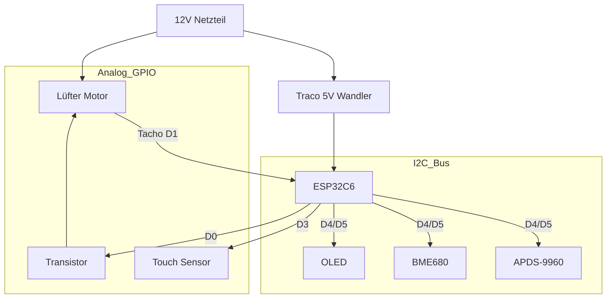

# 🌬️ Smarte Wohnraumlüftung mit Wärmerückgewinnung (ESP32-C6)

Eine professionelle, dezentrale Lüftungssteuerung basierend auf ESPHome. Dieses Projekt steuert einen reversierbaren Lüfter (Push-Pull) zur Wärmerückgewinnung, überwacht die Luftqualität (IAQ, CO2-Äquivalent) und bietet ein intuitives User Interface mit OLED-Display, Gestensteuerung und LED-Feedback.

> 💡 **Kompatibilität:** Die Steuerung funktioniert prinzipiell für jede dezentrale Wohnraumlüftung mit 12V PWM-Lüftern. Sie wurde jedoch **speziell als Ersatz für die VentoMaxx V-WRG Serie** entwickelt. Die Hardware (PCB-Layout/Größe und Bedienpanel) ist explizit für VentoMaxx optimiert und muss für andere Hersteller ggf. angepasst werden.

[](https://esphome.io/)
[](https://www.home-assistant.io/)
[](https://opensource.org/licenses/MIT)

---

## 📑 Inhaltsverzeichnis

- [Features](#-features)
- [Vergleich mit VentoMaxx](#-vergleich-mit-ventomaxx-v-wrg)
- [ESP-NOW & Autonomie](#-esp-now-kabellose-autonomie)
- [Hardware & BOM](#️-hardware--bill-of-materials-bom)
- [Eigene Platine (PCB)](#-eigene-platine-pcb)
- [Pinbelegung](#-pinbelegung--verkabelung)
- [Installation](#-installation--software)
- [Bedienung](#-bedienung--steuerung)
- [Wärmerückgewinnung](#-wärmerückgewinnung---so-funktionierts)
- [Technische Details](#-technische-details--optimierungen)
- [Projektstruktur](#-projektstruktur)
- [Troubleshooting](#-troubleshooting)
- [Lizenz](#-lizenz)

---

## ✨ Features

### Lüftungsmodi

- 🔄 **Wärmerückgewinnung**: Alternierender Betrieb (Standard 70s Rein / 70s Raus). Synchronisiert über ESP-NOW.
- 💨 **Durchlüften**: Permanenter Abluftbetrieb (z.B. im Sommer). Timer-gesteuert oder Dauerhaft (0 Min).
- 🔗 **Dezentrale Gruppe**: Geräte kommunizieren direkt miteinander (ESP-NOW). Kein zentraler WLAN-Broker nötig.

### Sensorik & Überwachung

- 🌡️ **Temperatur & Feuchte**: Präzise Messung (via BME680).
- 🍃 **Luftqualität (IAQ)**: Bosch BME680 mit BSEC2-Algorithmus.
- 🏎️ **Drehzahlüberwachung**: Echtes Tacho-Signal-Feedback vom Lüfter.

### Modernes UI

- 📟 **OLED Display**: Zeigt Status, IAQ und Drehzahl an.
- 👋 **Annäherung**: Display wacht automatisch auf, wenn man sich nähert (APDS-9960).
- 🔆 **Adaptive Helligkeit**: Display-Helligkeit passt sich automatisch an Umgebungslicht an.
- 🎯 **Optimierte Sensorik**: Reduzierter I²C-Bus-Traffic und Stromverbrauch durch intelligente Filter.

### Home Assistant Integration

Volle Kontrolle und Visualisierung über Home Assistant.

---

## 🔄 Vergleich mit VentoMaxx V-WRG

Diese Lösung wurde als smarter Ersatz für die herkömmliche [VentoMaxx V-WRG / WRG PLUS](https://www.ventomaxx.de/dezentrale-lueftung-produktuebersicht/aktive-luefter-mit-waermerueckgewinnung/) Steuerung entwickelt. Während die originale VentoMaxx-Lösung keine Integration in ein Smart Home System ermöglicht, bietet dieser ESPHome-Ansatz ein völlig neues Level an Flexibilität und Integrität. Da hier diese Lösung auf ESPHome basiert, kann sie mit jeder Home Assistant Version verwendet werden und bietet eine native Integration in Home Assistant.

### Funktionsvergleich

| Feature             | VentoMaxx V-WRG (Standard)     | ESPHome Smart WRG (Dieses Projekt)           |
| :------------------ | :----------------------------- | :------------------------------------------- |
| **Konnektivität**   | Kabelgebunden / Inselbetrieb   | **WiFi 6 & ESP-NOW Mesh**                    |
| **Smart Home**      | Nein (oder teure Zusatzmodule) | **Nativ Home Assistant (API)**               |
| **Visualisierung**  | Einfache Status-LEDs           | **0.91" OLED mit Echtzeit-Graphen & Werten** |
| **Sensorik**        | Optional CO2 (rudimentär)      | **BME680 (IAQ, VOC, Temp, Hum, Pressure)**   |
| **Bedienung**       | Wandschalter / Fernbedienung   | **App, Touch, Gesten & Automatik**           |
| **Synchronisierung**| Physisches Steuerkabel         | **Kabellos & Intelligent via ESP-NOW**       |
| **Konfiguration**   | DIP-Schalter / Potentiometer   | **Dynamisch per Software (Floor/Room IDs)**  |
| **Kosten**          | Hochpreisig (Industriestandard)| **Preiswert & Unbegrenzt erweiterbar**       |

### 🚀 Warum diese Lösung überlegen ist

1. **Echte Luftqualität**: Statt nur die Zeit zu steuern, reagiert dieses System auf den **IAQ (Indoor Air Quality)** Index. Bei schlechter Luft schaltet das System automatisch hoch.
2. **Keine neuen Kabel**: Durch **ESP-NOW** synchronisieren sich Geräte in einem Raum (z.B. paarweiser Push-Pull Betrieb) komplett kabellos über Funk. Das Ganze funktioniert sogar, wenn das lokale WLAN ausfällt, da die Kommunikation direkt über die Wi-Fi-Radio-Hardware (MAC-Ebene) erfolgt, ohne dass eine Verbindung zu einem Access Point erforderlich ist.
3. **Wartungs-Intelligenz**: Durch die **Tacho-Auswertung** erkennt das System, ob ein Lüfter blockiert oder verschmutzt ist, und meldet dies proaktiv an Home Assistant.
4. **Zukunftssicher**: Dank **Over-the-Air (OTA)** Updates können neue Funktionen oder verbesserte Regelalgorithmen (z.B. für Wärmerückgewinnung) jederzeit eingespielt werden.

---

## 📡 ESP-NOW: Kabellose Autonomie

Die Geräte kommunizieren über die [ESPHome ESP-NOW Komponente](https://esphome.io/components/espnow.html). **ESP-NOW** ist ein von Espressif entwickeltes, verbindungsloses Protokoll, das eine direkte Kommunikation zwischen ESP32-Geräten ohne Umweg über einen WLAN-Router ermöglicht.

### Vorteile im Überblick

- 🌐 **WLAN-Unabhängigkeit**: Die Geräte benötigen keinen WLAN-Router (Access Point) für die Synchronisation. Die Kommunikation erfolgt direkt auf der MAC-Ebene (2,4 GHz Radio). Fällt das lokale WLAN aus, arbeitet die Lüftungsgruppe ungestört weiter.
- 🛡️ **Hohe Zuverlässigkeit**: Durch die direkte Punkt-zu-Punkt-Kommunikation ist das System immun gegen Überlastungen oder Störungen im herkömmlichen WLAN-Netzwerk.
- ⚡ **Extrem geringe Latenz**: Da keine Verbindung aufgebaut oder verwaltet werden muss (handshake-frei), werden Synchronisationsbefehle nahezu verzögerungsfrei übertragen. Dies ist entscheidend für den exakten Richtungswechsel synchronisierter Lüfterpaare.
- 🔌 **Keine Steuerleitungen**: Es müssen keine Datenkabel durch Wände gezogen werden. Die Synchronisation erfolgt "Out-of-the-box" über Funk.
- 📡 **Automatisches Software-Filtering**: Durch den Broadcast-Modus und die projektinterne Filterung (Floor/Room ID) finden sich Geräte im gleichen Raum automatisch.

Weitere Informationen finden Sie in der [offiziellen ESPHome Dokumentation](https://esphome.io/components/espnow.html).

---

## 🎮 Bedienkonzept: Dual Button Control

Das System verfügt über zwei physische Touch-Buttons für die manuelle Steuerung ohne Home Assistant:

### Rechter Button (Mode/Power)

- **Kurz drücken**: Wechsel zwischen Betriebsmodi
  - Wärmerückgewinnung → Durchlüften → Aus → (wiederholt)
- **Lang drücken (>5s)**: System Ein/Aus
  - Schaltet Lüfter, Display und alle Funktionen komplett aus/ein

### Linker Button (Fan Intensity)

- **Kurz drücken**: Wechsel zwischen Lüfter-Intensitätsstufen
  - 10 Stufen: 1 (niedrig, 12%) bis 10 (maximum, 100%)
  - Stufe 1 beginnt bei 12% um zuverlässigen Lüfterstart zu gewährleisten
  - Lineare Skalierung zwischen den Stufen

### Visuelle Rückmeldung

- Aktuelle Intensitätsstufe wird auf dem OLED-Display angezeigt
- Betriebsmodus wird ebenfalls visualisiert
- Beide Werte sind auch in Home Assistant sichtbar

---

## �🛠️ Hardware & Bill of Materials (BOM)

### Zentrale Einheit

| Komponente | Beschreibung |
| :--- | :--- |
| **MCU** | Seeed Studio XIAO ESP32C6 (RISC-V, WiFi 6, Zigbee/Matter ready) |
| **Power** | 12V DC Netzteil (mind. 1A) |
| **DC/DC** | Traco Power TSR 1-2450 (12V zu 5V Wandler, effizient) |

### Aktoren & Sensoren

| Komponente | Beschreibung | Dokumentation |
| :--- | :--- | :--- |
| **Lüfter** | 120mm PWM Lüfter (z.B. Arctic P12 PWM). *Geplant: ebm-papst AxiRev.* | [Fan Component](https://esphome.io/components/fan/speed.html) |
| **BME680** | Bosch Umweltsensor (Temp, Hum, Pressure, Gas/IAQ) | [BME68x BSEC2](https://esphome.io/components/sensor/bme68x_bsec2.html) |
| **NTCs** | 2x NTC 10k *(Geplant für Zuluft/Abluft Messung)* | [NTC Sensor](https://esphome.io/components/sensor/ntc.html) |
| **APDS-9960** | Gesten- und Annäherungssensor | [APDS-9960](https://esphome.io/components/sensor/apds9960.html) |

### User Interface

| Komponente | Beschreibung | Dokumentation |
| :--- | :--- | :--- |
| **Display** | 0.91" OLED (SSD1306, 128x32 I2C) | [SSD1306 OLED](https://esphome.io/components/display/ssd1306.html) |
| **Touch Buttons** | 2x Kapazitiv (Rechts: Mode/Power, Links: Intensität) | [Binary Sensor](https://esphome.io/components/binary_sensor/index.html) |

---

## 🖱️ Eigene Platine - PCB

Eine dedizierte Platine (PCB), die alle oben genannten Komponenten (XIAO, Traco, Transistoren, Anschlüsse für Sensoren) kompakt vereint, befindet sich aktuell in der Entwicklung.

- **Professionelles Design**: Optimiert für den Einbau in Standard-Unterputzdosen oder Lüftergehäuse.
- **Plug & Play**: Einfache Montage durch Steckverbinder (JST/Dupont).
- **Bezug**: Informationen zum Layout (EasyEDA/KiCad) und Bestellmöglichkeiten werden dem Projekt hinzugefügt, sobald die Prototypen-Phase abgeschlossen ist.

---

## 🔌 Pinbelegung & Verkabelung

Das System basiert auf dem [Seeed XIAO ESP32C6](https://esphome.io/components/esp32.html).

⚠️ **WICHTIG:** Der Lüfter läuft mit 12V, die Logik mit 3.3V. Achte auf die korrekten Spannungsteiler und Schutzbeschaltungen.

| XIAO Pin | GPIO | Funktion | Bemerkung |
| :--- | :--- | :--- | :--- |
| **D0** | GPIO0 | [ADC Input](https://esphome.io/components/sensor/adc.html) | NTC Innen (Spannungsteiler) |
| **D1** | GPIO1 | [ADC Input](https://esphome.io/components/sensor/adc.html) | NTC Außen (Spannungsteiler) |
| **D2** | GPIO2 | LED Data | WS2812B Ring (via 470Ω) |
| **D3** | GPIO21 | Touch Button | Display ON/OFF Toggle |
| **D4** | GPIO22 | [I2C SDA](https://esphome.io/components/i2c.html) | BME680, OLED, APDS-9960 |
| **D5** | GPIO23 | [I2C SCL](https://esphome.io/components/i2c.html) | BME680, OLED, APDS-9960 |
| **D6** | GPIO16 | [PWM Output](https://esphome.io/components/output/ledc.html) | Fan PWM (via NPN-Transistor) |
| **D7** | GPIO17 | [Pulse Counter](https://esphome.io/components/sensor/pulse_counter.html) | Lüfter Tacho Signal |
| **D8** | GPIO19 | *frei* | |
| **D9** | GPIO20 | *frei* | |

### Schematische Darstellung (Konzept)



---

## 💻 Installation & Software

### Voraussetzungen

- Installiertes ESPHome Dashboard (z.B. als Home Assistant Add-on)
- Grundkenntnisse in YAML

### Konfiguration

1. Kopiere den Inhalt von `esp_wohnraumlueftung.yaml` in deine ESPHome Instanz.
2. Erstelle eine `secrets.yaml` mit deinen WLAN-Daten:

```yaml
wifi_ssid: "DeinWLAN"
wifi_password: "DeinPasswort"
ap_password: "FallbackPasswort"
ota_password: "OTAPasswort"
```

### Kalibrierung der NTCs

Die Konfiguration nutzt NTCs mit einem B-Wert von 3435. Falls du andere Sensoren nutzt, passe den `b_constant` Wert im YAML Code an.

### Flashen

1. Verbinde den XIAO per USB.
2. Klicke auf "Install".

---

## 🎮 Bedienung & Steuerung

Das System bietet drei Steuerungsmöglichkeiten: **Direkt am Gerät**, **über Home Assistant** und **automatisch** durch Sensoren.

### 🖐️ Bedienung am Gerät

#### Touch-Button (GPIO21)

Der kapazitive Touch-Button dient zur Display-Steuerung:

| Aktion            | Funktion        | Feedback                      |
| :---------------- | :-------------- | :---------------------------- |
| **Kurzer Touch**  | Display Ein/Aus | Display aktiviert/deaktiviert |

> 💡 **Tipp:** Das Display schaltet sich automatisch nach 5 Sekunden ab, um die OLED-Lebensdauer zu schonen.

#### Annäherungssensor (APDS9960)

Das System reagiert intelligent auf deine Anwesenheit:

```text
     👋 Hand nähert sich
         ↓
    [APDS9960 Sensor]
         ↓
   Proximity > 15%
         ↓
    ✨ Display aktiviert
         ↓
    ⏱️ 5 Sekunden Timeout
         ↓
    🌙 Display deaktiviert
```

**Funktionsweise:**

- **Erkennungsbereich:** < 20cm vor dem Sensor
- **Reaktionszeit:** < 500ms
- **Auto-Helligkeit:** Passt sich an Umgebungslicht an
  - 🌞 Heller Raum → Volle Helligkeit
  - 🌙 Dunkler Raum → Reduzierte Helligkeit

### 🏠 Steuerung über Home Assistant

Alle Funktionen sind vollständig in Home Assistant integriert:

#### Betriebsmodi

| Modus                     | Beschreibung                            | Anwendungsfall             |
| :------------------------ | :-------------------------------------- | :------------------------- |
| 🔄 **Wärmerückgewinnung** | Alternierender Betrieb (70s Rein/Raus)  | Standard-Betrieb im Winter |
| 💨 **Durchlüften**        | Permanenter Abluftbetrieb               | Schnelle Lüftung, Sommer   |
| ⏸️ **Aus**                | Lüfter gestoppt                         | Wartung, Nachtruhe         |

#### Steuerbare Parameter

**Lüftergeschwindigkeit:**

- Slider: 0-100%
- Mindestdrehzahl: 10% (konfigurierbar)
- Echtzeit-RPM-Anzeige

**Durchlüften-Timer:**

- Einstellbar: 0-120 Minuten (5-Min-Schritte)
- 0 Min = Dauerbetrieb
- Standard: 30 Minuten

**Zyklusdauer (Wärmerückgewinnung):**

- Einstellbar: 10-300 Sekunden
- Standard: 70 Sekunden pro Richtung
- Synchronisiert über ESP-NOW

**Sync-Intervall:**

- Einstellbar: 1-360 Minuten
- Standard: 180 Minuten (3 Stunden)
- Hält Geräte synchron

### 📺 OLED Display (128x32)

Das Display zeigt alle wichtigen Informationen auf einen Blick:

```
┌──────────────────────────────────────┐
│ ↗ ████████░░  72%   🌡️ 21.5°C  IAQ 45│
│                     💧 55%    ⚡ 850rpm│
└──────────────────────────────────────┘
```

#### Display-Layout

**Linke Seite:**

- **Richtungspfeil:**
  - `↗` = Zuluft (Rein)
  - `↘` = Abluft (Raus)
- **Drehzahlbalken:** Visuelle Darstellung 0-100%
- **Prozentanzeige:** Aktuelle Lüftergeschwindigkeit

**Rechte Seite (rotiert alle 3 Sekunden):**

| Ansicht | Anzeige | Icon |
|---------|---------|------|
| **Temperatur** | 21.5°C | 🌡️ |
| **Luftfeuchtigkeit** | 55% | 💧 |
| **Luftqualität (IAQ)** | 0-500 | 🍃 |
| **Drehzahl** | RPM | ⚡ |
| **Luftdruck** | hPa | 🔽 |
| **VOC** | ppm | 💨 |

#### Luftqualitäts-Anzeige (IAQ)

Das System verwendet eine intuitive Farbcodierung:

| IAQ-Wert    | Bewertung     | Farbe        | Empfehlung        |
| :---------- | :------------ | :----------- | :---------------- |
| **0-50**    | Ausgezeichnet | 🟢 Grün      | Alles perfekt     |
| **51-100**  | Gut           | 🟡 Gelb      | Weiter so         |
| **101-150** | Mäßig         | 🟠 Orange    | Lüften empfohlen  |
| **151-200** | Schlecht      | 🔴 Rot       | Sofort lüften!    |
| **201+**    | Sehr schlecht | 🔴 Dunkelrot | Dringend handeln! |

> 📡 **ESP-NOW:** IAQ-Werte werden automatisch an gekoppelte Geräte gesendet.

### 🔄 Automatische Funktionen

#### Smart Display Management

1. **Proximity Wake-Up:**
    - Hand vor Sensor → Display an
    - Automatische Helligkeitsanpassung
    - 5s Auto-Off Timer

2. **Adaptive Helligkeit:**

    ```yaml
    Umgebungslicht > 100 → Helligkeit 255 (100%)
    Umgebungslicht ≤ 100 → Helligkeit 128 (50%)
    ```

3. **OLED-Schutz:**
    - Auto-Off nach Inaktivität
    - Verhindert Einbrennen
    - Verlängert Lebensdauer

#### Automatische Lüftersteuerung

**Fan Auto Cycle Script:**

```text
1. Ramp Up:   0% → 100% in 5s (sanfter Start)
2. Hold:      100% für 20s (volle Leistung)
3. Ramp Down: 100% → 0% in 5s (sanfter Stopp)
4. Pause:     100ms
5. Wiederholen
```

**Vorteile:**

- ✅ Reduziert mechanischen Verschleiß
- ✅ Leiser Betrieb
- ✅ Energieeffizient

### 💡 Tipps für optimale Nutzung

#### Allgemein

- 🌡️ **Winter:** Wärmerückgewinnung-Modus für Energieeffizienz
- ☀️ **Sommer:** Durchlüften-Modus für schnelle Kühlung
- 🌙 **Nacht:** Reduzierte Geschwindigkeit (30-40%) für leisen Betrieb
- 🏃 **Schnelllüftung:** Durchlüften-Modus mit Timer (15-30 Min)

#### Display-Nutzung

- 👋 Hand vor Sensor statt Touch-Button (schont Hardware)
- 🌙 Display bleibt nachts aus (Auto-Off)
- 📊 IAQ-Werte regelmäßig prüfen

#### Wartung

- 🧹 Keramikspeicher alle 6 Monate reinigen
- 🔧 Lüfter alle 12 Monate entstauben
- 📈 Effizienz-Werte monitoren (Verschlechterung = Reinigung nötig)

---

## 🧠 Wärmerückgewinnung - So funktioniert's

### Grundprinzip

Das System nutzt einen **Keramikspeicher** zur Wärmerückgewinnung. Dieser speichert Wärme aus der Abluft und gibt sie an die Zuluft ab.

### Betriebszyklus (Standard: 70s pro Phase)


### Phase 1: Abluft (Rausblasen) - 70 Sekunden

```
Innenraum (warm) → Keramikspeicher → Außen
    21°C              ↓ Wärme         5°C
                  speichern
```

**Was passiert:**

- 🔥 Warme Raumluft (21°C) strömt durch den Keramikspeicher
- 📈 Keramik erwärmt sich und speichert Energie
- 🌡️ **NTC Innen** misst am Ende die wahre Raumtemperatur
- 💨 Abgekühlte Luft (~10°C) wird nach außen geblasen

### Phase 2: Zuluft (Reinblasen) - 70 Sekunden

```
Außen → Keramikspeicher → Innenraum (vorgewärmt)
 5°C     ↑ Wärme           ~16°C
        abgeben
```

**Was passiert:**

- ❄️ Kalte Außenluft (5°C) strömt durch den warmen Keramikspeicher
- 🔄 Keramik gibt gespeicherte Wärme ab
- 🌡️ **NTC Außen** misst Außentemperatur
- 🌡️ **NTC Innen** misst vorgewärmte Zuluft (~16°C)
- 🏠 Vorgewärmte Luft strömt in den Raum

### Effizienzberechnung

Am Ende der Zuluft-Phase wird die Wärmerückgewinnung berechnet:

$$
\text{Effizienz} = \frac{T_{\text{Zuluft}} - T_{\text{Außen}}}{T_{\text{Raum}} - T_{\text{Außen}}} \times 100\%
$$

**Beispielrechnung:**

- Raumtemperatur: 21°C
- Außentemperatur: 5°C
- Zulufttemperatur: 16°C

$$
\text{Effizienz} = \frac{16°C - 5°C}{21°C - 5°C} \times 100\% = \frac{11°C}{16°C} \times 100\% = 68.75\%
$$

**Interpretation:**

- **> 70%:** Ausgezeichnete Wärmerückgewinnung
- **50-70%:** Gute Wärmerückgewinnung
- **< 50%:** Keramik zu kalt oder Zyklus zu kurz

### Optimierung der Effizienz

| Parameter                 | Auswirkung                          | Empfehlung      |
| :------------------------ | :---------------------------------- | :-------------- |
| **Zyklusdauer**           | Längere Zyklen = bessere Speicherung| 70-90s optimal  |
| **Lüftergeschwindigkeit** | Langsamer = mehr Wärmeübertragung   | 60-80%          |
| **Keramikvolumen**        | Mehr Masse = mehr Speicher          | Größer ist besser|
| **Außentemperatur**       | Kälter = höhere Effizienz möglich   | -               |

### Visualisierung im Display

```
┌──────────────────────────────────────┐
│ ↗ ████████░░  72%   🌡️ 21.5°C  IAQ 45│
│                     💧 55%    ⚙️ 68% │ ← Effizienz
└──────────────────────────────────────┘
```

> ⚙️ **Effizienz-Anzeige:** Wird unten rechts im Display angezeigt (geplant)

### Synchronisation mehrerer Geräte

Bei Verwendung mehrerer Geräte im gleichen Raum:

**Paar-Betrieb (2 Geräte):**

```
Gerät A: Phase A (Zuluft)  ←→  Gerät B: Phase B (Abluft)
         ↓ 70s wechseln ↓
Gerät A: Phase B (Abluft) ←→  Gerät B: Phase A (Zuluft)
```

**Vorteile:**

- ✅ Kontinuierlicher Luftaustausch
- ✅ Keine Druckschwankungen
- ✅ Optimale Wärmerückgewinnung
- ✅ Synchronisiert über ESP-NOW

---

## 🔧 Technische Details & Optimierungen

Detaillierte technische Informationen zu Sensor-Optimierungen, ESPHome YAML Syntax, I²C-Konfiguration und weiteren technischen Aspekten finden Sie in der separaten Dokumentation:

📄 **[Technical-Details.md](documentation/Technical-Details.md)**

Diese Dokumentation enthält:

- APDS9960 Sensor-Optimierung
- ESPHome YAML Syntax Best Practices
- I²C Bus Konfiguration
- BME680 BSEC2 Konfiguration
- ESP-NOW Kommunikation
- Lüftersteuerung (PWM)

---

## 📁 Projektstruktur

```text
ESPHome-Wohnraumlueftung/
├── esp_wohnraumlueftung.yaml      # Hauptkonfiguration
├── esp32c6_common.yaml            # Gemeinsame ESP32-C6 Einstellungen
├── apds9960_config.yaml           # APDS9960 Sensor (optimiert)
├── device_config.yaml             # Dynamische Gerätekonfiguration
├── display_render.h               # Custom C++ Display-Rendering
├── automation_helpers.h           # Helper-Funktionen (IAQ, Rampen)
├── components/                    # Externe Komponenten
│   └── ventilation_group/         # Lüftungssteuerung
│       ├── __init__.py
│       └── ventilation_group.h
├── documentation/
│   ├── Hardware-Setup-Readme.md
│   └── Dynamic-Configuration.md
└── Readme.md                      # Diese Datei
```

---

## 🔍 Troubleshooting

Für eine umfassende Anleitung zur Fehlerbehebung, siehe die dedizierte [Troubleshooting-Dokumentation](documentation/Troubleshooting.md).

**Häufige Themen:**

- ESPHome YAML Fehler
- I²C Bus Probleme
- APDS9960 Proximity-Sensor
- BME680 / BSEC2 Kalibrierung
- ESP-NOW Synchronisation
- Kompilierungsfehler
- Performance-Optimierung

---

## ⚠️ Sicherheitshinweise

- Dieses Projekt arbeitet im 12V Bereich, was generell sicher ist.
- Das Netzteil (230V zu 12V) muss fachgerecht installiert und isoliert werden.
- Achte auf ausreichende Isolationsabstände auf PCBs zwischen Hochvolt- und Niedervolt-Bereichen.

---

## 📜 Lizenz

Dieses Projekt steht unter der MIT Lizenz.
Feel free to fork & improve!

---

**Made with ❤️ and ESPHome**
