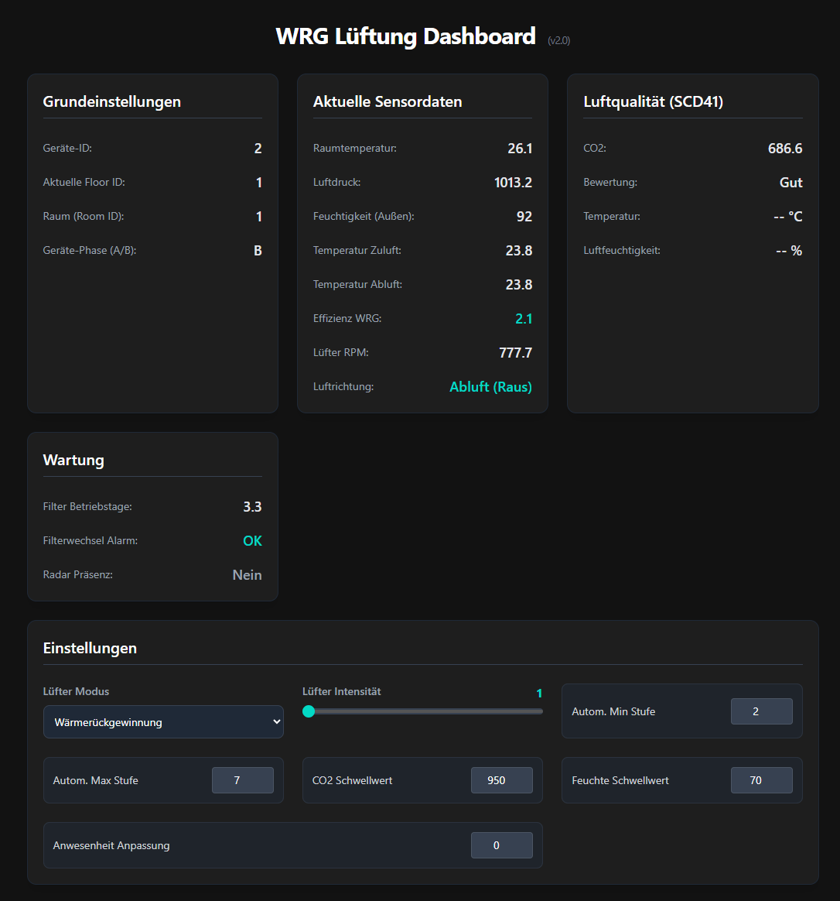
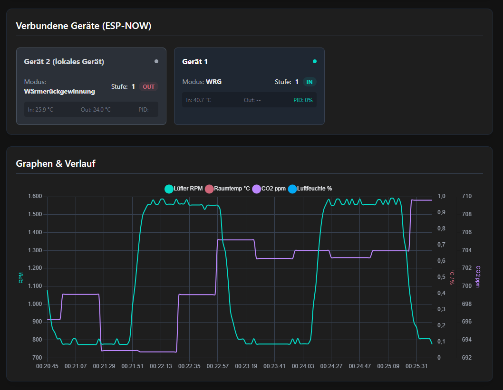
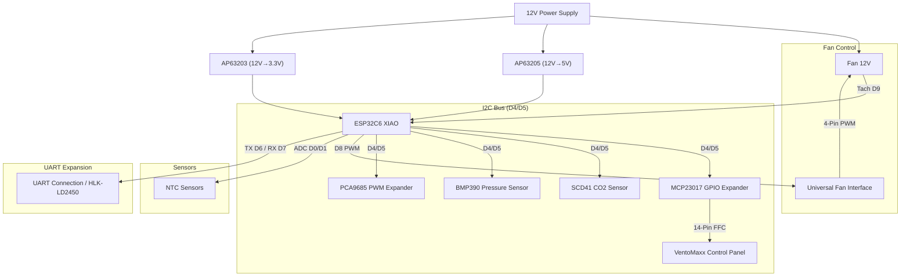

# 🌬️ VentoSync - Advanced ESPHome-based smart HRV for VentoMaxx V-WRG Series based on ESP32-C6

[](Readme_de.md)

## 🚀 Summary & Overview

This open-source project offers a professional, decentralized ventilation control system based on ESPHome. It replaces the control system of the VentoMaxx V-WRG series using a specifically developed printed circuit board (PCB), controlling the reversible 12V fan for heat recovery. It optionally monitors air quality (CO2, humidity, and temperature) using a high-quality Sensirion SCD41 sensor, calculates effective heat recovery, and uses the **original VentoMaxx control panel** for seamless integration and intuitive operation. Furthermore, a radar sensor for presence detection can be optionally integrated, which can be mounted invisibly behind the cover of the ventilation unit.
Communication between individual ventilation units takes place via the ESP-NOW protocol, so no Wi-Fi or central control unit is required (the power line communication used by VentoMaxx is not used).

> 💡 **Compatibility:** The control system works in principle for any decentralized residential ventilation with a reversible 12V fan (3-PIN or 4-PIN PWM). However, it was **specifically developed as a replacement for the VentoMaxx V-WRG series**. The hardware (PCB layout/size and control panel) is therefore explicitly optimized for the VentoMaxx V-WRG series and may need to be adapted for other manufacturers. The PCB is designed to fit exactly into the housing of the VentoMaxx V-WRG series and uses the existing mounting points.
Attention: This solution is not compatible with the VentoMaxx ZR-WRG series, as it uses a central control unit!

[](https://esphome.io/)
[](https://www.home-assistant.io/)
[](https://esphome.io/components/esp32.html)


---

## 📑 Table of Contents

- [Features](#-features)
- [Roadmap & Future Enhancements](#️-roadmap--future-enhancements)
- [Comparison with VentoMaxx](#-comparison-with-ventomaxx-v-wrg)
- [ESP-NOW & Autonomy](#-ESP-NOW-wireless-autonomy)
- [Hardware & BOM](#️-hardware--bill-of-materials-bom)
- [Custom Circuit Board (PCB)](#-custom-circuit-board-pcb)
- [Pin Assignment](#-pin-assignment--wiring)
- [Installation](#-installation--software)
- [Operation](#-operation--control)
- [Automated Versioning](#-automated-versioning)
- [Heat Recovery](#-heat-recovery---how-it-works)
- [Technical Details](#-technical-details--optimizations)
- [Project Structure](#-project-structure)
- [Code Architecture](#️-code-architecture--maintainability)
- [Troubleshooting](#-troubleshooting)
- [License](#-license)

---

## Motivation

Many years ago, as part of a house renovation, I installed the V-WRG decentralized residential ventilation from Ventomaxx (10 units) and was very satisfied with it. However, the proprietary control and the lack of integration into my smart home system always bothered me. Therefore, I decided to develop my own circuit board (PCB) including control software based on ESPHome, as there was no ready-made solution. This solution is open source and is intended to help other users who are in the same situation as I was.
For ventilation control based on CO2, I use an extremely high-quality and precise CO2 sensor (Sensirion SCD41), which is integrated directly into the board (via a small additional PCB; Note: Currently the BME680 serves as a fallback, as the SCD41 PCB is still in production). This sensor measures the real CO2 concentration in the air and controls the ventilation intensity according to the presets (using modern PID control). All code comments and internal documentation have been switched to English for better international maintainability, while the user interface remains in German.
Since the ventilation units in the various rooms are usually in a very central position, I also use them directly for presence detection via a radar sensor, which can be mounted invisibly hidden behind the cover of the ventilation unit. The presence sensor is used for controlling the ventilation intensity in Standard Automatic mode and can also be used in Home Assistant for any other automations.
According to my research, the range of functions of this custom development goes beyond everything currently found on the ventilation unit market!

---

## 🔄 Comparison with VentoMaxx V-WRG

This solution is a **drop-in replacement** for the [VentoMaxx V-WRG / WRG PLUS](https://www.ventomaxx.de/dezentrale-lueftung-produktuebersicht/aktive-luefter-mit-waermerueckgewinnung/) control — mechanically compatible, functionally massively expanded:

| | VentoMaxx (Original) | ESPHome Smart WRG |
| :--- | :---: | :---: |
| Operating Modes | 3 | **5+** (incl. automation) |
| Sensors | 0-1 (opt. VOC) | **6** (CO2, Temp, Humidity, Pressure, Radar, Tachometer) |
| Fan Control | 3 fixed levels | **10 levels + stepless (PID)** |
| Smart Home | ❌ | ✅ Home Assistant (native) |
| Maintenance Alarm | Timer-LED | ✅ Predictive + Push |
| Synchronization | Control cable | ✅ Wireless (**ESP-NOW Protocol v4**) & Real-time Sync |
| Versioning | Manual | ✅ Fully automatic (Patch-Level) |
| Updates | Service technician | ✅ Over-the-Air (OTA) |
| License | Proprietary | ✅ Open Source (MIT) |

 **You can find the full feature-for-feature comparison with all technical details in [📄 Comparison-VentoMaxx.md](documentation/Comparison-VentoMaxx.md).**

---

## ✨ Features

### ⚙️ Intelligent Operating Modes

All devices in a room find each other automatically upon startup or room change via **dynamic ESP-NOW discovery** and subsequently communicate efficiently via unicast.

- 🤖 **Standard Automatic**: Fully automatic control for maximum comfort and efficiency. Standard operation in heat recovery (push-pull) with dynamic adjustment to CO2 and humidity, taking weather data into account.
In summer, cross-ventilation for passive nightly cooling (when it is cooler outside than inside) is automatically activated. This mode is the standard in everyday life to ensure maximum energy efficiency and air quality. In future versions, I will further optimize this mode to further increase comfort and efficiency.
- 🔄 **Efficient Heat Recovery**: Cyclic, bidirectional operation (push-pull) to maximize energy efficiency. This mode ignores CO2, humidity, and radar presence sensors.
- 💨 **Cross-Ventilation (Summer Mode)**: Mode for permanent exhaust air flow, ideal for passive cooling on summer nights. Flexibly configurable via timer or as continuous operation. This mode ignores CO2, humidity, and radar presence sensors.
- 🚀 **Boost Ventilation**: Intensive ventilation for quick air exchange. The device ventilates for 15 minutes with the **manually selected intensity** and then pauses for 105 minutes to effectively remove moisture and regenerate the ceramic heat exchanger. The cycle then repeats.

### 🛡️ Precision Sensors & Monitoring

- 🌡️ **Climate Data Acquisition**: High-precision measurement of temperature and relative humidity using [Sensirion SCD41](https://sensirion.com/de/produkte/katalog/SCD41).
  > 💡 **Current Note (March 2026):** Since my SCD41 add-on PCB is currently still in production, I am using the **Bosch BME680** as a fallback. To drastically reduce compilation time, we switched from the BSEC2 library to a **lightweight IAQ template calculation** (`log(R) + 0.04 * RH`). If no SCD41 is detected on the bus, this IAQ index serves as a redundant indicator of air quality.
- 💨 **True CO2 Measurement**: The SCD41 uses **photoacoustic sensing** for direct CO2 measurement (400-5000 ppm) instead of calculated equivalents - ideal for demand-based ventilation control.
- 🏔️ **Air Pressure Measurement & Hardware Protection via BMP390**: The high-precision barometer sensor [Bosch BMP390](https://www.bosch-sensortec.com/en/products/environmental-sensors/pressure-sensors/pressure-sensors-bmp390.html) not only provides local weather data and barometric compensation for the SCD41 but also acts as a **safety guard for the Traco power supply**.
  - **Automatic Derating Management**: Monitoring the internal temperature in the housing of the ventilation unit to comply with Traco specifications.
  - **Emergency Shutdown**: At critical temperatures (>60°C), a safety protocol starts (fan stop and 60min deep sleep) to protect the hardware from overheating and sends a corresponding warning to Home Assistant.
- 📊 **Automatic Intensity Control**: The system can automatically increase fan power as CO2 levels or humidity rise for optimal indoor air quality. Advanced PID control is used for this, which dynamically adjusts the fan power to the measured values. The control is optimized to keep the fan power as low as possible to minimize energy consumption and noise.
- 🚶 **Radar-based Presence Detection (HLK-LD2450)**: Presence in the room is precisely detected using a mmWave radar sensor (integrated via the UART pin header). In manual modes (Heat Recovery, Ventilation, Boost Ventilation), the sensor serves as a **manual boost/override**. Via a sliding demand control (slider `-5` to `+5`), the currently selected fan level can be ideally adjusted (e.g., `+3` intensifies ventilation in the office when someone is present, `-2` lowers it to reduce noise in the bedroom). In auto mode, presence is ignored in favor of stable PID control.
Of course, this sensor can also be used for other automations in Home Assistant.
- 📊 **Real VentoMaxx V-Curve**: The fan is controlled exactly according to the physical parameters of the original hardware (50% PWM = stop zone, linear scaling in both directions), which enables high-precision and material-friendly control.
- **Virtual Speed Calculation:** Intelligent virtual speed calculation (4200 RPM @ 100%) as a fallback for the standard fan without a tachometer signal.
- 🔄 **Plain Text Direction Display**: A new sensor entity shows the current air direction at any time ("Supply Air (In)", "Exhaust Air (Out)", or "Standstill"), which significantly simplifies diagnosis and monitoring of synchronization.

### ⚡ Extremely Low Power Consumption

The VentoMaxx system with this ESPHome control works outstandingly efficiently. By using a high-quality Traco power supply and precision PWM control of the ebm-papst motor, the real power (measured at 230V) is in a range that is significantly lower than many commercial systems:

- **Level 1 (Base Ventilation):** ~2.7 - 2.9 Watts *(approx. $7.36 / year)*
- **Level 5 (Increased Load):** ~3.2 - 3.7 Watts *(approx. $9.10 / year)*
- **Level 10 (Maximum Power):** ~5.0 - 6.0 Watts *(approx. $15.75 / year)*

Even with year-round 24/7 continuous operation at the *absolute maximum level (10)*, the nominal electricity costs (at $0.30/kWh) amount to only around 15 dollars per year. In the most frequently used Standard Automatic mode (values fluctuate between level 1 and 3 at night or when absent), the real operating costs are extremely economical at **approx. 7 to 8.50 dollars per year** for the entire unit.

*Particularly noteworthy: These measurements include the continuous operation of all installed components – including the ESP32 control (Wi-Fi/ESP-NOW), the climate and CO2 sensors, as well as the continuously measuring mmWave radar presence sensor!*

Note: This is not a 100% accurate laboratory measurement. I determined these values using a Shelly 1PM mini. This measures the power consumption of the entire unit, including the ESP32 control (Wi-Fi/ESP-NOW), the climate and CO2 sensors, as well as the continuously measuring mmWave radar presence sensor!

### 🖥️ Operation at the Ventilation Device

To ensure an optimal user experience, the original control panel of the VentoMaxx V-WRG-1 is retained. The functionality was implemented as identically as possible to the original to enable intuitive operation.


- 🚥 **Original VentoMaxx Panel**: Use of the original control panel with 9 LEDs and 3 buttons with mostly identical functionality or operation as the original.
- 🔘 **Intuitive Control**:
  - **ON / OFF**: System On/Off/Reset.
    Short press --> turns the device on.
    Hold for 5sec --> turns the device off.
    Hold for 10sec --> turns the device off and restarts the system (reboot).
  - **Mode**: Short press cycles through programs: **Auto → Heat Recovery → Boost Ventilation → Ventilation → Off**.
  - **Level +**: 10 speed levels (cyclic, indicated by 5 LEDs with half/full brightness). The original Ventomaxx control only offers 5 levels. Holding the button cycles through the ventilation levels.
- 🔆 **LED Feedback**: Indication of mode, current fan level (1-10), and status.
  - ✨ **Group Synchronization**: All displays in a ventilation group synchronize in real-time. If device A changes the mode or level, the LEDs of all partner devices (peers) in the room wake up immediately to display the new status for 30 seconds (wake-up effect).
  - **Diagnostic Blink Codes (Master LED)**: The center LED (Master) signals malfunctions via a blink pattern (pulse):
    - **2x Blinks**: Synchronization error between fans (room group). The devices can no longer coordinate with each other.
    - **3x Blinks**: The connection to the Wi-Fi router is interrupted. App control is currently not possible.
    - **4x Blinks**: Heat warning (50-60°C). The temperature inside the ventilation unit housing is too warm (e.g., due to direct sunlight or a malfunction). The system is still running but should be checked. The device switches off automatically at over 60°C.
- You can find the detailed description of operation and control under [Operation](#-operation--control).

### 🏠 Integration

**Full Home Assistant Integration**: Native API support for seamless monitoring, control, and automation via your smart home system. All device functionalities can be controlled and read via Home Assistant.

**Local Web Dashboard (`wrg_dashboard`)**: An asynchronous web server running directly on the ESP32 provides a modern and responsive user interface. Simply go to **`http://<your-IP-address>/ui`** (or e.g., `http://esptest.local/ui`) in your web browser. Via the dashboard, you can view all sensor data in real-time (as tiles with daily history graphs) and change all system settings without additional hardware (like Home Assistant) in the local network. *(Note: The root URL `/` still shows the standard ESPHome UI)*
This theoretically makes it possible to use it entirely without Home Assistant (which I do not recommend, however)!




**📡 ESP-NOW Visualization**: The local web dashboard offers a live view of all devices connected via ESP-NOW. The "Connected Devices (ESP-NOW)" tile visualizes node ID, current operating mode, speed, and air direction (phase) of all active peers in real-time.

## 📡 ESP-NOW: Wireless Autonomy

The devices communicate via the [ESPHome ESP-NOW component](https://esphome.io/components/espnow.html). **ESP-NOW** is a connectionless protocol developed by Espressif that enables direct communication between ESP32 devices without going through a Wi-Fi router.

### Advantages at a Glance

- 🌐 **WLAN Independence**: The devices do not need a Wi-Fi router (Access Point) for synchronization. Communication takes place directly at the MAC level (2.4 GHz radio). If the local Wi-Fi fails, the ventilation group continues to work undisturbed.
- 🛡️ **High Reliability**: Due to direct point-to-point communication, the system is immune to overloads or interference in the conventional Wi-Fi network.
- ⚡ **Extremely Low Latency**: Since no connection needs to be established or managed (handshake-free after discovery), synchronization commands are transmitted almost without delay. This is crucial for the exact change of direction of synchronized fan pairs.
- 🔌 **No Control Cables**: No data cables need to be pulled through walls. Synchronization takes place "out-of-the-box" via radio.
- 📡 **Dynamic Discovery & Persistence**: Devices in the same room find each other automatically when booting or when configuration changes via a discovery broadcast. As soon as a match (same Floor/Room ID) occurs, the MAC addresses of the peers are permanently stored in the NVS (flash).
- ⚙️ **Efficient Unicast Communication**: After initial discovery, the actual data transmission (PID demand, status, sync) takes place via targeted unicast packets to the known peers. This massively reduces the noise floor in the 2.4 GHz band and increases stability.
- ⚙️ **Global Configuration Synchronization**: Changes to settings (e.g., CO2 limits, timers, Standard Automatic modes) on one device via Home Assistant or the control panel are mirrored in real-time wirelessly to all other synchronized peers.

#### Discovery Process

1. **Broadcast**: A device sends a `ROOM_DISC` packet to all (FF:FF:FF:FF:FF:FF) upon startup or room change.
2. **Matching**: Receivers check whether Floor and Room ID match their own.
3. **Handshake**: If they match, the sender is saved as a peer and a confirmation (`ROOM_CONF`) is sent back directly (unicast).
4. **Persistence**: The list of peers survives reboots and ensures immediate availability after the boot process.

- 🔒 **Protocol v4 & Validation**: Introduction of a dedicated magic header (`0x42`) and strict version checking to avoid miscommunication between different firmware versions.

- ⚙️ **Real-time Settings Mirroring**: Changes to parameters (CO2 limits, fan levels, timers) are transmitted immediately to all partner devices in the room group via ESP-NOW unicast to ensure uniform control behavior (loop prevention included).

You can find more information in the [official ESPHome documentation](https://esphome.io/components/espnow.html).

---

### 🗺️ Roadmap & Future Enhancements

The following "Advanced Automation" functions are in preparation:

- **Intuitive Group Control**:
  - Through the "Group-Controller" concept via ESP-NOW, several devices in a room can be represented as a single visual unit in the Home Assistant dashboard (e.g., using Mushroom Cards). This reduces Wi-Fi traffic, increases stability, and makes operation extremely easy (high WAF - wife acceptance factor).
  - *Details, concept, and YAML examples for ESPHome and the HA Dashboard can be found in the folder [ha_integration_example](ha_integration_example/).*

- **🌙 Intelligent Night Mode**:
  - Time-controlled throttling of fan power to minimize noise during rest periods.
  - **Light Sensor Integration**: Automatic activation of a "Whisper-Quiet" profile at night via hardware twilight sensor (LDR/BH1750 support planned).
  - Inclusion of presence detection (radar sensor).
  - Inclusion of CO2 values for control.
  - Locally and remotely activatable.

- **🏠 Away-From-Home Mode (Safety Dehumidification)**:
  - Automated protection mode for absence (vacation).
  - The system remains "Off" but monitors humidity. If a fixed threshold (e.g., 60%) is exceeded, ventilation starts at level 1 to prevent mold.

- **🌡️ Monitoring Mode (Sensor-Only)**:
  - Mode in which the fan is stopped, but all sensors (CO2, Temp, Radar) and the web dashboard remain fully active (without Light Sleep) to ensure gap-less measurement data in Home Assistant.

- **⏲️ Timed Ventilation**:
  - Manual supply air or exhaust air operation activatable via the dashboard/app with an integrated timer for targeted extraction (e.g., after cooking), then switching back to the desired mode.

- **❄️ Frost Protection Automation**:
  - Intelligent detection of impending frost on the ceramic heat exchanger at extreme outside temperatures. Automatic adjustment of cycle times or briefly deactivating supply air to regenerate the heat exchanger. The external NTC sensor can be used for this.

- **📅 Self-Sufficient Weekly Schedule**:
  - Native implementation of schedules directly on the ESP32 to ensure comfort functions even if the central smart home control fails. Independent of this, schedules can be easily configured via Home Assistant. If this feature is implemented, it must be ensured that the schedules do not collide with schedules from Home Assistant.

- **🔔 Advanced Alarm Logic**:
  - Implementation of visual (Master LED) and digital (Push) alerts for critical conditions such as extreme humidity, frost danger, or critical CO2 values.

- **Closed-Loop Speed Monitoring**:
  - Continuous monitoring of the fan speed via tachometer signal for constant volume flow and error detection (only for 4-PIN PWM fans).

- **AI-Powered Ventilation Control**:
  - Proactive AI-powered ventilation control based on historical data and external forecasts (weather, CO2, humidity). See [📄 AI-Powered-Ventilation-Control](documentation/KI-gestützte-Lüftungssteuerung.md) for details.

## 🖱️ Custom Circuit Board - PCB

A dedicated printed circuit board (PCB) that combines all required components compactly (XIAO, Traco, transistors, connections for sensors) has already been developed by me, manufactured by JLCPCB, and is currently in the testing phase.
I have placed special emphasis on safety and quality, as the ventilation systems usually run 24/7. Even if the power is minimal, safety has the highest priority here.
The components were also selected so that a runtime of >10 years is possible without hesitation.
To make additional expansions possible, I have provided an additional UART pin connection (H4 --> already used for the radar sensor), an additional I²C connection (H3 --> free), and additional GPIO pin connections (H1 --> free: 6 GPIOs, 3V3, and GND).


In addition, I have developed an SCD41 PCB that positions the SCD41 CO2 sensor perfectly for the existing ventilation opening of the VentoMaxx housing. Unlike many cheap Chinese SCD41 boards, both capacitors are also mounted here according to the manufacturer specifications, a slot serves for thermal decoupling of the SCD41 sensor from the rest of the board, and the copper planes were also spared in the lower area to further maximize thermal separation. The pins have a 1.25mm pitch and are positioned so that the SCD41 CO2 sensor fits perfectly into the ventilation opening. This PCB is currently still in production at JLCPCB.


---

## 🛠️ Hardware & Bill of Materials (BOM)

### Central Unit

| Component | Description |
| :--- | :--- |
| **MCU** | [Seeed Studio XIAO ESP32C6](https://esphome.io/components/esp32.html) (RISC-V, WiFi 6, Zigbee/Matter ready) |
| **Power** | TRACO POWER TMPS 10-112 (230VAC to 12VDC, 10W) <br>– **Premium Choice:** Certified according to **EN 60335-1** (household appliances) and **EN 62368-1** (IT/industry). The choice fell on this high-end module from Traco Power (Switzerland) because it offers maximum safety through its double insulation (**protection class II**) and high insulation voltage (4kV). Unlike inexpensive power supplies, it meets the strict EMC requirements of **Class B** without external filters and is designed for maintenance-free continuous operation (>10 years) in residential spaces. |
| **DC/DC** | Diodes Inc. AP63205 (12V->5V) & AP63203 (12V->3.3V) <br>– **Custom Development:** These two professional step-down converters (Buck Converters) were implemented directly on the PCB for high-efficiency energy conversion (up to 94% efficiency). They ensure an extremely stable power supply for MCU and sensors with minimal heat generation – a key factor for the long-term stability of the system in continuous operation. |

### Actuators & Sensors

| Component | Description | Documentation |
| :--- | :--- | :--- |
| **Fan** | The original VentoMaxx V-WRG units use the **EBM-PAPST 4412 F/2 GLL (VarioPro)** **3-Pin PWM** (without tachometer signal) fan. Alternatively, a much more modern and quieter **AxiRev** (4-Pin PWM) can be used. For this, however, you would have to handle the mounting via a 3D-printed adapter. *The technical connection is described in the following document: [Anleitung-Fan-Circuit.md](documentation/Anleitung-Fan-Circuit.md)* | [Fan Component](https://esphome.io/components/fan/speed.html) |
| **SCD41** | Sensirion CO2 sensor (Real CO2 400-5000ppm, Temp, Hum) via I²C | [SCD4X Component](https://esphome.io/components/sensor/scd4x.html) |
| **BMP390** | Bosch high-precision barometric pressure sensor via I²C | [BMP3XX Component](https://esphome.io/components/sensor/bmp3xx.html) |
| **BME680** | Bosch gas sensor (fallback for IAQ/air quality) via I²C | [BME680 Component](https://esphome.io/components/sensor/bme680.html) |
| **NTCs** | 2x NTC 10k (Supply Air/Exhaust Air) for efficiency measurement | [NTC Sensor](https://esphome.io/components/sensor/NTC.html) |
| **I/O Expander** | **MCP23017** (I2C) for VentoMaxx panel | [MCP23017](https://esphome.io/components/mcp23017.html) |
| **LED Driver** | **PCA9685** (I2C) for dimmable LEDs in VentoMaxx panel | [PCA9685](https://esphome.io/components/output/pca9685.html) |

The complete Bill of Materials (BOM) is located in the [EasyEDA-Pro](file:///home/tengeroff/ESPHome-Wohnraumlueftung/EasyEDA-Pro) subfolder in the [BOM](file:///home/tengeroff/ESPHome-Wohnraumlueftung/EasyEDA-Pro/BOM_ESPHome%20VentoSync%20PWM_PCB_ESPHome-WRG_ESP32_PWM_2026-03-01.csv).

### 🖱️ User Interface

| Component | Description | Documentation |
| :--- | :--- | :--- |
| **VentoMaxx Panel** | Original panel (14-Pin FFC). 3 buttons, 9 LEDs (dimmable via PCA9685). | The pinout of the original panel was completely measured and documented by me to enable exact control via the custom PCB and the port expanders (MCP23017/PCA9685). |

[Control-Panel Adapter](images/Ventomax%20V-WRG-1/Control-Panel%20Adapter.jpg)

---

## 🔌 Pin Assignment & Wiring

The system is based on the [Seeed XIAO ESP32C6](https://esphome.io/components/esp32.html).

⚠️ **IMPORTANT:** The fan runs on 12V, the logic on 3.3V or also 5V. Corresponding voltage dividers and protection circuits are present.

| XIAO Pin | GPIO | Function | Remark |
| :--- | :--- | :--- | :--- |
| **D0** | GPIO0 | [ADC Input](https://esphome.io/components/sensor/adc.html) | NTC Outside (Exhaust Air) |
| **D1** | GPIO1 | [ADC Input](https://esphome.io/components/sensor/adc.html) | NTC Inside (Supply Air) |
| **D2** | GPIO2 | Output | **MCP23017 Reset** |
| **D3** | GPIO21 | Output | **PCA9685 OE** (Output Enable) |
| **D4** | GPIO22 | [I2C SDA](https://esphome.io/components/i2c.html) | SCD41, BMP390, PCA9685, MCP23017 |
| **D5** | GPIO23 | [I2C SCL](https://esphome.io/components/i2c.html) | SCD41, BMP390, PCA9685, MCP23017 |
| **D6** | GPIO16 | [UART RX](https://esphome.io/components/uart.html) | **HLK-LD2450 Radar RX** |
| **D7** | GPIO17 | [UART TX](https://esphome.io/components/uart.html) | **HLK-LD2450 Radar TX** |
| **D8** | GPIO19 | [PWM Output](https://esphome.io/components/output/ledc.html) | **Fan PWM Primary** |
| **D9** | GPIO20 | [Pulse Counter](https://esphome.io/components/sensor/pulse_counter.html) | **Fan Tach** (Pullup via 3V3) |
| **D10** | GPIO18 | - | Not connected (NC) |

### 📊 Schematic Representation (Concept)



---

### Installation & Software

### Prerequisites

- Installed ESPHome Dashboard (e.g., as Home Assistant Add-on)
- Basic knowledge of YAML

### Configuration

1. Copy the contents of `ventosync.yaml` into your ESPHome instance.
2. Create a `secrets.yaml` with your Wi-Fi data:

```yaml
wifi_ssid: "YourWiFi"
wifi_password: "YourPassword"
ap_password: "FallbackPassword"
ota_password: "OTAPassword"
```

### Calibration of NTCs

The configuration uses NTCs with a B-value of 3435. If you use other sensors, adapt the `b_constant` value in the YAML code.

### Flashing

1. Connect the XIAO via USB.
2. Click on "Install".

---

## 🎮 Operation & Control

The system is controlled intuitively via the integrated control panel or fully automatically via Home Assistant.

### ��️ Control Panel (VentoMaxx Style)

The panel has 3 buttons and 9 status LEDs.

#### Button Assignment

| Button | Function | Operation |
| :--- | :--- | :--- |
| **Power (I/O)** | System On/Off | • Short press: On / Off (Toggle)<br>• Long (>5s): Off (Safety Off)<br>• Very long (>10s): Device restart (Reboot) |
| **Mode (M)** | Operating Mode | • Short press: Cycles through Auto → Heat Recovery → Boost Ventilation → Ventilation → Off |
| **Level (+)** | Fan Intensity | • Short press: Cycles through 10 speed levels (indicated via 5 LEDs).<br>• **Hold**: Automatic cycling up and down through levels (1 level per second) until released. |

#### Status LEDs (Feedback)

| LED | Quantity | Position | Behavior |
| :--- | :---: | :--- | :--- |
| **Power** | 🟢 1x | LED Panel | Lights up bright during operation. Dims to 20% brightness after 60s @ `ui_active_timeout` (default: 60s) (instead of turning off completely). |
| **Master** | 🟢 1x | LED Panel | Lights up when UI is active (normal operation). Signals malfunctions via blink pattern: **2x**: Room synchronization failed | **3x**: Wi-Fi loss | **4x**: Heat warning (50-60°C). Device switches off automatically at over 60°C. |
| **Mode L** (`LED_WRG`) | 🟢 1x | Left | **Pulses** in Standard Automatic mode. Permanently on for Heat Recovery or Ventilation. |
| **Mode R** (`LED_VEN`) | 🟢 1x | Right | Permanently on for Boost Ventilation or Ventilation. |
| **Intensity** | 🟢 5x | LED Panel | Shows current fan level 1–10 (half/full brightness for 10 levels via 5 LEDs). Only visible when UI is active. |

**Mode LED Assignment (when UI is active):**

| Mode | `LED_WRG` (left) | `LED_VEN` (right) |
| :--- | :---: | :---: |
| **Auto (Default)** | 🔵 pulses | ⚫ |
| Heat Recovery (Eco) | 🟢 | ⚫ |
| Boost Ventilation | ⚫ | 🟢 |
| Ventilation (Summer) | 🟢 | 🟢 |
| Off / System OFF | ⚫ | ⚫ |

> �� **60 Seconds Auto-Dimming:** All status LEDs (Mode, Intensity, Master) fade out gently 60 seconds (configurable) after the last button press. The **Power LED** remains on dimmed at 20%. With each button press, all LEDs are reactivated. Exception: The **Master LED continues to signal error states**, even after the timeout.

---

### 🔄 Detailed Operating Modes (Programs)

The device cycles through the programs via the **Mode button (M)**. Upon **powering on**, **Mode 1 (Standard Automatic)** is active.

> �� **Tip:** The sequence when pressing the button is: **Auto → Heat Recovery → Ventilation → Boost Ventilation → Off → Auto...**

---

#### 1. 🤖 Standard Automatic *(Standard / Recommended)* — `LED_WRG` 🟢 (pulses slowly)

**This mode is the standard upon powering on** and handles all control tasks fully automatically. The ventilation system regulates itself independently based on environmental data and requires no manual intervention after initial HA configuration ("Set and forget").

**Active Smart Features:**

| Feature | Sensor(s) | Threshold |
| :--- | :--- | :--- |
| ✅ **CO2 Control (PID)** | SCD41 (`sensor.scd41_CO2`) | `number.auto_CO2_threshold` |
| ✅ **Humidity Management (PID)** | SCD41 (`sensor.scd41_humidity`) + HA `outdoor_humidity` | Via outdoor humidity |
| ✅ **Summer Cooling Function** | NTC sensors + ESP-NOW group temperature | 22°C indoor temperature |

**Logic in Detail:**

- **Basic Operation:** Heat recovery (`MODE_ECO_RECOVERY`) at minimum fan level (`CO2_min_fan_level`, default: 2). The change intervals (cycle duration) adapt dynamically to the current fan level (gentle 70 seconds at level 1 to fast 50 seconds at level 10) including a synchronized NTC time window.
- **Adaptive Auto (CO2 Priority):** CO2 always has priority. If the CO2 value rises above the HA limit, a PID controller **exclusively** regulates the fan power **steplessly** and silently up — humidity is ignored during this time. A configurable min/max level (`automatik_min_fan_level`) limits the adjustment window.
- **💧 Humidity Management:** Only when CO2 is satisfied (below threshold), the humidity PID controller takes over. If the humidity limit is exceeded (default 60%), the separate PID controller (`PID_humidity`) increases the power (mold prevention). Intelligent hysteresis prevents rapid switching between CO2 and humidity control. **Outdoor Check:** Dehumidification only occurs if the outside air is drier than the inside air (`out_hum < in_hum`).
- **Summer Cooling:** If indoor temperature > 22°C and the outdoor area is cooler, the system automatically switches to `Ventilation`. As soon as it gets warmer outside again, it returns to Heat Recovery.
- **Presence (Manual Modes):** In Heat Recovery, Ventilation, and Boost Ventilation modes, the fan strength is dynamically adjusted when presence is detected (slider `-5` to `+5`). This allows for demand-based "presence boost" without affecting the automatic control.
- **🌱 Energy Saving Mode (Light Sleep):** When the system is switched off (Mode `Off`), the ESP32-C6 switches to a power-saving Light Sleep. In this state, Wi-Fi is deactivated and the LED driver (PCA9685) is completely switched off via a hardware pin. The device remains wakeable at any time via the physical power button. Upon waking up, it automatically synchronizes directly with the current status of the rest of the ventilation group.
- **Group Logic:** PID demand and temperatures are shared every second via ESP-NOW unicast — all discovered devices in the room run synchronously (the fans scale identically to the highest demand in the room).

> **⚙️ Prerequisite for Humidity Management: `sensor.outdoor_humidity` in Home Assistant**
>
> The ESPHome code expects the entity ID `sensor.outdoor_humidity` (in `sensors_climate.yaml`). There are two ways:
> **Option A (Weather Service):** Create a template sensor based on your weather integration (e.g., OpenWeatherMap).
> **Option B (Local Sensor):** Create a template sensor (alias) or adapt the entity ID in the YAML.
> *Without this sensor, dehumidification still works, but the outdoor check is simply skipped.*
For details, see [Feuchte-Management-HA-Sensor.md](documentation/Feuchte-Management-HA-Sensor.md)

---

#### 2. ❄️ Heat Recovery (Eco Recovery) — `LED_WRG` 🟢

- **HA Entity:** `select.modus_lueftungsanlage` → `Eco Recovery`
- **Function:** Manual heat recovery operation without the Standard Automatic features. The air direction changes periodically, heat loss is reduced by up to 85%.
- **Cycle Times:** Adapt to the fan level: Level 1: **70 sec.**, Level 2: **65 sec.**, … Level 5: **50 sec.**
- **Synchronization:** Phase A blows in, Phase B blows out — devices in push-pull arrangement, house pressure-neutral.

---

#### 3. 💨 Boost Ventilation — `LED_VEN` 🟢

- **HA Entity:** `button.stosslueftung_starten`
- **Function:** Intensive ventilation for rapid air exchange (e.g., after showering or cooking).
- **Sequence:** 15 minutes of intensive ventilation, 105 minutes pause, then repeat 15-minute cycle (2-hour rhythm). Alternating start direction protects the ceramic heat exchanger.

---

#### 4. 🌬️ Cross-Ventilation / Ventilation (Summer) — `LED_WRG` 🟢 + `LED_VEN` 🟢

- **HA Entity:** `select.modus_lueftungsanlage` → `Ventilation` + `number.lueftungsdauer` (Timer, 0 = endless)
- **Function:** Constant air flow without change of direction. Half of the group sucks in, the other half blows out → cool draft through the living space.
- **Note:** In Standard Automatic mode, cross-ventilation is **automatically** activated at high indoor temperatures.

---

#### 5. ⭕ Off — both LEDs ⚫

- **HA Entity:** `select.modus_lueftungsanlage` → `Off`
- **Function:** Fans and PWM outputs are stopped. System LED turns off.

---

### 📱 Control via Home Assistant

All functions are fully integrated into Home Assistant. Changes on the panel are synchronized immediately.

#### Available Controls

- **Fan**: Slider 0-10% to 100% (internally corresponds to the 10 levels of the control panel)
- **Mode**: Selection (Standard Automatic / Eco Recovery / Ventilation / Off)
- **Timer**: Configuration for "Ventilation" (default: 30 min)
- **LED Brightness**: `number.max_led_brightness` (0-100%, default: 80%) to limit the maximum panel brightness.
- **CO2 Limit**: `number.auto_CO2_threshold` (always active in Automatik mode)
- **Diagnostics**: Display of RPM, temperature, humidity, and **CO2 content (ppm)**

👉 **Tip:** A detailed overview of all available Home Assistant entities, including their technical names (`ID`) and functions, can be found in the document **[Entities_Documentation.md](documentation/Entities_Documentation.md)**.

#### 📊 Fan Speed per Level (VentoMaxx V-Curve)

The original VentoMaxx fan (**ebm-papst 4412 F/2 GLL**) is controlled via a **single PWM signal**. The characteristic curve follows a V-shape (measured via oscilloscope), with 50% PWM marking the standstill:

| | **50 % PWM** | **30 % → 5 % PWM** | **70 % → 95 % PWM** |
|---|---|---|---|
| **Function** | Fan **STOP** | Direction A (Exhaust / Out) | Direction B (Supply / In) |
| **Speed** | 0 RPM | increases with distance from 50% | increases with distance from 50% |

| Level | Performance | PWM Dir A (Exhaust) | PWM Dir B (Supply) |
| :---: | :---: | :---: | :---: |
| **OFF** | 0 % | 50.0 % | 50.0 % |
| **1** | 10 % | 30.0 % | 70.0 % |
| **2** | 20 % | 27.2 % | 72.8 % |
| **3** | 30 % | 24.4 % | 75.6 % |
| **4** | 40 % | 21.7 % | 78.3 % |
| **5** | 50 % | 18.9 % | 81.1 % |
| **6** | 60 % | 16.1 % | 83.9 % |
| **7** | 70 % | 13.3 % | 86.7 % |
| **8** | 80 % | 10.6 % | 89.4 % |
| **9** | 90 % | 7.8 % | 92.2 % |
| **10** | 100 % | 5.0 % | 95.0 % |

> ⚙️ **Minimum Speed:** Level 1 corresponds to 10% speed (PWM never at 50% = stop). In Standard Automatic mode (PID), the speed is regulated steplessly between `CO2_min_fan_level` and `CO2_max_fan_level`.
> 🔄 **Software Fan Ramping:** With every change of direction (Heat Recovery/Boost Ventilation), the system performs a **5-second gentle braking and soft-start ramp**. This protects the motor and minimizes switching noise. The intensity LEDs show the target value in the meantime.

#### Automatic Functions

- **Stealth Mode**: The LEDs are automatically switched off if the device is not operated.
- **Filter Change Alarm**: Predictive maintenance notification (see below).

#### 🧹 Setting up Filter Change Alarm in Home Assistant

The system automatically tracks the operating hours of the fan and triggers an alarm when:

- **Operating Hours > 365 days** (8760h runtime), or
- **Calendar Time > 3 years** since the last filter change.

**Available Entities:**

| Entity | Type | Description |
|---|---|---|
| `binary_sensor.filterwechsel_alarm` | Binary Sensor | `ON` = filter change recommended |
| `sensor.filter_betriebstage` | Sensor | Fan runtime in days since last change |
| `button.filter_gewechselt_reset` | Button | Press after filter change → resets counter |

**Example: Push notification via HA Automation**

Add the following automation to your Home Assistant `automations.yaml`:

```yaml
automation:
  - alias: "Filter Change Notification"
    trigger:
      - platform: state
        entity_id: binary_sensor.ventosync_filterwechsel_alarm
        to: "on"
    action:
      - service: notify.mobile_app_<your_device>
        data:
          title: "🧹 Filter change recommended"
          message: >-
            The ventilation system has reached {{ states("sensor.esptest_filter_betriebstage") }} operating days
            since the last filter change. Please check and change filter.
          data:
            tag: "filter_change"
            importance: high
```

> 💡 **After the filter change:** Press the button `Filter changed (Reset)` in Home Assistant to reset the operating hours and the calendar timer.

---

### 💡 Tips for Optimal Use

#### Maintenance & Care

- **Filter**: Check/change every 12 months.
- **Cleaning**: Clean the panel with a dry cloth only.
- **Heat Exchanger**: Rinse with water once a year (see manufacturer instructions).

---

## 🧠 Heat Recovery - How it works

### Fundamental Principle

The system uses a **ceramic regenerator** for heat recovery. This stores heat from the exhaust air and gives it to the supply air. The cycle time (phase) varies according to the air level between **50s and 70s** to optimize energy efficiency.

### Operating Cycle (50s to 70s per phase)


### Phase 1: Exhaust Air (Blowing Out) - 70 Seconds

```text
Interior (warm) → Ceramic heat exchanger → Exterior
    21°C              ↓ Store          5°C
                    heat
```

**What happens:**

- 🔥 Warm room air (21°C) flows through the ceramic heat exchanger
- 📈 Ceramic heats up and stores energy
- 🌡️ **Indoor NTC** measures the true room temperature at the end
- 💨 Cooled air (~10°C) is blown to the outside

### Phase 2: Supply Air (Blowing In) - 70 Seconds

```text
Exterior → Ceramic heat exchanger → Interior (pre-heated)
 5°C     ↑ Give off         ~16°C
        heat
```

**What happens:**

- ❄️ Cold outside air (5°C) flows through the warm ceramic heat exchanger
- 🔄 Ceramic gives off stored heat
- 🌡️ **Outdoor NTC** measures outside temperature
- 🌡️ **Indoor NTC** measures pre-heated supply air (~16°C)
- 🏠 Pre-heated air flows into the room

### NTC Sensors (Temperature Stabilization)

The NTC sensors measure the temperature at the ceramic heat exchanger inside and outside (`temp_zuluft` and `temp_abluft`). Since the fan direction in heat recovery mode changes cyclically (e.g., every 70 seconds), the sensors require a certain amount of time due to their thermal mass to adapt to the new air temperature. To make the measurement as accurate as possible, very small NTC sensors are used with the lowest possible mass and high accuracy. This makes the adaptation to the changing temperature, depending on the ventilation direction, as fast and precise as possible.
To avoid incorrect intermediate values in Home Assistant, both sensors use **intelligent temperature stabilization**:

- After a change of direction (Push/Pull), measurement value transmission is paused for **40% of the cycle duration (min. 15s)** (which corresponds to approx. 25-30s).
- Then the system collects measured values in a **30-second sliding window**.
- Only when the fluctuation within this window falls to a realistic **0.3 °C** or less is the value considered stable and updated.

*Note on redundancy:* `temp_abluft` provides the actual outside temperature when the airflow is directed inward. `temp_zuluft` provides the room temperature when the airflow is directed outward and serves as redundancy for the more precise SCD41 sensor.

Specifically, the following sensor is used:

| Manufacturer | Part Number | Source | Accuracy | Data Sheet |
| :--- | :--- | :--- | :--- | :--- |
| **VARIOHM** | `ENTC-EI-10K9777-02` | [Reichelt Elektronik](https://www.reichelt.de/de/de/shop/produkt/thermistor_NTC_-40_bis_125_c-350474) | ± 0.2 °C | [PDF](EasyEDA-Pro/components/NTC_ENTC_EI-10K9777-02.pdf) |

### Efficiency Calculation

At the end of the supply air phase, the heat recovery is calculated:

$$
	ext{Efficiency} = rac{T_{	ext{Supply}} - T_{	ext{Outside}}}{T_{	ext{Room}} - T_{	ext{Outside}}} 	imes 100\%
$$

**Example calculation:**

- Room temperature: 21°C
- Outside temperature: 5°C
- Supply temperature: 16°C

$$
	ext{Efficiency} = rac{16°C - 5°C}{21°C - 5°C} 	imes 100\% = rac{11°C}{16°C} 	imes 100\% = 68.75\%
$$

**Interpretation:**

- **> 70%:** Excellent heat recovery
- **50-70%:** Good heat recovery
- **< 50%:** Ceramic too cold or cycle too short

### Optimizing Efficiency

| Parameter | Impact | Recommendation |
| :--- | :--- | :--- |
| **Cycle Duration** | Longer cycles = better storage | 70-90s optimal |
| **Fan Speed** | Slower = more heat transfer | 60-80% |
| **Ceramic Volume** | More mass = more storage | Larger is better |
| **Outside Temperature** | Colder = higher efficiency possible | - |

### Synchronization of Multiple Devices

When using several devices in the same room:

**Pair Operation (2 devices):**

```text
Device A: Phase A (Supply)  ←→  Device B: Phase B (Exhaust)
         ↓ 70s switch ↓
Device A: Phase B (Exhaust) ←→  Device B: Phase A (Supply)
```

**Advantages:**

- ✅ Continuous air exchange
- ✅ No pressure fluctuations
- ✅ Optimal heat recovery
- ✅ Synchronized via ESP-NOW

---

## 🔧 Technical Details & Optimizations

Detailed technical information about sensor optimizations, ESPHome YAML syntax, I²C configuration, and other technical aspects can be found in the separate documentation:

📄 **[Technical-Details.md](documentation/Technical-Details.md)**

This documentation contains:

- ESPHome YAML Syntax Best Practices
- I²C Bus Configuration
- SCD41 CO2 Sensor Configuration
- ESP-NOW Communication
- Fan Control (PWM)

---

## 📁 Project Structure

```text
VentoSync/
├── ventosync.yaml      # Main configuration (minimal)
├── esp32c6_common.yaml            # Common ESP32-C6 settings
├── device_config.yaml             # Dynamic device configuration
├── secrets.yaml                   # Wi-Fi data (Git-ignored)
├── packages/                      # Shared YAML modules
│   ├── hardware_io.yaml           # Hardware (PCA9685, MCP23017, LEDs)
│   ├── hardware_fan.yaml          # Central fan configuration (PWM, RPM, Fan entity)
│   ├── sensor_BMP390.yaml         # Bosch BMP390 (Pressure, Pressure Trend, Thermal Guard)
│   ├── sensor_SCD41.yaml          # Sensirion SCD41 (CO2, Temp, Hum, Calibration)
│   ├── sensor_NTC.yaml            # Analog NTC probes (Supply/Exhaust) & ADC setup
│   ├── sensor_BME680.yaml         # Bosch BME680 (IAQ & Gas fallback)
│   ├── sensor_LD2450.yaml         # HLK-LD2450 Radar (Presence, Targets)
│   ├── sensors_climate.yaml       # Overall climate statistics & Heat recovery efficiency
│   ├── ui_controls.yaml           # HA GUI elements (Sliders, Selects, Alarm)
│   ├── logic_automation.yaml      # Control logic, PIDs, intervals, maintenance

├── components/                    # Local custom C++ components
│   ├── automation_helpers.h       # C++ helper functions for lambdas
│   └── ventilation_group/         # Ventilation control logic
├── experimental/                  # Test and development devices
│   ├── espslavetest.yaml          # Test node configuration
│   ├── integration_test.yaml      # Automated integration tests
│   └── espslaveNTC.yaml           # Experimental setup with NTC sensors
├── tests/                         # C++ Unit Tests (GTest)
│   ├── simple_test_runner.cpp     # Test logic for all C++ components
│   └── run_tests.bat              # Build & Run batch script
├── assets/                        # Static files
│   └── materialdesignicons...ttf  # Material Design Webfont
├── documentation/                 # In-depth instructions
└── Readme.md                      # This file
```

---

## 🏗️ Code Architecture & Maintainability

### Modularly Built Firmware

The firmware follows a **multi-stage modular architectural approach**, maximizing maintainability and extensibility:

#### **1. YAML Modularization (Packages)**

The formerly enormous main file `ventosync.yaml` was drastically slimmed down to simplify readability and maintenance. The project intensively uses the ESPHome `packages:` function to outsource self-contained logic building blocks into separate YAML files:

- **`hardware_io.yaml`**: Encapsulates the entire physical hardware. Includes I2C buses, port expanders (MCP23017, PCA9685), basic pinouts, and power toggles.
- **`sensors_climate.yaml`**: Contains the central measurement periphery (SCD41 CO2, BMP390 Pressure, NTC temperature probes) and climate-based calculations (e.g., efficiency of heat recovery).
- **`sensor_BME680.yaml`** & **`sensor_LD2450.yaml`**: Specific packages for the IAQ gas sensor and the mmWave radar for better modularity and hardware interchangeability.
- **`ui_controls.yaml`**: Isolates all entities that appear as controls in Home Assistant (sliders for timer and setup, dropdowns for mode selection, as well as logical LED lights).
- **`logic_automation.yaml`**: The "brain" when it comes to processes. This is where the complex PID climate controllers, interval-based automations, cyclic fan ramp scripts, and the input logic of the hardware buttons on the control panel reside.

The main file (`ventosync.yaml`) now only acts as the "glue" that defines base variables, loads C++ dependencies, and merges these four module files together.

#### **2. `automation_helpers.h` - Central Helper Library**

All complex lambda functions were banished from the YAML code and outsourced into reusable native C++ helper functions:

**Advantages:**

- ✅ **Better Readability**: YAML remains clear, logic is documented in C++
- ✅ **Reusability**: Functions can be used in several places
- ✅ **Type Safety**: Compiler checks at compile time instead of runtime errors
- ✅ **IDE Support**: Syntax highlighting, auto-completion, and refactoring tools
- ✅ **Easier Maintenance**: Changes are made in one place instead of in several YAML lambdas

**Included Functions:**

- `handle_espnow_receive()` - ESP-NOW packet processing and state synchronization
- `handle_button_*_click()` - Button event handlers (Power, Mode, Level)
- `set_*_handler()` - UI element callbacks (Timer, Cycle Duration, Fan Intensity)
- `update_leds_logic()` - LED status update based on system state
- `cycle_operating_mode()` - Operating mode change logic
- `calculate_heat_recovery_efficiency()` - Heat recovery calculation

**Example:**

```yaml
# Before: Complex lambda directly in YAML
binary_sensor:
  - platform: gpio
    on_press:
      - lambda: |-
          id(current_mode_index) = (id(current_mode_index) + 1) % 5;
          cycle_operating_mode(id(current_mode_index));
          id(update_leds).execute();

# After: Clean call of the helper function
binary_sensor:
  - platform: gpio
    on_press:
      - lambda: handle_button_mode_click();

```

---

### 🚀 Automated Versioning

To simplify software maintenance and ensure that every firmware change is traceable, the project uses an automated versioning system:

- **Automatic Patch Bump**: With every compile process, the third digit of the version (e.g., `0.6.0` → `0.6.1`) is automatically incremented by a Python build script (`version_bump.py`).
- **Transparency**: The current version is injected into the firmware as a C++ macro and is available in Home Assistant via the sensor `sensor.espwrglueftung_projekt_version`.
- **Consistency**: The version is stored in a central `version.json` in the project root, which rules out manual errors.

---

### 🔧 Current Technical Improvements

- **Hardware Upgrade: SCD41 CO2 Sensor & BMP390 (February 2026)**:
  - ✅ **BME680 Optimization**: Switching to the standard platform (without BSEC2) saves massive compilation time. IAQ is now calculated via an efficient template.
  - ⚠️ **Note:** Since the SCD41 PCB is still in production, the **BME680** currently serves as a fallback (IAQ index). The code automatically detects if the SCD41 is present.
  - ✅ **Photoacoustic sensing** for precise CO2 measurement (400-5000 ppm)
  - ✅ Integrated temperature and humidity measurement (SCD41)
  - ✅ Automatic CO2-based ventilation control for optimal indoor air quality
  - ✅ Documentation: `EasyEDA-Pro/components/SCD41-Sensirion.pdf`

- **Code Refactoring (February 2026)**:
  - ✅ All multi-line lambdas outsourced to `automation_helpers.h`
  - ✅ Improved type safety through explicit C++ functions
  - ✅ Modernized ESPHome API usage (`current_option()` instead of deprecated `.state`)
  - ✅ Correct template types for script components (`RestartScript<>`, `SingleScript<>`)
  - ✅ Precise component types (`SpeedFan`, `LEDCOutput` instead of generic base classes)

- **C++ Pro Performance & Thread Safety (March 2026)**:
  - ✅ **Thread Safety**: Displacement of manual LwIP semaphores by C++ Standard Library `<mutex>` and `std::lock_guard` for 100% exception-safe HTTP event queuing (AsyncWebServer).
  - ✅ **Memory Management**: Use of Move Semantics (`std::move`) for waste-free transfer of vectors between tasks, plus strict const-correctness (`const std::string&`).
  - ✅ **DRY Architecture**: Removal of redundant ternary operators (`condition ? state : (float)NAN`) for Web-JSON building through the use of dedicated, anonymous lambda helper functions per sensor data type.
  - ✅ **Footprint Reduction**: Complete removal of outdated Web-UI cache concepts (`DashboardSnapshot`) and thus drastically improved free RAM performance.

- **Modern Web Dashboard (Tailwind CSS) & UX (March 2026)**:
  - ✅ **Premium UI/UX**: Switching the asynchronous dashboard to **Tailwind CSS**. Modern dark mode design, fully responsive, and optimized for desktop & mobile.
  - ✅ **Basic Settings**: Integration of a new dashboard section for device ID, floor ID, room ID, and phase for quick on-site configuration.
  - ✅ **Real-time Graphs**: Expansion of the Chart.js integration for smooth visualization of CO2, humidity, temp, and RPM.
  - ✅ **Code Health**: Cleanup of dashboard backend logic, fixing type-mismatch errors in C++ lambdas, and removal of deprecated warnings.

- **Stability & Oscillation Fixes (April 2026)**:
  - ✅ **NaN-Safe PID Control**: Hardened demand calculation against invalid sensor data (`NaN`) in both `auto_mode.h` and `fan_control.h`. The system now holds the last valid state if sensors fail, preventing erratic fan toggling.
  - ✅ **Unified Control Authority**: Unified intensity calculation to a single source of truth (`evaluate_auto_mode`), eliminating race conditions and fighting between independent 10s update intervals.
  - ✅ **Smart Group Sync**: Automatic propagation of `Automatik` mode across peer devices via ESP-NOW. Peers now correctly mirror the active mode and its configuration in real-time.
  - ✅ **Broadcast Optimization**: Reduced network jitter and eliminated recursive broadcast cascades by optimizing state-sync triggers during PID adjustments.
  - ✅ **Config Safety**: Added validation for min/max fan levels (swap-guard) to prevent inverted scaling on UI misconfiguration.

- **Protocol v4 & Stability (March 2026)**:
  - ✅ **ESP-NOW v4 Upgrade**: Introduction of a magic header (`0x42`) and protocol versioning to avoid incompatibilities.
  - ✅ **Real-time Settings Sync**: Full mirroring of all user configurations (CO2 limits, fan levels, timers) via unicast.
  - ✅ **Millis Refactoring**: 64-bit arithmetic to avoid the 49-day rollover bug in the `VentilationStateMachine`.
  - ✅ **NTC Performance**: Optimization of the filter wait time (40% of the cycle) for faster value delivery with equal stability.
  - ✅ **Summer Cooling**: Refinement of hysteresis control (+1.5°C activation / -0.5°C deactivation).
  - ✅ **Modularization & Internationalization**: Clean separation of C++ core and YAML customization (sensor-specific packages) to fix linker errors and improve compilability. Switching all code comments to English for international maintainability.

### 🙏 Acknowledgements / Credits

A special thank you goes to **[patrickcollins12](https://github.com/patrickcollins12)** for his excellent project **[ESPHome Fan Controller](https://github.com/patrickcollins12/esphome-fan-controller)**. His implementation and explanations for using the [ESPHome PID Climate](https://esphome.io/components/climate/PID/) module for quiet, stepless PWM fan controls served as significant inspiration and basis for the CO2 and humidity automation in this project.

---

## ⚠️ Safety Instructions

- This project operates in the 12V range, which is generally safe.
- The power supply (230V to 12V) must be professionally installed.

---

## 🛠️ Development Environment - Installation & Software

### 1. ESPHome Installation

Install ESPHome via pip:

```bash
# Install ESPHome (latest version)
py -3.13 -m pip install --upgrade esphome
```

### 2. Compiling & Flashing Firmware

Compile the firmware and upload it to the device. Replace `ventosync.yaml` with the name of your YAML file.

```bash
# Compiling
py -3.13 -m esphome compile ventosync.yaml

# Or flash directly (with OTA update via IP)
py -3.13 -m esphome upload ventosync.yaml --device <IP-Address>
```

### 3. OTA Updates

After the first flash via USB, you can perform updates wirelessly via Home Assistant:

1. In Home Assistant, go to **Settings → System → Updates**
2. Click on **Firmware Updates**
3. Select your device and click on **Install**

---

## 📜 License

This project is licensed under the [GNU General Public License v3.0 (GPLv3)](LICENSE).
Feel free to fork & improve!

---

**Made with ❤️ and ESPHome**
