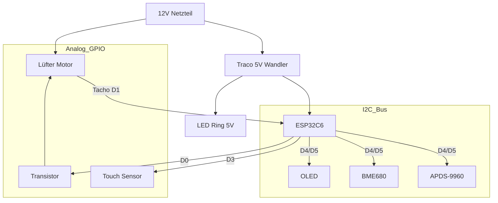

# 🌬️ Smarte Wohnraumlüftung mit Wärmerückgewinnung (ESP32-C6)

Eine professionelle, dezentrale Lüftungssteuerung basierend auf ESPHome. Dieses Projekt steuert einen reversierbaren Lüfter (Push-Pull) zur Wärmerückgewinnung, überwacht die Luftqualität (IAQ, CO2-Äquivalent) und bietet ein intuitives User Interface mit OLED-Display, Gestensteuerung und LED-Feedback.

## ✨ Features

**Lüftungsmodi (Logik geplant):**

- 🔄 **Wärmerückgewinnung**: Alternierender Betrieb (70s Rein / 70s Raus) zur Nutzung des Keramik-Wärmespeichers.
- 💨 **Durchlüften**: Permanenter Abluftbetrieb (z.B. im Sommer oder bei schlechten Gerüchen).

**Sensorik & Überwachung:**

- 🌡️ **Temperatur & Feuchte**: Präzise Messung (via BME680). *NTC-Sensoren im Luftstrom geplant.*
- 🍃 **Luftqualität (IAQ)**: Bosch BME680 mit BSEC2-Algorithmus zur Erkennung von VOCs und IAQ-Qualität.
- 🏎️ **Drehzahlüberwachung**: Echtes Tacho-Signal-Feedback vom Lüfter.
- 📈 **Effizienz-Berechnung**: Ermittlung des Wirkungsgrads live in % *(Geplant)*.

## Modernes UI

- 📟 **OLED Display**: Zeigt Status, IAQ und Drehzahl an.
- 🌈 **LED Ring**: Visualisiert Luftqualität (Grün->Gelb->Rot) durch Animationen.
- 👋 **Annäherung**: Display wacht automatisch auf, wenn man sich nähert (APDS-9960).
- 👆 **Bedienung**: Ein Touch-Button für Display-Toggle. *Erweiterte Bedienung geplant.*

Home Assistant Integration: Volle Kontrolle und Visualisierung über Home Assistant.

## 🛠️ Hardware & Bill of Materials (BOM)

### Zentrale Einheit

| Komponente | Beschreibung |
| :--- | :--- |
| **MCU** | Seeed Studio XIAO ESP32C6 (RISC-V, WiFi 6, Zigbee/Matter ready) |
| **Power** | 12V DC Netzteil (mind. 1A) |
| **DC/DC** | Traco Power TSR 1-2450 (12V zu 5V Wandler, effizient) |

### Aktoren & Sensoren

| Komponente | Beschreibung |
| :--- | :--- |
| **Lüfter** | 120mm PWM Lüfter (z.B. Arctic P12 PWM). *Geplant: ebm-papst AxiRev für Profi-Einsatz.* |
| **BME680** | Bosch Umweltsensor (Temp, Hum, Pressure, Gas/IAQ) |
| **NTCs** | 2x NTC 10k *(Geplant für Zuluft/Abluft Messung)* |
| **APDS-9960** | Gesten- und Annäherungssensor |

### User Interface

| Komponente | Beschreibung |
| :--- | :--- |
| **Display** | 0.91" OLED (SSD1306, 128x32 I2C) |
| **LEDs** | LED Ring mit 7x WS2812B (Neopixel) |
| **Touch** | 1x Kapazitiv (Implementiert) + 1x *(Geplant)* |

🔌 Pinbelegung & Verkabelung

Das System basiert auf dem Seeed XIAO ESP32C6.

⚠️ WICHTIG: Der Lüfter läuft mit 12V, die Logik mit 3.3V. Achte auf die korrekten Spannungsteiler und Schutzbeschaltungen (siehe Schaltplan).

| XIAO Pin | GPIO | Funktion | Anschluss / Bemerkung |
| :--- | :--- | :--- | :--- |
| **D0** | GPIO0 | PWM Lüfter | Via NPN-Transistor (Inverted Logic) |
| **D1** | GPIO1 | Tacho Signal | Lüfter RPM Signal |
| **D2** | GPIO2 | LED Ring | Data In (WS2812) |
| **D3** | GPIO21 | Touch Button | Display ON/OFF Toggle |
| **D4** | GPIO22 | I2C SDA | BME680, OLED, APDS-9960 |
| **D5** | GPIO23 | I2C SCL | BME680, OLED, APDS-9960 |
| **D8** | GPIO18 | *NTC Innen* | *(Geplant)* |
| **D9** | GPIO17 | *NTC Außen* | *(Geplant)* |

### Schematische Darstellung (Konzept)

💻 Installation & Software

Voraussetzungen:

Installiertes ESPHome Dashboard (z.B. als Home Assistant Add-on).

Grundkenntnisse in YAML.

Konfiguration:

1. Kopiere den Inhalt von `esptest.yaml` in deine ESPHome Instanz.
2. Erstelle eine `secrets.yaml` mit deinen WLAN-Daten:

wifi_ssid: "DeinWLAN"
wifi_password: "DeinPasswort"
ap_password: "FallbackPasswort"
ota_password: "OTAPasswort"

Kalibrierung der NTCs:

Die Konfiguration nutzt NTCs mit einem B-Wert von 3435. Falls du andere Sensoren nutzt, passe den b_constant Wert im YAML Code an.

Flashen:

Verbinde den XIAO per USB.

Klicke auf "Install".

🎮 Bedienung

Am Gerät

Touch Links (Kurz): Lüfterstufe erhöhen (1-10, rotiert).

Touch Links (Lang): Wechsel zwischen Modus "Wärmerückgewinnung" und "Durchlüften".

Touch Rechts (Lang > 5s): Gerät Ein/Aus schalten.

Annäherung: Hand vor den Sensor halten (< 10cm) aktiviert das Display und den LED-Ring für 10 Sekunden.

Visualisierung (OLED)

Links: Drehzahlbalken & Pfeil für Luftrichtung (-> Raus, <- Rein).

Rechts: Temperatur, Feuchte, IAQ (rotiert alle 3 Sek. durch Details).

Unten Rechts: Aktuelle Effizienz der Wärmerückgewinnung in %.

LED Ring Status

Farbe: Zeigt die Luftqualität (Grün = Super, Gelb = OK, Rot = Schlecht).

Helligkeit: Korrespondiert mit der Lüftergeschwindigkeit.

🧠 Logik der Wärmerückgewinnung

Da die Sensoren abwechselnd kalte Außenluft und warme Innenluft messen, ist eine direkte Delta-Messung schwierig. Der Algorithmus arbeitet wie folgt:

Phase Rausblasen (70s): Der Keramikspeicher lädt sich auf. Am Ende der Phase misst NTC Innen die wahre Raumtemperatur.

Phase Reinblasen (70s): Kalte Außenluft wird durch den Speicher erwärmt.

NTC Außen misst die Außentemperatur.

NTC Innen misst die vorgewärmte Zuluft.

Berechnung: Am Ende der "Rein"-Phase wird die Effizienz ermittelt (Konzept):

$$ \text{Effizienz} = \frac{T_{\text{Zuluft}} - T_{\text{Außen}}}{T_{\text{Raum}} - T_{\text{Außen}}} \times 100 $$

⚠️ Sicherheitshinweise

Dieses Projekt arbeitet im 12V Bereich, was generell sicher ist.

Das Netzteil (230V zu 12V) muss fachgerecht installiert und isoliert werden.

Achte auf ausreichende Isolationsabstände auf PCBs zwischen Hochvolt- und Niedervolt-Bereichen.

📜 Lizenz

Dieses Projekt steht unter der MIT Lizenz.
Feel free to fork & improve!
