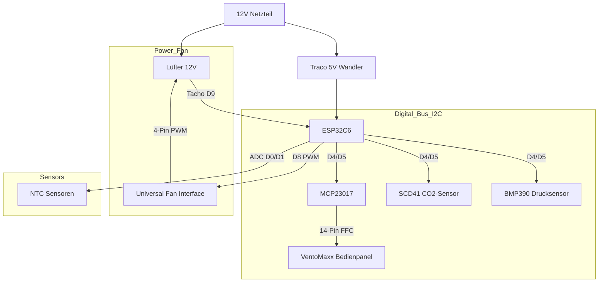

# 🌬️ Smarte dezentrale Wohnraumlüftung mit Wärmerückgewinnung auf Basis von ESP32-C6 und ESPHome

Eine professionelle, dezentrale Lüftungssteuerung basierend auf ESPHome. Dieses Projekt erstezt die Steuerung der VentoMaxx V-WRG Serie mittels eines eigens dafür entwickelten PCB und steuert damit einen reversierbaren 12V Lüfter (Push-Pull) zur Wärmerückgewinnung, überwacht die Luftqualität (CO2, Feuchte und Temperatur), berechnet die effektive Wärmerückgewinnung und nutzt das **originale VentoMaxx Bedienpanel** für eine nahtlose Integration und intuitive Steuerung.

> 💡 **Kompatibilität:** Die Steuerung funktioniert prinzipiell für jede dezentrale Wohnraumlüftung mit 12V Lüftern (3-PIN oder 4-PIN PWM). Sie wurde jedoch **speziell als Ersatz für die VentoMaxx V-WRG Serie** entwickelt. Die Hardware (PCB-Layout/Größe und Bedienpanel) ist damit explizit für die VentoMaxx V-WRG Serie optimiert und muss für andere Hersteller ggf. angepasst werden. Das PCB ist so konzipiert, dass es in das Gehäuse der VentoMaxx V-WRG Serie passt und die vorhandenen Befestigungspunkte nutzt.

[](https://esphome.io/)
[](https://www.home-assistant.io/)
[](https://github.com/thomasengeroff-dotcom/ESPHome-Wohnraumlueftung/releases)
[](https://esphome.io/components/esp32.html)


[](https://opensource.org/licenses/MIT)

---

## 📑 Inhaltsverzeichnis

- [Leistungsmerkmale](#-leistungsmerkmale)
- [Vergleich mit VentoMaxx](#-vergleich-mit-ventomaxx-v-wrg)
- [ESP-NOW & Autonomie](#-esp-now-kabellose-autonomie)
- [Hardware & BOM](#️-hardware--bill-of-materials-bom)
- [Eigene Platine (PCB)](#-eigene-platine-pcb)
- [Pinbelegung](#-pinbelegung--verkabelung)
- [Installation](#-installation--software)
- [Bedienung](#-bedienung--steuerung)
- [Wärmerückgewinnung](#-wärmerückgewinnung---so-funktionierts)
- [Technische Details](#-technische-details--optimierungen)
- [Projektstruktur](#-projektstruktur)
- [Code-Architektur](#️-code-architektur--wartbarkeit)
- [Troubleshooting](#-troubleshooting)
- [Lizenz](#-lizenz)

---

## ✨ Leistungsmerkmale

### ⚙️ Intelligente Betriebsmodi

- 🔄 **Effiziente Wärmerückgewinnung**: Zyklischer, bidirektionaler Betrieb (Push-Pull) zur Maximierung der Energieeffizienz. Die Synchronisation aller Einheiten erfolgt vollautomatisch und kabellos über das ESP-NOW Protokoll.
- 💨 **Querlüftung (Sommerbetrieb)**: Modus für permanenten Abluftstrom, ideal zur passiven Kühlung in Sommernächten. Flexibel konfigurierbar via Timer oder als Dauerbetrieb.
- 🔗 **Autarkes Mesh-Netzwerk**: Robuste Dezentralität durch direkte Peer-to-Peer Kommunikation (ESP-NOW). Der Gruppenbetrieb ist auch ohne zentrale WLAN-Infrastruktur oder externe Broker gewährleistet.

### 🛡️ Präzisions-Sensorik & Monitoring

- 🌡️ **Klimadatenerfassung**: Hochpräzise Messung von Temperatur und relativer Luftfeuchtigkeit mittels Sensirion SCD41.
- 💨 **Echte CO2-Messung**: Der SCD41 nutzt **photoacoustic sensing** zur direkten CO2-Messung (400-5000 ppm) statt berechneter Äquivalente - ideal für bedarfsgerechte Lüftungssteuerung.
- 🏔️ **Luftdruckmessung via BMP390**: Der hochpräzise Barometer-Sensor ermöglicht lokale Wettertrend-Analysen, Sturmwarnungen (Rapid Pressure Drop) und liefert gleichzeitig die exakten Höhendaten für die Autokalibrierung und barometrische Kompensation des SCD41 CO2-Sensors.
- 📊 **Automatische Intensitätsregelung**: Das System kann die Lüfterleistung automatisch bei steigendem CO2-Gehalt für optimale Raumluftqualität erhöhen.
- 🏎️ **Closed-Loop Drehzahlüberwachung**: Kontinuierliches Monitoring der Lüfterdrehzahl via Tacho-Signal für konstanten Volumenstrom und Fehlererkennung.

### 🖥️ Human-Machine Interface (HMI)

- 🚥 **Original VentoMaxx Panel**: Nutzung des originalen Bedienfelds mit 9 LEDs und 3 Tastern mit überwiegend identischer Funktionalität bzw. Bedienung wie beim Original.
- 🔘 **Intuitive Steuerung**:
  - **Power**: System Ein/Aus/Reset.
  - **Modus**: Wechsel zwischen Wärmerückgewinnung (Winter), Querlüftung (Sommer) und dynamischer Lüftung basierend auf CO2-Gehalt und Feuchte.
  - **Stufe +**: 5 Lüfterstufen (zyklisch).
- 🔆 **LED Feedback**: Anzeige von Modus, aktueller Lüfterstufe (1-5) und Status.
  - Master Led wird derzeit nicht genutzt. Kann aber für zukünftige Funktionen genutzt werden zB. für die Anzeige von Fehlern oder Warnungen.

### 🏠 Integration

**Volle Home Assistant Integration**: Native API-Unterstützung für nahtloses Monitoring, Steuerung und Automatisierung über Ihr Smart Home System. Alle Funktionalitäten des Geräts sind über Home Assistant steuerbar und auslesbar.

### ️ Roadmap & Zukünftige Erweiterungen

Die Firmware ist für folgende "Advanced Automation"-Funktionen vorbereitet (Implementierung folgt):

- **🤖 Adaptive CO2-Regelung** ✅ *Implementiert*:
  - Dynamische Anpassung der Lüfterleistung basierend auf Echtzeit-CO2-Werten (ppm) vom SCD41 Sensor.
  - 6-stufige Schwellwerte nach DIN EN 13779 / Umweltbundesamt (600/800/1000/1200/1400 ppm) mit 100 ppm Hysterese.
  - Konfigurierbarer **Max-Level** (Noise Control) begrenzt die Lüfterdrehzahl auch bei hohen CO2-Werten.
  - Nur aktiv wenn SCD41 angeschlossen ist — automatische Erkennung. Lokal und remote aktivierbar.
  - Siehe [📄 CO2 Automatik Dokumentation](documentation/CO2-Automatik.md) für Details.

- **🌙 Intelligenter Nachtmodus**:
  - Zeitgesteuerte Drosselung der Lüfterleistung zur Geräuschminimierung in Ruhephasen.
  - Flexibles Zeitmanagement und Definition spezifischer Nacht-Profile.
  - Lokal und remote aktivierbar.

- **🧹 Wartungs-Management**:
  - Prädiktiver Filterwechsel-Alarm basierend auf Betriebsstunden und Zeitintervallen.
  - Lokale Visualisierung und digitale Benachrichtigung im Smart Home Dashboard.

- **💧 Feuchte-Management**:
  - Automatisierte Entfeuchtungslogik zur Schimmelprävention basierend auf absoluter und relativer Feuchte.
  - Intelligente Hysterese-Steuerung zur Vermeidung von "Rapid Cycling".
  - Lokal und remote aktivierbar.
  - Zielwert für maximale Luftfeuchtigkeit konfigurierbar.

- **Unterdruckwächter**:
  - Zum Differenzdruckausgleich bei gleichzeitigem Betrieb von Kamin-/Holzofen und Lüftungsanlage. Erweiterung der Hardware durch einen potentialfreien Kontakt, an welchem der Unterdruckwächter angeschlossen wird.

- **KI-gestützte Lüftungssteuerung**:
  - Proaktive KI-gestützte Lüftungssteuerung basierend auf historischen Daten und externen Prognosen (Wetter, CO2, Feuchte). Siehe [📄 KI-gestützte Lüftungssteuerung](documentation/KI-gestützte-Lüftungssteuerung.md) für Details.

- **🚶 Radar-basierte Anwesenheitserkennung**:
  - Integration eines 24GHz mmWave-Radarsensors (MR24HPC1) über den vorgesehenen UART-Pin-Header auf der Platine.
  - Da die dezentralen Lüftungsgeräte ohnehin in jedem relevanten Raum optimal positioniert sind, dienen sie gleichzeitig als perfekter Standort für eine raumgenaue Präsenzerfassung, die nahtlos an Home Assistant übergeben wird.
  - **Bedarfsgesteuerte Regelung**: Über Home Assistant lässt sich konfigurieren, inwieweit die Lüftung bei erkannter Anwesenheit reagieren soll (z. B. Lüfterdrehzahl drosseln zur Lärmreduzierung im Schlafzimmer).
  
### 🔧 Aktuelle technische Verbesserungen

- **Hardware-Upgrade: SCD41 CO2-Sensor & BMP390 (Februar 2026)**:
  - ✅ Wechsel von BME680 (VOC-basierte IAQ-Schätzung) zu **SCD41** (echte CO2-Messung) und **BMP390** (Luftdruck)
  - ✅ **Photoacoustic sensing** für präzise CO2-Messung (400-5000 ppm)
  - ✅ Integrierte Temperatur- und Feuchtigkeitsmessung (SCD41)
  - ✅ Automatische CO2-basierte Lüftungsregelung für optimale Raumluftqualität
  - ✅ Dokumentation: `EasyEDA-Pro/components/SCD41-Sensirion.pdf`

- **Code-Refactoring (Februar 2026)**:
  - ✅ Alle Multi-Line-Lambdas in `automation_helpers.h` ausgelagert
  - ✅ Verbesserte Typsicherheit durch explizite C++ Funktionen
  - ✅ Modernisierte ESPHome API-Nutzung (`current_option()` statt deprecated `.state`)
  - ✅ Korrekte Template-Typen für Script-Komponenten (`RestartScript<>`, `SingleScript<>`)
  - ✅ Präzise Komponenten-Typen (`SpeedFan`, `LEDCOutput` statt generischer Basisklassen)

---

## 🔄 Vergleich mit VentoMaxx V-WRG

Diese Lösung wurde als smarter Ersatz für die herkömmliche [VentoMaxx V-WRG / WRG PLUS](https://www.ventomaxx.de/dezentrale-lueftung-produktuebersicht/aktive-luefter-mit-waermerueckgewinnung/) Steuerung entwickelt. Einen detaillierten Funktionsvergleich finden Sie in **[Comparison-VentoMaxx.md](documentation/Comparison-VentoMaxx.md)**.

Während die originale VentoMaxx-Lösung keine Integration in ein Smart Home System ermöglicht, bietet dieser ESPHome-Ansatz ein völlig neues Level an Flexibilität und Integrität. Da hier diese Lösung auf ESPHome basiert, kann sie mit jeder Home Assistant Version verwendet werden und bietet eine native Integration in Home Assistant.

### Funktionsvergleich

| Feature             | VentoMaxx V-WRG (Standard)     | ESPHome Smart WRG (Dieses Projekt)           |
| :------------------ | :----------------------------- | :------------------------------------------- |
| **Konnektivität**   | Kabelgebunden / Inselbetrieb   | **WiFi 6 & ESP-NOW Mesh**                    |
| **Smart Home**      | Nein (oder teure Zusatzmodule) | **Nativ Home Assistant (API)**               |
| **Visualisierung**  | Status-LEDs (Original Panel)   | **Status-LEDs + Home Assistant Dashboard**   |
| **Sensorik**        | Optional CO2 (rudimentär)      | **SCD41 (Echtes CO2, Temp, Hum)**            |
| **Bedienung**       | Wandschalter / Fernbedienung   | **Original Panel, App & Automatik**          |
| **Synchronisierung**| Physisches Steuerkabel         | **Kabellos & Intelligent via ESP-NOW**       |
| **Konfiguration**   | DIP-Schalter / Potentiometer   | **Dynamisch per Software (Floor/Room IDs)**  |
| **Kosten**          | Hochpreisig (Industriestandard)| **Preiswert & Unbegrenzt erweiterbar**       |

### 🚀 Warum diese Lösung überlegen ist

1. **Echte CO2-Messung statt Schätzwerte**: Der SCD41 misst den tatsächlichen CO2-Gehalt (400-5000 ppm) mittels **photoacoustic sensing** - nicht nur VOC-basierte Näherungswerte. Bei erhöhtem CO2 schaltet das System automatisch hoch.
2. **Keine neuen Kabel**: Durch **ESP-NOW** synchronisieren sich Geräte in einem Raum (z.B. paarweiser Push-Pull Betrieb) komplett kabellos über Funk. Das Ganze funktioniert sogar, wenn das lokale WLAN ausfällt, da die Kommunikation direkt über die Wi-Fi-Radio-Hardware (MAC-Ebene) erfolgt, ohne dass eine Verbindung zu einem Access Point erforderlich ist.
3. **Wartungs-Intelligenz**: Durch die **Tacho-Auswertung** erkennt das System, ob ein Lüfter blockiert oder verschmutzt ist, und meldet dies proaktiv an Home Assistant.
4. **Zukunftssicher**: Dank **Over-the-Air (OTA)** Updates können neue Funktionen oder verbesserte Regelalgorithmen (z.B. für Wärmerückgewinnung) jederzeit eingespielt werden.

---

## 📡 ESP-NOW: Kabellose Autonomie

Die Geräte kommunizieren über die [ESPHome ESP-NOW Komponente](https://esphome.io/components/espnow.html). **ESP-NOW** ist ein von Espressif entwickeltes, verbindungsloses Protokoll, das eine direkte Kommunikation zwischen ESP32-Geräten ohne Umweg über einen WLAN-Router ermöglicht.

### Vorteile im Überblick

- 🌐 **WLAN-Unabhängigkeit**: Die Geräte benötigen keinen WLAN-Router (Access Point) für die Synchronisation. Die Kommunikation erfolgt direkt auf der MAC-Ebene (2,4 GHz Radio). Fällt das lokale WLAN aus, arbeitet die Lüftungsgruppe ungestört weiter.
- 🛡️ **Hohe Zuverlässigkeit**: Durch die direkte Punkt-zu-Punkt-Kommunikation ist das System immun gegen Überlastungen oder Störungen im herkömmlichen WLAN-Netzwerk.
- ⚡ **Extrem geringe Latenz**: Da keine Verbindung aufgebaut oder verwaltet werden muss (handshake-frei), werden Synchronisationsbefehle nahezu verzögerungsfrei übertragen. Dies ist entscheidend für den exakten Richtungswechsel synchronisierter Lüfterpaare.
- 🔌 **Keine Steuerleitungen**: Es müssen keine Datenkabel durch Wände gezogen werden. Die Synchronisation erfolgt "Out-of-the-box" über Funk.
- 📡 **Automatisches Software-Filtering**: Durch den Broadcast-Modus und die projektinterne Filterung (Floor/Room ID) finden sich Geräte im gleichen Raum automatisch.

Weitere Informationen finden Sie in der [offiziellen ESPHome Dokumentation](https://esphome.io/components/espnow.html).

---

## 🛠️ Hardware & Bill of Materials (BOM)

### Zentrale Einheit

| Komponente | Beschreibung |
| :--- | :--- |
| **MCU** | Seeed Studio XIAO ESP32C6 (RISC-V, WiFi 6, Zigbee/Matter ready) |
| **Power** | TRACO POWER TMPS10-112 (230V AC zu 12V DC, 10W) |
| **DC/DC** | Diodes Inc. AP63205 (12V->5V) & AP63203 (12V->3.3V) |

### Aktoren & Sensoren

| Komponente | Beschreibung | Dokumentation |
| :--- | :--- | :--- |
| **Lüfter** | **AxiRev** (4-Pin PWM) oder **3-Pin PWM** (ohne Tacho-Signal). *Siehe [Anleitung-Fan-Circuit.md](documentation/Anleitung-Fan-Circuit.md)* | [Fan Component](https://esphome.io/components/fan/speed.html) |
| **SCD41** | Sensirion CO2-Sensor (Echtes CO2 400-5000ppm, Temp, Hum) via I²C | [SCD4X Component](https://esphome.io/components/sensor/scd4x.html) |
| **BMP390** | Bosch Hochpräziser Barometrischer Drucksensor via I²C | [BMP3XX Component](https://esphome.io/components/sensor/bmp3xx.html) |
| **NTCs** | 2x NTC 10k (Zuluft/Abluft) für Effizienzmessung | [NTC Sensor](https://esphome.io/components/sensor/ntc.html) |
| **I/O Expander** | **MCP23017** (I2C) für VentoMaxx Panel | [MCP23017](https://esphome.io/components/mcp23017.html) |

> ℹ️ **Hinweis zu 3-Pin PWM Lüftern:**
> Neben den klassischen 4-Pin PWM Lüftern gibt es auch spezielle Propeller/Lüfter, die **kein Tacho-Signal** besitzen und daher nur über **3 Pins** verfügen (GND, 12V, PWM). Diese können problemlos ohne physikalische Änderung an der Schaltung betrieben werden, indem der Tacho-Pin (Pin 3 am Terminal) einfach unbelegt bleibt. Beachten Sie jedoch, dass ohne Tacho-Signal keine direkte Überwachung der Drehzahl (RPM) oder Blockadeerkennung durch die Software möglich ist.

### 🖱️ User Interface

| Komponente | Beschreibung | Dokumentation |
| :--- | :--- | :--- |
| **VentoMaxx Panel** | Original Panel (14-Pin FFC). 3 Taster, 9 LEDs. | - |

---

## 🖱️ Eigene Platine - PCB

Eine dedizierte Platine (PCB), die alle oben genannten Komponenten (XIAO, Traco, Transistoren, Anschlüsse für Sensoren) kompakt vereint, befindet sich aktuell in der Entwicklung.

- **Professionelles Design**: Optimiert für den Einbau in Standard-Unterputzdosen oder Lüftergehäuse.
- **Plug & Play**: Einfache Montage durch Steckverbinder (JST/Dupont).
- **Bezug**: Informationen zum Layout (EasyEDA/KiCad) und Bestellmöglichkeiten werden dem Projekt hinzugefügt, sobald die Prototypen-Phase abgeschlossen ist.

---

## 🔌 Pinbelegung & Verkabelung

Das System basiert auf dem [Seeed XIAO ESP32C6](https://esphome.io/components/esp32.html).

⚠️ **WICHTIG:** Der Lüfter läuft mit 12V, die Logik mit 3.3V. Achte auf die korrekten Spannungsteiler und Schutzbeschaltungen.

| XIAO Pin | GPIO | Funktion | Bemerkung |
| :--- | :--- | :--- | :--- |
| **D0** | GPIO0 | [ADC Input](https://esphome.io/components/sensor/adc.html) | NTC Außen (Abluft) |
| **D1** | GPIO1 | [ADC Input](https://esphome.io/components/sensor/adc.html) | NTC Innen (Zuluft) |
| **D2** | GPIO2 | Output | **MCP23017 Reset** |
| **D3** | GPIO21 | Output | **PCA9685 OE** (Output Enable) |
| **D4** | GPIO22 | [I2C SDA](https://esphome.io/components/i2c.html) | SCD41, BMP390, PCA9685, MCP23017 |
| **D5** | GPIO23 | [I2C SCL](https://esphome.io/components/i2c.html) | SCD41, BMP390, PCA9685, MCP23017 |
| **D6** | GPIO16 | [UART RX](https://esphome.io/components/uart.html) | **MR24HPC1 Radar RX** |
| **D7** | GPIO17 | [UART TX](https://esphome.io/components/uart.html) | **MR24HPC1 Radar TX** |
| **D8** | GPIO19 | [PWM Output](https://esphome.io/components/output/ledc.html) | **Fan PWM Primary** |
| **D9** | GPIO20 | [Pulse Counter](https://esphome.io/components/sensor/pulse_counter.html) | **Fan Tacho** (Pullup via 3V3) |
| **D10** | GPIO18 | - | Unbelegt (NC) |

### 📊 Schematische Darstellung (Konzept)



---

## 💻 Installation & Software

### Voraussetzungen

- Installiertes ESPHome Dashboard (z.B. als Home Assistant Add-on)
- Grundkenntnisse in YAML

### Konfiguration

1. Kopiere den Inhalt von `esp_wohnraumlueftung.yaml` in deine ESPHome Instanz.
2. Erstelle eine `secrets.yaml` mit deinen WLAN-Daten:

```yaml
wifi_ssid: "DeinWLAN"
wifi_password: "DeinPasswort"
ap_password: "FallbackPasswort"
ota_password: "OTAPasswort"
```

### Kalibrierung der NTCs

Die Konfiguration nutzt NTCs mit einem B-Wert von 3435. Falls du andere Sensoren nutzt, passe den `b_constant` Wert im YAML Code an.

### Flashen

1. Verbinde den XIAO per USB.
2. Klicke auf "Install".

---

## 🎮 Bedienung & Steuerung

Die Steuerung erfolgt intuitiv über das integrierte Bedienpanel oder vollautomatisch via Home Assistant.

### 🖐️ Bedienpanel (VentoMaxx Style)

Das Panel verfügt über 3 Taster und 9 Status-LEDs.

#### Tastenbelegung

| Taste | Funktion | Bedienung |
| :--- | :--- | :--- |
| **Power (I/O)** | System Ein/Aus | • Kurz drücken: Standby Toggle<br>• Lang drücken (>5s): Hard Reset |
| **Modus (M)** | Betriebsart wählen | • Kurz drücken: Wechselt zwischen *Wärmerückgewinnung* und *Durchlüften* |
| **Stufe (+)** | Lüfterstärke | • Kurz drücken: Zykliert durch 10 Geschwindigkeitsstufen (angezeigt über 5 LEDs). |

#### Status-LEDs (Feedback)

| LED Gruppe | LEDs | Anzeige |
| :--- | :--- | :--- |
| **Power** | 🟢 1x Grün | Leuchtet permanent, wenn System aktiv. Blinkt bei Fehler. |
| **Master** | 🟢 1x Grün | Leuchtet, wenn dies das Master-Gerät in einer Gruppe ist. |
| **Programm** | 🟢 2x Grün | Zeigt das aktive Programm an (siehe unten). |
| **Intensität** | 🟢 5x Grün | Zeigt aktuelle Lüfterstufe 1 bis 5 (halbe/volle Helligkeit für 10 Stufen). |

---

### 🔄 Detaillierte Betriebsmodi (Programme)

Über die **Modus-Taste (M)** werden die vier Hauptprogramme gewählt. Die Anzeige erfolgt über die zwei Modus-LEDs (**L** = Links, **R** = Rechts):

#### 1. Effizienzlüftung (WRG)

- **Anzeige:** LED **L** leuchtet.
- **Funktion:** Optimierte Wärmerückgewinnung im zyklischen Push-Pull Betrieb.
- **Zykluszeiten:** Die Reversierzeiten passen sich automatisch der Lüfterstufe an:
  - Stufe 1: **70 Sek.**
  - Stufe 2: **65 Sek.**
  - Stufe 3: **60 Sek.**
  - Stufe 4: **55 Sek.**
  - Stufe 5: **50 Sek.**
- **Synchronisation:** Paarzahlig aktive Stationen laufen im Gegentakt (Druckneutral).

#### 2. Stoßlüftung

- **Anzeige:** LED **R** leuchtet.
- **Funktion:** Intensivlüftung für schnellen Luftaustausch.
- **Ablauf:** 15 Minuten Effizienzlüftung (WRG), gefolgt von 105 Minuten Pause. Der 2-Stunden-Zyklus startet dann erneut mit umgekehrter Drehrichtung.

#### 3. Querlüftung (Durchlüften)

- **Anzeige:** LED **L** & **R** leuchten.
- **Funktion:** Dauerhafter Durchfluss ohne Richtungswechsel (keine WRG).
- **Betrieb:** Eine Hälfte der Gruppe arbeitet als Zuluft, die andere als Abluft.
- **Hinweis:** Nur im Gruppenmodus verfügbar.

#### 4. Sensorlüftung (Automatik)

- **Anzeige:** Beide LEDs **AUS**.
- **Funktion:** Bedarfsgesteuerte Regelung über den integrierten Hygrosensor.
- **Logik:** Das System schaltet bei Überschreitung von Schwellenwerten automatisch hoch:
  - **< 55% r.F.:** Stufe 1 (Standard)
  - **>= 55% r.F.:** Stufe 2
  - **>= 65% r.F.:** Stufe 3
  - **>= 70% r.F.:** Stufe 4
  - **>= 80% r.F.:** Stufe 5
- Die Rückschaltung erfolgt bei Unterschreitung von 54% r.F. (Hysterese). Die maximale Stufe kann manuell begrenzt werden.

---

### 📱 Steuerung über Home Assistant

Alle Funktionen sind vollständig in Home Assistant integriert. Änderungen am Panel werden sofort synchronisiert.

#### Verfügbare Steuerungen

- **Lüfter**: Slider 0-100% (Panel-Stufen entsprechen ~20% Schritten)
- **Modus**: Auswahl (Eco Recovery / Ventilation / Off)
- **Timer**: Konfiguration für "Durchlüften" (Standard: 30 Min)
- **Diagnose**: Anzeige von RPM, Temperatur, Feuchte und **CO2-Gehalt (ppm)**

#### Automatische Funktionen

- **Nachtmodus (geplant)**: Dimmt die LEDs automatisch basierend auf Uhrzeit.
- **Filter-Alarm**: Power-LED blinkt rot (geplant), wenn Filterwechsel nötig.

---

### 💡 Tipps für optimale Nutzung

#### Betriebsarten sinnvoll einsetzen

- ❄️ **Winter (WRG)**: Nutzen Sie immer den Wärmerückgewinnungs-Modus für maximale Energieersparnis.
- ☀️ **Sommer (Querlüftung)**: Abends den "Durchlüften"-Modus aktivieren, um kühle Außenluft einzubringen (ohne WRG).
- 🔇 **Nacht**: Stufe 1 oder 2 ist meist ausreichend und kaum hörbar.

#### Wartung & Pflege

- **Filter**: Alle 6 Monate prüfen/wechseln.
- **Reinigung**: Panel nur mit trockenem Tuch reinigen.
- **Wärmetauscher**: Einmal jährlich mit Wasser ausspülen (siehe Herstelleranleitung).

---

## 🧠 Wärmerückgewinnung - So funktioniert's

### Grundprinzip

Das System nutzt einen **Keramikspeicher** zur Wärmerückgewinnung. Dieser speichert Wärme aus der Abluft und gibt sie an die Zuluft ab. Die Zykluszeit (Phase) variiert je nach Luftstufe zwischen **50s und 70s**, um die Energieeffizienz zu optimieren.

### Betriebszyklus (50s bis 70s pro Phase)


### Phase 1: Abluft (Rausblasen) - 70 Sekunden

```text
Innenraum (warm) → Keramikspeicher → Außen
    21°C              ↓ Wärme         5°C
                  speichern
```

**Was passiert:**

- 🔥 Warme Raumluft (21°C) strömt durch den Keramikspeicher
- 📈 Keramik erwärmt sich und speichert Energie
- 🌡️ **NTC Innen** misst am Ende die wahre Raumtemperatur
- 💨 Abgekühlte Luft (~10°C) wird nach außen geblasen

### Phase 2: Zuluft (Reinblasen) - 70 Sekunden

```text
Außen → Keramikspeicher → Innenraum (vorgewärmt)
 5°C     ↑ Wärme           ~16°C
        abgeben
```

**Was passiert:**

- ❄️ Kalte Außenluft (5°C) strömt durch den warmen Keramikspeicher
- 🔄 Keramik gibt gespeicherte Wärme ab
- 🌡️ **NTC Außen** misst Außentemperatur
- 🌡️ **NTC Innen** misst vorgewärmte Zuluft (~16°C)
- 🏠 Vorgewärmte Luft strömt in den Raum

### NTC Sensoren

Die NTC Sensoren messen die Temperatur am Keramikspeicher innen und außen. Um die Messung möglichst genau zu machen, werden sehr kleine NTC Sensoren genutzt, mit möglichst geringer Masse und hoher Genauigkeit. Dadurch wird die Anpassung an die wechselnde Temperatur je nach Lüftungsrichtung möglichst schnell und präzise.
Konkret wird der folgende Sensor verwendet:

| Hersteller | Artikelnummer | Bezugsquelle | Genauigkeit | Datenblatt |
| :--- | :--- | :--- | :--- | :--- |
| **VARIOHM** | `ENTC-EI-10K9777-02` | [Reichelt Elektronik](https://www.reichelt.de/de/de/shop/produkt/thermistor_ntc_-40_bis_125_c-350474) | ± 0,2 °C | [PDF](EasyEDA-Pro/components/NTC_ENTC_EI-10K9777-02.pdf) |

### Effizienzberechnung

Am Ende der Zuluft-Phase wird die Wärmerückgewinnung berechnet:

$$
\text{Effizienz} = \frac{T_{\text{Zuluft}} - T_{\text{Außen}}}{T_{\text{Raum}} - T_{\text{Außen}}} \times 100\%
$$

**Beispielrechnung:**

- Raumtemperatur: 21°C
- Außentemperatur: 5°C
- Zulufttemperatur: 16°C

$$
\text{Effizienz} = \frac{16°C - 5°C}{21°C - 5°C} \times 100\% = \frac{11°C}{16°C} \times 100\% = 68.75\%
$$

**Interpretation:**

- **> 70%:** Ausgezeichnete Wärmerückgewinnung
- **50-70%:** Gute Wärmerückgewinnung
- **< 50%:** Keramik zu kalt oder Zyklus zu kurz

### Optimierung der Effizienz

| Parameter                 | Auswirkung                          | Empfehlung      |
| :------------------------ | :---------------------------------- | :-------------- |
| **Zyklusdauer**           | Längere Zyklen = bessere Speicherung| 70-90s optimal  |
| **Lüftergeschwindigkeit** | Langsamer = mehr Wärmeübertragung   | 60-80%          |
| **Keramikvolumen**        | Mehr Masse = mehr Speicher          | Größer ist besser|
| **Außentemperatur**       | Kälter = höhere Effizienz möglich   | -               |

### Synchronisation mehrerer Geräte

Bei Verwendung mehrerer Geräte im gleichen Raum:

**Paar-Betrieb (2 Geräte):**

```text
Gerät A: Phase A (Zuluft)  ←→  Gerät B: Phase B (Abluft)
         ↓ 70s wechseln ↓
Gerät A: Phase B (Abluft) ←→  Gerät B: Phase A (Zuluft)
```

**Vorteile:**

- ✅ Kontinuierlicher Luftaustausch
- ✅ Keine Druckschwankungen
- ✅ Optimale Wärmerückgewinnung
- ✅ Synchronisiert über ESP-NOW

---

## 🔧 Technische Details & Optimierungen

Detaillierte technische Informationen zu Sensor-Optimierungen, ESPHome YAML Syntax, I²C-Konfiguration und weiteren technischen Aspekten finden Sie in der separaten Dokumentation:

📄 **[Technical-Details.md](documentation/Technical-Details.md)**

Diese Dokumentation enthält:

- ESPHome YAML Syntax Best Practices
- I²C Bus Konfiguration
- SCD41 CO2-Sensor Konfiguration
- ESP-NOW Kommunikation
- Lüftersteuerung (PWM)

---

## 📁 Projektstruktur

```text
ESPHome-Wohnraumlueftung/
├── esp_wohnraumlueftung.yaml      # Hauptkonfiguration
├── esp32c6_common.yaml            # Gemeinsame ESP32-C6 Einstellungen
├── device_config.yaml             # Dynamische Gerätekonfiguration
├── automation_helpers.h           # C++ Helper-Funktionen für Lambdas
├── components/                    # Externe Komponenten
│   └── ventilation_group/         # Lüftungssteuerung
│       ├── __init__.py
│       └── ventilation_group.h
├── documentation/
│   ├── Anleitung-Fan-Circuit.md
│   ├── Hardware-Setup-Readme.md
│   └── Dynamic-Configuration.md
└── Readme.md                      # Diese Datei
```

---

## 🏗️ Code-Architektur & Wartbarkeit

### Modular aufgebaute Firmware

Die Firmware folgt einem **modularen Architekturansatz**, der Wartbarkeit und Erweiterbarkeit maximiert:

#### **`automation_helpers.h` - Zentrale Helper-Bibliothek**

Alle komplexen Lambda-Funktionen wurden in wiederverwendbare C++ Helper-Funktionen ausgelagert:

**Vorteile:**

- ✅ **Bessere Lesbarkeit**: YAML bleibt übersichtlich, Logik ist in C++ dokumentiert
- ✅ **Wiederverwendbarkeit**: Funktionen können an mehreren Stellen genutzt werden
- ✅ **Typsicherheit**: Compiler-Checks zur Compile-Zeit statt Runtime-Fehler
- ✅ **IDE-Support**: Syntax-Highlighting, Auto-Completion und Refactoring-Tools
- ✅ **Einfachere Wartung**: Änderungen an einem Ort statt in mehreren YAML-Lambdas

**Enthaltene Funktionen:**

- `handle_espnow_receive()` - ESP-NOW Paket-Verarbeitung und State-Synchronisation
- `handle_button_*_click()` - Taster-Event-Handler (Power, Mode, Level)
- `set_*_handler()` - UI-Element Callbacks (Timer, Cycle Duration, Fan Intensity)
- `update_leds_logic()` - LED-Status-Aktualisierung basierend auf System-State
- `cycle_operating_mode()` - Betriebsmodus-Wechsel-Logik
- `calculate_heat_recovery_efficiency()` - Wärmerückgewinnungs-Berechnung

**Beispiel:**

```yaml
# Vorher: Komplexe Lambda direkt im YAML
binary_sensor:
  - platform: gpio
    on_press:
      - lambda: |-
          id(current_mode_index) = (id(current_mode_index) + 1) % 4;
          cycle_operating_mode(id(current_mode_index));
          id(update_leds).execute();

# Nachher: Sauberer Aufruf der Helper-Funktion
binary_sensor:
  - platform: gpio
    on_press:
      - lambda: handle_button_mode_click();
```

---

## 🔍 Troubleshooting

Für eine umfassende Anleitung zur Fehlerbehebung, siehe die dedizierte [Troubleshooting-Dokumentation](documentation/Troubleshooting.md).

**Häufige Themen:**

- ESPHome YAML Fehler
- I²C Bus Probleme
- APDS9960 Proximity-Sensor
- SCD41 CO2-Sensor Kalibrierung
- ESP-NOW Synchronisation
- Kompilierungsfehler
- Performance-Optimierung

---

## ⚠️ Sicherheitshinweise

- Dieses Projekt arbeitet im 12V Bereich, was generell sicher ist.
- Das Netzteil (230V zu 12V) muss fachgerecht installiert und isoliert werden.
- Achte auf ausreichende Isolationsabstände auf PCBs zwischen Hochvolt- und Niedervolt-Bereichen.

---

## 📜 Lizenz

Dieses Projekt steht unter der MIT Lizenz.
Feel free to fork & improve!

---

**Made with ❤️ and ESPHome**
