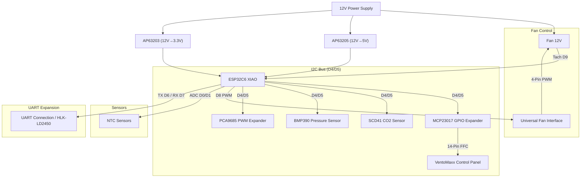
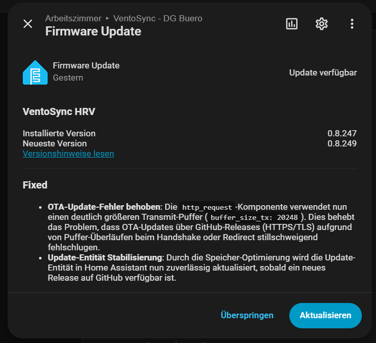

# 🌬️ VentoSync — ESPHome Smart HRV Control for VentoMaxx V-WRG (ESP32-C6)

[](Readme_de.md)

## ⚖️ Disclaimer

> ⚠️ **VentoSync is an independent community project and NOT affiliated with Ventomaxx GmbH.**

## 🚀 Summary & Overview

This open-source project offers a professional, decentralized heat recovery ventilation (HRV) control system based on ESPHome. It replaces the control system of the VentoMaxx V-WRG series using a custom developed printed circuit board (PCB), controlling the reversible 12V fan for heat recovery. 
It optionally monitors air quality (CO2, humidity, and temperature) using a high-quality Sensirion SCD41 sensor, calculates effective heat recovery and uses the **original VentoMaxx control panel** for seamless integration and intuitive operation. 
Furthermore, a mmWave radar sensor for presence detection can be optionally integrated, which can be mounted invisibly behind the cover of the ventilation unit.
Communication between individual ventilation units takes place via the stable ESP-NOW protocol, so no Wi-Fi or central control unit is required (the power line communication used by VentoMaxx is not used).

> 💡 **Compatibility:** The control system works in principle for any decentralized residential ventilation which works with a reversible 12V fan (3-PIN or 4-PIN PWM). However, it was **specifically developed as a replacement for the VentoMaxx V-WRG series**. The hardware (PCB layout/size and control panel) is therefore explicitly optimized for the VentoMaxx V-WRG series and needs to be adapted for other manufacturers. The PCB is designed to fit exactly into the housing of the VentoMaxx V-WRG series and uses the existing mounting points.
Attention: This solution is not compatible with the VentoMaxx ZR-WRG series, as it uses a central control unit! Adaption to the ZR-WRG series is possible, but currently not implemented.

[](https://esphome.io/)
[](https://www.home-assistant.io/)
[](https://esphome.io/components/esp32.html)


---

## 📑 Table of Contents

- [🚀 Summary & Overview](#🚀-summary--overview)
- [Motivation](#motivation)
- [🛠️ Custom made PCB](#🛠️-custom-made-pcb)
- [🔄 Comparison with VentoMaxx](#🔄-comparison-with-ventomaxx-v-wrg)
- [✨ Features](#✨-features)
- [📡 ESP-NOW: Wireless Autonomy](#📡-esp-now-wireless-autonomy)
- [🗺️ Roadmap & Future Enhancements](#🗺️-roadmap--future-enhancements)
- [🖱️ Custom Circuit Board - PCB](#🖱️-custom-circuit-board---pcb)
- [🛠️ Hardware & Bill of Materials (BOM)](#🛠️-hardware--bill-of-materials-bom)
- [🔌 Pin Assignment & Wiring](#🔌-pin-assignment--wiring)
- [🛠️ Installation & Software](#🛠️-installation--software)
- [📲 OTA Updates & Initial Provisioning](#📲-ota-updates--initial-provisioning)
- [🎮 Operation & Control](#🎮-operation--control)
- [🧠 Heat Recovery - How it works](#🧠-heat-recovery---how-it-works)
- [🔧 Technical Details & Optimizations](#🔧-technical-details--optimizations)
- [📁 Project Structure](#📁-project-structure)
- [🏗️ Code Architecture & Maintainability](#🏗️-code-architecture--maintainability)
- [🚀 Automated Versioning](#🚀-automated-versioning)
- [⚠️ Safety Instructions](#⚠️-safety-instructions)
- [⚖️ Legal Disclaimer](#⚖️-legal-disclaimer)
- [🔍 Troubleshooting](#🔍-troubleshooting)
- [📜 License](#📜-license)

---

## Motivation

Many years ago, as part of a house renovation, I installed the V-WRG decentralized residential ventilation from Ventomaxx (10 units) and was very satisfied with it. However, the proprietary control and the lack of integration into my smart home system always bothered me. Therefore, I decided to develop my own circuit board (PCB) including control software based on ESPHome, as there was no ready-made solution. This solution is open source and is intended to help other users who are in the same situation as I was.
For ventilation control based on CO2, I use an extremely high-quality and precise CO2 sensor (Sensirion SCD41), which is integrated directly into the board (via a small additional PCB; Note: Currently the Bosch BME680 serves as a fallback, as the SCD41 PCB is still in production). This sensor measures the real CO2 concentration in the air and controls the ventilation intensity according to the presets (using modern PID control). All code comments and internal documentation have been switched to English for better international maintainability, while the user interface remains in German.
Since the ventilation units in the various rooms are usually in a very central position, I also use them directly for presence detection via a radar sensor, which can be mounted invisibly hidden behind the cover of the ventilation unit. The presence sensor is used for controlling the ventilation intensity in Smart automatic mode and can also be used in Home Assistant for any other automations.
According to my research, the range of functions of this custom development goes beyond everything currently found on the ventilation unit market!

---

## 🛠️ Custom made PCB

The heart of the project is a custom developed circuit board that fits perfectly into the existing housing of the VentoMaxx units.


> [!TIP]
> If you are interested in obtaining a PCB for your own devices, please feel free to contact me at **thomas@engeroff.net**. 
> Please note that I have not yet decided whether the PCB production files will be made open source.


---

## 🔄 Comparison with VentoMaxx V-WRG

This solution is a **drop-in replacement** for the [VentoMaxx V-WRG / WRG PLUS](https://www.ventomaxx.de/dezentrale-lueftung-produktuebersicht/aktive-luefter-mit-waermerueckgewinnung/) control — mechanically compatible, functionally massively expanded:

| | VentoMaxx (Original) | ESPHome Smart WRG |
| :--- | :---: | :---: |
| Operating Modes | 3 | **5+** (incl. automation) |
| Sensors | 0-1 (opt. VOC) | **6** (CO2, Temp, Humidity, Pressure, Radar, Tachometer) |
| Fan Control | 3 fixed levels | **10 levels (discrete PID)** |
| Smart Home | ❌ | ✅ Home Assistant (native) |
| Maintenance Alarm | Timer-LED | ✅ Predictive + Push |
| Synchronization | Power line | ✅ Wireless (**ESP-NOW Protocol**) & Real-time Sync |
| Updates | Service technician (must be sent in) | ✅ Over-the-Air (OTA) |
| Versioning | Manual | ✅ Fully automatic (Patch-Level) |
| Extendability | ❌ | ✅ System can be extended with additional sensors and actuators or individual functions |
| License | Proprietary | ✅ Open Source (GPL v3) |

 **You can find the full feature-for-feature comparison with all technical details in [📄 Comparison-VentoMaxx.md](documentation/Comparison-VentoMaxx.md).**

---

## ✨ Features

### ⚙️ Intelligent Operating Modes

All devices in a room find each other automatically upon startup or room change via **dynamic ESP-NOW discovery** and subsequently communicate efficiently via unicast.

- 🤖 **Smart automatic**: Fully automatic control for maximum comfort and efficiency. Standard operation in heat recovery (push-pull) with dynamic PID-based adjustment to CO2 and humidity, taking outdoor air conditions into account. In summer, cross-ventilation for passive nightly cooling is automatically activated when it is cooler outside than inside. *→ [Full details and timing examples ↓](#1--smart-automatic-standard--recommended----led_wrg--pulses-slowly)*
- 🔄 **Efficient Heat Recovery**: Cyclic, bidirectional operation (push-pull) to maximize energy efficiency. This mode ignores CO2, humidity, and radar presence sensors.
- 💨 **Cross-Ventilation (Summer Mode)**: Mode for permanent exhaust air flow, ideal for passive cooling on summer nights. Flexibly configurable via timer or as continuous operation. This mode ignores CO2, humidity, and radar presence sensors.
- 🚀 **Boost Ventilation**: Intensive ventilation for quick air exchange. The device ventilates for 15 minutes with the **manually selected intensity** and then pauses for 105 minutes to effectively remove moisture and regenerate the ceramic heat exchanger. The cycle then repeats.
- 🌡️ **Off**: The fan is switched off but all sensors (CO2, Temp, Radar) and the web dashboard remain fully active to ensure gap-less measurement data in Home Assistant. The device acts in a **Monitoring Mode (Sensors-only)**.

### 🛡️ Precision Sensors & Monitoring

- 🌡️ **Climate Data Acquisition**: High-precision measurement of temperature and relative humidity using [Sensirion SCD41](https://sensirion.com/de/produkte/katalog/SCD41).
  - ✅ **Photoacoustic sensing** for precise CO2 measurement (400-5000 ppm), integrated temperature and humidity measurement (SCD41), Documentation: `EasyEDA-Pro/components/SCD41-Sensirion.pdf`
  - ✅ **BME680 Advanced IAQ Engine**: The BME680 now uses a custom C++ engine for robust baseline tracking, dynamic thermal compensation, and smart flash wear-leveling. This provides high-quality VOC/IAQ data without the overhead of the BSEC library.
  - ⚠️ **Note:** Since the SCD41 PCB is still in production, the **BME680** currently serves as a fallback (IAQ index). The code automatically detects if the SCD41 is present.
  - 🏔️ **Air Pressure Measurement & Hardware Protection via BMP390**: The high-precision barometer sensor [Bosch BMP390](https://www.bosch-sensortec.com/en/products/environmental-sensors/pressure-sensors/pressure-sensors-bmp390.html) not only provides local weather data and barometric compensation for the SCD41 but also acts as a **safety guard for the Traco power supply**:
    - **Automatic Derating Management**: Monitoring the internal temperature in the housing of the ventilation unit to comply with Traco specifications.
    - **Emergency Shutdown**: At critical temperatures (>60°C), a safety protocol starts (fan stop and 60min deep sleep) to protect the hardware from overheating and sends a corresponding warning to Home Assistant.


- 🚶 **Radar-based Presence Detection (HLK-LD2450)**: Presence in the room is precisely detected using a mmWave radar sensor (integrated via the UART pin header). In manual modes (Heat Recovery, Ventilation, Boost Ventilation), the sensor serves as a **manual boost/override**. Via a sliding demand control (slider `-5` to `+5`), the currently selected fan level can be ideally adjusted (e.g., `+3` intensifies ventilation in the office when someone is present, `-2` lowers it to reduce noise in the bedroom). In auto mode, presence is ignored in favor of stable PID control.
Of course, this sensor is exposed to Home Assistant and can be used for any other automations in Home Assistant.

- **💨 Advanced Air Quality & Cooling Logic**:
  - **Enthalpy-Balance / Absolute Humidity Guard**: Unlike conventional systems that compare relative humidity (which is misleading — cold air at 90% rH holds far less water than warm air at 50% rH), VentoSync calculates the **absolute humidity** in g/m³ using the [Magnus formula](https://en.wikipedia.org/wiki/Clausius%E2%80%93Clapeyron_relation). Humidity-driven ventilation is **only activated when outdoor air is actually drier** than indoor air. If outdoor air is more humid, the humidity demand is set to **zero** — the system will not import moisture, even if the humidity PID controller requests more ventilation.

    | Scenario | Indoor | Outdoor | Absolute Humidity | Result |
    |---|---|---|---|---|
    | ☀️ **Normal summer day** | 23°C / 55% rH | 20°C / 45% rH | Indoor: 11.3 g/m³ **>** Outdoor: 7.8 g/m³ | ✅ Ventilation helps → humidity demand active |
    | 🌧️ **Rainy / muggy day** | 23°C / 55% rH | 18°C / 90% rH | Indoor: 11.3 g/m³ **<** Outdoor: 13.8 g/m³ | 🛑 Outdoor air more humid → humidity demand = 0 |
    | ❄️ **Winter night** | 21°C / 45% rH | −5°C / 80% rH | Indoor: 8.3 g/m³ **>** Outdoor: 2.6 g/m³ | ✅ Cold air is very dry → ventilation helps |

    > [!TIP]
    > This feature sets VentoSync apart from most commercial HRV units, which blindly ventilate based on relative humidity alone and can actually **increase** indoor moisture during rainy or muggy weather.

    If both temperature sensors are unavailable, the system falls back to a simple relative humidity comparison as a safety net. See [📄 Automatic-Mode-Logic.md](documentation/Automatic-Mode-Logic.md) for full technical details.
- 📊 **Optimized VentoMaxx Ventilation Curve**: Based on the physical parameters of the original hardware (50% PWM = stop zone), the curve has been optimized with finer granularity in the lower levels (Levels 1-6) to ensure even more discreet acoustic operation.
- 🪟 **Window Guard**: Automatic room-wide ventilation pause when windows are open. Includes a per-device **"Ignore Window Guard" switch** to bypass the lock for specific units if needed.
  - ✅ **Smart Pause (5s Delay)**: The guard engages after 5 seconds of continuous "open" state to prevent accidental triggers. All VentoSync units in the room immediately stop their fans to prevent energy waste.
  - ✅ **Automatic Resume**: The system preserves its current operating mode (e.g., Automatic or Manual) and resumes operation seamlessly as soon as all windows are closed.
  - ✅ **Visual Feedback (35s Limit)**: A distinct pulsing pattern on the Master LED indicates the "Paused by Window" state. To avoid light pollution at night, the pulsing starts after 5 seconds and stops after 35 seconds while the fan remains safely stopped.
  - ✅ **HA Status Entity**: A dedicated binary sensor (`binary_sensor.fenstersperre_aktiv`) provides real-time visibility of the lock status in Home Assistant.
  - > For a step-by-step guide on how to integrate multiple window sensors and create the required room entities, please refer to our **[Home Assistant Window Guard Setup Guide](documentation/Window-Guard-HA-Setup.md)**.

- 📈 **Phase Position Continuity**: The system proportionally scales the current cycle progress to the new duration whenever the intensity is adjusted, ensuring the fan continues its operation seamlessly.
- 🌊 **Slew-Rate Speed Transitions**: Fan speed changes are smoothed at a rate of ~5% per second. This prevents harsh electrical surges and provides a more premium, quiet acoustic transition when adjusting ventilation levels.
- **Virtual Speed Calculation:** Intelligent virtual speed calculation (4200 RPM @ 100%) as a fallback for the standard fan without a tachometer signal.
- 🔄 **Plain Text Direction Display**: A sensor entity shows the current air direction at any time ("Supply Air (In)", "Exhaust Air (Out)", or "Standstill"), which significantly simplifies diagnosis and monitoring of synchronization.

### additional Features:

- 🌴 **Vacation Mode**: Energy-saving mode primarily used when absent for longer periods. When activated, it saves the current state and switches all devices in the room to a configurable mode and fan intensity. Deactivating it fully restores the previous system state. The mode can be activated for all devices simultaneously via a Home Assistant Toggle Helper.
  - 🛠️ **Configurable via HA entities** (visible in the device's *Configuration* section):
    - `select.urlaubsmodus_betriebsmodus` — Choose the operating mode when vacation is active (Smart-Automatik / Wärmerückgewinnung / Durchlüften / Stoßlüftung / Aus). Default: `Stoßlüftung`.
    - `number.urlaubsmodus_intensitat` — Set the fan intensity level (1–10) during vacation. Default: `1`.
  > For a step-by-step guide on how to create the required Home Assistant Toggle Helper, please refer to our **[Home Assistant Vacation Mode Setup Guide](documentation/Vacation-Mode-HA-Setup.md)**.

- **Child protection mode**: A simple switch to lock the device, so it cannot be controlled by pressing the buttons on the device. This mode is only available via Home Assistant.
  - 🛠️ **Configurable via HA entities** (visible in the device's *Configuration* section):
    - `switch.kindersicherung` — Toggle switch to enable or disable the child protection mode.
    - If the protection is activated and any button on the device is pressed, all LEDs flash three times.
    - On the device itself the protection can be activated or deactivated by pressing the Mode and Intensity buttons simultaneously for 5 seconds. To acknowledge this, all LEDs flash two times.
    - changes via homeassistant are always possible and are not blocked by the child protection mode.  

### ⚡ Extremely Low Power Consumption

The VentoMaxx system with this ESPHome control works outstandingly efficiently. By using a high-quality Traco power supply and precision PWM control of the ebm-papst motor, the real power (measured at 230V) is in a range that is significantly lower than many commercial systems:

- **Level 1 (Base Ventilation):** ~2.7 - 2.9 Watts *(approx. €7.36 / year)*
- **Level 5 (Increased Load):** ~3.2 - 3.7 Watts *(approx. €9.10 / year)*
- **Level 10 (Maximum Power):** ~5.0 - 6.0 Watts *(approx. €15.75 / year)*

Even with 24/7 continuous operation at the *absolute maximum level (10)*, the nominal electricity costs (at €0.30/kWh) amount to only around 15 euros per year. In the most frequently used Smart automatic mode (values fluctuate between level 1 and 3 most of the time), the real operating costs are extremely economical at **approx. 7 to 8.50 euros per year** for the entire unit.

> **Note**: This is not a 100% accurate laboratory measurement. I determined these values using a Shelly 1PM mini.

*Particularly noteworthy: These measurements include the continuous operation of all installed components – including the ESP32 control (Wi-Fi/ESP-NOW), the climate and CO2 sensors, as well as the continuously measuring mmWave radar presence sensor!*

### 🖥️ Operation at the Ventilation Device

To ensure an optimal user experience, the original control panel of the VentoMaxx V-WRG-1 is retained. The functionality was implemented as identically as possible to the original to enable intuitive operation.


- 🚥 **Original VentoMaxx Panel**: Use of the original control panel with 9 LEDs and 3 buttons with mostly identical functionality or operation as the original.
- 🔘 **Intuitive Control**:
  - **ON / OFF**: System On/Off/Reset.
    Short press --> turns the device on.
    Hold for 5sec --> turns the device off.
    Hold for 10sec --> turns the device off and restarts the system (reboot).
  - **Mode**: Short press cycles through programs: **Auto → Heat Recovery → Ventilation → Boost Ventilation → Off**.
  - **Level +**: 10 speed levels (cyclic, indicated by 5 LEDs with half/full brightness). The original Ventomaxx control only offers 5 levels. Holding the button cycles through the ventilation levels.
- 🔆 **LED Feedback & LES Error codes**: Indication of mode, current fan level (1-10), and status.
  - ✨ **Group Synchronization**: All displays in a ventilation group synchronize in real-time. If device A changes the mode or level, the LEDs of all partner devices (peers) in the room wake up immediately to display the new status for 30 seconds (wake-up effect).
  - **Diagnostic Blink Codes (Master LED)**: The center LED (Master) signals malfunctions via a blink pattern (pulse):
    - **2x Blinks**: Synchronization error between fans (room group). No ESP-NOW packets received from peers for >3 minutes. *(Only active when the "Peer monitoring" switch is enabled in the dashboard.)*
    - **3x Blinks**: The connection to the Wi-Fi router is interrupted. App control is currently not possible. *(Triggers only after 30 seconds of continuous connection loss — brief roaming drops are suppressed.)*
    - **4x Blinks**: Heat warning (50-60°C). The temperature inside the ventilation unit housing is too warm (e.g., due to direct sunlight or a malfunction). The system is still running but should be checked. The device switches off automatically at over 60°C.
    - **Slow Pulse (1s On, 2s Off)**: Window Guard active. All fans in the room are stopped. *(Starts after 5s, automatically deactivated after 35s to avoid light pollution.)*
- You can find the detailed description of operation and control under [Operation](#-operation--control).

### 🏠 Integration

**Full Home Assistant Integration**: Native **ESPHome Native API** support for high-performance, real-time monitoring and control. Unlike traditional MQTT, the Native API uses highly optimized protocol buffers for minimal latency and footprint.
- **Instant Synchronization**: State changes are pushed instantly with up to 10x smaller message sizes than MQTT.
- **Zero-Configuration**: Automatic discovery in Home Assistant—no manual entity setup or MQTT broker required.
- **Enterprise-Grade Security**: Encrypted communication via Noise protocol using pre-shared keys.

**Hybrid Integration Philosophy**: While the **primary focus** of VentoSync is a deep and seamless integration into **Home Assistant**, the project also offers a powerful alternative. Through the built-in **Local Web Dashboard**, the system can be used as a **fully functional standalone solution**. This allows users to enjoy the complete range of features—from automated ventilation to sensor diagnostics—without ever needing to set up or maintain a Home Assistant instance.

#### WRG Dashboard - Local Web Dashboard

An asynchronous web server running directly on the ESP32 provides a **premium, responsive UI/UX** using **Tailwind CSS**.
- **Modern Design**: High-end dark mode interface, fully responsive for desktop & mobile.
- **Real-time Visualization**: Integrated **Chart.js** for smooth, real-time graphs of CO2, humidity, temperature, and fan RPM.
- **Easy Configuration**: Dedicated sections for quick on-site setup of Device ID, Floor ID, Room ID, and Phase.
- **Diagnostic Tools**: Live monitoring of all sensor data as tiles with daily history graphs.
- **Standalone Capability**: Change all system settings without needing Home Assistant (though HA is still recommended). Simply go to **`http://<your-IP-address>/ui`** (or e.g., `http://esptest.local/ui`) in your web browser. *(Note: The root URL `/` still shows the standard ESPHome UI)*


*WRG Dashboard 1: Local web dashboard with key settings and a clear overview of the most important data*


*WRG Dashboard 2: Live view of connected devices and all sensor data in the local web dashboard*

#### Standard ESPHome Dashboard


*Standard Dashboard: Local web dashboard with all entities and live logs*


*Standard Dashboard: Local web dashboard with all entities and live logs (continued)*

**📡 ESP-NOW Visualization**: The local web dashboard offers a live view of all devices connected via ESP-NOW. The "Connected Devices (ESP-NOW)" tile visualizes node ID, current operating mode, speed, and air direction (phase) of all active peers in real-time.

> [!IMPORTANT]
> **Hybrid-Offline Operation**: While all core logic and data processing run 100% locally on the ESP32-C6 (even without internet), the local web dashboard currently loads **Tailwind CSS** and **Chart.js** via an external CDN (`https://cdn.tailwindcss.com`...). This means an internet connection is required to display the dashboard's styling and graphs correctly. Local assets, such as custom fonts, are currently not used to keep the flash footprint minimal.

## 📡 ESP-NOW: Wireless Autonomy

The devices communicate via the [ESPHome ESP-NOW component](https://esphome.io/components/espnow.html). **ESP-NOW** is a connectionless protocol developed by Espressif that enables direct communication between ESP32 devices without going through a Wi-Fi router.

### Advantages at a Glance

- 🌐 **WLAN Independence**: The devices do not need a Wi-Fi router (Access Point) for synchronization. Communication takes place directly at the MAC level (2.4 GHz radio). If the local Wi-Fi fails, the ventilation group continues to work undisturbed.
- 🛡️ **High Reliability**: Due to direct point-to-point communication, the system is immune to overloads or interference in the conventional Wi-Fi network.
- ⚡ **Extremely Low Latency**: Since no connection needs to be established or managed (handshake-free after discovery), synchronization commands are transmitted almost without delay. This is crucial for the exact change of direction of synchronized fan pairs.
- 🔌 **No Control Cables**: No data cables need to be pulled through walls. Synchronization takes place "out-of-the-box" via radio.
- 📡 **Dynamic Discovery & Persistence**: Devices in the same room find each other automatically when booting or when configuration changes via a discovery broadcast. As soon as a match (same Floor/Room ID) occurs, the MAC addresses of the peers are permanently stored in the NVS (flash).
  > [!NOTE]
  > Due to the 254-character string limit in ESPHome Globals, the persistent peer list is limited to **approx. 14 peers** per device. This is more than sufficient for standard residential installations. No more than 14 devices must be in the same "virtual" room.
- ⚙️ **Efficient Unicast Communication**: After initial discovery, the actual data transmission (PID demand, status, sync) takes place via targeted unicast packets to the known peers. This massively reduces the noise floor in the 2.4 GHz band and increases stability.
- ⚙️ **Global Configuration Synchronization**: Changes to settings (e.g., CO2 limits, timers, Smart automatic modes) on one device via Home Assistant or the control panel are mirrored in real-time wirelessly to all other synchronized peers.

### Discovery Process

1. **Broadcast**: A device sends a `ROOM_DISC` packet to all (FF:FF:FF:FF:FF:FF) upon startup or room change.
2. **Matching**: Receivers check whether Floor and Room ID match their own.
3. **Handshake**: If they match, the sender is saved as a peer and a confirmation (`ROOM_CONF`) is sent back directly (unicast).
4. **Persistence**: The list of peers survives reboots and ensures immediate availability after the boot process.

- 🔒 **Protocol v4 & Validation**: Introduction of a dedicated magic header (`0x42`) and strict version checking to avoid miscommunication between different firmware versions.

- ⚙️ **Real-time Settings Mirroring**: Changes to parameters (CO2 limits, fan levels, timers) are transmitted immediately to all partner devices in the room group via ESP-NOW unicast to ensure uniform control behavior (loop prevention included).

- 📡 **Optimized Signal Strength**: To ensure maximum reliability for Wi-Fi and ESP-NOW communication—even when installed further away from the router, behind walls or other obstacles—an external antenna is connected via a U.FL connector to the ESP32-C6 and the esp is configured to use the external antenna instead of the internal PCB antenna.


---

## 🗺️ Roadmap & Future Enhancements

The following "Advanced Automation" functions are in preparation:

- **Intuitive Group Control**:
  - Through the "Group-Controller" concept via ESP-NOW, several devices in a room can be represented as a single visual unit in the Home Assistant dashboard (e.g., using Mushroom Cards). This reduces Wi-Fi traffic, increases stability, and makes operation extremely easy (high WAF - wife acceptance factor).
  - *Details, concept, and YAML examples for ESPHome and the HA Dashboard can be found in the folder [ha_integration_example](ha_integration_example/).*

- **🌙 Intelligent Night Mode**:
  - Time-controlled throttling of fan power to minimize noise during rest periods.
  - **Light Sensor Integration**: Automatic activation of a "Whisper-Quiet" profile at night via hardware twilight sensor (LDR/BH1750 support planned).
  - **Silent Sleep logic**: Using mmWave micro-movement (breathing detection) to switch to the quietest level and extend reversal cycles, minimizing mechanical switching noise in bedrooms.
  - Inclusion of presence detection (radar sensor) and CO2 values for control.
  - Locally and remotely activatable.

- **🏠 Away-From-Home Mode & Absence Logic**:
  - **HA-Integrated Away Mode**: Similar to the existing "Vacation Mode," the system can receive a "Nobody Home" signal from Home Assistant (e.g., via Geofencing or Alarm system state). It then automatically switches to a configurable "Away Level" or mirrors the Vacation Mode settings to ensure minimal hygienic ventilation while maximizing energy savings.
  - **Short-term Absence Reduction**: Automatically reducing ventilation to a hygienic minimum when the room is empty (detected via on-board radar), saving some energy.

- **❄️ Frost Protection Automation**:
  - Intelligent detection of impending frost on the ceramic heat exchanger at extreme outside temperatures. Automatic adjustment of cycle times or briefly deactivating supply air to regenerate the heat exchanger. The external NTC sensor can be used for this.

- **📅 Self-Sufficient Weekly Schedule**:
  - Native implementation of schedules directly on the ESP32 to ensure comfort functions even if the central smart home control fails. Independent of this, schedules can be easily configured via Home Assistant. If this feature is implemented, it must be ensured that the schedules do not collide with schedules from Home Assistant.

- **🔔 Advanced Alarm & Filter Logic**:
  - Implementation of visual (Master LED) and digital (Push) alerts for critical conditions such as extreme humidity, frost danger, or critical CO2 values.

- **Closed-Loop Speed Monitoring**:
  - Continuous monitoring of the fan speed via tachometer signal for constant volume flow and error detection (only for 4-PIN PWM fans).

- **AI-Powered Ventilation Control**:
  - Proactive AI-powered ventilation control based on historical data and external forecasts (weather, CO2, humidity). See [📄 AI-Powered-Ventilation-Control](documentation/KI-gestützte-Lüftungssteuerung.md) for details.
  - **Person Counting**: Estimating occupancy density via mmWave radar to adjust volume flow (CFM) proportionally. This only makes sense if the entire room is covered by the radar sensor.

- **🔌 Expansion & Integration Options (via UART / S2I)**:
  - **VOC Sensor Integration**: ✅ **Partly Implemented.** The BME680 provides IAQ/VOC data (pseudo-CO2). Future refinement includes a "Mixed-Air-Quality" demand logic that combines CO2 and VOC values for the control loop.
  - **Smart Home Gateway (Modbus/KNX)**: Building a bridge for professional building automation systems to coordinate ventilation with heating or window states.

## 🖱️ Custom Circuit Board - PCB

A custom-engineered PCB has been developed to integrate all core components (XIAO ESP32-C6, Traco Power DC/DC converters, logic-level shifters) into a compact, robust unit. The boards are manufactured by JLCPCB and are currently in the final validation phase.

**Key Design Principles:**
- **Industrial-Grade Reliability**: Components were selected for a projected service life of >10 years under 24/7 continuous operation.
- **Safety First**: Despite the low power consumption, the layout follows strict safety standards to ensure fire safety and voltage stability.
- **Future-Proof Expansion**: The board includes dedicated expansion headers for future upgrades:
  - **H4 (UART)**: High-speed serial connection (currently utilized for the mmWave Radar).
  - **H3 (I²C)**: For additional environmental sensors or OLED displays.
  - **H1 (GPIO)**: 6 free GPIOs including 3.3V/GND for custom DIY expansions.


### Specialized SCD41 Sensor Board
To achieve the highest possible accuracy, I developed a secondary PCB specifically for the **Sensirion SCD41**. Unlike generic breakout boards, this design implements the manufacturer's reference specifications for decoupling:
- **Thermal Isolation**: A specialized milling slot and copper-free zones "thermally decouple" the sensor from the PCB's heat mass.
- **Precision Filtering**: Proper decoupling capacitors are placed in immediate proximity to the sensor.
- **Perfect Fit**: Designed with a 1.25mm pitch connector to align perfectly with the VentoMaxx housing's ventilation intake.


---

## 🛠️ Hardware & Bill of Materials (BOM)

### Central Unit

| Component | Description |
| :--- | :--- |
| **MCU** | [Seeed Studio XIAO ESP32C6](https://wiki.seeedstudio.com/xiao_esp32c6_getting_started/) (RISC-V, WiFi 6, Zigbee/Matter ready) |
| **Power** | TRACO POWER TMPS 10-112 (230VAC to 12VDC, 10W) <br>– **Premium Choice:** Certified according to **EN 60335-1** (household appliances) and **EN 62368-1** (IT/industry). The choice fell on this high-end module from Traco Power (Switzerland) because it offers maximum safety through its double insulation (**protection class II**) and high insulation voltage (4kV). Unlike inexpensive power supplies, it meets the strict EMC requirements of **Class B** without external filters and is designed for maintenance-free continuous operation (>10 years) in residential spaces. |
| **DC/DC** | Diodes Inc. AP63205 (12V->5V) & AP63203 (12V->3.3V) <br>– **Custom Development:** These two professional step-down converters (Buck Converters) were implemented directly on the PCB for high-efficiency energy conversion (up to 94% efficiency). They ensure an extremely stable power supply for MCU and sensors with minimal heat generation – a key factor for the long-term stability of the system in continuous operation. |

### Actuators & Sensors

| Component | Description | Documentation |
| :--- | :--- | :--- |
| **Fan** | The original VentoMaxx V-WRG units use the **EBM-PAPST 4412 F/2 GLL (VarioPro)** **3-Pin PWM** (without tachometer signal) fan. Alternatively, a much more modern and quieter **AxiRev** (4-Pin PWM) can be used. For this, however, you would have to handle the mounting via a 3D-printed adapter. *Wiring shown below.* | [Fan Component](https://esphome.io/components/fan/speed.html) |
| **SCD41** | Sensirion CO2 sensor (Real CO2 400-5000ppm, Temp, Hum) via I²C | [SCD4X Component](https://esphome.io/components/sensor/scd4x.html) |
| **BMP390** | Bosch high-precision barometric pressure sensor via I²C | [BMP3XX Component](https://esphome.io/components/sensor/bmp3xx.html) |
| **BME680** | Bosch gas sensor (fallback for IAQ/air quality) via I²C | [BME680 Component](https://esphome.io/components/sensor/bme680.html) |
| **NTCs** | 2x NTC 10k (Supply Air/Exhaust Air) for efficiency measurement | [NTC Sensor](https://esphome.io/components/sensor/NTC.html) |
| **I/O Expander** | **MCP23017** (I2C) for VentoMaxx panel | [MCP23017](https://esphome.io/components/mcp23017.html) |
| **LED Driver** | **PCA9685** (I2C) for dimmable LEDs in VentoMaxx panel | [PCA9685](https://esphome.io/components/output/pca9685.html) |

 
*Fan connector wiring, with original cable.*

The complete Bill of Materials (BOM) is located in the [EasyEDA-Pro](EasyEDA-Pro/) subfolder in the [BOM](EasyEDA-Pro/BOM_ESPHome%20VentoSync%20PWM_PCB_ESPHome-WRG_ESP32_PWM_2026-03-01.csv).

### 🖱️ On-device control panel

| Component | Description | Documentation |
| :--- | :--- | :--- |
| **VentoMaxx Panel** | Original panel (14-Pin FFC). 3 buttons, 9 LEDs (dimmable via PCA9685). | The pinout of the original panel was completely measured and documented by me to enable exact control via the custom PCB and the port expanders (MCP23017/PCA9685). |


---

## 🔌 Pin Assignment & Wiring

The system is based on the [Seeed XIAO ESP32C6](https://wiki.seeedstudio.com/xiao_esp32c6_getting_started/).

⚠️ **IMPORTANT:** The fan runs on 12V, the logic on 3.3V or 5V (radar sensor). Corresponding voltage dividers and protection circuits are present.

| XIAO Pin | GPIO | Function | Remark |
| :--- | :--- | :--- | :--- |
| **D0** | GPIO0 | [ADC Input](https://esphome.io/components/sensor/adc.html) | NTC Outside (Exhaust Air) |
| **D1** | GPIO1 | [ADC Input](https://esphome.io/components/sensor/adc.html) | NTC Inside (Supply Air) |
| **D2** | GPIO2 | Output | **MCP23017 Reset** |
| **D3** | GPIO21 | Output | **PCA9685 OE** (Output Enable) |
| **D4** | GPIO22 | [I2C SDA](https://esphome.io/components/i2c.html) | SCD41, BMP390, PCA9685, MCP23017 |
| **D5** | GPIO23 | [I2C SCL](https://esphome.io/components/i2c.html) | SCD41, BMP390, PCA9685, MCP23017 |
| **D6** | GPIO16 | [UART RX](https://esphome.io/components/uart.html) | **HLK-LD2450 Radar RX** |
| **D7** | GPIO17 | [UART TX](https://esphome.io/components/uart.html) | **HLK-LD2450 Radar TX** |
| **D8** | GPIO19 | [PWM Output](https://esphome.io/components/output/ledc.html) | **Fan PWM Primary** |
| **D9** | GPIO20 | [Pulse Counter](https://esphome.io/components/sensor/pulse_counter.html) | **Fan Tach** (Pullup via 3V3) |
| **D10** | GPIO18 | - | Not connected (NC) |

### 📊 Schematic Representation (Concept)



---

## 🛠️ Installation & Software

### 🚀 Getting Started (Step-by-Step)

1. **Prepare Firmware**: Compile the firmware with your own Wi-Fi settings (using `secrets.yaml`).
2. **Initial Flash**: Flash the ESP32-C6 (XIAO) initially via USB with the VentoSync firmware using the ESPHome dashboard.
3. **Hardware Installation**: 
   > [!CAUTION]
   > **DANGER TO LIFE:** The installation of the PCB and ESP into the VentoMaxx ventilation unit involves working with **230V mains voltage**. This step **MUST only be performed by a qualified electrician**.
   Mount the PCB and ESP into the ventilation unit housing according to the wiring diagram as a drop-in replacement.
4. **Network Configuration**: Locate the device in your router and assign a **static IP address** to ensure reliable communication.
5. **Home Assistant Integration**: Add the device to Home Assistant under the ESPHome integration (it should be automatically discovered immediately).
6. **Configure Device Settings**: Once integrated, adjust the following parameters in the Home Assistant UI or the local Dashboard:
   - **Device ID** (Unique number for this device)
   - **Room ID** (Devices with the same Room ID will synchronize)
   - **Floor ID**
7. **Alternative - Web Dashboard**: If you don't use Home Assistant, you can configure all settings via the local web dashboard at `http://<device-ip>` and `http://<device-ip>/ui`.
8. **Enjoy**: Sit back and enjoy your smart HRV system!


### Calibration of NTCs

The configuration is optimized for the **[ENTC-10K9777-02](https://www.reichelt.de/de/de/shop/produkt/thermistor_ntc_-40_bis_125_c-350474)** NTC thermistor (10kΩ, B-value 3435). If you use other sensors, you must adapt the `b_constant` and `reference_resistance` values in the YAML code accordingly.

---

## 📲 OTA Updates & Initial Provisioning

VentoSync firmware binary releases on GitHub are "secret-free" and do not contain any hardcoded Wi-Fi credentials. When performing an OTA update using these official release binaries, follow these steps to ensure continuous connectivity:

### Initial Provisioning (Captive Portal)
If your device loses its Wi-Fi connection after an OTA update from a locally compiled firmware to a GitHub release, it is because ESPHome did not permanently save your locally hardcoded credentials. 

To restore connectivity:
1. Search for the Wi-Fi network **"VentoSync Hotspot"** on your smartphone or PC.
2. Connect to it using the password: `ventosync`
3. A Captive Portal window should automatically open (if not, browse to `192.168.4.1`).
4. Select your home Wi-Fi network from the list and enter your password.

**Done!** ESPHome has now permanently saved your credentials to the ESP32's internal non-volatile storage (NVS). **All future OTA updates will automatically use these stored credentials and connect seamlessly.**

Example of Update process in Home Assistant:



---

## 🎮 Operation & Control

The system is controlled intuitively via the integrated control panel or fully automatically via Home Assistant.

### 🖥️ Control Panel (VentoMaxx Style)

The panel has 3 buttons and 9 status LEDs.

#### Button Assignment

| Button | Function | Operation |
| :--- | :--- | :--- |
| **Power (I/O)** | System On/Off | • Short press: On / Off (Toggle)<br>• Long (>5s): Off (Safety Off)<br>• Very long (>10s): Device restart (Reboot) |
| **Mode (M)** | Operating Mode | • Short press: Cycles through Auto → Heat Recovery → Ventilation → Boost Ventilation → Off |
| **Level (+)** | Fan Intensity | • Short press: Cycles through 10 speed levels (indicated via 5 LEDs).<br>• **Hold**: Automatic cycling up and down through levels (1 level per second) until released. |

#### Status LEDs (Feedback)

| LED | Quantity | Position | Behavior |
| :--- | :---: | :--- | :--- |
| **Power** | 🟢 1x | LED Panel | Lights up bright during operation. Dims to 20% brightness after 60s @ `ui_active_timeout` (default: 60s) (instead of turning off completely). |
| **Master** | 🟢 1x | LED Panel | Lights up solid (dimmed) on Master Device (Device-ID=1). Signals malfunctions via blink pattern: **2x**: Peer sync lost >3min *(requires Peer monitoring switch)*  / **3x**: Wi-Fi loss >30s /  **4x**: Heat warning (50-60°C). Device switches off automatically at over 60°C. |
| **Mode L** (`LED_WRG`) | 🟢 1x | Left | **Pulses** in Smart automatic mode. Permanently on for Heat Recovery or Ventilation. |
| **Mode R** (`LED_VEN`) | 🟢 1x | Right | Permanently on for Boost Ventilation or Ventilation. |
| **Intensity** | 🟢 5x | LED Panel | Shows current fan level 1–10 (half/full brightness for 10 levels via 5 LEDs). Only visible when UI is active. |

**Mode LED Assignment (when UI is active):**

| Mode | `LED_WRG` (left) | `LED_VEN` (right) |
| :--- | :---: | :---: |
| **Auto (Default)** | 🔵 pulses | ⚫ |
| Heat Recovery (Eco) | 🟢 | ⚫ |
| Boost Ventilation | ⚫ | 🟢 |
| Ventilation (Summer) | 🟢 | 🟢 |
| Off / System OFF | ⚫ | ⚫ |

**Intensity LED Assignment (Standard "Fill Bar"):**

It is highly intuitive that each of the 5 LEDs represents exactly 2 intensity levels. The LED fills halfway (50%) first, then completely (100%), before the next LED is activated:

- **Level 1**:  ◖ ◯ ◯ ◯ ◯  *(LED 1 @ 50%)*
- **Level 2**:  ⬤ ◯ ◯ ◯ ◯  *(LED 1 @ 100%)*
- **Level 3**:  ⬤ ◖ ◯ ◯ ◯  *(LED 2 starts @ 50%)*
- **Level 4**:  ⬤ ⬤ ◯ ◯ ◯  *(LED 2 @ 100%)*
- **...**
- **Level 9**:  ⬤ ⬤ ⬤ ⬤ ◖  *(LED 5 @ 50%)*
- **Level 10**: ⬤ ⬤ ⬤ ⬤ ⬤  *(LED 5 @ 100%)*

This allows the "tip" of the indicator to move fluidly and logically from left to right, similar to a standard volume indicator on a smartphone.

> **60 Seconds Auto-Dimming:** All status LEDs (Mode, Intensity, Master) fade out gently 60 seconds (configurable) after the last button press. The **Power LED** remains on dimmed at 20%. With each button press, all LEDs are reactivated. Exception: The **Master LED continues to signal error states**, even after the timeout.

---

### 🔄 Detailed Operating Modes (Programs)

The device cycles through the programs via the **Mode button (M)**. Upon initial **power-on**, **Mode 1 (Smart automatic)** is active.

> **Hint:** The sequence when pressing the button is: **Auto → Heat Recovery → Ventilation → Boost Ventilation → Off → Auto...**

---

#### 1. 🤖 Smart automatic *(Standard / Recommended)* — `LED_WRG` 🟢 (pulses slowly)

**This mode is the standard upon powering on** and handles all control tasks fully automatically. The ventilation system regulates itself independently based on environmental data and requires no manual intervention after initial HA configuration ("Set and forget").

**Active Smart Features:**

| Feature | Sensor(s) | Threshold |
| :--- | :--- | :--- |
| ✅ **CO2 Control (PID)** | SCD41 (`sensor.scd41_CO2`) | `number.auto_CO2_threshold` |
| ✅ **Humidity Management (PID)** | SCD41 (`sensor.scd41_humidity`) + HA `outdoor_humidity` | Via outdoor humidity |
| ✅ **Summer Cooling Function** | NTC sensors + ESP-NOW group temperature | 22°C indoor temperature |

**Logic in Detail:**

- **Basic Operation:** Heat recovery (`MODE_ECO_RECOVERY`) at minimum fan level (`CO2_min_fan_level`, default: 2). The change intervals (cycle duration) adapt dynamically to the current fan level (gentle 70 seconds at level 1 to fast 50 seconds at level 10) including a synchronized NTC time window.

- **🎛️ Intelligent PID Control — CO2 & Humidity:** Instead of simply switching the fan on at full power when limits are exceeded, VentoSync uses a **PID controller** to regulate fan speed precisely, gradually, and above all quietly.

  > **What is a PID controller?**
  > Think of it like a careful driver: if you're barely over the speed limit, you ease off just a little. Only if you're far above the limit do you brake harder. And if you've been slightly over for a long time, you press a bit more to reach the target. VentoSync works exactly the same way with CO2 and humidity — no jerky switching, just smooth, continuously adjusting ventilation.

  The controller has **two active components**:

  - **P (Proportional)**: Reacts *immediately* to how far the CO2 value is above the threshold. At 100 ppm above: moderate demand. At 500 ppm above: noticeably higher demand.
  - **I (Integral)**: The "memory" of the controller. If a deviation *persists over time* (e.g. people continuously breathing in the room), this component slowly and steadily increases the demand — until air quality improves. When CO2 drops, the integral gradually decreases and the fan returns gently to minimum.

  > [!NOTE]
  > The controller is deliberately tuned very slowly (I-gain: `0.0000005`). This prevents aggressive reactions to brief peaks. Only sustained elevated CO2 over many minutes leads to a higher fan level.

  **Real-world example** — CO2 threshold `800 ppm`, fan range Levels 2–7:

  | Time | CO2 value | What happens |
  |---|---|---|
  | 0 min | 820 ppm | 20 ppm above → small proportional demand → **Fan stays at Level 2** (minimum) |
  | 15 min | 870 ppm | 70 ppm above, integral building → **Fan stays at Level 2** |
  | 30 min | 920 ppm | 120 ppm above, integral accumulated → **Fan switches to Level 3** |
  | 50 min | 960 ppm | CO2 still rising, integral keeps rising → **Fan switches to Level 4** |
  | 70 min | 900 ppm | CO2 falling, integral decreasing → **Fan returns to Level 3** |
  | 90 min | 790 ppm | Below threshold, demand → zero → **Fan returns to Level 2** |

  **Key behavior rules:**
  - The fan changes by **at most ±1 level per 10-second cycle** — no sudden jumps.
  - The fan never drops below the configured **minimum level** (default: Level 2) and never exceeds the **maximum level** (default: Level 7).
  - CO2 is the **primary control signal**, but the system always uses the **higher** of CO2 and humidity demand — so neither air quality concern is ever neglected.
  - If a device has no own sensors, it automatically adopts the highest demand from any sensor-equipped device in the room group (via ESP-NOW).
  - When switching *into* Smart Automatic mode, all demand values reset to zero — the fan **always starts gently from the minimum level**, never jumps to a high level immediately.

- **💧 Humidity Management:** The humidity PID controller (`PID_humidity`) runs continuously in parallel with CO2. Dehumidification is activated if the humidity limit is exceeded (default: 60%) **and** the outdoor air is actually drier than the indoor air (absolute humidity check via Magnus formula — not just relative humidity). If outdoor air is more humid (e.g. rainy day), the humidity demand is set to zero. See the [Enthalpy-Balance section ↑](#precision-sensors--monitoring) for worked examples with the comparison table.

- **Summer Cooling:** If indoor temperature > 22°C and the outdoor area is cooler (by at least 1.5°C), the system automatically switches to `Ventilation` (cross-ventilation). Phase-A and Phase-B devices in the room blow in opposite directions simultaneously, creating real cross-ventilation. As soon as it gets warmer outside again (hysteresis), it returns to Heat Recovery.

- **Presence (Manual Modes):** In Heat Recovery, Ventilation, and Boost Ventilation modes, the fan strength is dynamically adjusted when presence is detected (slider `-5` to `+5`). This allows for demand-based "presence boost" without affecting the automatic control.

- **🌱 Energy Saving Mode (Light Sleep):** When the system is switched off (Mode `Off`), the ESP32-C6 switches to a power-saving Light Sleep. In this state, Wi-Fi is deactivated and the LED driver (PCA9685) is completely switched off via a hardware pin. The device remains wakeable at any time via the physical power button. Upon waking up, it automatically synchronizes directly with the current status of the rest of the ventilation group.

- **Group Logic:** PID demand and temperatures are shared every second via ESP-NOW unicast — all discovered devices in the room run synchronously (the fans scale identically to the highest demand in the room).

> **⚙️ Prerequisite for Humidity Management: `sensor.outdoor_humidity` in Home Assistant**
>
> The ESPHome code expects the entity ID `sensor.outdoor_humidity` (in `sensors_climate.yaml`). There are two ways:
> **Option A (Weather Service):** Create a template sensor based on your weather integration (e.g., OpenWeatherMap).
> **Option B (Local Sensor):** Create a template sensor (alias) or adapt the entity ID in the YAML.
> *Without this sensor, dehumidification still works, but the outdoor check is simply skipped.*
For details, see [Feuchte-Management-HA-Sensor.md](documentation/Feuchte-Management-HA-Sensor.md)

---

#### 2. ❄️ Heat Recovery (Eco Recovery) — `LED_WRG` 🟢

- **HA Entity:** `select.modus_lueftungsanlage` → `Eco Recovery`
- **Function:** Manual heat recovery operation without the Smart automatic features. The air direction changes periodically, heat loss is reduced by up to 85%.
- **Cycle Times:** Adapt to the fan level: Level 1: **70 sec.**, Level 2: **65 sec.**, … Level 5: **50 sec.**
- **Synchronization:** Phase A blows in, Phase B blows out — devices in push-pull arrangement, house pressure-neutral.

---

#### 3. 💨 Boost Ventilation — `LED_VEN` 🟢

- **HA Entity:** `button.stosslueftung_starten`
- **Function:** Intensive ventilation for rapid air exchange (e.g., after showering or cooking).
- **Sequence:** 15 minutes of intensive ventilation, 105 minutes pause, then repeat 15-minute cycle (2-hour rhythm). Alternating start direction protects the ceramic heat exchanger.

---

#### 4. 🌬️ Cross-Ventilation / Ventilation (Summer) — `LED_WRG` 🟢 + `LED_VEN` 🟢

- **HA Entity:** `select.modus_lueftungsanlage` → `Ventilation` + `number.lueftungsdauer` (Timer, 0 = endless)
- **Function:** Constant air flow without change of direction. Half of the group sucks in, the other half blows out → cool draft through the living space.
- **Note:** In Smart automatic mode, cross-ventilation is **automatically** activated at high indoor temperatures.

---

#### 5. ⭕ Off — both LEDs ⚫

- **HA Entity:** `select.modus_lueftungsanlage` → `Off`
- **Function:** Fans and PWM outputs are stopped. System LED turns off.

---

### 📱 Control via Home Assistant

All functions are fully integrated into Home Assistant. Changes on the panel are synchronized immediately.

#### Available Controls

- **Fan**: Slider 0-10% to 100% (internally corresponds to the 10 levels of the control panel)
- **Mode**: Selection (Smart automatic / Eco Recovery / Boost Ventilation / Ventilation / Off)
- **Timer**: Configuration for "Ventilation" (default: 30 min)
- **LED Brightness**: `number.max_led_brightness` (0-100%, default: 80%) to limit the maximum panel brightness.
- **CO2 Limit**: `number.auto_CO2_threshold` (always active in Automatik mode)
- **Diagnostics**: Display of RPM, temperature, humidity, and **CO2 content (ppm)**
- **Vacation Mode** *(Configuration)*:
  - `select.urlaubsmodus_betriebsmodus` — Operating mode when vacation is active (default: `Stoßlüftung`)
  - `number.urlaubsmodus_intensitat` — Fan intensity when vacation is active, 1–10 (default: `1`)

👉 **Tip:** A detailed overview of all available Home Assistant entities, including their technical names (`ID`) and functions, can be found in the document **[Entities_Documentation.md](documentation/Entities_Documentation.md)**.

#### 📊 Fan Speed per Level (VentoMaxx V-Curve)

The original VentoMaxx fan (**ebm-papst 4412 F/2 GLL**) is controlled via a **single PWM signal**. The characteristic curve follows a V-shape (measured via oscilloscope), with 50% PWM marking the standstill:

| | **50 % PWM** | **30 % → 5 % PWM** | **70 % → 95 % PWM** |
|---|---|---|---|
| **Function** | Fan **STOP** | Direction A (Exhaust / Out) | Direction B (Supply / In) |
| **Speed** | 0 RPM | increases with distance from 50% | increases with distance from 50% |

| Level | Performance | PWM Dir A (Exhaust) | PWM Dir B (Supply) | RPM (approx.) |
| :---: | :---: | :---: | :---: | :---: |
| **OFF** | 0 % | 50.0 % | 50.0 % | 0 |
| **1** | 10 % | 30.0 % | 70.0 % | 420 |
| **2** | 16 % | 27.2 % | 72.8 % | 672 |
| **3** | 23 % | 24.4 % | 75.6 % | 966 |
| **4** | 31 % | 21.7 % | 78.3 % | 1302 |
| **5** | 40 % | 18.9 % | 81.1 % | 1680 |
| **6** | 50 % | 16.1 % | 83.9 % | 2100 |
| **7** | 61 % | 13.3 % | 86.7 % | 2562 |
| **8** | 73 % | 10.6 % | 89.4 % | 3066 |
| **9** | 86 % | 7.8 % | 92.2 % | 3612 |
| **10** | 100 % | 5.0 % | 95.0 % | 4200 |

The RPM range is optimized to allow for finer steps at low levels (Levels 1-6) for even quieter operation, while the power increases more rapidly at higher levels.

> ⚙️ **Minimum Speed:** Level 1 corresponds to 10% speed (PWM at 50% = stop). In Smart automatic mode (PID), the speed is regulated in discrete steps (Levels 1-10) between `automatik_min_luefterstufe` and `automatik_max_luefterstufe`.
> 🔄 **Software Fan Ramping:** With every change of direction (Heat Recovery/Boost Ventilation), the system performs a **5-second gentle braking and soft-start ramp**. This protects the motor and minimizes switching noise. The intensity LEDs show the target value in the meantime.

#### Automatic Functions

- **Stealth Mode**: The LEDs are automatically switched off if the device is not operated.
- **Filter Change Alarm**: Predictive maintenance notification (see below).

#### 🧹 Setting up Filter Change Alarm in Home Assistant

The system automatically tracks the operating hours of the fan and triggers an alarm when:

- **Operating Hours > 365 days** (8760h runtime), or
- **Calendar Time > 3 years** since the last filter change.

**Available Entities:**

| Entity | Type | Description |
|---|---|---|
| `binary_sensor.filterwechsel_alarm` | Binary Sensor | `ON` = filter change recommended |
| `sensor.filter_betriebstage` | Sensor | Fan runtime in days since last change |
| `button.filter_gewechselt_reset` | Button | Press after filter change → resets counter |

**Example: Push notification via HA Automation**

Add the following automation to your Home Assistant `automations.yaml`:

```yaml
automation:
  - alias: "Filter Change Notification"
    trigger:
      - platform: state
        entity_id: binary_sensor.ventosync_filterwechsel_alarm
        to: "on"
    action:
      - service: notify.mobile_app_<your_device>
        data:
          title: "🧹 Filter change recommended"
          message: >-
            The ventilation system has reached {{ states("sensor.esptest_filter_betriebstage") }} operating days
            since the last filter change. Please check and change filter.
          data:
            tag: "filter_change"
            importance: high
```

> 💡 **After the filter change:** Press the button `Filter changed (Reset)` in Home Assistant to reset the operating hours and the calendar timer.

---

## 🧠 Heat Recovery - How it works

### Fundamental Principle

The system uses a **ceramic regenerator** for heat recovery. This stores heat from the exhaust air and gives it to the supply air. The cycle time (phase) varies according to the air level between **50s and 70s** to optimize energy efficiency.

### Operating Cycle (50s to 70s per phase)


### Phase 1: Exhaust Air (Blowing Out) - 70 Seconds

```text
Interior (warm) → Ceramic heat exchanger → Exterior
    21°C              ↓ Store          5°C
                    heat
```

**What happens:**

- 🔥 Warm room air (21°C) flows through the ceramic heat exchanger
- 📈 Ceramic heats up and stores energy
- 🌡️ **Indoor NTC** measures the true room temperature at the end
- 💨 Cooled air (~10°C) is blown to the outside

### Phase 2: Supply Air (Blowing In) - 70 Seconds

```text
Exterior → Ceramic heat exchanger → Interior (pre-heated)
 5°C     ↑ Give off         ~16°C
        heat
```

**What happens:**

- ❄️ Cold outside air (5°C) flows through the warm ceramic heat exchanger
- 🔄 Ceramic gives off stored heat
- 🌡️ **Outdoor NTC** measures outside temperature
- 🌡️ **Indoor NTC** measures pre-heated supply air (~16°C)
- 🏠 Pre-heated air flows into the room

### NTC Sensors (Temperature Stabilization)

The NTC sensors measure the temperature at the ceramic heat exchanger inside and outside (`temp_zuluft` and `temp_abluft`). Since the fan direction in heat recovery mode changes cyclically (e.g., every 70 seconds), the sensors require a certain amount of time due to their thermal mass to adapt to the new air temperature. To make the measurement as accurate as possible, very small NTC sensors are used with the lowest possible mass and high accuracy. This makes the adaptation to the changing temperature, depending on the ventilation direction, as fast and precise as possible.
To avoid incorrect intermediate values in Home Assistant and to accurately capture the true thermal limits, both sensors use **intelligent, unified, and phase-aware temperature stabilization**:

- **Phase-Lock:** The system explicitly discards measurement values during the "wrong" airflow direction (e.g., indoor sensor during supply phase). This prevents the sliding window from being contaminated with recovered heat instead of true room air.
- **Thermal Wait:** After each change of direction (Push/Pull), measurement value transmission is paused for **40% of the cycle duration (min. 15s)** to allow the NTC to adapt to the new air stream.
- **Combined Filter Logic:** All stages (Phase-Lock, History Invalidation, Stability Check, and Seasonal Selection) are merged into a single, high-performance C++ function (`filter_ntc_combined`).
- **Dynamic Seasonal Selection:**
  - **Winter/Transition:** The outdoor sensor takes the minimum value (true cold outside air), and the indoor sensor takes the maximum value (true warm room air).
  - **Summer Cooling:** When outside air is hotter than inside air, the logic automatically reverses (outdoor takes max, indoor takes min).
- **Median Fallback:** If the reference sensor is temporarily unavailable, the system uses the median of the last 3 values as a safe compromise.
- **120s Failsafe Timeout:** A generous watchdog ensures the sensors stay "online" in Home Assistant even during long phases where values are legitimately blocked by the Phase-Lock.

*Note on redundancy:* `temp_zuluft` (Outdoor NTC) provides the actual outside temperature when the airflow is directed inward. `temp_abluft` (Indoor NTC) provides the room temperature when the airflow is directed outward and serves as redundancy for the more precise SCD41 sensor.

Specifically, the following sensor is used:

| Manufacturer | Part Number | Source | Accuracy | Data Sheet |
| :--- | :--- | :--- | :--- | :--- |
| **VARIOHM** | `ENTC-EI-10K9777-02` | [Reichelt Elektronik](https://www.reichelt.de/de/de/shop/produkt/thermistor_NTC_-40_bis_125_c-350474) | ± 0.2 °C | [PDF](EasyEDA-Pro/components/NTC_ENTC_EI-10K9777-02.pdf) |

### Air Quality & Gas Sensors (BME680)

To provide precise Indoor Air Quality (IAQ) data, the system features a highly optimized **BME680 Advanced IAQ Engine**. Since the BSEC2 library is too heavy and restricted, VentoSync uses a custom, thread-safe C++ implementation:

- **Optimized Heater Profile:** The gas sensor operates at **300°C for 150ms** (Bosch recommendation for IAQ). This reduces self-heating and extends the sensor's lifespan compared to default settings.
- **Dynamic Thermal Compensation:** Temperature readings are dynamically corrected based on ambient conditions (interpolated offset between -1.0°C and -2.0°C) to compensate for the heater's thermal impact.
- **Smart Flash Wear-Leveling:** The gas baseline is only persisted to the ESP32's flash memory if it has changed by more than **2%** and at least **1 hour** has passed. This maximizes the flash memory's longevity.
- **Health Watchdog:** A dedicated monitoring logic detects I2C communication failures or "stuck" values and reports a sensor health problem to Home Assistant after 10 consecutive failures.
- **Change-Detection Trend:** The IAQ trend and classification sensors use change-detection logic to minimize network traffic and database growth in Home Assistant.

### Efficiency Calculation (Energy-Based)

The true heat recovery efficiency of a ceramic regenerator over a complete cycle is energy-based, not based on instantaneous temperatures (according to DIN EN 13141-8). 

At the end of the supply air phase, the system calculates the efficiency using **numerical trapezoidal integration** over the entire phase duration:

$$
	\eta_{WRG} = \frac{\int (\text{T}_{Supply} - \text{T}_{Outside}) dt}{\int (\text{T}_{Room} - \text{T}_{Outside}) dt}
$$

**Why this is mathematically superior:**
If the efficiency was calculated as a simple average of instantaneous point-in-time efficiencies, it would become highly inaccurate and numerically unstable (exploding values) when the temperature difference ($\Delta T$) is very small (e.g., during the transition seasons). By integrating the temperature deltas over time, the calculation remains physically accurate, stable, and provides a true representation of the thermal energy recovered during the cycle.

**Recovered Thermal Energy (Wh):**
In addition to the percentage efficiency, the system calculates the actual recovered thermal energy in **Watt-hours (Wh)**. This is achieved by a non-linear mapping of the 10 fan levels to the real volumetric flow rates of the Ventomaxx v-wrg-1 (ranging from approx. 17 m³/h at level 1 up to 43 m³/h at level 10) and integrating the actual temperature difference ($T_{supply} - T_{outside}$) over time. This allows you to track exactly how much heating energy (or cooling energy in summer) the system has "saved" during each cycle.

**Interpretation:**

- **> 70%:** Excellent heat recovery
- **50-70%:** Good heat recovery
- **< 50%:** Ceramic too cold, cycle too short, or temperature difference too small

### Optimizing Efficiency

| Parameter | Impact | Recommendation |
| :--- | :--- | :--- |
| **Cycle Duration** | Longer cycles = better storage | 70-90s optimal |
| **Fan Speed** | Slower = more heat transfer | 60-80% |
| **Ceramic Volume** | More mass = more storage | Larger is better |
| **Outside Temperature** | Colder = higher efficiency possible | - |

### Synchronization of Multiple Devices

When using several devices in the same room:

**Pair Operation (2 devices):**

```text
Device A: Phase A (Supply)  ←→  Device B: Phase B (Exhaust)
         ↓ 70s switch ↓
Device A: Phase B (Exhaust) ←→  Device B: Phase A (Supply)
```

**Advantages:**

- ✅ Continuous air exchange
- ✅ No pressure fluctuations
- ✅ Optimal heat recovery
- ✅ Synchronized via ESP-NOW

---

## 🔧 Technical Details & Optimizations

Detailed technical information about sensor optimizations, ESPHome YAML syntax, I²C configuration, and other technical aspects can be found in the separate documentation:

📄 **[Technical-Details.md](documentation/Technical-Details.md)** / **[Automatic-Mode-Logic.md](documentation/Automatic-Mode-Logic.md)**

This documentation contains:

- ESPHome YAML Syntax Best Practices
- I²C Bus Configuration
- SCD41 CO2 Sensor Configuration
- ESP-NOW Communication
- Fan Control (PWM)

---

## 📁 Project Structure

```text
VentoSync/
├── .github/workflows/         # CI/CD (GitHub Actions) for build & release
├── components/                # Custom C++ components for ESPHome
│   ├── ventilation_group/     # Core state machine and coordination
│   ├── ventilation_logic/     # IAQ classification and math helpers
│   └── wrg_dashboard/         # Tailwind CSS & Chart.js Web UI
├── documentation/             # Detailed technical guides and datasheets
├── EasyEDA-Pro/               # PCB design files (Schematics, Layout, BOM)
├── ha_integration_example/    # Examples for HA dashboards & slave nodes
├── json/                      # Deployment manifests and templates
├── packages/                  # Modular YAML configuration blocks
│   ├── actuators/             # PID, Automation & Safety logic
│   ├── base/                  # ESP32-C6 core & Wi-Fi/OTA settings
│   ├── communication/         # ESP-NOW protocols
│   ├── integration/           # Home Assistant data exchange
│   ├── io/                    # Fan, Buttons & Hardware Pinouts
│   ├── sensors/               # Drivers for SCD41, BME680, NTC, etc.
│   └── ui/                    # UI Controls & Diagnostics
├── tests/                     # C++ unit tests for core logic
├── ventosync.yaml             # Main entry point (Full variant)
│   ├── base/
│   │   ├── ventosync_base.yaml    # Shared logic and global variables
│   │   ├── esp32c6_common.yaml    # Basic ESP32-C6 settings
│   │   └── ...
└── version.json               # Current firmware version

```

---

## 🏗️ Code Architecture & Maintainability

### Modularly Built Firmware

The firmware follows a **multi-stage modular architectural approach**, maximizing maintainability and extensibility:

#### **1. YAML Modularization (Packages)**

The formerly enormous main file was drastically slimmed down to simplify readability and maintenance. The project intensively uses the ESPHome `packages:` function to outsource self-contained logic building blocks into separate YAML files. Since version 0.8.171, the `packages/` directory is strictly hierarchically structured:

- **`base/`**: Contains the fundamental ESP32-C6 device configuration.
- **`io/`**: Encapsulates the physical hardware. Includes I2C buses, port expanders, basic pinouts, and central fan configuration.
- **`sensors/`**: Contains the entire measurement periphery (SCD41, BME680, Radar, NTCs).
  - 🧩 **Sensor Mocks**: If a sensor is missing (e.g., SCD41), mocks (`mock_scd41.yaml`) automatically step in. These prevent compile errors, suppress log spamming, and seamlessly hide non-existent sensors from Home Assistant using `internal: true`.
- **`actuators/`**: The "brain" of the system. This is where high-performance automations, PID climate controllers, and safety-critical thermal shutdown logic (`logic_safety.yaml`) reside.
- **`integration/`**: Isolates all external Home Assistant data points (`homeassistant.yaml`) to keep the system capable of running autonomously.
- **`ui/`**: Contains the Web GUI, diagnostic entities, and status LEDs.

The main files (`ventosync.yaml` etc.) now merely act as slim "wrappers" that import `packages/base/ventosync_base.yaml` and load specific sensors or mocks depending on the variant.

#### **2. `automation_helpers.h` - Central Helper Library**

All complex lambda functions were banished from the YAML code and outsourced into reusable native C++ helper functions:

**Advantages:**

- ✅ **Better Readability**: YAML remains clear, logic is documented in C++
- ✅ **Reusability**: Functions can be used in several places
- ✅ **Type Safety**: Compiler checks at compile time instead of runtime errors
- ✅ **IDE Support**: Syntax highlighting, auto-completion, and refactoring tools
- ✅ **Easier Maintenance**: Changes are made in one place instead of in several YAML lambdas

**Included Functions:**

- `handle_espnow_receive()` - ESP-NOW packet processing and state synchronization
- `handle_button_*_click()` - Button event handlers (Power, Mode, Level)
- `set_*_handler()` - UI element callbacks (Timer, Cycle Duration, Fan Intensity)
- `update_leds_logic()` - LED status update based on system state
- `cycle_operating_mode()` - Operating mode change logic
- `calculate_heat_recovery_efficiency()` - Heat recovery calculation

**Example:**

```yaml
# Before: Complex lambda directly in YAML
binary_sensor:
  - platform: gpio
    on_press:
      - lambda: |-
          id(current_mode_index) = (id(current_mode_index) + 1) % 5;
          cycle_operating_mode(id(current_mode_index));
          id(update_leds).execute();

# After: Clean call of the helper function
binary_sensor:
  - platform: gpio
    on_press:
      - lambda: handle_button_mode_click();

```
#### **3. 🚀 Performance & Technical Excellence**

To ensure 24/7 reliability and premium performance on the ESP32-C6, the firmware implements several high-end C++ and architectural optimizations:

- **C++ Pro Performance & Thread Safety**:
  - ✅ **Thread Safety**: Manual LwIP semaphores replaced by C++ Standard Library `<mutex>` and `std::lock_guard` for 100% exception-safe HTTP event queuing.
  - ✅ **Memory Management**: Use of Move Semantics (`std::move`) and strict const-correctness to minimize RAM fragmentation and CPU overhead.
  - ✅ **DRY Architecture**: Dedicated, anonymous lambda helper functions for Web-JSON building to eliminate redundant logic.
  - ✅ **Footprint Reduction**: Optimized RAM usage by removing outdated Web-UI cache concepts.

- **🛡️ System Stability & Reliability**:
  - ✅ **NaN-Safe PID Control**: Hardened demand calculation against invalid sensor data. The system holds the last valid state if sensors fail, preventing erratic fan toggling.
  - ✅ **Unified Control Authority**: Centralized intensity calculation (`evaluate_auto_mode`) to eliminate race conditions between independent update intervals.
  - ✅ **Smart Group Sync**: Automatic propagation of modes and configurations across peer devices via ESP-NOW with built-in loop prevention.
  - ✅ **Config Safety**: Added validation for min/max fan levels (swap-guard) to prevent inverted scaling on UI misconfiguration.
  - ✅ **NVS Wear Protection**: Write access to the internal flash memory is minimized by buffering non-critical data like filter operating hours and writing them only once every 8 hours (3x per day) to maximize memory longevity.
  - ✅ **LED Self-Test**: During the boot sequence, the system performs a 3-second hardware check by forcing all LEDs to 100% brightness, ensuring visual feedback reliability before restoring user settings.
  - ✅ **Combined NTC Filtering**: Replaced fragmented YAML lambdas with a unified, high-performance C++ filter (`filter_ntc_combined`). This merges Phase-Lock, Thermal Wait, and Seasonal Selection into a single coherent pipeline, ensuring 100% data integrity for thermal measurements.
  - ✅ **Robust Failsafe**: Implemented customizable plausibility ranges and an extended 120s timeout to prevent "unavailable" states in Home Assistant during long ventilation phases.

#### **4. 🏁 System Boot Flow**

The following diagram visualizes the robust initialization sequence required for stable networking and sensor discovery:

```text
Boot (t=0)
  │
  ├─ on_boot (priority -10)
  │   ├─ delay 2s
  │   ├─ sync_config_to_controller()
  │   ├─ cycle_operating_mode()
  │   ├─ load_peers_from_runtime_cache()  ← Load NVS
  │   ├─ delay 1s
  │   ├─ send_discovery_broadcast()       ← Search for Peers
  │   ├─ delay 3s
  │   └─ request_peer_status()            ← State sync
  │
  ├─ interval 60s (repeated)
  │   └─ if peer_cache.empty() → send_discovery_broadcast()
  │
  └─ Normal Operation
```

---

## 🚀 Automated Release & Versioning

To ensure professional software maintenance and full traceability of every change, the project utilizes a highly automated release workflow:

- **AI-Driven Changelogs**: Every release is preceded by an automated analysis of code changes. An AI assistant generates detailed entries for the `CHANGELOG.md` and updates the firmware description in `version.json`.
- **Automatic Version Bump**: The versioning follows a strict pattern where the patch version (e.g., `0.8.251` → `0.8.252`) is automatically incremented during the build process.
- **Git Integration**: Successful builds are automatically committed and pushed to the repository, ensuring the GitHub manifest and binary releases are always in sync with the local development state.
- **Continuous Transparency**: The current version is available as a sensor in Home Assistant and displayed on the local web dashboard for easy verification.

---


### 🙏 Acknowledgements / Credits

A special thank you goes to **[patrickcollins12](https://github.com/patrickcollins12)** for his excellent project **[ESPHome Fan Controller](https://github.com/patrickcollins12/esphome-fan-controller)**. His implementation and explanations for using the [ESPHome PID Climate](https://esphome.io/components/climate/PID/) module for quiet, stepless PWM fan controls served as significant inspiration and basis for the CO2 and humidity automation in this project.

---

## ⚠️ Safety Instructions

- This project operates in the 12V range, which is generally safe.
- The power supply (230V to 12V) on the PCB and the PCB itself must be professionally installed!

---

## 🛠️ Development Environment - Installation & Software

### 1. ESPHome Installation (Linux)

For a stable development environment, it is strongly recommended to install ESPHome within a **Python virtual environment** (`venv`). This avoids conflicts with system-wide packages and is the only officially supported manual installation method on Linux.

```bash
# 1. Create a virtual environment
python3 -m venv venv

# 2. Activate the environment
source venv/bin/activate

# 3. Install ESPHome
pip install --upgrade esphome
```

*(Note: Always remember to run `source venv/bin/activate` before using the `esphome` command in a new terminal session.)*

### 🔄 Updating the Environment

To keep your development environment up to date, use the following commands:

**Update ESPHome (inside venv):**
```bash
# Ensure venv is active
source venv/bin/activate
# Update to latest version
pip install --upgrade esphome
```

**Full System & Python Update (Linux):**
```bash
# Update package list and upgrade all system packages
sudo apt update && sudo apt upgrade -y
```

**Update pip & setuptools (inside venv):**
```bash
pip install --upgrade pip setuptools
```

### 2. Compiling & Flashing Firmware

VentoSync now uses a modular hardware architecture. Depending on your hardware setup, select the appropriate configuration file:

- **`ventosync.yaml`**: Full version (SCD41, BME680, LD2450)
- **`ventosync_bme680_only.yaml`**: Fallback/Test version (BME680, no SCD41, no LD2450)
- **`ventosync_radar_only.yaml`**: Devices with mmWave presence detection but no climate sensors
- **`ventosync_nosensor.yaml`**: Basic ventilation control without environmental sensors

Use the provided `upload_all.sh` script to automatically compile and upload the correct variant to all your devices locally:

```bash
# Upload to all devices defined in the script
./upload_all.sh
```

Or manually for a single device using the ESPHome CLI:

```bash
# 1. Validate configuration (checks for YAML errors)
esphome config ventosync_nosensor.yaml

# 2. Compile & Upload via OTA (automatically uploads to the specified IP)
esphome run ventosync_nosensor.yaml --device <IP-Address> --no-logs

# 3. Only compile (generates the binary without uploading)
esphome compile ventosync_nosensor.yaml

# 4. Only upload (useful if you already compiled the binary)
esphome upload ventosync_nosensor.yaml --device <IP-Address> --no-logs

```

## Keywords

Here are some keywords that can be used for searching for this project:
- Ventomaxx V-WRG 1 PLUS smart home
- Ventomaxx V-WRG Home Assistant
- Ventomaxx decentralized ventilation ESPHome
- V-WRG Powerline replacement ESP32
- Retrofitting Ventomaxx V-WRG control
- VentoMaxx
- V-WRG
- HRV
- Decentralized Heat Recovery Ventilation
- ESPHome
- ESP32-C6
- SCD41
- BME680
- LD2450
- mmWave Radar
- Presence Detection

---

## ⚖️ Legal Disclaimer

This project is an independent open-source development. It is **not** affiliated with, endorsed by, or associated with **VentoMaxx GmbH**. The use of the trade name "VentoMaxx" is for identification and compatibility description purposes only.

While every effort has been made to ensure the safety and functionality of this firmware and the corresponding PCB design, the end-user assumes all responsibility for installation, wiring, and usage. Modifying your ventilation unit may void your warranty and should only be performed by qualified individuals.

---

## 📜 License

This project is licensed under the [GNU General Public License v3.0 (GPLv3)](LICENSE).
Feel free to fork & improve!

---

**Made with ❤️ and ESPHome**
