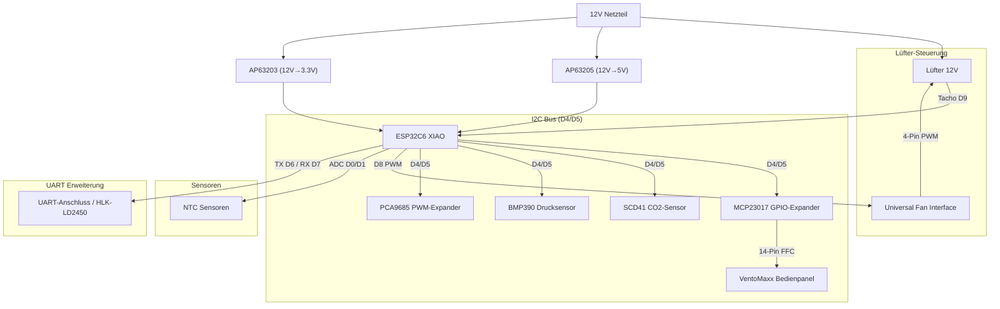

# 🌬️ Smarte dezentrale Wohnraumlüftung mit Wärmerückgewinnung auf Basis von ESP32-C6 und ESPHome

Eine professionelle, dezentrale Lüftungssteuerung basierend auf ESPHome. Dieses Projekt erstezt die Steuerung der VentoMaxx V-WRG Serie mittels eines eigens dafür entwickelten PCB und steuert damit einen reversierbaren 12V Lüfter (Push-Pull) zur Wärmerückgewinnung, überwacht die Luftqualität (CO2, Feuchte und Temperatur), berechnet die effektive Wärmerückgewinnung und nutzt das **originale VentoMaxx Bedienpanel** für eine nahtlose Integration, intuitive Steuerung und vieles mehr.

> 💡 **Kompatibilität:** Die Steuerung funktioniert prinzipiell für jede dezentrale Wohnraumlüftung mit 12V Lüftern (3-PIN oder 4-PIN PWM). Sie wurde jedoch **speziell als Ersatz für die VentoMaxx V-WRG Serie** entwickelt. Die Hardware (PCB-Layout/Größe und Bedienpanel) ist damit explizit für die VentoMaxx V-WRG Serie optimiert und muss für andere Hersteller ggf. angepasst werden. Das PCB ist so konzipiert, dass es exakt in das Gehäuse der VentoMaxx V-WRG Serie passt und die vorhandenen Befestigungspunkte nutzt.

[](https://esphome.io/)
[](https://www.home-assistant.io/)
[](https://github.com/thomasengeroff-dotcom/ESPHome-Wohnraumlueftung/releases)
[](https://esphome.io/components/esp32.html)


[](https://opensource.org/licenses/MIT)

---

## 📑 Inhaltsverzeichnis

- [Leistungsmerkmale](#-leistungsmerkmale)
- [Implementierte Erweiterungen](#-implementierte-erweiterungen)
- [Roadmap & Zukünftige Erweiterungen](#️-roadmap--zukünftige-erweiterungen)
- [Vergleich mit VentoMaxx](#-vergleich-mit-ventomaxx-v-wrg)
- [ESP-NOW & Autonomie](#-esp-now-kabellose-autonomie)
- [Hardware & BOM](#️-hardware--bill-of-materials-bom)
- [Eigene Platine (PCB)](#-eigene-platine-pcb)
- [Pinbelegung](#-pinbelegung--verkabelung)
- [Installation](#-installation--software)
- [Bedienung](#-bedienung--steuerung)
- [Wärmerückgewinnung](#-wärmerückgewinnung---so-funktionierts)
- [Technische Details](#-technische-details--optimierungen)
- [Projektstruktur](#-projektstruktur)
- [Code-Architektur](#️-code-architektur--wartbarkeit)
- [Troubleshooting](#-troubleshooting)
- [Lizenz](#-lizenz)

---

## ✨ Leistungsmerkmale

### ⚙️ Intelligente Betriebsmodi

- 🤖 **Standard-Automatik**: Vollautomatische Steuerung für maximalen Komfort und Effizienz. Standardbetrieb in Wärmerückgewinnung (Push-Pull) mit dynamischer Anpassung an CO2 und Luftfeuchtigkeit unter Einbezug von Wetterdaten. Im Sommer wird die Querlüftung zur passiven Kühlung (wenn außen kühler als innen) automatisch aktiviert. Zusätzlich nutzt dieser Modus die Radar Anwesenheits Sensorik um die Anwesenheit im Raum zu messen und die Lüftungsintensität entsprechend der Voreinstellungen anzupassen.
- 🔄 **Effiziente Wärmerückgewinnung**: Zyklischer, bidirektionaler Betrieb (Push-Pull) zur Maximierung der Energieeffizienz. Die Synchronisation aller Einheiten erfolgt vollautomatisch und kabellos über das ESP-NOW Protokoll. Dieser Modus lässt aber die Radar Anwesenheits Sensorik unberücksichtigt.
- 💨 **Querlüftung (Sommerbetrieb)**: Modus für permanenten Abluftstrom, ideal zur passiven Kühlung in Sommernächten. Flexibel konfigurierbar via Timer oder als Dauerbetrieb. Dieser Modus lässt aber die Radar Anwesenheits Sensorik unberücksichtigt.
- 🔗 **Autarkes Mesh-Netzwerk**: Robuste Dezentralität durch direkte Peer-to-Peer Kommunikation (ESP-NOW). Der Gruppenbetrieb ist auch ohne zentrale WLAN-Infrastruktur oder externe Broker gewährleistet.

### 🛡️ Präzisions-Sensorik & Monitoring

- 🌡️ **Klimadatenerfassung**: Hochpräzise Messung von Temperatur und relativer Luftfeuchtigkeit mittels Sensirion SCD41.
- 💨 **Echte CO2-Messung**: Der SCD41 nutzt **photoacoustic sensing** zur direkten CO2-Messung (400-5000 ppm) statt berechneter Äquivalente - ideal für bedarfsgerechte Lüftungssteuerung.
- 🏔️ **Luftdruckmessung via BMP390**: Der hochpräzise Barometer-Sensor ermöglicht lokale Wettertrend-Analysen, Sturmwarnungen (Rapid Pressure Drop) und liefert gleichzeitig die exakten Höhendaten für die Autokalibrierung und barometrische Kompensation des SCD41 CO2-Sensors.
- 📊 **Automatische Intensitätsregelung**: Das System kann die Lüfterleistung automatisch bei steigendem CO2-Gehalt oder Luftfeuchtigkeit für optimale Raumluftqualität erhöhen.
- 🏎️ **Closed-Loop Drehzahlüberwachung**: Kontinuierliches Monitoring der Lüfterdrehzahl via Tacho-Signal für konstanten Volumenstrom und Fehlererkennung (nur bei 4-PIN PWM Lüftern möglich).
- 📡 **Radar Anwesenheits Sensorik**: Mittels des HLK-LD2450 Radar Sensors wird die Anwesenheit in der Raum gemessen und die Lüftungsintensität entsprechend angepasst. Es kann eingestellt werden, ob die Lüftung intensiver (z.B. für Büro), normal (z.B. für Wohnraum) oder geringer (z.B. für Schlafzimmer) betrieben werden soll.

### 🖥️ Bedienung am Lüftungsgerät


- 🚥 **Original VentoMaxx Panel**: Nutzung des originalen Bedienfelds mit 9 LEDs und 3 Tastern mit überwiegend identischer Funktionalität bzw. Bedienung wie beim Original.
- 🔘 **Intuitive Steuerung**:
  - **Power**: System Ein/Aus/Reset.
    Kurzes Drücken schaltet das Gerät ein.
    5sec gedrückt halten schaltet das Gerät aus.
    10sec gedrückt halten schaltet das Gerät aus und startet das System neu (Reboot).
  - **Modus**: Wechsel zwischen Wärmerückgewinnung (Winter), Querlüftung (Sommer) und dynamischer Lüftung basierend auf CO2-Gehalt und Feuchte.
  - **Stufe +**: 10 Geschwindigkeitsstufen (zyklisch, angezeigt über 5 LEDs mit halber/voller Helligkeit).
- 🔆 **LED Feedback**: Anzeige von Modus, aktueller Lüfterstufe (1-5) und Status.
  - Master Led wird derzeit für Fehleranzeige genutzt: Sie blinkt, wenn das Lüftungsgerät keine Verbindung zum Netzwerk hat oder keine ESP-NOW Nachrichten von anderen Geräten empfängt.

### 🏠 Integration

**Volle Home Assistant Integration**: Native API-Unterstützung für nahtloses Monitoring, Steuerung und Automatisierung über Ihr Smart Home System. Alle Funktionalitäten des Geräts sind über Home Assistant steuerbar und auslesbar.

**Intuitive Gruppensteuerung**: Durch das "Group-Controller" Konzept via ESP-NOW können mehrere Geräte in einem Raum als eine einzige visuelle Einheit im Home Assistant Dashboard (z.B. mittels Mushroom Cards) abgebildet werden. Dies reduziert den WLAN-Traffic, erhöht die Stabilität und macht die Bedienung extrem einfach (hoher WAF).
👉 *Details, Konzept und YAML-Beispiele für ESPHome und das HA Dashboard finden Sie im Ordner [ha_integration_example](ha_integration_example/).*

### ✅ Implementierte Erweiterungen

- **🤖 Adaptive Automatik (CO2 & Feuchte)**:
  - Dynamische **stufenlose** Anpassung der Lüfterleistung basierend auf Echtzeit-CO2-Werten (ppm) vom SCD41 Sensor sowie der relativen Luftfeuchte im Innen- und Außenvergleich.
  - Nutzung eines fortschrittlichen **PID-Reglers (Proportional-Integral-Derivative)** für eine **lautlose, kontinuierliche Steuerung**. Die PWM Leistung wird nahtlos im Hintergrund verstellt, ohne hörbare Drehzahlsprünge.
  - Konfigurierbarer **Min-/Max-Level** (`automatik_min_fan_level`) begrenzt das Anpassungsfenster der Automatik auf leise Drehzahlen.
  - **Dynamische Zyklusdauer**: Die Wechselintervalle (Richtung A/B) passen sich fließend der aktuellen Lüfterstufe an (z.B. sanfte 70 Sekunden auf Stufe 1 bis schnelle 50 Sekunden auf Stufe 10) inkl. synchronisiertem NTC-Zeitfenster.
  - Siehe [📄 CO2 Automatik Dokumentation](documentation/CO2-Automatik.md) für Details.

- **🚶 Radar-basierte Anwesenheitserkennung (HLK-LD2450)**:
  - Integration eines mmWave-Radarsensors über den vorgesehenen UART-Pin-Header auf der Platine.
  - Da die Lüftungsgeräte ohnehin in jedem Raum optimal positioniert sind, dienen sie gleichzeitig als perfekter Standort für eine raumgenaue Präsenzerfassung für Home Assistant.
  - **Gleitende Bedarfssteuerung**: Über den Slider `Anwesenheit Lüfter-Anpassung` kann stufenlos (von -5 bis +5) konfiguriert werden, wie das System reagieren soll. (z.B. `+3` intensiviert die Lüftung im Büro bei erkanntem Radar-Target; `-2` senkt sie zur Lärmreduzierung im Schlafzimmer, `0` schaltet die Modifikation ab).

- **🧹 Wartungs-Management (Prädiktiver Filterwechsel-Alarm)**:
  - Automatisches Tracking der Lüfter-Betriebsstunden und Kalenderzeit seit letztem Filterwechsel.
  - Alarm bei Betriebsstunden > 365 Tage Laufzeit oder > 3 Jahre Kalenderzeit.
  - Digitale Benachrichtigung über Home Assistant Binary Sensor (`binary_sensor.filterwechsel_alarm`).
  - Reset-Button nach Filterwechsel (`button.filter_gewechselt_reset`) setzt alle Zähler zurück.
  - Siehe [🧹 Filterwechsel-Alarm in Home Assistant einrichten](#-filterwechsel-alarm-in-home-assistant-einrichten) für HA Automation-Beispiel.

- **Master LED Fehleranzeige**:
  - Die Master LED blinkt (Strobe-Effekt), wenn keine WiFi-Verbindung besteht oder keine ESP-NOW Nachrichten von Peer-Geräten innerhalb von 5 Minuten empfangen wurden.
  - Bei normalem Betrieb ist die LED aus.

- **💧 Feuchte-Management**:
  - Automatisierte Entfeuchtungslogik zur Schimmelprävention: Bei Überschreitung des konfigurierbaren Feuchte-Grenzwerts (40-100%, Default 60%) regelt ein **PID-Regler** (`pid_humidity`) die Lüfterleistung stufenlos hoch.
  - **Intelligente Hysterese** via PID-Deadband (`±2%`) und Output-Averaging (5 Samples) verhindert "Rapid Cycling".
  - **Outdoor-Check**: Es wird nur entfeuchtet, wenn die Außenluft trockener ist als die Innenluft (`out_hum < in_hum`).
  - Zielwert konfigurierbar über `Automatik: Feuchte Grenzwert` Slider in Home Assistant — wird automatisch via ESP-NOW an alle Geräte der Gruppe synchronisiert.
  - Aktiv im Standard-Automatik und Effiziente Wärmerückgewinnung Modus.

  > **⚙️ Voraussetzung: `sensor.outdoor_humidity` in Home Assistant**
  >
  > Das Feuchte-Management benötigt eine Außenluftfeuchtigkeit aus Home Assistant. Der ESPHome-Code erwartet die Entity-ID `sensor.outdoor_humidity` (konfiguriert in `sensors_climate.yaml`). Es gibt zwei Wege, diesen Sensor bereitzustellen:
  >
  > **Option A: Wetterdienst-Integration** (kein zusätzlicher Sensor nötig)
  >
  > Installieren Sie eine Wetter-Integration (z.B. [OpenWeatherMap](https://www.home-assistant.io/integrations/openweathermap/), [Met.no](https://www.home-assistant.io/integrations/met/)) und erstellen Sie in `configuration.yaml` einen Template-Sensor:
  >
  > ```yaml
  > template:
  >   - sensor:
  >       - name: "Outdoor Humidity"
  >         unique_id: outdoor_humidity
  >         unit_of_measurement: "%"
  >         state: "{{ state_attr('weather.home', 'humidity') }}"
  >         device_class: humidity
  > ```
  >
  > **Option B: Physischer Außensensor** (z.B. ESP32 + BME280/SHT31 auf Balkon/Terrasse)
  >
  > Wenn der Außensensor bereits als HA-Entity existiert (z.B. `sensor.balkon_sht31_humidity`), erstellen Sie einen Alias:
  >
  > ```yaml
  > template:
  >   - sensor:
  >       - name: "Outdoor Humidity"
  >         unique_id: outdoor_humidity
  >         unit_of_measurement: "%"
  >         state: "{{ states('sensor.balkon_sht31_humidity') }}"
  >         device_class: humidity
  > ```
  >
  > **Alternativ:** Ändern Sie direkt die `entity_id` in `sensors_climate.yaml` auf Ihren Sensor:
  >
  > ```yaml
  > entity_id: sensor.balkon_sht31_humidity  # statt sensor.outdoor_humidity
  > ```
  >
  > 💡 **Ohne `sensor.outdoor_humidity`** funktioniert die Entfeuchtung trotzdem — der Outdoor-Check wird dann übersprungen und der PID regelt rein nach dem Innenfeuchte-Grenzwert.

## 🔄 Vergleich mit VentoMaxx V-WRG

Diese Lösung ist ein **Drop-in Replacement** für die [VentoMaxx V-WRG / WRG PLUS](https://www.ventomaxx.de/dezentrale-lueftung-produktuebersicht/aktive-luefter-mit-waermerueckgewinnung/) Steuerung — mechanisch kompatibel, funktional massiv erweitert:

| | VentoMaxx (Original) | ESPHome Smart WRG |
| :--- | :---: | :---: |
| Betriebsmodi | 3 | **5+** (inkl. Automatiken) |
| Sensorik | 0-1 (opt. VOC) | **6** (CO2, Temp, Feuchte, Druck, Radar, Tacho) |
| Lüfterregelung | 3 feste Stufen | **10 Stufen + stufenlos (PID)** |
| Smart Home | ❌ | ✅ Home Assistant (nativ) |
| Wartungsalarm | Timer-LED | ✅ Prädiktiv + Push |
| Synchronisation | Steuerkabel | ✅ Kabellos (ESP-NOW) |
| Updates | Servicetechniker | ✅ Over-the-Air (OTA) |
| Lizenz | Proprietär | ✅ Open Source (MIT) |

� **Den vollständigen Feature-für-Feature Vergleich mit allen technischen Details finden Sie in [📄 Comparison-VentoMaxx.md](documentation/Comparison-VentoMaxx.md).**

---

## 📡 ESP-NOW: Kabellose Autonomie

Die Geräte kommunizieren über die [ESPHome ESP-NOW Komponente](https://esphome.io/components/espnow.html). **ESP-NOW** ist ein von Espressif entwickeltes, verbindungsloses Protokoll, das eine direkte Kommunikation zwischen ESP32-Geräten ohne Umweg über einen WLAN-Router ermöglicht.

### Vorteile im Überblick

- 🌐 **WLAN-Unabhängigkeit**: Die Geräte benötigen keinen WLAN-Router (Access Point) für die Synchronisation. Die Kommunikation erfolgt direkt auf der MAC-Ebene (2,4 GHz Radio). Fällt das lokale WLAN aus, arbeitet die Lüftungsgruppe ungestört weiter.
- 🛡️ **Hohe Zuverlässigkeit**: Durch die direkte Punkt-zu-Punkt-Kommunikation ist das System immun gegen Überlastungen oder Störungen im herkömmlichen WLAN-Netzwerk.
- ⚡ **Extrem geringe Latenz**: Da keine Verbindung aufgebaut oder verwaltet werden muss (handshake-frei), werden Synchronisationsbefehle nahezu verzögerungsfrei übertragen. Dies ist entscheidend für den exakten Richtungswechsel synchronisierter Lüfterpaare.
- 🔌 **Keine Steuerleitungen**: Es müssen keine Datenkabel durch Wände gezogen werden. Die Synchronisation erfolgt "Out-of-the-box" über Funk.
- 📡 **Automatisches Software-Filtering**: Durch den Broadcast-Modus und die projektinterne Filterung (Floor/Room ID) finden sich Geräte im gleichen Raum automatisch.
- ⚙️ **Globale Konfigurations-Synchronisation**: Änderungen an Einstellungen (z. B. CO2-Grenzwerte, Timer, Automatik-Modi) an einem Gerät via Home Assistant oder Bedienpanel werden in Echtzeit drahtlos an alle anderen Geräte in derselben Raumgruppe gespiegelt. So laufen alle Lüfter stets mit identischen Parametern, ohne dass jedes Gerät einzeln konfiguriert werden muss.

Weitere Informationen finden Sie in der [offiziellen ESPHome Dokumentation](https://esphome.io/components/espnow.html).

---

### 🗺️ Roadmap & Zukünftige Erweiterungen

Die Firmware ist für folgende weitere "Advanced Automation"-Funktionen vorbereitet:

- **🌙 Intelligenter Nachtmodus**:
  - Zeitgesteuerte Drosselung der Lüfterleistung zur Geräuschminimierung in Ruhephasen.
  - Flexibles Zeitmanagement und Definition spezifischer Nacht-Profile.
  - Lokal und remote aktivierbar.

- **Unterdruckwächter**:
  - Zum Differenzdruckausgleich bei gleichzeitigem Betrieb von Kamin-/Holzofen und Lüftungsanlage. Erweiterung der Hardware durch einen potentialfreien Kontakt, an welchem der Unterdruckwächter angeschlossen wird.

- **KI-gestützte Lüftungssteuerung**:
  - Proaktive KI-gestützte Lüftungssteuerung basierend auf historischen Daten und externen Prognosen (Wetter, CO2, Feuchte). Siehe [📄 KI-gestützte Lüftungssteuerung](documentation/KI-gestützte-Lüftungssteuerung.md) für Details.

### 🔧 Aktuelle technische Verbesserungen

- **Hardware-Upgrade: SCD41 CO2-Sensor & BMP390 (Februar 2026)**:
  - ✅ Wechsel von BME680 (VOC-basierte IAQ-Schätzung) zu **SCD41** (echte CO2-Messung) und **BMP390** (Luftdruck)
  - ✅ **Photoacoustic sensing** für präzise CO2-Messung (400-5000 ppm)
  - ✅ Integrierte Temperatur- und Feuchtigkeitsmessung (SCD41)
  - ✅ Automatische CO2-basierte Lüftungsregelung für optimale Raumluftqualität
  - ✅ Dokumentation: `EasyEDA-Pro/components/SCD41-Sensirion.pdf`

- **Code-Refactoring (Februar 2026)**:
  - ✅ Alle Multi-Line-Lambdas in `automation_helpers.h` ausgelagert
  - ✅ Verbesserte Typsicherheit durch explizite C++ Funktionen
  - ✅ Modernisierte ESPHome API-Nutzung (`current_option()` statt deprecated `.state`)
  - ✅ Korrekte Template-Typen für Script-Komponenten (`RestartScript<>`, `SingleScript<>`)
  - ✅ Präzise Komponenten-Typen (`SpeedFan`, `LEDCOutput` statt generischer Basisklassen)

### 🙏 Danksagungen / Credits

Ein besonderer Dank gilt **[patrickcollins12](https://github.com/patrickcollins12)** für sein hervorragendes Projekt **[ESPHome Fan Controller](https://github.com/patrickcollins12/esphome-fan-controller)**. Seine Implementierung und Erläuterungen zur Nutzung des [ESPHome PID Climate](https://esphome.io/components/climate/pid/) Moduls für geräuschlose (lautlose) stufenlose PWM-Lüftersteuerungen dienten als maßgebliche Inspiration und Grundlage für die CO2- und Feuchtigkeitsautomatik in diesem Projekt.

---

## 🖱️ Eigene Platine - PCB

Eine dedizierte Platine (PCB), die alle benötigten Komponenten (XIAO, Traco, Transistoren, Anschlüsse für Sensoren) kompakt vereint, befindet sich aktuell in der Entwicklung.


### Hinweise zur Entwicklung

- **Professionelles Design**: Optimiert für den Einbau in Standard-Unterputzdosen oder Lüftergehäuse.
- **Plug & Play**: Einfache Montage durch Steckverbinder (JST/Dupont).
- **Bezug**: Informationen zum Layout (EasyEDA/KiCad) und Bestellmöglichkeiten werden dem Projekt hinzugefügt, sobald die Prototypen-Phase abgeschlossen ist.

---

## 🛠️ Hardware & Bill of Materials (BOM)

### Zentrale Einheit

| Komponente | Beschreibung |
| :--- | :--- |
| **MCU** | Seeed Studio XIAO ESP32C6 (RISC-V, WiFi 6, Zigbee/Matter ready) |
| **Power** | TRACO POWER TMPS10-112 (230V AC zu 12V DC, 10W) |
| **DC/DC** | Diodes Inc. AP63205 (12V->5V) & AP63203 (12V->3.3V) |

### Aktoren & Sensoren

| Komponente | Beschreibung | Dokumentation |
| :--- | :--- | :--- |
| **Lüfter** | **AxiRev** (4-Pin PWM) oder **3-Pin PWM** (ohne Tacho-Signal). *Siehe [Anleitung-Fan-Circuit.md](documentation/Anleitung-Fan-Circuit.md)* | [Fan Component](https://esphome.io/components/fan/speed.html) |
| **SCD41** | Sensirion CO2-Sensor (Echtes CO2 400-5000ppm, Temp, Hum) via I²C | [SCD4X Component](https://esphome.io/components/sensor/scd4x.html) |
| **BMP390** | Bosch Hochpräziser Barometrischer Drucksensor via I²C | [BMP3XX Component](https://esphome.io/components/sensor/bmp3xx.html) |
| **NTCs** | 2x NTC 10k (Zuluft/Abluft) für Effizienzmessung | [NTC Sensor](https://esphome.io/components/sensor/ntc.html) |
| **I/O Expander** | **MCP23017** (I2C) für VentoMaxx Panel | [MCP23017](https://esphome.io/components/mcp23017.html) |
| **LED Driver** | **PCA9685** (I2C) für dimmbare LEDs im VentoMaxx Panel | [PCA9685](https://esphome.io/components/output/pca9685.html) |

> ℹ️ **Hinweis zu 3-Pin PWM Lüftern:**
> Neben den klassischen 4-Pin PWM Lüftern gibt es auch spezielle Propeller/Lüfter, die **kein Tacho-Signal** besitzen und daher nur über **3 Pins** verfügen (GND, 12V, PWM). Dies ist auch der Fall für den von Ventomaxx verbauten EBM-Papst Lüfter.
Diese können problemlos ohne physikalische Änderung an der Schaltung betrieben werden, indem der Tacho-Pin (Pin 3 am Terminal) einfach unbelegt bleibt. Beachten Sie jedoch, dass ohne Tacho-Signal keine direkte Überwachung der Drehzahl (RPM) oder Blockadeerkennung durch die Software möglich ist.

### 🖱️ User Interface

| Komponente | Beschreibung | Dokumentation |
| :--- | :--- | :--- |
| **VentoMaxx Panel** | Original Panel (14-Pin FFC). 3 Taster, 9 LEDs (via PCA9685 dimmbar). | - |

---

## 🔌 Pinbelegung & Verkabelung

Das System basiert auf dem [Seeed XIAO ESP32C6](https://esphome.io/components/esp32.html).

⚠️ **WICHTIG:** Der Lüfter läuft mit 12V, die Logik mit 3.3V oder auch 5V. Entsprechende Spannungsteiler und Schutzbeschaltungen sind vorhanden.

| XIAO Pin | GPIO | Funktion | Bemerkung |
| :--- | :--- | :--- | :--- |
| **D0** | GPIO0 | [ADC Input](https://esphome.io/components/sensor/adc.html) | NTC Außen (Abluft) |
| **D1** | GPIO1 | [ADC Input](https://esphome.io/components/sensor/adc.html) | NTC Innen (Zuluft) |
| **D2** | GPIO2 | Output | **MCP23017 Reset** |
| **D3** | GPIO21 | Output | **PCA9685 OE** (Output Enable) |
| **D4** | GPIO22 | [I2C SDA](https://esphome.io/components/i2c.html) | SCD41, BMP390, PCA9685, MCP23017 |
| **D5** | GPIO23 | [I2C SCL](https://esphome.io/components/i2c.html) | SCD41, BMP390, PCA9685, MCP23017 |
| **D6** | GPIO16 | [UART RX](https://esphome.io/components/uart.html) | **HLK-LD2450 Radar RX** |
| **D7** | GPIO17 | [UART TX](https://esphome.io/components/uart.html) | **HLK-LD2450 Radar TX** |
| **D8** | GPIO19 | [PWM Output](https://esphome.io/components/output/ledc.html) | **Fan PWM Primary** |
| **D9** | GPIO20 | [Pulse Counter](https://esphome.io/components/sensor/pulse_counter.html) | **Fan Tacho** (Pullup via 3V3) |
| **D10** | GPIO18 | - | Unbelegt (NC) |

### 📊 Schematische Darstellung (Konzept)



---

### Installation & Software

### Voraussetzungen

- Installiertes ESPHome Dashboard (z.B. als Home Assistant Add-on)
- Grundkenntnisse in YAML

### Konfiguration

1. Kopiere den Inhalt von `esp_wohnraumlueftung.yaml` in deine ESPHome Instanz.
2. Erstelle eine `secrets.yaml` mit deinen WLAN-Daten:

```yaml
wifi_ssid: "DeinWLAN"
wifi_password: "DeinPasswort"
ap_password: "FallbackPasswort"
ota_password: "OTAPasswort"
```

### Kalibrierung der NTCs

Die Konfiguration nutzt NTCs mit einem B-Wert von 3435. Falls du andere Sensoren nutzt, passe den `b_constant` Wert im YAML Code an.

### Flashen

1. Verbinde den XIAO per USB.
2. Klicke auf "Install".

---

## 🎮 Bedienung & Steuerung

Die Steuerung erfolgt intuitiv über das integrierte Bedienpanel oder vollautomatisch via Home Assistant.

### 🖐️ Bedienpanel (VentoMaxx Style)

Das Panel verfügt über 3 Taster und 9 Status-LEDs.

#### Tastenbelegung

| Taste | Funktion | Bedienung |
| :--- | :--- | :--- |
| **Power (I/O)** | System Ein/Aus | • Kurz drücken: Ein / Aus<br>• Lang (>5s): Aus<br>• Sehr lang (>10s): Geräte-Neustart (Reboot) |
| **Modus (M)** | Betriebsmodus | • Kurz drücken: Zykliert durch Automatik → WRG → Stoßlüftung → Durchlüften → Aus |
| **Stufe (+)** | Lüfterstärke | • Kurz drücken: Zykliert durch 10 Geschwindigkeitsstufen (angezeigt über 5 LEDs). |

#### Status-LEDs (Feedback)

| LED | Anzahl | Position | Verhalten |
| :--- | :---: | :--- | :--- |
| **Power** | 🟢 1x | LED Panel | Leuchtet, wenn System EIN **und** UI aktiv. Geht nach 30s aus. |
| **Master** | 🟢 1x | LED Panel | Leuchtet bei aktivem UI (kein Fehler). Blinkt dauerhaft bei Fehler (WLAN-/ESP-NOW-Verbindungsverlust) — unabhängig vom UI-Timeout. |
| **Modus L** (`LED_WRG`) | 🟢 1x | Links | **Pulsiert** im Smart-Automatik Modus. Dauerhaft an bei WRG oder Durchlüften. |
| **Modus R** (`LED_VEN`) | 🟢 1x | Rechts | Dauerhaft an bei Stoßlüftung oder Durchlüften. |
| **Intensität** | 🟢 5x | LED Panel | Zeigt aktuelle Lüfterstufe 1–10 (halbe/volle Helligkeit für 10 Stufen über 5 LEDs). Nur bei aktivem UI sichtbar. |

**Modus-LED Zuordnung (bei aktivem UI):**

| Modus | `LED_WRG` (links) | `LED_VEN` (rechts) |
| :--- | :---: | :---: |
| **Automatik (Standard)** | 🔵 pulsiert | ⚫ |
| Wärmerückgewinnung (Eco) | 🟢 | ⚫ |
| Stoßlüftung | ⚫ | 🟢 |
| Durchlüften (Sommer) | 🟢 | 🟢 |
| Aus / System OFF | ⚫ | ⚫ |

> 💡 **30 Sekunden Auto-Dimming:** Alle Status-LEDs (Power, Master, Modus, Intensität) erlöschen 30 Sekunden nach dem letzten Tastendruck sanft. Bei jedem Tastendruck werden sie wieder aktiviert. Ausnahme: Die **Master-LED blinkt weiter bei Fehler** (WLAN/ESP-NOW-Ausfall), auch nach dem Timeout.

---

### 🔄 Detaillierte Betriebsmodi (Programme)

Über die **Modus-Taste (M)** zykliert das Gerät durch die Programme. Beim **Einschalten** ist **Modus 1 (Smart-Automatik)** aktiv.

> 💡 **Tipp:** Die Reihenfolge beim Tastendruck ist: **Automatik → WRG → Stoßlüftung → Durchlüften → Aus → Automatik...**

---

#### 1. 🤖 Smart-Automatik *(Standard / Empfohlen)* — `LED_WRG` 🟢 (pulsiert langsam)

**Dieser Modus ist der Standard beim Einschalten** und übernimmt vollautomatisch alle Steuerungsaufgaben. Die Lüftungsanlage regelt sich eigenständig basierend auf Umgebungsdaten und erfordert nach initialer HA-Konfiguration keinerlei manuelle Eingriffe ("Set and Forget").

**Aktive Smart-Features:**

| Feature | Sensor(en) | Schwellenwert |
| :--- | :--- | :--- |
| ✅ **CO2-Regelung (PID)** | SCD41 (`sensor.scd41_co2`) | `number.auto_co2_threshold` |
| ✅ **Feuchte-Management (PID)** | SCD41 (`sensor.scd41_humidity`) + HA `outdoor_humidity` | Über Außenfeuchte |
| ✅ **Radar Anwesenheits-Sensorik** | HLK-LD2450 (`binary_sensor.radar_presence`) | Konfigurabel in HA |
| ✅ **Sommer-Kühlfunktion** | NTC-Sensoren + ESP-NOW Gruppentemperatur | 22°C Innentemperatur |

**Logik im Detail:**

- **Grundbetrieb:** Wärmerückgewinnung (`MODE_ECO_RECOVERY`) auf Mindestlüfterstufe (`co2_min_fan_level`, Standard: 2).
- **CO2 & Feuchte (PID):** Steigen CO2 oder absolute Feuchtigkeit über die HA-Grenzwerte, regeln PID-Regler den Lüfter **stufenlos** und leise hoch. Deadband-Logik verhindert Mikro-Schwankungen.
- **Sommer-Kühlung:** Bei Innentemperatur > 22°C und kühlerem Außenbereich wechselt das System automatisch in `Durchlüften`. Sobald es außen wieder wärmer wird, kehrt es zu WRG zurück.
- **Anwesenheit:** Optionale Anpassung der Lüfterstärke (+3/+1/-1 Stufen) je nach konfiguriertem Profil in HA.
- **Gruppenlogik:** PID-Demand und Temperaturen werden sekündlich via ESP-NOW geteilt — alle Geräte im Raum laufen synchron.

---

#### 2. ❄️ Wärmerückgewinnung (Eco Recovery) — `LED_WRG` 🟢

- **HA Entität:** `select.modus_lueftungsanlage` → `Eco Recovery`
- **Funktion:** Manueller WRG-Betrieb ohne die Smart-Automatik-Features. Die Luftrichtung wechselt zyklisch, Wärmeverlust wird um bis zu 85% reduziert.
- **Zykluszeiten:** Passen sich der Lüfterstufe an: Stufe 1: **70 Sek.**, Stufe 2: **65 Sek.**, … Stufe 5: **50 Sek.**
- **Synchronisation:** Phase A bläst hinein, Phase B hinaus — Geräte im Gegentakt, Haus druckneutral.

---

#### 3. 💨 Stoßlüftung — `LED_VEN` 🟢

- **HA Entität:** `button.stosslueftung_starten`
- **Funktion:** Intensivlüftung für schnellen Luftaustausch (z. B. nach dem Duschen oder Kochen).
- **Ablauf:** 15 Minuten intensiv lüften, 105 Minuten Pause, dann erneuter 15-Minuten-Zyklus (2 Std. Rhythmus). Wechselnde Startrichtung schützt den Keramikspeicher.

---

#### 4. 🌬️ Querlüftung / Durchlüften (Sommer) — `LED_WRG` 🟢 + `LED_VEN` 🟢

- **HA Entität:** `select.modus_lueftungsanlage` → `Ventilation` + `number.lueftungsdauer` (Timer, 0 = Endlos)
- **Funktion:** Konstanter Luftstrom ohne Richtungswechsel. Hälfte der Gruppe saugt an, andere Hälfte bläst ab → kühler Luftzug durch den Wohnraum.
- **Hinweis:** Im Automatik-Modus wird die Querlüftung **automatisch** bei hoher Innentemperatur aktiviert.

---

#### 5. ⭕ Aus — beide LEDs ⚫

- **HA Entität:** `select.modus_lueftungsanlage` → `Off`
- **Funktion:** Lüfter und PWM-Ausgänge werden gestoppt. Anlagen-LED erlischt.

---

### 📱 Steuerung über Home Assistant

Alle Funktionen sind vollständig in Home Assistant integriert. Änderungen am Panel werden sofort synchronisiert.

#### Verfügbare Steuerungen

- **Lüfter**: Slider 0-10% bis 100% (entspricht intern den 10 Stufen des Bedienpanels)
- **Modus**: Auswahl (Smart-Automatik / Eco Recovery / Ventilation / Off)
- **Timer**: Konfiguration für "Durchlüften" (Standard: 30 Min)
- **CO2-Grenzwert**: `number.auto_co2_threshold` (Standard aktiv)
- **Diagnose**: Anzeige von RPM, Temperatur, Feuchte und **CO2-Gehalt (ppm)**

👉 **Tipp:** Eine detaillierte Übersicht aller verfügbaren Home Assistant Entitäten inklusive ihrer technischen Namen (`ID`) und Funktion finden Sie im Dokument **[Entities_Documentation.md](documentation/Entities_Documentation.md)**.

#### 📊 Lüftergeschwindigkeit pro Stufe (ebm-papst VarioPro PWM-Kennlinie)

Der ebm-papst 4412 F/2 GLL (VarioPro) wird über ein **einzelnes PWM-Signal** gesteuert, das gleichzeitig Drehzahl und Richtung kodiert:

| | **50 % PWM** | **50 % → 0 % PWM** | **50 % → 100 % PWM** |
|---|---|---|---|
| **Funktion** | Lüfter **STOP** | Richtung A (Abluft) | Richtung B (Zuluft) |
| **Drehzahl** | 0 RPM | steigt mit Abstand zu 50% | steigt mit Abstand zu 50% |

| Stufe | Drehzahl | PWM Dir A (Abluft) | PWM Dir B (Zuluft) |
| :---: | :---: | :---: | :---: |
| **1** | 10 % | 45 % | 55 % |
| **2** | 20 % | 40 % | 60 % |
| **3** | 30 % | 35 % | 65 % |
| **4** | 40 % | 30 % | 70 % |
| **5** | 50 % | 25 % | 75 % |
| **6** | 60 % | 20 % | 80 % |
| **7** | 70 % | 15 % | 85 % |
| **8** | 80 % | 10 % | 90 % |
| **9** | 90 % | 5 % | 95 % |
| **10** | 100 % | 0 % | 100 % |

> °️ **Mindestdrehzahl:** Stufe 1 entspricht 10 % Drehzahl (PWM nie auf 50 % = Stopp). Im Automatik-Modus (PID) wird die Drehzahl stufenlos zwischen `co2_min_fan_level` und `co2_max_fan_level` geregelt.

#### Automatische Funktionen

- **Nachtmodus (geplant)**: Dimmt die LEDs automatisch basierend auf Uhrzeit.
- **Filterwechsel-Alarm**: Prädiktive Wartungsbenachrichtigung (siehe unten).

#### 🧹 Filterwechsel-Alarm in Home Assistant einrichten

Das System trackt automatisch die Betriebsstunden des Lüfters und löst einen Alarm aus, wenn:

- **Betriebsstunden > 365 Tage** (8760h Laufzeit), oder
- **Kalenderzeit > 3 Jahre** seit dem letzten Filterwechsel.

**Verfügbare Entitäten:**

| Entität | Typ | Beschreibung |
|---|---|---|
| `binary_sensor.filterwechsel_alarm` | Binary Sensor | `ON` = Filterwechsel empfohlen |
| `sensor.filter_betriebstage` | Sensor | Lüfter-Laufzeit in Tagen seit letztem Wechsel |
| `button.filter_gewechselt_reset` | Button | Nach Filterwechsel drücken → setzt Zähler zurück |

**Beispiel: Push-Benachrichtigung via HA Automation**

Fügen Sie folgende Automation in Ihre Home Assistant `automations.yaml` ein:

```yaml
automation:
  - alias: "Filterwechsel Benachrichtigung"
    trigger:
      - platform: state
        entity_id: binary_sensor.espwohnraumlueftung_filterwechsel_alarm
        to: "on"
    action:
      - service: notify.mobile_app_<ihr_geraet>
        data:
          title: "🧹 Filterwechsel empfohlen"
          message: >-
            Die Lüftungsanlage hat {{ states('sensor.esptest_filter_betriebstage') }} Betriebstage
            seit dem letzten Filterwechsel erreicht. Bitte Filter prüfen und wechseln.
          data:
            tag: "filterwechsel"
            importance: high
```

> 💡 **Nach dem Filterwechsel:** Drücken Sie den Button `Filter gewechselt (Reset)` in Home Assistant, um die Betriebsstunden und den Kalender-Timer zurückzusetzen.

---

### 💡 Tipps für optimale Nutzung

#### Wartung & Pflege

- **Filter**: Alle 12 Monate prüfen/wechseln.
- **Reinigung**: Panel nur mit trockenem Tuch reinigen.
- **Wärmetauscher**: Einmal jährlich mit Wasser ausspülen (siehe Herstelleranleitung).

---

## 🧠 Wärmerückgewinnung - So funktioniert's

### Grundprinzip

Das System nutzt einen **Keramikspeicher** zur Wärmerückgewinnung. Dieser speichert Wärme aus der Abluft und gibt sie an die Zuluft ab. Die Zykluszeit (Phase) variiert je nach Luftstufe zwischen **50s und 70s**, um die Energieeffizienz zu optimieren.

### Betriebszyklus (50s bis 70s pro Phase)


### Phase 1: Abluft (Rausblasen) - 70 Sekunden

```text
Innenraum (warm) → Keramikspeicher → Außen
    21°C              ↓ Wärme         5°C
                  speichern
```

**Was passiert:**

- 🔥 Warme Raumluft (21°C) strömt durch den Keramikspeicher
- 📈 Keramik erwärmt sich und speichert Energie
- 🌡️ **NTC Innen** misst am Ende die wahre Raumtemperatur
- 💨 Abgekühlte Luft (~10°C) wird nach außen geblasen

### Phase 2: Zuluft (Reinblasen) - 70 Sekunden

```text
Außen → Keramikspeicher → Innenraum (vorgewärmt)
 5°C     ↑ Wärme           ~16°C
        abgeben
```

**Was passiert:**

- ❄️ Kalte Außenluft (5°C) strömt durch den warmen Keramikspeicher
- 🔄 Keramik gibt gespeicherte Wärme ab
- 🌡️ **NTC Außen** misst Außentemperatur
- 🌡️ **NTC Innen** misst vorgewärmte Zuluft (~16°C)
- 🏠 Vorgewärmte Luft strömt in den Raum

### NTC Sensoren (Temperatur-Stabilisierung)

Die NTC Sensoren messen die Temperatur am Keramikspeicher innen und außen (`temp_zuluft` und `temp_abluft`). Da die Lüfterrichtung im Wärmerückgewinnungs-Modus zyklisch (z.B. alle 70 Sekunden) wechselt, benötigen die Sensoren aufgrund ihrer thermischen Masse eine gewisse Zeit, um sich an die neue Lufttemperatur anzupassen. Um die Messung möglichst genau zu machen, werden sehr kleine NTC Sensoren genutzt, mit möglichst geringer Masse und hoher Genauigkeit. Dadurch wird die Anpassung an die wechselnde Temperatur je nach Lüftungsrichtung möglichst schnell und präzise.
Um fehlerhafte Zwischenwerte in Home Assistant zu vermeiden, nutzen beide Sensoren eine **intelligente Temperatur-Stabilisierung**:

- Nach einem Richtungswechsel (Push/Pull) wird die Messwertübertragung für **45 Sekunden pausiert**.
- Danach sammelt das System Messwerte in einem **30-Sekunden Sliding-Window**.
- Erst wenn die Schwankung innerhalb dieses Fensters auf realistische **0,3 °C** oder weniger fällt, gilt der Wert als stabil und wird aktualisiert.

*Hinweis zur Redundanz:* `temp_abluft` liefert bei nach innen gerichtetem Luftstrom die tatsächliche Außentemperatur. `temp_zuluft` liefert bei nach außen gerichtetem Luftstrom die Raumtemperatur und dient als Redundanz zum präziseren SCD41 Sensor.

Konkret wird der folgende Sensor verwendet:

| Hersteller | Artikelnummer | Bezugsquelle | Genauigkeit | Datenblatt |
| :--- | :--- | :--- | :--- | :--- |
| **VARIOHM** | `ENTC-EI-10K9777-02` | [Reichelt Elektronik](https://www.reichelt.de/de/de/shop/produkt/thermistor_ntc_-40_bis_125_c-350474) | ± 0,2 °C | [PDF](EasyEDA-Pro/components/NTC_ENTC_EI-10K9777-02.pdf) |

### Effizienzberechnung

Am Ende der Zuluft-Phase wird die Wärmerückgewinnung berechnet:

$$
\text{Effizienz} = \frac{T_{\text{Zuluft}} - T_{\text{Außen}}}{T_{\text{Raum}} - T_{\text{Außen}}} \times 100\%
$$

**Beispielrechnung:**

- Raumtemperatur: 21°C
- Außentemperatur: 5°C
- Zulufttemperatur: 16°C

$$
\text{Effizienz} = \frac{16°C - 5°C}{21°C - 5°C} \times 100\% = \frac{11°C}{16°C} \times 100\% = 68.75\%
$$

**Interpretation:**

- **> 70%:** Ausgezeichnete Wärmerückgewinnung
- **50-70%:** Gute Wärmerückgewinnung
- **< 50%:** Keramik zu kalt oder Zyklus zu kurz

### Optimierung der Effizienz

| Parameter                 | Auswirkung                          | Empfehlung      |
| :------------------------ | :---------------------------------- | :-------------- |
| **Zyklusdauer**           | Längere Zyklen = bessere Speicherung| 70-90s optimal  |
| **Lüftergeschwindigkeit** | Langsamer = mehr Wärmeübertragung   | 60-80%          |
| **Keramikvolumen**        | Mehr Masse = mehr Speicher          | Größer ist besser|
| **Außentemperatur**       | Kälter = höhere Effizienz möglich   | -               |

### Synchronisation mehrerer Geräte

Bei Verwendung mehrerer Geräte im gleichen Raum:

**Paar-Betrieb (2 Geräte):**

```text
Gerät A: Phase A (Zuluft)  ←→  Gerät B: Phase B (Abluft)
         ↓ 70s wechseln ↓
Gerät A: Phase B (Abluft) ←→  Gerät B: Phase A (Zuluft)
```

**Vorteile:**

- ✅ Kontinuierlicher Luftaustausch
- ✅ Keine Druckschwankungen
- ✅ Optimale Wärmerückgewinnung
- ✅ Synchronisiert über ESP-NOW

---

## 🔧 Technische Details & Optimierungen

Detaillierte technische Informationen zu Sensor-Optimierungen, ESPHome YAML Syntax, I²C-Konfiguration und weiteren technischen Aspekten finden Sie in der separaten Dokumentation:

📄 **[Technical-Details.md](documentation/Technical-Details.md)**

Diese Dokumentation enthält:

- ESPHome YAML Syntax Best Practices
- I²C Bus Konfiguration
- SCD41 CO2-Sensor Konfiguration
- ESP-NOW Kommunikation
- Lüftersteuerung (PWM)

---

## 📁 Projektstruktur

```text
ESPHome-Wohnraumlueftung/
├── esp_wohnraumlueftung.yaml      # Hauptkonfiguration (minimal)
├── esp32c6_common.yaml            # Gemeinsame ESP32-C6 Einstellungen
├── device_config.yaml             # Dynamische Gerätekonfiguration
├── secrets.yaml                   # WLAN-Daten (Git-ignored)
├── packages/                      # Geteilte YAML-Module
│   ├── hardware_io.yaml           # Hardware-Schnittstellen (I2C, MCP, PCA, LEDs)
│   ├── sensors_climate.yaml       # Sensorik (SCD41, NTCs, BMP390, LD2450)
│   ├── ui_controls.yaml           # HA GUI-Elemente (Slider, Selects, Alarm)
│   ├── logic_automation.yaml      # Steuerungslogik, PIDs, Intervalle, Wartung
│   └── display_diagnostics.yaml   # OLED-Display Diagnoseseiten
├── components/                    # Lokale Custom C++-Komponenten
│   ├── automation_helpers.h       # C++ Helper-Funktionen für Lambdas
│   └── ventilation_group/         # Lüftungssteuerung Logik
├── experimental/                  # Test- und Entwicklungsgeräte
│   ├── espslavetest.yaml          # Test-Knoten Konfiguration
│   ├── integration_test.yaml      # Automatisierte Integrationstests
│   └── espslaveNTC.yaml           # Experimentelles Setup mit NTC Sensorik
├── tests/                         # C++ Unit Tests (GTest)
│   ├── simple_test_runner.cpp     # Test-Logik für alle C++ Komponenten
│   └── run_tests.bat              # Build & Run Batch-Skript
├── assets/                        # Statische Dateien
│   └── materialdesignicons...ttf  # Material Design Webfont
├── documentation/                 # Tiefergehende Anleitungen
└── Readme.md                      # Diese Datei
```

---

## 🏗️ Code-Architektur & Wartbarkeit

### Modular aufgebaute Firmware

Die Firmware folgt einem **mehrstufigen modularen Architekturansatz**, der Wartbarkeit und Erweiterbarkeit maximiert:

#### **1. YAML Modularisierung (Packages)**

Die ehemals gewaltige Hauptdatei `esp_wohnraumlueftung.yaml` wurde drastisch verschlankt, um die Lesbarkeit und Pflege zu vereinfachen. Das Projekt nutzt intensiv die ESPHome `packages:` Funktion, um in sich geschlossene Logikbausteine in separate YAML-Dateien auszulagern:

- **`hardware_io.yaml`**: Kapselt die gesamte physische Hardware. Beinhaltet I2C-Busse, Port-Expander (MCP23017, PCA9685), Basis-Pinbelegungen und Power-Toggles.
- **`sensors_climate.yaml`**: Beinhaltet die gesamte Mess-Peripherie. Konfiguration des SCD41 (CO2), BMP390 (Druck), NTC-Temperaturfühler, Drehzahlsensoren und klimabasierte Berechnungenpunkte (z. B. Effizienz der Wärmerückgewinnung).
- **`ui_controls.yaml`**: Isoliert alle Entitäten, die in Home Assistant als Steuerelemente auftauchen (Slider für Timer und Setup, Dropdowns zur Modus-Wahl, sowie logische LED-Lichter).
- **`logic_automation.yaml`**: Das "Gehirn", wenn es um Abläufe geht. Hier sitzen die komplexen PID-Klimaregler, Automatisierungen per Interval, zyklische Fan-Ramp-Skripte sowie die Input-Logik der Hardwaretaster am Bedienpanel.

Die Hauptdatei (`esp_wohnraumlueftung.yaml`) fungiert nun lediglich als "Klebstoff", der Basisvariablen definiert, C++ Abhängigkeiten lädt und diese vier Modul-Dateien zusammenführt.

#### **2. `automation_helpers.h` - Zentrale Helper-Bibliothek**

Alle komplexen Lambda-Funktionen wurden aus dem YAML Code verbannt und in wiederverwendbare native C++ Helper-Funktionen ausgelagert:

**Vorteile:**

- ✅ **Bessere Lesbarkeit**: YAML bleibt übersichtlich, Logik ist in C++ dokumentiert
- ✅ **Wiederverwendbarkeit**: Funktionen können an mehreren Stellen genutzt werden
- ✅ **Typsicherheit**: Compiler-Checks zur Compile-Zeit statt Runtime-Fehler
- ✅ **IDE-Support**: Syntax-Highlighting, Auto-Completion und Refactoring-Tools
- ✅ **Einfachere Wartung**: Änderungen an einem Ort statt in mehreren YAML-Lambdas

**Enthaltene Funktionen:**

- `handle_espnow_receive()` - ESP-NOW Paket-Verarbeitung und State-Synchronisation
- `handle_button_*_click()` - Taster-Event-Handler (Power, Mode, Level)
- `set_*_handler()` - UI-Element Callbacks (Timer, Cycle Duration, Fan Intensity)
- `update_leds_logic()` - LED-Status-Aktualisierung basierend auf System-State
- `cycle_operating_mode()` - Betriebsmodus-Wechsel-Logik
- `calculate_heat_recovery_efficiency()` - Wärmerückgewinnungs-Berechnung

**Beispiel:**

```yaml
# Vorher: Komplexe Lambda direkt im YAML
binary_sensor:
  - platform: gpio
    on_press:
      - lambda: |-
          id(current_mode_index) = (id(current_mode_index) + 1) % 5;
          cycle_operating_mode(id(current_mode_index));
          id(update_leds).execute();

# Nachher: Sauberer Aufruf der Helper-Funktion
binary_sensor:
  - platform: gpio
    on_press:
      - lambda: handle_button_mode_click();
```

---

## 🔍 Troubleshooting

Für eine umfassende Anleitung zur Fehlerbehebung, siehe die dedizierte [Troubleshooting-Dokumentation](documentation/Troubleshooting.md).

**Häufige Themen:**

- ESPHome YAML Fehler
- I²C Bus Probleme
- SCD41 CO2-Sensor Kalibrierung
- ESP-NOW Synchronisation
- Kompilierungsfehler
- Performance-Optimierung

---

## ⚠️ Sicherheitshinweise

- Dieses Projekt arbeitet im 12V Bereich, was generell sicher ist.
- Das Netzteil (230V zu 12V) muss fachgerecht installiert und isoliert werden.
- Achte auf ausreichende Isolationsabstände auf PCBs zwischen Hochvolt- und Niedervolt-Bereichen.

---

## 📜 Lizenz

Dieses Projekt steht unter der MIT Lizenz.
Feel free to fork & improve!

---

**Made with ❤️ and ESPHome**
