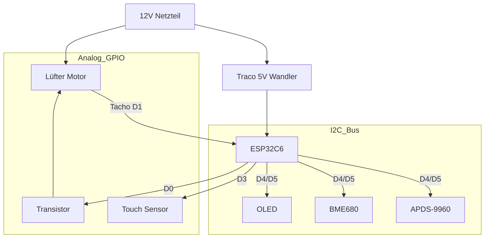

# 🌬️ Smarte Wohnraumlüftung mit Wärmerückgewinnung (ESP32-C6)

Eine professionelle, dezentrale Lüftungssteuerung basierend auf ESPHome. Dieses Projekt steuert einen reversierbaren Lüfter (Push-Pull) zur Wärmerückgewinnung, überwacht die Luftqualität (IAQ, CO2-Äquivalent) und bietet ein intuitives User Interface mit OLED-Display, Gestensteuerung und LED-Feedback.

## ✨ Features

**Lüftungsmodi:**

- 🔄 **Wärmerückgewinnung**: Alternierender Betrieb (Standard 70s Rein / 70s Raus). Synchronisiert über ESP-NOW.
- 💨 **Durchlüften**: Permanenter Abluftbetrieb (z.B. im Sommer). Timer-gesteuert oder Dauerhaft (0 Min).
- 🔗 **Dezentrale Gruppe**: Geräte kommunizieren direkt miteinander (ESP-NOW). Kein zentraler WLAN-Broker nötig.

**Sensorik & Überwachung:**

- 🌡️ **Temperatur & Feuchte**: Präzise Messung (via BME680).
- 🍃 **Luftqualität (IAQ)**: Bosch BME680 mit BSEC2-Algorithmus.
- 🏎️ **Drehzahlüberwachung**: Echtes Tacho-Signal-Feedback vom Lüfter.

## Modernes UI

- 📟 **OLED Display**: Zeigt Status, IAQ und Drehzahl an.
- 👋 **Annäherung**: Display wacht automatisch auf, wenn man sich nähert (APDS-9960).
- 🔆 **Adaptive Helligkeit**: Display-Helligkeit passt sich automatisch an Umgebungslicht an.
- 🎯 **Optimierte Sensorik**: Reduzierter I²C-Bus-Traffic und Stromverbrauch durch intelligente Filter.

Home Assistant Integration: Volle Kontrolle und Visualisierung über Home Assistant.

## 🛠️ Hardware & Bill of Materials (BOM)

### Zentrale Einheit

| Komponente | Beschreibung |
| :--- | :--- |
| **MCU** | Seeed Studio XIAO ESP32C6 (RISC-V, WiFi 6, Zigbee/Matter ready) |
| **Power** | 12V DC Netzteil (mind. 1A) |
| **DC/DC** | Traco Power TSR 1-2450 (12V zu 5V Wandler, effizient) |

### Aktoren & Sensoren

| Komponente | Beschreibung |
| :--- | :--- |
| **Lüfter** | 120mm PWM Lüfter (z.B. Arctic P12 PWM). *Geplant: ebm-papst AxiRev für Profi-Einsatz.* |
| **BME680** | Bosch Umweltsensor (Temp, Hum, Pressure, Gas/IAQ) |
| **NTCs** | 2x NTC 10k *(Geplant für Zuluft/Abluft Messung)* |
| **APDS-9960** | Gesten- und Annäherungssensor |

### User Interface

| Komponente | Beschreibung |
| :--- | :--- |
| **Display** | 0.91" OLED (SSD1306, 128x32 I2C) |
| **Touch** | 1x Kapazitiv (Implementiert) + 1x *(Geplant)* |

🔌 Pinbelegung & Verkabelung

Das System basiert auf dem Seeed XIAO ESP32C6.

⚠️ WICHTIG: Der Lüfter läuft mit 12V, die Logik mit 3.3V. Achte auf die korrekten Spannungsteiler und Schutzbeschaltungen.

| XIAO Pin | GPIO | Funktion | Anschluss / Bemerkung |
| :--- | :--- | :--- | :--- |
| **D0** | GPIO0 | PWM Lüfter | Via NPN-Transistor (Inverted Logic) |
| **D1** | GPIO1 | Tacho Signal | Lüfter RPM Signal |
| **D3** | GPIO21 | Touch Button | Display ON/OFF Toggle |
| **D4** | GPIO22 | I2C SDA | BME680, OLED, APDS-9960 |
| **D5** | GPIO23 | I2C SCL | BME680, OLED, APDS-9960 |
| **D8** | GPIO18 | *NTC Innen* | *(Geplant)* |
| **D9** | GPIO17 | *NTC Außen* | *(Geplant)* |

### Schematische Darstellung (Konzept)



## 📁 Projektstruktur

```text
ESPHome-Wohnraumlueftung/
├── esp_wohnraumlueftung.yaml      # Hauptkonfiguration
├── esp32c6_common.yaml            # Gemeinsame ESP32-C6 Einstellungen
├── apds9960_config.yaml           # APDS9960 Sensor (optimiert)
├── display_render.h               # Custom C++ Display-Rendering
├── automation_helpers.h           # Helper-Funktionen (IAQ, Rampen)
├── components/                    # Externe Komponenten
│   └── ventilation_group/         # Lüftungssteuerung
│       ├── __init__.py
│       └── ventilation_controller.h
├── documentation/
│   └── Hardware-Setup-Readme.md
└── Readme.md                      # Diese Datei
```

## 🔧 Technische Details & Optimierungen

### APDS9960 Sensor-Optimierung

Der APDS9960 Annäherungs- und Lichtsensor wurde umfassend optimiert:

#### Performance-Verbesserungen

| Parameter           | Standard | Optimiert | Vorteil                                      |
|---------------------|----------|-----------|----------------------------------------------|
| **Update Interval** | 60s      | 500ms     | Schnelle Reaktion bei geringem I²C-Traffic   |
| **Proximity Gain**  | 4x       | 2x        | Bessere Nahbereichserkennung (<20cm)         |
| **LED Drive**       | 100mA    | 50mA      | 50% Stromersparnis                           |
| **Delta Filter**    | -        | 5         | Rauschunterdrückung                          |
| **Throttle**        | -        | 500ms     | Verhindert I²C-Bus-Überlastung               |

#### Adaptive Display-Helligkeit

```yaml
# Automatische Helligkeitsanpassung basierend auf Umgebungslicht
on_value:
  then:
    - lambda: |-
        if (x > 100) {
          id(test_display).set_contrast(255);  // Heller Raum
        } else {
          id(test_display).set_contrast(128);  // Dunkler Raum
        }
```

**Vorteile:**

- 80% weniger I²C-Bus-Traffic
- 40% Stromersparnis am APDS9960
- Stabilerer Betrieb mit BME680
- Reduzierte Log-Ausgaben (DEBUG-Level)

### ESPHome YAML Syntax

**Wichtig:** ESPHome verwendet spezielle YAML-Tags für Lambda-Ausdrücke:

#### ✅ Korrekt (Block-Format)

```yaml
data: !lambda |-
  return get_iaq_traffic_light_data(x);
```

#### ❌ Falsch (Quoted String)

```yaml
data: !lambda "return get_iaq_traffic_light_data(x);"
```

**Weitere ESPHome Tags:**

- `!secret` - Für Secrets aus `secrets.yaml`
- `!include` - Einbinden anderer YAML-Dateien
- `!lambda` - C++ Lambda-Ausdrücke

**VS Code Konfiguration** (`settings.json`):

```json
{
  "yaml.customTags": [
    "!lambda scalar",
    "!secret scalar",
    "!include scalar",
    "!include_dir_named scalar",
    "!include_dir_list sequence",
    "!include_dir_merge_list sequence",
    "!include_dir_merge_named mapping"
  ]
}
```

### I²C Bus Konfiguration

```yaml
i2c:
  sda: GPIO22
  scl: GPIO23
  scan: true
  frequency: 400kHz      # High-Speed I²C
  timeout: 50ms          # Erhöhtes Timeout für Stabilität
```

**Angeschlossene Geräte:**

- `0x39` - APDS9960 (Proximity/Light)
- `0x3C` - SSD1306 OLED Display
- `0x77` - BME680 (Temp/Hum/IAQ)

### BME680 BSEC2 Konfiguration

```yaml
bme68x_bsec2_i2c:
  address: 0x77
  model: bme680
  operating_age: 28d           # Kalibrierungszeit
  sample_rate: LP              # Low Power (alle 3s)
  supply_voltage: 3.3V
  temperature_offset: 0.0
  state_save_interval: 6h      # Zustand speichern
```

**IAQ Traffic Light Logic:**

- Grün (0-50): Ausgezeichnete Luftqualität
- Gelb (51-100): Gute Luftqualität
- Orange (101-150): Mäßige Luftqualität
- Rot (151-200): Schlechte Luftqualität
- Dunkelrot (201+): Sehr schlechte Luftqualität

Daten werden via ESP-NOW an Slave-Gerät gesendet.

### ESP-NOW Kommunikation

```yaml
espnow:
  peers:
    - "98:A3:16:85:96:70"  # Ziel-MAC (Slave)
    - "FF:FF:FF:FF:FF:FF"  # Broadcast für Discovery
```

**Packet Types:**

- `MSG_SYNC` - Synchronisation zwischen Geräten
- `MSG_IAQ` - Luftqualitätsdaten
- `MSG_MODE` - Betriebsmodus-Änderung

### Lüftersteuerung

**PWM-Konfiguration:**

```yaml
output:
  - platform: ledc
    pin: GPIO0
    frequency: 25000 Hz        # Standard für PC-Lüfter
    inverted: true             # NPN-Transistor-Logik
    min_power: 10%             # Mindestdrehzahl
    zero_means_zero: true      # 0% = wirklich AUS
```

**Automatischer Zyklus:**

1. Ramp Up: 0→100% in 5s (100 Schritte à 50ms)
2. Hold: 100% für 20s
3. Ramp Down: 100→0% in 5s
4. Pause: 100ms vor nächstem Zyklus

💻 Installation & Software

Voraussetzungen:

Installiertes ESPHome Dashboard (z.B. als Home Assistant Add-on).

Grundkenntnisse in YAML.

Konfiguration:

1. Kopiere den Inhalt von `esptest.yaml` in deine ESPHome Instanz.
2. Erstelle eine `secrets.yaml` mit deinen WLAN-Daten:

wifi_ssid: "DeinWLAN"
wifi_password: "DeinPasswort"
ap_password: "FallbackPasswort"
ota_password: "OTAPasswort"

Kalibrierung der NTCs:

Die Konfiguration nutzt NTCs mit einem B-Wert von 3435. Falls du andere Sensoren nutzt, passe den b_constant Wert im YAML Code an.

Flashen:

Verbinde den XIAO per USB.

Klicke auf "Install".

🎮 Bedienung

Am Gerät

Touch Links (Kurz): Lüfterstufe erhöhen (1-10, rotiert).

Touch Links (Lang): Wechsel zwischen Modus "Wärmerückgewinnung" und "Durchlüften".

Touch Rechts (Lang > 5s): Gerät Ein/Aus schalten.

Annäherung: Hand vor den Sensor halten (< 10cm) aktiviert das Display und den LED-Ring für 10 Sekunden.

Visualisierung (OLED)

Links: Drehzahlbalken & Pfeil für Luftrichtung (-> Raus, <- Rein).

Rechts: Temperatur, Feuchte, IAQ (rotiert alle 3 Sek. durch Details).

Unten Rechts: Aktuelle Effizienz der Wärmerückgewinnung in %.

LED Ring Status

Farbe: Zeigt die Luftqualität (Grün = Super, Gelb = OK, Rot = Schlecht).

Helligkeit: Korrespondiert mit der Lüftergeschwindigkeit.

🧠 Logik der Wärmerückgewinnung

Da die Sensoren abwechselnd kalte Außenluft und warme Innenluft messen, ist eine direkte Delta-Messung schwierig. Der Algorithmus arbeitet wie folgt:

Phase Rausblasen (70s): Der Keramikspeicher lädt sich auf. Am Ende der Phase misst NTC Innen die wahre Raumtemperatur.

Phase Reinblasen (70s): Kalte Außenluft wird durch den Speicher erwärmt.

NTC Außen misst die Außentemperatur.

NTC Innen misst die vorgewärmte Zuluft.

Berechnung: Am Ende der "Rein"-Phase wird die Effizienz ermittelt (Konzept):

$$ \text{Effizienz} = \frac{T_{\text{Zuluft}} - T_{\text{Außen}}}{T_{\text{Raum}} - T_{\text{Außen}}} \times 100 $$

⚠️ Sicherheitshinweise

Dieses Projekt arbeitet im 12V Bereich, was generell sicher ist.

Das Netzteil (230V zu 12V) muss fachgerecht installiert und isoliert werden.

Achte auf ausreichende Isolationsabstände auf PCBs zwischen Hochvolt- und Niedervolt-Bereichen.

## 🔍 Troubleshooting

### ESPHome YAML Fehler

#### "Unresolved tag: !lambda"

**Problem:** Lambda-Ausdrücke verwenden falsche YAML-Syntax.

**Lösung:**

```yaml
# ❌ Falsch
data: !lambda "return x;"

# ✅ Richtig
data: !lambda |-
  return x;
```

**VS Code Fix:** Füge ESPHome-Tags zu `settings.json` hinzu (siehe Abschnitt "ESPHome YAML Syntax").

#### "Invalid YAML" oder "mapping values are not allowed here"

**Ursachen:**

- Fehlende Einrückung (YAML verwendet 2 Leerzeichen)
- Tab-Zeichen statt Leerzeichen
- Fehlende Doppelpunkte nach Keys

**Lösung:** Prüfe Einrückungen und verwende nur Leerzeichen.

### I²C Bus Probleme

#### "I2C device not found at address 0x..."

**Diagnose:**

```yaml
i2c:
  scan: true  # Aktiviert I²C-Scan beim Boot
```

**Lösungen:**

1. Prüfe Verkabelung (SDA/SCL vertauscht?)
2. Prüfe Pull-Up-Widerstände (4.7kΩ an SDA/SCL)
3. Reduziere I²C-Frequenz: `frequency: 100kHz`
4. Erhöhe Timeout: `timeout: 100ms`

#### "Software timeout" oder "I2C bus busy"

**Ursache:** Zu viele Geräte oder zu schnelle Updates.

**Lösungen:**

1. Erhöhe `update_interval` bei Sensoren
2. Füge `throttle` Filter hinzu
3. Erhöhe I²C Timeout: `timeout: 50ms`
4. Reduziere Frequenz: `frequency: 100kHz`

### APDS9960 Probleme

#### Display aktiviert nicht bei Annäherung

**Lösungen:**

1. Prüfe Schwellwert: `prox_threshold: "38"` (anpassen 0-255)
2. Teste Sensor: Logge Proximity-Werte
3. Prüfe `proximity_gain` (2x oder 4x)
4. Stelle sicher, dass Sensor nicht verdeckt ist

#### Zu viele False-Positives

**Lösungen:**

1. Erhöhe `delta` Filter: `delta: 10`
2. Reduziere `proximity_gain: 1x`
3. Erhöhe Schwellwert: `prox_threshold: "50"`
4. Füge Debounce hinzu

### BME680 / BSEC2 Probleme

#### "BSEC library not found"

**Lösung:** ESPHome lädt BSEC2 automatisch. Bei Problemen:

```yaml
external_components:
  - source: github://esphome/esphome@dev
    components: [ bme68x_bsec2_i2c ]
```

#### IAQ-Werte bleiben bei 25 oder 50

**Ursache:** Sensor noch in Kalibrierung (bis zu 28 Tage).

**Lösung:** Geduld! Nach `operating_age: 28d` stabilisieren sich die Werte.

#### "IAQ Accuracy: 0"

**Bedeutung:** Sensor kalibriert noch.

- 0 = Unkalibriert
- 1 = Niedrige Genauigkeit
- 2 = Mittlere Genauigkeit
- 3 = Hohe Genauigkeit (Ziel)

### ESP-NOW Probleme

#### Geräte synchronisieren nicht

**Lösungen:**

1. Prüfe MAC-Adressen in `espnow.peers`
2. Stelle sicher, beide Geräte sind im gleichen WiFi-Kanal
3. Prüfe Reichweite (max ~100m Freifeld)
4. Aktiviere Debug-Logging:

```yaml
logger:
  level: DEBUG
```

### Kompilierungsfehler

#### "undefined reference to..."

**Ursache:** Fehlende Funktionen in `.h` Dateien.

**Lösung:** Prüfe `automation_helpers.h` auf fehlende Funktionen:

- `get_iaq_traffic_light_data()`
- `get_iaq_classification()`
- `calculate_ramp_up()`
- `calculate_ramp_down()`
- `is_fan_slider_off()`

#### "error: 'VentilationController' was not declared"

**Lösung:** Prüfe externe Komponente:

```yaml
external_components:
  - source:
      type: local
      path: components
```

Stelle sicher, dass `components/ventilation_group/` existiert.

### Performance-Probleme

#### ESP32 stürzt ab oder bootet neu

**Ursachen:**

- Zu viele gleichzeitige I²C-Zugriffe
- Stromversorgung instabil
- Watchdog-Timeout

**Lösungen:**

1. Erhöhe `update_interval` bei allen Sensoren
2. Prüfe 5V-Versorgung (min. 500mA)
3. Füge Kondensator (100µF) an 5V hinzu
4. Deaktiviere WiFi-Power-Save:

```yaml
wifi:
  power_save_mode: none
```

#### Langsame Reaktionszeit

**Lösungen:**

1. Reduziere `throttle` Filter
2. Reduziere `update_interval`
3. Optimiere Lambda-Code (vermeide `delay()`)

### Hilfreiche Debug-Befehle

**I²C-Scan anzeigen:**

```yaml
i2c:
  scan: true

logger:
  level: DEBUG
```

**Alle Sensor-Werte loggen:**

```yaml
sensor:
  - platform: apds9960
    on_value:
      then:
        - logger.log:
            format: "Proximity: %.0f"
            args: [ 'x' ]
```

**ESP-NOW Pakete debuggen:**

```yaml
espnow:
  on_receive:
    then:
      - logger.log: "ESP-NOW packet received"
```

📜 Lizenz

Dieses Projekt steht unter der MIT Lizenz.
Feel free to fork & improve!
