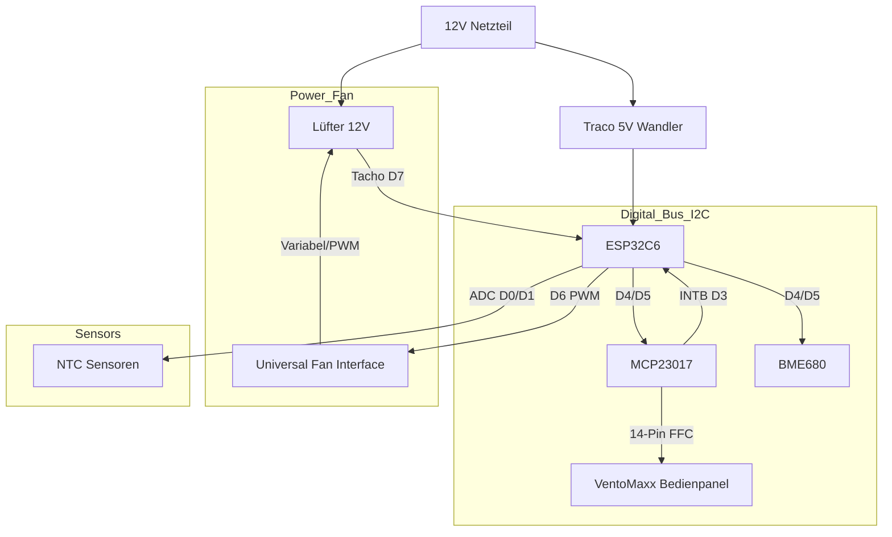

# 🌬️ Smarte Wohnraumlüftung mit Wärmerückgewinnung (ESP32-C6)

Eine professionelle, dezentrale Lüftungssteuerung basierend auf ESPHome. Dieses Projekt steuert einen reversierbaren Lüfter (Push-Pull) zur Wärmerückgewinnung, überwacht die Luftqualität (IAQ, CO2-Äquivalent), berechnet die effektive Wärmerückgewinnung und nutzt das originale **VentoMaxx Bedienpanel** für eine nahtlose Integration und intuitive Steuerung.

> 💡 **Kompatibilität:** Die Steuerung funktioniert prinzipiell für jede dezentrale Wohnraumlüftung mit 12V PWM-Lüftern. Sie wurde jedoch **speziell als Ersatz für die VentoMaxx V-WRG Serie** entwickelt. Die Hardware (PCB-Layout/Größe und Bedienpanel) ist damit explizit für die VentoMaxx V-WRG Serie optimiert und muss für andere Hersteller ggf. angepasst werden.

[](https://esphome.io/)
[](https://www.home-assistant.io/)
[](https://opensource.org/licenses/MIT)

---

## 📑 Inhaltsverzeichnis

- [Leistungsmerkmale](#-leistungsmerkmale)
- [Vergleich mit VentoMaxx](#-vergleich-mit-ventomaxx-v-wrg)
- [ESP-NOW & Autonomie](#-esp-now-kabellose-autonomie)
- [Hardware & BOM](#️-hardware--bill-of-materials-bom)
- [Eigene Platine (PCB)](#-eigene-platine-pcb)
- [Pinbelegung](#-pinbelegung--verkabelung)
- [Installation](#-installation--software)
- [Bedienung](#-bedienung--steuerung)
- [Wärmerückgewinnung](#-wärmerückgewinnung---so-funktionierts)
- [Technische Details](#-technische-details--optimierungen)
- [Projektstruktur](#-projektstruktur)
- [Troubleshooting](#-troubleshooting)
- [Lizenz](#-lizenz)

---

## ✨ Leistungsmerkmale

### ⚙️ Intelligente Betriebsmodi

- 🔄 **Effiziente Wärmerückgewinnung**: Zyklischer, bidirektionaler Betrieb (Push-Pull) zur Maximierung der Energieeffizienz. Die Synchronisation aller Einheiten erfolgt vollautomatisch und kabellos über das ESP-NOW Protokoll.
- 💨 **Querlüftung (Sommerbetrieb)**: Modus für permanenten Abluftstrom, ideal zur passiven Kühlung in Sommernächten. Flexibel konfigurierbar via Timer oder als Dauerbetrieb.
- 🔗 **Autarkes Mesh-Netzwerk**: Robuste Dezentralität durch direkte Peer-to-Peer Kommunikation (ESP-NOW). Der Gruppenbetrieb ist auch ohne zentrale WLAN-Infrastruktur oder externe Broker gewährleistet.

### 🛡️ Präzisions-Sensorik & Monitoring

- 🌡️ **Klimadatenerfassung**: Hochpräzise Messung von Temperatur und relativer Luftfeuchtigkeit mittels Bosch BME680.
- 🍃 **Luftqualitätsanalyse (IAQ)**: Integrierte BSEC2-Algorithmen zur Berechnung des Index of Air Quality (IAQ) und CO2-Äquivalenten für eine bedarfsgerechte Lüftungssteuerung.
- 🏎️ **Closed-Loop Drehzahlüberwachung**: Kontinuierliches Monitoring der Lüfterdrehzahl via Tacho-Signal für konstanten Volumenstrom und Fehlererkennung.

### 🖥️ Human-Machine Interface (HMI)

- 🚥 **Original VentoMaxx Panel**: Nutzung des originalen Bedienfelds mit 9 LEDs und 3 Tastern.
- 🔘 **Intuitive Steuerung**:
  - **Power**: System Ein/Aus/Reset.
  - **Modus**: Wechsel zwischen Wärmerückgewinnung (Winter) und Durchlüften (Sommer).
  - **Stufe +**: 5 Lüfterstufen (zyklisch).
- 🔆 **LED Feedback**: Anzeige von Modus, aktueller Lüfterstufe (1-5) und Status.

### 🏠 Integration

**Volle Home Assistant Integration**: Native API-Unterstützung für nahtloses Monitoring, Steuerung und Automatisierung über Ihr Smart Home System.

### �️ Roadmap & Zukünftige Erweiterungen

Die Firmware ist für folgende "Advanced Automation"-Funktionen vorbereitet (Implementierung folgt):

- **🤖 Adaptive IAQ-Regelung**:
  - Dynamische Anpassung der Lüfterleistung basierend auf Echtzeit-IAQ-Werten.
  - Granulare Konfiguration von Schwellenwerten, Reaktionskurven und Maximalbegrenzungen (Noise Control).
  - Lokal und remote aktivierbar.

- **🌙 Intelligenter Nachtmodus**:
  - Zeitgesteuerte Drosselung der Lüfterleistung zur Geräuschminimierung in Ruhephasen.
  - Flexibles Zeitmanagement und Definition spezifischer Nacht-Profile.
  - Lokal und remote aktivierbar.

- **🧹 Wartungs-Management**:
  - Prädiktiver Filterwechsel-Alarm basierend auf Betriebsstunden und Zeitintervallen.
  - Lokale Visualisierung und digitale Benachrichtigung im Smart Home Dashboard.

- **💧 Feuchte-Management**:
  - Automatisierte Entfeuchtungslogik zur Schimmelprävention basierend auf absoluter und relativer Feuchte.
  - Intelligente Hysterese-Steuerung zur Vermeidung von "Rapid Cycling".
  - Lokal und remote aktivierbar.
  - Zielwert für maximale Luftfeuchtigkeit konfigurierbar.

---

## 🔄 Vergleich mit VentoMaxx V-WRG

Diese Lösung wurde als smarter Ersatz für die herkömmliche [VentoMaxx V-WRG / WRG PLUS](https://www.ventomaxx.de/dezentrale-lueftung-produktuebersicht/aktive-luefter-mit-waermerueckgewinnung/) Steuerung entwickelt. Während die originale VentoMaxx-Lösung keine Integration in ein Smart Home System ermöglicht, bietet dieser ESPHome-Ansatz ein völlig neues Level an Flexibilität und Integrität. Da hier diese Lösung auf ESPHome basiert, kann sie mit jeder Home Assistant Version verwendet werden und bietet eine native Integration in Home Assistant.

### Funktionsvergleich

| Feature             | VentoMaxx V-WRG (Standard)     | ESPHome Smart WRG (Dieses Projekt)           |
| :------------------ | :----------------------------- | :------------------------------------------- |
| **Konnektivität**   | Kabelgebunden / Inselbetrieb   | **WiFi 6 & ESP-NOW Mesh**                    |
| **Smart Home**      | Nein (oder teure Zusatzmodule) | **Nativ Home Assistant (API)**               |
| **Visualisierung**  | Status-LEDs (Original Panel)   | **Status-LEDs + Home Assistant Dashboard**   |
| **Sensorik**        | Optional CO2 (rudimentär)      | **BME680 (IAQ, VOC, Temp, Hum, Pressure)**   |
| **Bedienung**       | Wandschalter / Fernbedienung   | **Original Panel, App & Automatik**          |
| **Synchronisierung**| Physisches Steuerkabel         | **Kabellos & Intelligent via ESP-NOW**       |
| **Konfiguration**   | DIP-Schalter / Potentiometer   | **Dynamisch per Software (Floor/Room IDs)**  |
| **Kosten**          | Hochpreisig (Industriestandard)| **Preiswert & Unbegrenzt erweiterbar**       |

### 🚀 Warum diese Lösung überlegen ist

1. **Echte Luftqualität**: Statt nur die Zeit zu steuern, reagiert dieses System auf den **IAQ (Indoor Air Quality)** Index. Bei schlechter Luft schaltet das System automatisch hoch.
2. **Keine neuen Kabel**: Durch **ESP-NOW** synchronisieren sich Geräte in einem Raum (z.B. paarweiser Push-Pull Betrieb) komplett kabellos über Funk. Das Ganze funktioniert sogar, wenn das lokale WLAN ausfällt, da die Kommunikation direkt über die Wi-Fi-Radio-Hardware (MAC-Ebene) erfolgt, ohne dass eine Verbindung zu einem Access Point erforderlich ist.
3. **Wartungs-Intelligenz**: Durch die **Tacho-Auswertung** erkennt das System, ob ein Lüfter blockiert oder verschmutzt ist, und meldet dies proaktiv an Home Assistant.
4. **Zukunftssicher**: Dank **Over-the-Air (OTA)** Updates können neue Funktionen oder verbesserte Regelalgorithmen (z.B. für Wärmerückgewinnung) jederzeit eingespielt werden.

---

## 📡 ESP-NOW: Kabellose Autonomie

Die Geräte kommunizieren über die [ESPHome ESP-NOW Komponente](https://esphome.io/components/espnow.html). **ESP-NOW** ist ein von Espressif entwickeltes, verbindungsloses Protokoll, das eine direkte Kommunikation zwischen ESP32-Geräten ohne Umweg über einen WLAN-Router ermöglicht.

### Vorteile im Überblick

- 🌐 **WLAN-Unabhängigkeit**: Die Geräte benötigen keinen WLAN-Router (Access Point) für die Synchronisation. Die Kommunikation erfolgt direkt auf der MAC-Ebene (2,4 GHz Radio). Fällt das lokale WLAN aus, arbeitet die Lüftungsgruppe ungestört weiter.
- 🛡️ **Hohe Zuverlässigkeit**: Durch die direkte Punkt-zu-Punkt-Kommunikation ist das System immun gegen Überlastungen oder Störungen im herkömmlichen WLAN-Netzwerk.
- ⚡ **Extrem geringe Latenz**: Da keine Verbindung aufgebaut oder verwaltet werden muss (handshake-frei), werden Synchronisationsbefehle nahezu verzögerungsfrei übertragen. Dies ist entscheidend für den exakten Richtungswechsel synchronisierter Lüfterpaare.
- 🔌 **Keine Steuerleitungen**: Es müssen keine Datenkabel durch Wände gezogen werden. Die Synchronisation erfolgt "Out-of-the-box" über Funk.
- 📡 **Automatisches Software-Filtering**: Durch den Broadcast-Modus und die projektinterne Filterung (Floor/Room ID) finden sich Geräte im gleichen Raum automatisch.

Weitere Informationen finden Sie in der [offiziellen ESPHome Dokumentation](https://esphome.io/components/espnow.html).

---

## 🛠️ Hardware & Bill of Materials (BOM)

### Zentrale Einheit

| Komponente | Beschreibung |
| :--- | :--- |
| **MCU** | Seeed Studio XIAO ESP32C6 (RISC-V, WiFi 6, Zigbee/Matter ready) |
| **Power** | 12V DC Netzteil (mind. 1A) |
| **DC/DC** | Traco Power TSR 1-2450 (12V zu 5V Wandler, effizient) |

### Aktoren & Sensoren

| Komponente | Beschreibung | Dokumentation |
| :--- | :--- | :--- |
| **Lüfter** | **4412 FGM PR** (3-Pin, VarioPro) oder **AxiRev** (4-Pin). *Siehe Hardware-Setup-Readme.* | [Fan Component](https://esphome.io/components/fan/speed.html) |
| **BME680** | Bosch Umweltsensor (Temp, Hum, Pressure, Gas/IAQ) | [BME68x BSEC2](https://esphome.io/components/sensor/bme68x_bsec2.html) |
| **NTCs** | 2x NTC 10k (Zuluft/Abluft) für Effizienzmessung | [NTC Sensor](https://esphome.io/components/sensor/ntc.html) |
| **I/O Expander** | **MCP23017** (I2C) für VentoMaxx Panel | [MCP23017](https://esphome.io/components/mcp23017.html) |

### 🖱️ User Interface

| Komponente | Beschreibung | Dokumentation |
| :--- | :--- | :--- |
| **VentoMaxx Panel** | Original Panel (14-Pin FFC). 3 Taster, 9 LEDs. | - |

---

## 🖱️ Eigene Platine - PCB

Eine dedizierte Platine (PCB), die alle oben genannten Komponenten (XIAO, Traco, Transistoren, Anschlüsse für Sensoren) kompakt vereint, befindet sich aktuell in der Entwicklung.

- **Professionelles Design**: Optimiert für den Einbau in Standard-Unterputzdosen oder Lüftergehäuse.
- **Plug & Play**: Einfache Montage durch Steckverbinder (JST/Dupont).
- **Bezug**: Informationen zum Layout (EasyEDA/KiCad) und Bestellmöglichkeiten werden dem Projekt hinzugefügt, sobald die Prototypen-Phase abgeschlossen ist.

---

## 🔌 Pinbelegung & Verkabelung

Das System basiert auf dem [Seeed XIAO ESP32C6](https://esphome.io/components/esp32.html).

⚠️ **WICHTIG:** Der Lüfter läuft mit 12V, die Logik mit 3.3V. Achte auf die korrekten Spannungsteiler und Schutzbeschaltungen.

| XIAO Pin | GPIO | Funktion | Bemerkung |
| :--- | :--- | :--- | :--- |
| **D0** | GPIO0 | [ADC Input](https://esphome.io/components/sensor/adc.html) | NTC Innen (Spannungsteiler) |
| **D1** | GPIO1 | [ADC Input](https://esphome.io/components/sensor/adc.html) | NTC Außen (Spannungsteiler) |
| **D3** | GPIO21 | Input (Pullup) | **MCP23017 INTB** (Interrupt) |
| **D4** | GPIO22 | [I2C SDA](https://esphome.io/components/i2c.html) | BME680, MCP23017 |
| **D5** | GPIO23 | [I2C SCL](https://esphome.io/components/i2c.html) | BME680, MCP23017 |
| **D6** | GPIO16 | [PWM Output](https://esphome.io/components/output/ledc.html) | Fan PWM (Universal: Direkt oder High-Side Mosfet) |
| **D7** | GPIO17 | [Pulse Counter](https://esphome.io/components/sensor/pulse_counter.html) | Fan Tacho (Pullup 3V3!) |
| **D8-D10** | - | Reserve | SPI / Frei |

### 📊 Schematische Darstellung (Konzept)



---

## 💻 Installation & Software

### Voraussetzungen

- Installiertes ESPHome Dashboard (z.B. als Home Assistant Add-on)
- Grundkenntnisse in YAML

### Konfiguration

1. Kopiere den Inhalt von `esp_wohnraumlueftung.yaml` in deine ESPHome Instanz.
2. Erstelle eine `secrets.yaml` mit deinen WLAN-Daten:

```yaml
wifi_ssid: "DeinWLAN"
wifi_password: "DeinPasswort"
ap_password: "FallbackPasswort"
ota_password: "OTAPasswort"
```

### Kalibrierung der NTCs

Die Konfiguration nutzt NTCs mit einem B-Wert von 3435. Falls du andere Sensoren nutzt, passe den `b_constant` Wert im YAML Code an.

### Flashen

1. Verbinde den XIAO per USB.
2. Klicke auf "Install".

---

## 🎮 Bedienung & Steuerung

Die Steuerung erfolgt intuitiv über das integrierte Bedienpanel oder vollautomatisch via Home Assistant.

### 🖐️ Bedienpanel (VentoMaxx Style)

Das Panel verfügt über 3 Taster und 9 Status-LEDs.

#### Tastenbelegung

| Taste | Funktion | Bedienung |
| :--- | :--- | :--- |
| **Power (I/O)** | System Ein/Aus | • Kurz drücken: Standby Toggle<br>• Lang drücken (>5s): Hard Reset |
| **Modus (M)** | Betriebsart wählen | • Kurz drücken: Wechselt zwischen *Wärmerückgewinnung* und *Durchlüften* |
| **Stufe (+)** | Lüfterstärke | • Kurz drücken: Zykliert durch 10 Geschwindigkeitsstufen (angezeigt über 5 LEDs). |

#### Status-LEDs (Feedback)

| LED Gruppe | LEDs | Anzeige |
| :--- | :--- | :--- |
| **Power** | 🟢 1x Grün | Leuchtet permanent, wenn System aktiv. Blinkt bei Fehler. |
| **Master** | 🟢 1x Grün | Leuchtet, wenn dies das Master-Gerät in einer Gruppe ist. |
| **Modus** | 🟢 2x Grün | **LED 1**: Wärmerückgewinnung aktiv<br>**LED 2**: Durchlüften (Sommer) aktiv |
| **Intensität** | 🟢 5x Grün | Zeigt aktuelle Lüfterstufe 1 bis 5 (linear skaliert). |

---

### 📱 Steuerung über Home Assistant

Alle Funktionen sind vollständig in Home Assistant integriert. Änderungen am Panel werden sofort synchronisiert.

#### Verfügbare Steuerungen

- **Lüfter**: Slider 0-100% (Panel-Stufen entsprechen ~20% Schritten)
- **Modus**: Auswahl (Eco Recovery / Ventilation / Off)
- **Timer**: Konfiguration für "Durchlüften" (Standard: 30 Min)
- **Diagnose**: Anzeige von RPM, Temperatur, Feuchte und IAQ

#### Automatische Funktionen

- **Nachtmodus (geplant)**: Dimmt die LEDs automatisch basierend auf Uhrzeit.
- **Filter-Alarm**: Power-LED blinkt rot (geplant), wenn Filterwechsel nötig.

---

### 💡 Tipps für optimale Nutzung

#### Betriebsarten sinnvoll einsetzen

- ❄️ **Winter (WRG)**: Nutzen Sie immer den Wärmerückgewinnungs-Modus für maximale Energieersparnis.
- ☀️ **Sommer (Querlüftung)**: Abends den "Durchlüften"-Modus aktivieren, um kühle Außenluft einzubringen (ohne WRG).
- 🔇 **Nacht**: Stufe 1 oder 2 ist meist ausreichend und kaum hörbar.

#### Wartung & Pflege

- **Filter**: Alle 6 Monate prüfen/wechseln.
- **Reinigung**: Panel nur mit trockenem Tuch reinigen.
- **Wärmetauscher**: Einmal jährlich mit Wasser ausspülen (siehe Herstelleranleitung).

---

## 🧠 Wärmerückgewinnung - So funktioniert's

### Grundprinzip

Das System nutzt einen **Keramikspeicher** zur Wärmerückgewinnung. Dieser speichert Wärme aus der Abluft und gibt sie an die Zuluft ab.

### Betriebszyklus (Standard: 70s pro Phase)


### Phase 1: Abluft (Rausblasen) - 70 Sekunden

```
Innenraum (warm) → Keramikspeicher → Außen
    21°C              ↓ Wärme         5°C
                  speichern
```

**Was passiert:**

- 🔥 Warme Raumluft (21°C) strömt durch den Keramikspeicher
- 📈 Keramik erwärmt sich und speichert Energie
- 🌡️ **NTC Innen** misst am Ende die wahre Raumtemperatur
- 💨 Abgekühlte Luft (~10°C) wird nach außen geblasen

### Phase 2: Zuluft (Reinblasen) - 70 Sekunden

```
Außen → Keramikspeicher → Innenraum (vorgewärmt)
 5°C     ↑ Wärme           ~16°C
        abgeben
```

**Was passiert:**

- ❄️ Kalte Außenluft (5°C) strömt durch den warmen Keramikspeicher
- 🔄 Keramik gibt gespeicherte Wärme ab
- 🌡️ **NTC Außen** misst Außentemperatur
- 🌡️ **NTC Innen** misst vorgewärmte Zuluft (~16°C)
- 🏠 Vorgewärmte Luft strömt in den Raum

### Effizienzberechnung

Am Ende der Zuluft-Phase wird die Wärmerückgewinnung berechnet:

$$
\text{Effizienz} = \frac{T_{\text{Zuluft}} - T_{\text{Außen}}}{T_{\text{Raum}} - T_{\text{Außen}}} \times 100\%
$$

**Beispielrechnung:**

- Raumtemperatur: 21°C
- Außentemperatur: 5°C
- Zulufttemperatur: 16°C

$$
\text{Effizienz} = \frac{16°C - 5°C}{21°C - 5°C} \times 100\% = \frac{11°C}{16°C} \times 100\% = 68.75\%
$$

**Interpretation:**

- **> 70%:** Ausgezeichnete Wärmerückgewinnung
- **50-70%:** Gute Wärmerückgewinnung
- **< 50%:** Keramik zu kalt oder Zyklus zu kurz

### Optimierung der Effizienz

| Parameter                 | Auswirkung                          | Empfehlung      |
| :------------------------ | :---------------------------------- | :-------------- |
| **Zyklusdauer**           | Längere Zyklen = bessere Speicherung| 70-90s optimal  |
| **Lüftergeschwindigkeit** | Langsamer = mehr Wärmeübertragung   | 60-80%          |
| **Keramikvolumen**        | Mehr Masse = mehr Speicher          | Größer ist besser|
| **Außentemperatur**       | Kälter = höhere Effizienz möglich   | -               |

### Synchronisation mehrerer Geräte

Bei Verwendung mehrerer Geräte im gleichen Raum:

**Paar-Betrieb (2 Geräte):**

```
Gerät A: Phase A (Zuluft)  ←→  Gerät B: Phase B (Abluft)
         ↓ 70s wechseln ↓
Gerät A: Phase B (Abluft) ←→  Gerät B: Phase A (Zuluft)
```

**Vorteile:**

- ✅ Kontinuierlicher Luftaustausch
- ✅ Keine Druckschwankungen
- ✅ Optimale Wärmerückgewinnung
- ✅ Synchronisiert über ESP-NOW

---

## 🔧 Technische Details & Optimierungen

Detaillierte technische Informationen zu Sensor-Optimierungen, ESPHome YAML Syntax, I²C-Konfiguration und weiteren technischen Aspekten finden Sie in der separaten Dokumentation:

📄 **[Technical-Details.md](documentation/Technical-Details.md)**

Diese Dokumentation enthält:

- ESPHome YAML Syntax Best Practices
- I²C Bus Konfiguration
- BME680 BSEC2 Konfiguration
- ESP-NOW Kommunikation
- Lüftersteuerung (PWM)

---

## 📁 Projektstruktur

```text
ESPHome-Wohnraumlueftung/
├── esp_wohnraumlueftung.yaml      # Hauptkonfiguration
├── esp32c6_common.yaml            # Gemeinsame ESP32-C6 Einstellungen
├── device_config.yaml             # Dynamische Gerätekonfiguration
├── automation_helpers.h           # Helper-Funktionen (IAQ, Rampen)
├── components/                    # Externe Komponenten
│   └── ventilation_group/         # Lüftungssteuerung
│       ├── __init__.py
│       └── ventilation_group.h
├── documentation/
│   ├── Hardware-Setup-Readme.md
│   └── Dynamic-Configuration.md
└── Readme.md                      # Diese Datei
```

---

## 🔍 Troubleshooting

Für eine umfassende Anleitung zur Fehlerbehebung, siehe die dedizierte [Troubleshooting-Dokumentation](documentation/Troubleshooting.md).

**Häufige Themen:**

- ESPHome YAML Fehler
- I²C Bus Probleme
- APDS9960 Proximity-Sensor
- BME680 / BSEC2 Kalibrierung
- ESP-NOW Synchronisation
- Kompilierungsfehler
- Performance-Optimierung

---

## ⚠️ Sicherheitshinweise

- Dieses Projekt arbeitet im 12V Bereich, was generell sicher ist.
- Das Netzteil (230V zu 12V) muss fachgerecht installiert und isoliert werden.
- Achte auf ausreichende Isolationsabstände auf PCBs zwischen Hochvolt- und Niedervolt-Bereichen.

---

## 📜 Lizenz

Dieses Projekt steht unter der MIT Lizenz.
Feel free to fork & improve!

---

**Made with ❤️ and ESPHome**
