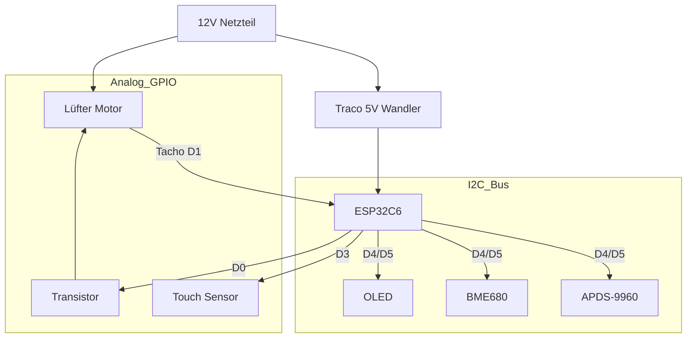

# 🌬️ Smarte Wohnraumlüftung mit Wärmerückgewinnung (ESP32-C6)

Eine professionelle, dezentrale Lüftungssteuerung basierend auf ESPHome. Dieses Projekt steuert einen reversierbaren Lüfter (Push-Pull) zur Wärmerückgewinnung, überwacht die Luftqualität (IAQ, CO2-Äquivalent) und bietet ein intuitives User Interface mit OLED-Display, Gestensteuerung und LED-Feedback.

[](https://esphome.io/)
[](https://www.home-assistant.io/)
[](https://opensource.org/licenses/MIT)

---

## 📑 Inhaltsverzeichnis

- [Features](#-features)
- [Vergleich mit VentoMaxx](#-vergleich-mit-ventomaxx-v-wrg)
- [Hardware & BOM](#️-hardware--bill-of-materials-bom)
- [Eigene Platine (PCB)](#-eigene-platine-pcb)
- [Pinbelegung](#-pinbelegung--verkabelung)
- [Installation](#-installation--software)
- [Bedienung](#-bedienung--steuerung)
- [Wärmerückgewinnung](#-wärmerückgewinnung---so-funktionierts)
- [Technische Details](#-technische-details--optimierungen)
- [Projektstruktur](#-projektstruktur)
- [Troubleshooting](#-troubleshooting)
- [Lizenz](#-lizenz)

---

## ✨ Features

### Lüftungsmodi

- 🔄 **Wärmerückgewinnung**: Alternierender Betrieb (Standard 70s Rein / 70s Raus). Synchronisiert über ESP-NOW.
- 💨 **Durchlüften**: Permanenter Abluftbetrieb (z.B. im Sommer). Timer-gesteuert oder Dauerhaft (0 Min).
- 🔗 **Dezentrale Gruppe**: Geräte kommunizieren direkt miteinander (ESP-NOW). Kein zentraler WLAN-Broker nötig.

### Sensorik & Überwachung

- 🌡️ **Temperatur & Feuchte**: Präzise Messung (via BME680).
- 🍃 **Luftqualität (IAQ)**: Bosch BME680 mit BSEC2-Algorithmus.
- 🏎️ **Drehzahlüberwachung**: Echtes Tacho-Signal-Feedback vom Lüfter.

### Modernes UI

- 📟 **OLED Display**: Zeigt Status, IAQ und Drehzahl an.
- 👋 **Annäherung**: Display wacht automatisch auf, wenn man sich nähert (APDS-9960).
- 🔆 **Adaptive Helligkeit**: Display-Helligkeit passt sich automatisch an Umgebungslicht an.
- 🎯 **Optimierte Sensorik**: Reduzierter I²C-Bus-Traffic und Stromverbrauch durch intelligente Filter.

### Home Assistant Integration

Volle Kontrolle und Visualisierung über Home Assistant.

---

## 🔄 Vergleich mit VentoMaxx V-WRG

Diese Lösung wurde als smarter Ersatz für die herkömmliche [VentoMaxx V-WRG / WRG PLUS](https://www.ventomaxx.de/dezentrale-lueftung-produktuebersicht/aktive-luefter-mit-waermerueckgewinnung/) Steuerung entwickelt. Während industrielle Lösungen oft starr und teuer sind, bietet dieser ESPHome-Ansatz ein völlig neues Level an Flexibilität.

### Funktionsvergleich

| Feature             | VentoMaxx V-WRG (Standard)     | ESPHome Smart WRG (Dieses Projekt)           |
| :------------------ | :----------------------------- | :------------------------------------------- |
| **Konnektivität**   | Kabelgebunden / Inselbetrieb   | **WiFi 6 & ESP-NOW Mesh**                    |
| **Smart Home**      | Nein (oder teure Zusatzmodule) | **Nativ Home Assistant (API)**               |
| **Visualisierung**  | Einfache Status-LEDs           | **0.91" OLED mit Echtzeit-Graphen & Werten** |
| **Sensorik**        | Optional CO2 (rudimentär)      | **BME680 (IAQ, VOC, Temp, Hum, Pressure)**   |
| **Bedienung**       | Wandschalter / Fernbedienung   | **App, Touch, Gesten & Automatik**           |
| **Synchronisierung**| Physisches Steuerkabel         | **Kabellos & Intelligent via ESP-NOW**       |
| **Konfiguration**   | DIP-Schalter / Potentiometer   | **Dynamisch per Software (Floor/Room IDs)**  |
| **Kosten**          | Hochpreisig (Industriestandard)| **Preiswert & Unbegrenzt erweiterbar**       |

### 🚀 Warum diese Lösung überlegen ist

1. **Echte Luftqualität**: Statt nur die Zeit zu steuern, reagiert dieses System auf den **IAQ (Indoor Air Quality)** Index. Bei schlechter Luft schaltet das System automatisch hoch.
2. **Keine neuen Kabel**: Durch **ESP-NOW** synchronisieren sich Geräte in einem Raum (z.B. paarweiser Push-Pull Betrieb) komplett kabellos über Funk.
3. **Wartungs-Intelligenz**: Durch die **Tacho-Auswertung** erkennt das System, ob ein Lüfter blockiert oder verschmutzt ist, und meldet dies proaktiv an Home Assistant.
4. **Zukunftssicher**: Dank **Over-the-Air (OTA)** Updates können neue Funktionen oder verbesserte Regelalgorithmen (z.B. für Wärmerückgewinnung) jederzeit eingespielt werden.

---

## 🛠️ Hardware & Bill of Materials (BOM)

### Zentrale Einheit

| Komponente | Beschreibung |
| :--- | :--- |
| **MCU** | Seeed Studio XIAO ESP32C6 (RISC-V, WiFi 6, Zigbee/Matter ready) |
| **Power** | 12V DC Netzteil (mind. 1A) |
| **DC/DC** | Traco Power TSR 1-2450 (12V zu 5V Wandler, effizient) |

### Aktoren & Sensoren

| Komponente | Beschreibung |
| :--- | :--- |
| **Lüfter** | 120mm PWM Lüfter (z.B. Arctic P12 PWM). *Geplant: ebm-papst AxiRev für Profi-Einsatz.* |
| **BME680** | Bosch Umweltsensor (Temp, Hum, Pressure, Gas/IAQ) |
| **NTCs** | 2x NTC 10k *(Geplant für Zuluft/Abluft Messung)* |
| **APDS-9960** | Gesten- und Annäherungssensor |

### User Interface

| Komponente | Beschreibung |
| :--- | :--- |
| **Display** | 0.91" OLED (SSD1306, 128x32 I2C) |
| **Touch** | 1x Kapazitiv (Implementiert) + 1x *(Geplant)* |

---

## 🖱️ Eigene Platine (PCB)

Eine dedizierte Platine (PCB), die alle oben genannten Komponenten (XIAO, Traco, Transistoren, Anschlüsse für Sensoren) kompakt vereint, befindet sich aktuell in der Entwicklung.

- **Professionelles Design**: Optimiert für den Einbau in Standard-Unterputzdosen oder Lüftergehäuse.
- **Plug & Play**: Einfache Montage durch Steckverbinder (JST/Dupont).
- **Bezug**: Informationen zum Layout (EasyEDA/KiCad) und Bestellmöglichkeiten werden dem Projekt hinzugefügt, sobald die Prototypen-Phase abgeschlossen ist.

---

## 🔌 Pinbelegung & Verkabelung

Das System basiert auf dem Seeed XIAO ESP32C6.

⚠️ **WICHTIG:** Der Lüfter läuft mit 12V, die Logik mit 3.3V. Achte auf die korrekten Spannungsteiler und Schutzbeschaltungen.

| XIAO Pin | GPIO | Funktion | Anschluss / Bemerkung |
| :--- | :--- | :--- | :--- |
| **D0** | GPIO0 | PWM Lüfter | Via NPN-Transistor (Inverted Logic) |
| **D1** | GPIO1 | Tacho Signal | Lüfter RPM Signal |
| **D3** | GPIO21 | Touch Button | Display ON/OFF Toggle |
| **D4** | GPIO22 | I2C SDA | BME680, OLED, APDS-9960 |
| **D5** | GPIO23 | I2C SCL | BME680, OLED, APDS-9960 |
| **D8** | GPIO18 | *NTC Innen* | *(Geplant)* |
| **D9** | GPIO17 | *NTC Außen* | *(Geplant)* |

### Schematische Darstellung (Konzept)



---

## 💻 Installation & Software

### Voraussetzungen

- Installiertes ESPHome Dashboard (z.B. als Home Assistant Add-on)
- Grundkenntnisse in YAML

### Konfiguration

1. Kopiere den Inhalt von `esp_wohnraumlueftung.yaml` in deine ESPHome Instanz.
2. Erstelle eine `secrets.yaml` mit deinen WLAN-Daten:

```yaml
wifi_ssid: "DeinWLAN"
wifi_password: "DeinPasswort"
ap_password: "FallbackPasswort"
ota_password: "OTAPasswort"
```

### Kalibrierung der NTCs

Die Konfiguration nutzt NTCs mit einem B-Wert von 3435. Falls du andere Sensoren nutzt, passe den `b_constant` Wert im YAML Code an.

### Flashen

1. Verbinde den XIAO per USB.
2. Klicke auf "Install".

---

## 🎮 Bedienung & Steuerung

Das System bietet drei Steuerungsmöglichkeiten: **Direkt am Gerät**, **über Home Assistant** und **automatisch** durch Sensoren.

### 🖐️ Bedienung am Gerät

#### Touch-Button (GPIO21)

Der kapazitive Touch-Button dient zur Display-Steuerung:

| Aktion            | Funktion        | Feedback                      |
| :---------------- | :-------------- | :---------------------------- |
| **Kurzer Touch**  | Display Ein/Aus | Display aktiviert/deaktiviert |

> 💡 **Tipp:** Das Display schaltet sich automatisch nach 5 Sekunden ab, um die OLED-Lebensdauer zu schonen.

#### Annäherungssensor (APDS9960)

Das System reagiert intelligent auf deine Anwesenheit:

```text
     👋 Hand nähert sich
         ↓
    [APDS9960 Sensor]
         ↓
   Proximity > 15%
         ↓
    ✨ Display aktiviert
         ↓
    ⏱️ 5 Sekunden Timeout
         ↓
    🌙 Display deaktiviert
```

**Funktionsweise:**

- **Erkennungsbereich:** < 20cm vor dem Sensor
- **Reaktionszeit:** < 500ms
- **Auto-Helligkeit:** Passt sich an Umgebungslicht an
  - 🌞 Heller Raum → Volle Helligkeit
  - 🌙 Dunkler Raum → Reduzierte Helligkeit

### 🏠 Steuerung über Home Assistant

Alle Funktionen sind vollständig in Home Assistant integriert:

#### Betriebsmodi

| Modus                     | Beschreibung                            | Anwendungsfall             |
| :------------------------ | :-------------------------------------- | :------------------------- |
| 🔄 **Wärmerückgewinnung** | Alternierender Betrieb (70s Rein/Raus)  | Standard-Betrieb im Winter |
| 💨 **Durchlüften**        | Permanenter Abluftbetrieb               | Schnelle Lüftung, Sommer   |
| ⏸️ **Aus**                | Lüfter gestoppt                         | Wartung, Nachtruhe         |

#### Steuerbare Parameter

**Lüftergeschwindigkeit:**

- Slider: 0-100%
- Mindestdrehzahl: 10% (konfigurierbar)
- Echtzeit-RPM-Anzeige

**Durchlüften-Timer:**

- Einstellbar: 0-120 Minuten (5-Min-Schritte)
- 0 Min = Dauerbetrieb
- Standard: 30 Minuten

**Zyklusdauer (Wärmerückgewinnung):**

- Einstellbar: 10-300 Sekunden
- Standard: 70 Sekunden pro Richtung
- Synchronisiert über ESP-NOW

**Sync-Intervall:**

- Einstellbar: 1-360 Minuten
- Standard: 180 Minuten (3 Stunden)
- Hält Geräte synchron

### 📺 OLED Display (128x32)

Das Display zeigt alle wichtigen Informationen auf einen Blick:

```
┌──────────────────────────────────────┐
│ ↗ ████████░░  72%   🌡️ 21.5°C  IAQ 45│
│                     💧 55%    ⚡ 850rpm│
└──────────────────────────────────────┘
```

#### Display-Layout

**Linke Seite:**

- **Richtungspfeil:**
  - `↗` = Zuluft (Rein)
  - `↘` = Abluft (Raus)
- **Drehzahlbalken:** Visuelle Darstellung 0-100%
- **Prozentanzeige:** Aktuelle Lüftergeschwindigkeit

**Rechte Seite (rotiert alle 3 Sekunden):**

| Ansicht | Anzeige | Icon |
|---------|---------|------|
| **Temperatur** | 21.5°C | 🌡️ |
| **Luftfeuchtigkeit** | 55% | 💧 |
| **Luftqualität (IAQ)** | 0-500 | 🍃 |
| **Drehzahl** | RPM | ⚡ |
| **Luftdruck** | hPa | 🔽 |
| **VOC** | ppm | 💨 |

#### Luftqualitäts-Anzeige (IAQ)

Das System verwendet eine intuitive Farbcodierung:

| IAQ-Wert    | Bewertung     | Farbe        | Empfehlung        |
| :---------- | :------------ | :----------- | :---------------- |
| **0-50**    | Ausgezeichnet | 🟢 Grün      | Alles perfekt     |
| **51-100**  | Gut           | 🟡 Gelb      | Weiter so         |
| **101-150** | Mäßig         | 🟠 Orange    | Lüften empfohlen  |
| **151-200** | Schlecht      | 🔴 Rot       | Sofort lüften!    |
| **201+**    | Sehr schlecht | 🔴 Dunkelrot | Dringend handeln! |

> 📡 **ESP-NOW:** IAQ-Werte werden automatisch an gekoppelte Geräte gesendet.

### 🔄 Automatische Funktionen

#### Smart Display Management

1. **Proximity Wake-Up:**
    - Hand vor Sensor → Display an
    - Automatische Helligkeitsanpassung
    - 5s Auto-Off Timer

2. **Adaptive Helligkeit:**

    ```yaml
    Umgebungslicht > 100 → Helligkeit 255 (100%)
    Umgebungslicht ≤ 100 → Helligkeit 128 (50%)
    ```

3. **OLED-Schutz:**
    - Auto-Off nach Inaktivität
    - Verhindert Einbrennen
    - Verlängert Lebensdauer

#### Automatische Lüftersteuerung

**Fan Auto Cycle Script:**

```text
1. Ramp Up:   0% → 100% in 5s (sanfter Start)
2. Hold:      100% für 20s (volle Leistung)
3. Ramp Down: 100% → 0% in 5s (sanfter Stopp)
4. Pause:     100ms
5. Wiederholen
```

**Vorteile:**

- ✅ Reduziert mechanischen Verschleiß
- ✅ Leiser Betrieb
- ✅ Energieeffizient

### 💡 Tipps für optimale Nutzung

#### Allgemein

- 🌡️ **Winter:** Wärmerückgewinnung-Modus für Energieeffizienz
- ☀️ **Sommer:** Durchlüften-Modus für schnelle Kühlung
- 🌙 **Nacht:** Reduzierte Geschwindigkeit (30-40%) für leisen Betrieb
- 🏃 **Schnelllüftung:** Durchlüften-Modus mit Timer (15-30 Min)

#### Display-Nutzung

- 👋 Hand vor Sensor statt Touch-Button (schont Hardware)
- 🌙 Display bleibt nachts aus (Auto-Off)
- 📊 IAQ-Werte regelmäßig prüfen

#### Wartung

- 🧹 Keramikspeicher alle 6 Monate reinigen
- 🔧 Lüfter alle 12 Monate entstauben
- 📈 Effizienz-Werte monitoren (Verschlechterung = Reinigung nötig)

---

## 🧠 Wärmerückgewinnung - So funktioniert's

### Grundprinzip

Das System nutzt einen **Keramikspeicher** zur Wärmerückgewinnung. Dieser speichert Wärme aus der Abluft und gibt sie an die Zuluft ab.

### Betriebszyklus (Standard: 70s pro Phase)


### Phase 1: Abluft (Rausblasen) - 70 Sekunden

```
Innenraum (warm) → Keramikspeicher → Außen
    21°C              ↓ Wärme         5°C
                  speichern
```

**Was passiert:**

- 🔥 Warme Raumluft (21°C) strömt durch den Keramikspeicher
- 📈 Keramik erwärmt sich und speichert Energie
- 🌡️ **NTC Innen** misst am Ende die wahre Raumtemperatur
- 💨 Abgekühlte Luft (~10°C) wird nach außen geblasen

### Phase 2: Zuluft (Reinblasen) - 70 Sekunden

```
Außen → Keramikspeicher → Innenraum (vorgewärmt)
 5°C     ↑ Wärme           ~16°C
        abgeben
```

**Was passiert:**

- ❄️ Kalte Außenluft (5°C) strömt durch den warmen Keramikspeicher
- 🔄 Keramik gibt gespeicherte Wärme ab
- 🌡️ **NTC Außen** misst Außentemperatur
- 🌡️ **NTC Innen** misst vorgewärmte Zuluft (~16°C)
- 🏠 Vorgewärmte Luft strömt in den Raum

### Effizienzberechnung

Am Ende der Zuluft-Phase wird die Wärmerückgewinnung berechnet:

$$
\text{Effizienz} = \frac{T_{\text{Zuluft}} - T_{\text{Außen}}}{T_{\text{Raum}} - T_{\text{Außen}}} \times 100\%
$$

**Beispielrechnung:**

- Raumtemperatur: 21°C
- Außentemperatur: 5°C
- Zulufttemperatur: 16°C

$$
\text{Effizienz} = \frac{16°C - 5°C}{21°C - 5°C} \times 100\% = \frac{11°C}{16°C} \times 100\% = 68.75\%
$$

**Interpretation:**

- **> 70%:** Ausgezeichnete Wärmerückgewinnung
- **50-70%:** Gute Wärmerückgewinnung
- **< 50%:** Keramik zu kalt oder Zyklus zu kurz

### Optimierung der Effizienz

| Parameter                 | Auswirkung                          | Empfehlung      |
| :------------------------ | :---------------------------------- | :-------------- |
| **Zyklusdauer**           | Längere Zyklen = bessere Speicherung| 70-90s optimal  |
| **Lüftergeschwindigkeit** | Langsamer = mehr Wärmeübertragung   | 60-80%          |
| **Keramikvolumen**        | Mehr Masse = mehr Speicher          | Größer ist besser|
| **Außentemperatur**       | Kälter = höhere Effizienz möglich   | -               |

### Visualisierung im Display

```
┌──────────────────────────────────────┐
│ ↗ ████████░░  72%   🌡️ 21.5°C  IAQ 45│
│                     💧 55%    ⚙️ 68% │ ← Effizienz
└──────────────────────────────────────┘
```

> ⚙️ **Effizienz-Anzeige:** Wird unten rechts im Display angezeigt (geplant)

### Synchronisation mehrerer Geräte

Bei Verwendung mehrerer Geräte im gleichen Raum:

**Paar-Betrieb (2 Geräte):**

```
Gerät A: Phase A (Zuluft)  ←→  Gerät B: Phase B (Abluft)
         ↓ 70s wechseln ↓
Gerät A: Phase B (Abluft) ←→  Gerät B: Phase A (Zuluft)
```

**Vorteile:**

- ✅ Kontinuierlicher Luftaustausch
- ✅ Keine Druckschwankungen
- ✅ Optimale Wärmerückgewinnung
- ✅ Synchronisiert über ESP-NOW

---

## 🔧 Technische Details & Optimierungen

### APDS9960 Sensor-Optimierung

Der APDS9960 Annäherungs- und Lichtsensor wurde umfassend optimiert:

#### Performance-Verbesserungen

| Parameter | Standard | Optimiert | Vorteil |
|-----------|----------|-----------|---------|
| **Update Interval** | 60s | 500ms | Schnelle Reaktion bei geringem I²C-Traffic |
| **Proximity Gain** | 4x | 2x | Bessere Nahbereichserkennung (<20cm) |
| **LED Drive** | 100mA | 50mA | 50% Stromersparnis |
| **Delta Filter** | - | 5 | Rauschunterdrückung |
| **Throttle** | - | 500ms | Verhindert I²C-Bus-Überlastung |

#### Adaptive Display-Helligkeit

```yaml
# Automatische Helligkeitsanpassung basierend auf Umgebungslicht
on_value:
  then:
    - lambda: |-
        if (x > 100) {
          id(test_display).set_contrast(255);  // Heller Raum
        } else {
          id(test_display).set_contrast(128);  // Dunkler Raum
        }
```

**Vorteile:**

- 80% weniger I²C-Bus-Traffic
- 40% Stromersparnis am APDS9960
- Stabilerer Betrieb mit BME680
- Reduzierte Log-Ausgaben (DEBUG-Level)

### ESPHome YAML Syntax

**Wichtig:** ESPHome verwendet spezielle YAML-Tags für Lambda-Ausdrücke:

#### ✅ Korrekt (Block-Format)

```yaml
data: !lambda |-
  return get_iaq_traffic_light_data(x);
```

#### ❌ Falsch (Quoted String)

```yaml
data: !lambda "return get_iaq_traffic_light_data(x);"
```

**Weitere ESPHome Tags:**

- `!secret` - Für Secrets aus `secrets.yaml`
- `!include` - Einbinden anderer YAML-Dateien
- `!lambda` - C++ Lambda-Ausdrücke

**VS Code Konfiguration** (`settings.json`):

```json
{
  "yaml.customTags": [
    "!lambda scalar",
    "!secret scalar",
    "!include scalar",
    "!include_dir_named scalar",
    "!include_dir_list sequence",
    "!include_dir_merge_list sequence",
    "!include_dir_merge_named mapping"
  ]
}
```

### I²C Bus Konfiguration

```yaml
i2c:
  sda: GPIO22
  scl: GPIO23
  scan: true
  frequency: 400kHz      # High-Speed I²C
  timeout: 50ms          # Erhöhtes Timeout für Stabilität
```

**Angeschlossene Geräte:**

- `0x39` - APDS9960 (Proximity/Light)
- `0x3C` - SSD1306 OLED Display
- `0x77` - BME680 (Temp/Hum/IAQ)

### BME680 BSEC2 Konfiguration

```yaml
bme68x_bsec2_i2c:
  address: 0x77
  model: bme680
  operating_age: 28d           # Kalibrierungszeit
  sample_rate: LP              # Low Power (alle 3s)
  supply_voltage: 3.3V
  temperature_offset: 0.0
  state_save_interval: 6h      # Zustand speichern
```

**IAQ Traffic Light Logic:**

- Grün (0-50): Ausgezeichnete Luftqualität
- Gelb (51-100): Gute Luftqualität
- Orange (101-150): Mäßige Luftqualität
- Rot (151-200): Schlechte Luftqualität
- Dunkelrot (201+): Sehr schlechte Luftqualität

Daten werden via ESP-NOW an Slave-Gerät gesendet.

### ESP-NOW Kommunikation

```yaml
espnow:
  peers:
    - "FF:FF:FF:FF:FF:FF"  # Broadcast für Discovery
```

**Packet Types:**

- `MSG_SYNC` - Synchronisation zwischen Geräten
- `MSG_IAQ` - Luftqualitätsdaten
- `MSG_MODE` - Betriebsmodus-Änderung

**Broadcast-Modus:**

- Alle Geräte senden an Broadcast-Adresse
- Filterung erfolgt im VentilationController basierend auf Floor/Room/Device ID
- Keine manuelle MAC-Konfiguration erforderlich

### Lüftersteuerung

**PWM-Konfiguration:**

```yaml
output:
  - platform: ledc
    pin: GPIO0
    frequency: 25000 Hz        # Standard für PC-Lüfter
    inverted: true             # NPN-Transistor-Logik
    min_power: 10%             # Mindestdrehzahl
    zero_means_zero: true      # 0% = wirklich AUS
```

**Automatischer Zyklus:**

1. Ramp Up: 0→100% in 5s (100 Schritte à 50ms)
2. Hold: 100% für 20s
3. Ramp Down: 100→0% in 5s
4. Pause: 100ms vor nächstem Zyklus

---

## 📁 Projektstruktur

```text
ESPHome-Wohnraumlueftung/
├── esp_wohnraumlueftung.yaml      # Hauptkonfiguration
├── esp32c6_common.yaml            # Gemeinsame ESP32-C6 Einstellungen
├── apds9960_config.yaml           # APDS9960 Sensor (optimiert)
├── device_config.yaml             # Dynamische Gerätekonfiguration
├── display_render.h               # Custom C++ Display-Rendering
├── automation_helpers.h           # Helper-Funktionen (IAQ, Rampen)
├── components/                    # Externe Komponenten
│   └── ventilation_group/         # Lüftungssteuerung
│       ├── __init__.py
│       └── ventilation_group.h
├── documentation/
│   ├── Hardware-Setup-Readme.md
│   └── Dynamic-Configuration.md
└── Readme.md                      # Diese Datei
```

---

## 🔍 Troubleshooting

### ESPHome YAML Fehler

#### "Unresolved tag: !lambda"

**Problem:** Lambda-Ausdrücke verwenden falsche YAML-Syntax.

**Lösung:**

```yaml
# ❌ Falsch
data: !lambda "return x;"

# ✅ Richtig
data: !lambda |-
  return x;
```

**VS Code Fix:** Füge ESPHome-Tags zu `settings.json` hinzu (siehe Abschnitt "ESPHome YAML Syntax").

#### "Invalid YAML" oder "mapping values are not allowed here"

**Ursachen:**

- Fehlende Einrückung (YAML verwendet 2 Leerzeichen)
- Tab-Zeichen statt Leerzeichen
- Fehlende Doppelpunkte nach Keys

**Lösung:** Prüfe Einrückungen und verwende nur Leerzeichen.

### I²C Bus Probleme

#### "I2C device not found at address 0x..."

**Diagnose:**

```yaml
i2c:
  scan: true  # Aktiviert I²C-Scan beim Boot
```

**Lösungen:**

1. Prüfe Verkabelung (SDA/SCL vertauscht?)
2. Prüfe Pull-Up-Widerstände (4.7kΩ an SDA/SCL)
3. Reduziere I²C-Frequenz: `frequency: 100kHz`
4. Erhöhe Timeout: `timeout: 100ms`

#### "Software timeout" oder "I2C bus busy"

**Ursache:** Zu viele Geräte oder zu schnelle Updates.

**Lösungen:**

1. Erhöhe `update_interval` bei Sensoren
2. Füge `throttle` Filter hinzu
3. Erhöhe I²C Timeout: `timeout: 50ms`
4. Reduziere Frequenz: `frequency: 100kHz`

### APDS9960 Probleme

#### Display aktiviert nicht bei Annäherung

**Lösungen:**

1. Prüfe Schwellwert: `prox_threshold: "38"` (anpassen 0-255)
2. Teste Sensor: Logge Proximity-Werte
3. Prüfe `proximity_gain` (2x oder 4x)
4. Stelle sicher, dass Sensor nicht verdeckt ist

#### Zu viele False-Positives

**Lösungen:**

1. Erhöhe `delta` Filter: `delta: 10`
2. Reduziere `proximity_gain: 1x`
3. Erhöhe Schwellwert: `prox_threshold: "50"`
4. Füge Debounce hinzu

### BME680 / BSEC2 Probleme

#### "BSEC library not found"

**Lösung:** ESPHome lädt BSEC2 automatisch. Bei Problemen:

```yaml
external_components:
  - source: github://esphome/esphome@dev
    components: [ bme68x_bsec2_i2c ]
```

#### IAQ-Werte bleiben bei 25 oder 50

**Ursache:** Sensor noch in Kalibrierung (bis zu 28 Tage).

**Lösung:** Geduld! Nach `operating_age: 28d` stabilisieren sich die Werte.

#### "IAQ Accuracy: 0"

**Bedeutung:** Sensor kalibriert noch.

- 0 = Unkalibriert
- 1 = Niedrige Genauigkeit
- 2 = Mittlere Genauigkeit
- 3 = Hohe Genauigkeit (Ziel)

### ESP-NOW Probleme

#### Geräte synchronisieren nicht

**Lösungen:**

1. Prüfe Floor/Room/Device ID Konfiguration
2. Stelle sicher, beide Geräte sind im gleichen WiFi-Kanal
3. Prüfe Reichweite (max ~100m Freifeld)
4. Aktiviere Debug-Logging:

```yaml
logger:
  level: DEBUG
```

### Kompilierungsfehler

#### "undefined reference to..."

**Ursache:** Fehlende Funktionen in `.h` Dateien.

**Lösung:** Prüfe `automation_helpers.h` auf fehlende Funktionen:

- `get_iaq_traffic_light_data()`
- `get_iaq_classification()`
- `calculate_ramp_up()`
- `calculate_ramp_down()`
- `is_fan_slider_off()`

#### "error: 'VentilationController' was not declared"

**Lösung:** Prüfe externe Komponente:

```yaml
external_components:
  - source:
      type: local
      path: components
```

Stelle sicher, dass `components/ventilation_group/` existiert.

### Performance-Probleme

#### ESP32 stürzt ab oder bootet neu

**Ursachen:**

- Zu viele gleichzeitige I²C-Zugriffe
- Stromversorgung instabil
- Watchdog-Timeout

**Lösungen:**

1. Erhöhe `update_interval` bei allen Sensoren
2. Prüfe 5V-Versorgung (min. 500mA)
3. Füge Kondensator (100µF) an 5V hinzu
4. Deaktiviere WiFi-Power-Save:

```yaml
wifi:
  power_save_mode: none
```

#### Langsame Reaktionszeit

**Lösungen:**

1. Reduziere `throttle` Filter
2. Reduziere `update_interval`
3. Optimiere Lambda-Code (vermeide `delay()`)

### Hilfreiche Debug-Befehle

**I²C-Scan anzeigen:**

```yaml
i2c:
  scan: true

logger:
  level: DEBUG
```

**Alle Sensor-Werte loggen:**

```yaml
sensor:
  - platform: apds9960
    on_value:
      then:
        - logger.log:
            format: "Proximity: %.0f"
            args: [ 'x' ]
```

**ESP-NOW Pakete debuggen:**

```yaml
espnow:
  on_receive:
    then:
      - logger.log: "ESP-NOW packet received"
```

---

## ⚠️ Sicherheitshinweise

- Dieses Projekt arbeitet im 12V Bereich, was generell sicher ist.
- Das Netzteil (230V zu 12V) muss fachgerecht installiert und isoliert werden.
- Achte auf ausreichende Isolationsabstände auf PCBs zwischen Hochvolt- und Niedervolt-Bereichen.

---

## 📜 Lizenz

Dieses Projekt steht unter der MIT Lizenz.
Feel free to fork & improve!

---

**Made with ❤️ and ESPHome**
