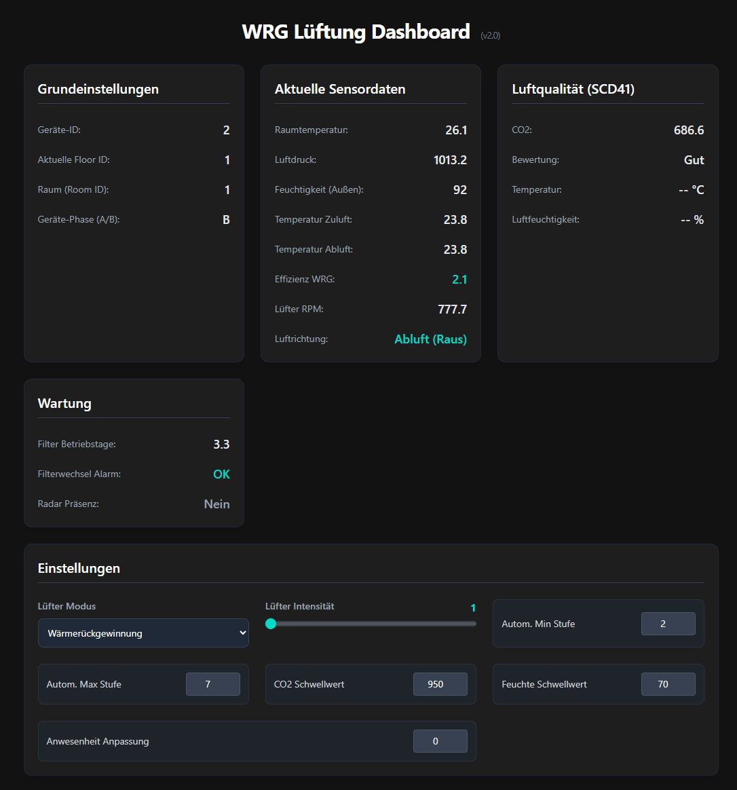
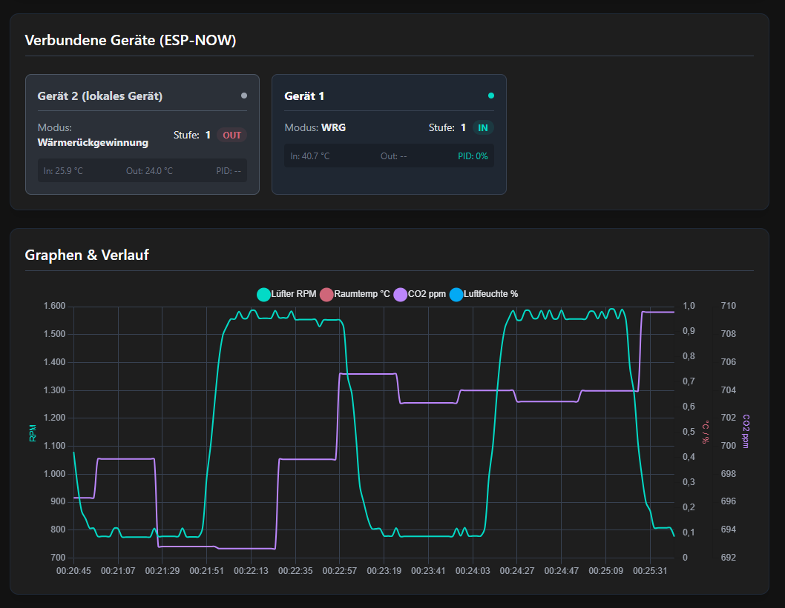
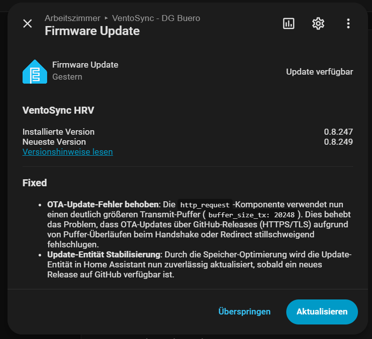

# 🌬️ VentoSync — ESPHome Smart HRV Control for VentoMaxx V-WRG

[](Readme_de.md)

## ⚖️ Disclaimer

> ⚠️ **VentoSync is an independent community project and NOT affiliated with Ventomaxx GmbH.**

## 🚀 Summary & Overview

This open-source project offers a professional, decentralized heat recovery ventilation (HRV) control system based on ESPHome. It replaces the control system of the VentoMaxx V-WRG series using a custom developed printed circuit board (PCB) based on an ESP32-C6 microcontroller, controlling the reversible 12V fan for heat recovery.
It optionally monitors air quality (CO2, humidity, and temperature) using a high-quality Sensirion SCD43 sensor, calculates effective heat recovery and uses the **original VentoMaxx control panel** for seamless integration and intuitive operation.
Furthermore, a mmWave radar sensor for presence detection can be optionally integrated and mounted invisibly behind the front cover of the ventilation unit.
Communication between individual ventilation units takes place via the stable ESP-NOW protocol, so no Wi-Fi or power line communication is required.

<p align="center">
  
  
</p>
<p align="center">
  <em><strong>Drop-in Hardware Replacement:</strong> Custom VentoSync ESP32-C6 PCB installed in the original VentoMaxx V-WRG ventilation unit housing — standard setup with external antenna (left) and upgraded with optional mmWave radar sensor for invisible room presence detection (right).</em>
</p>

> 💡 **Compatibility:** The control system works in principle for any decentralized residential ventilation which works with a reversible 12V fan (3-PIN or 4-PIN PWM). However, it was **specifically developed as a replacement for the VentoMaxx V-WRG series**. The hardware (PCB layout/size and control panel) is therefore explicitly optimized for the VentoMaxx V-WRG series and needs to be adapted for other manufacturers. The PCB is designed to fit exactly into the housing of the VentoMaxx V-WRG series and uses the existing mounting points.
Attention: This solution is not compatible with the VentoMaxx ZR-WRG series, as it uses a central control unit! Adaption to the ZR-WRG series is possible, but currently not implemented.

[](https://github.com/thomasengeroff-dotcom/VentoSync/actions/workflows/build.yaml)
[](https://github.com/thomasengeroff-dotcom/VentoSync/releases)
[](https://esphome.io/)
[](https://www.home-assistant.io/)
[](documentation/en/en_mqtt-integration.md)
[](https://esphome.io/components/esp32.html)


---

## 📑 Table of Contents

- [⚖️ Disclaimer](#️-disclaimer)
- [🚀 Summary & Overview](#-summary--overview)
  - [Motivation](#motivation)
  - [🛠️ Custom made PCB](#️-custom-made-pcb)
  - [🔄 Comparison with VentoMaxx V-WRG](#-comparison-with-ventomaxx-v-wrg)
- [✨ Features](#-features)
  - [⚙️ Intelligent Operating Modes](#️-intelligent-operating-modes)
  - [🛡️ Precision Sensors & Monitoring](#️-precision-sensors--monitoring)
  - [⚡ Extremely Low Power Consumption](#-extremely-low-power-consumption)
  - [🖥️ Native On-Device Control](#️-native-on-device-control)
  - [🏠 Home Assistant Integration](#-home-assistant-integration)
  - [📊 VentoSync Dashboard - Local Web Dashboard](#-ventosync-dashboard---local-web-dashboard)
- [📡 ESP-NOW: Wireless Autonomy](#-esp-now-wireless-autonomy)
- [🗺️ Roadmap & Future Enhancements](#️-roadmap--future-enhancements)
- [🎛️ Custom Circuit Board - PCB](#️-custom-circuit-board---pcb)
  - [Specialized SCD43 Sensor Board](#specialized-scd43-sensor-board)
  - [🌿 Modular Sensor Ecosystem: SGP41 & SHT4x](#-modular-sensor-ecosystem-the-right-metric-for-every-room)
- [🛠️ Setup & Installation](#️-setup--installation)
  - [🧰 PCB Mounting & Fan Wiring](#-pcb-mounting--fan-wiring)
  - [💻 Development Environment (Linux `venv` & ESPHome CLI)](#-development-environment-linux-venv--esphome-cli)
  - [⚙️ Configuration & Compilation](#️-configuration--compilation)
  - [⚡ Initial Flashing & Provisioning](#-initial-flashing--provisioning)
  - [🔄 OTA Updates & Home Assistant Integration](#-ota-updates--home-assistant-integration)
  - [🌡️ Calibration of NTC Sensors](#️-calibration-of-ntc-sensors)
- [🎮 Operation & Control](#-operation--control)
  - [🖥️ On-Device Control Panel (VentoMaxx Style)](#️-on-device-control-panel-ventomaxx-style)
  - [🔄 Operating Modes (Programs)](#-operating-modes-programs)
  - [📱 Control via Home Assistant](#-control-via-home-assistant)
- [🧠 Heat Recovery - How it works](#-heat-recovery---how-it-works)
- [🔧 Technical Details & Optimizations](#-technical-details--optimizations)
- [📁 Project Structure](#-project-structure)
- [🏗️ Code Architecture & Maintainability](#️-code-architecture--maintainability)
- [🚀 Automated Release & Versioning](#-automated-release--versioning)
- [🙏 Acknowledgements / Credits](#-acknowledgements--credits)
- [⚠️ Safety Instructions](#️-safety-instructions)
- [⚖️ Legal Disclaimer](#️-legal-disclaimer)
- [📜 License](#-license)

---

## Motivation

Many years ago, as part of a house renovation, I installed the V-WRG decentralized residential ventilation from Ventomaxx (10 units) and was very satisfied with it. However, the proprietary control and the lack of integration into my smart home system always bothered me. Therefore, I decided to develop my own circuit board (PCB) including control software based on ESPHome, as there was no ready-made solution. This solution is open source and is intended to help other users who are in the same situation as I was.
For ventilation control based on CO2, I use an extremely high-quality and precise CO2 sensor (Sensirion SCD43), which is integrated directly into the board (via a small additional PCB; Note: Currently the Bosch BME680 serves as a fallback, as the SCD43 PCB is still in production). This sensor measures the real CO2 concentration in the air and controls the ventilation intensity according to the presets (using modern PID control). All code comments and internal documentation have been switched to English for better international maintainability, while the user interface remains in German (at least for now).
Since the ventilation units in the various rooms are usually in a very central position, I also use them directly for presence detection via a radar sensor, which can be mounted invisibly hidden behind the cover of the ventilation unit. The presence sensor is used for controlling the ventilation intensity in Smart automatic mode and can also be used in Home Assistant for any other automation.
According to my research, the range of functionality of this project goes beyond everything currently found on the ventilation unit market!
If you own a VentoMaxx V-WRG system, you are in luck: you can easily upgrade your system and boost it with advanced, 21st-century smart features!

---

## 🛠️ Custom made PCB

The heart of the project is a custom developed circuit board that fits perfectly into the existing housing of the VentoMaxx units.


> [!TIP]
> If you are interested in obtaining a PCB for your own devices, please feel free to contact me at **<thomas@engeroff.net>**.
> Please note that I have not yet decided whether the PCB production files will be made open source.


> [!CAUTION]
> **DANGER TO LIFE (230V Mains Voltage):** Working on and installing the PCB into the ventilation unit involves **230V mains voltage**. Installation and electrical connection **MUST only be performed by a qualified electrician** in accordance with applicable safety regulations!

---

## 🔄 Comparison with VentoMaxx V-WRG

This solution is a **drop-in replacement** for the [VentoMaxx V-WRG / WRG PLUS](https://www.ventomaxx.de/dezentrale-lueftung-produktuebersicht/aktive-luefter-mit-waermerueckgewinnung/) control — mechanically compatible, functionally massively expanded:

| | VentoMaxx (Original) | ESPHome Smart WRG |
| :--- | :---: | :---: |
| Operating Modes | 3 | **5+** (incl. smart automation) |
| Sensors | 0-1 (opt. VOC) | **6** (CO2, Temp, Humidity, Pressure, Radar, Tachometer) |
| Fan Control | 5 fixed levels | **10 levels (discrete PID)** |
| Smart Home | ❌ | ✅ Home Assistant (native) |
| Maintenance Alarm | Timer-LED | ✅ Predictive + Push |
| Synchronization | Power line | ✅ Wireless (**ESP-NOW Protocol**) & Real-time Sync |
| Updates | Service technician (must be sent in) | ✅ Over-the-Air (OTA) |
| Versioning | Manual | ✅ Fully automatic (Patch-Level) |
| Extendability | ❌ | ✅ System can be extended with additional sensors and actuators or individual functions |
| License | Proprietary | ✅ Open Source (GPL v3) |

 **You can find the full feature-for-feature comparison with all technical details in [📄 Comparison-VentoMaxx.md](documentation/en/en_ventomaxx-comparison.md).**

---

## ✨ Features

### ⚙️ Intelligent Operating Modes

All devices in a room find each other automatically upon startup or room change via **dynamic ESP-NOW discovery** and subsequently communicate efficiently via unicast.

- 🤖 **Smart automatic**: Fully automatic control for maximum comfort and efficiency. Standard operation in heat recovery (push-pull) with dynamic PID-based adjustment to CO2 and humidity, taking outdoor air conditions into account. In summer, cross-ventilation for passive nightly cooling is automatically activated when it is cooler outside than inside. The CO2 regulation evaluates the **highest CO2 level across all devices in the room (Room-wide Sensor Fusion)**. This means even devices without a local CO2 sensor will properly adjust their ventilation intensity if another unit in the room detects high CO2 levels. *→ [Full details and timing examples in 📄 Operating-Modes.md](documentation/en/en_operating-modes.md)*
- 🔄 **Efficient Heat Recovery**: Cyclic, bidirectional operation (push-pull) to maximize energy efficiency. While automatic CO2 and humidity control are inactive in manual mode, presence detection can dynamically adjust fan intensity if enabled.
- 💨 **Cross-Ventilation (Summer Mode)**: Constant airflow without changing direction (Phase-A units blow in, Phase-B units blow out simultaneously to create an effective cross-draft for passive night cooling). Flexibly configurable via timer or as continuous operation.
- 🚀 **Boost Ventilation**: Intensive ventilation for quick air exchange. The device ventilates for 15 minutes with the **manually selected intensity** and then pauses for 105 minutes to effectively remove moisture and regenerate the ceramic heat exchanger. The cycle then repeats.
- 🌡️ **Off (Monitoring Mode)**: The fan is switched off (0 RPM) but all sensors (CO2, Temp, Radar) and the web dashboard remain fully active to ensure gap-less measurement data in Home Assistant. *(Note: Ultra-low-power Light Sleep with Wi-Fi turned off is available via long-press on the Power button >5s).*

### 🛡️ Precision Sensors & Monitoring

- 🌡️ **Climate Data Acquisition**: High-precision measurement of temperature and relative humidity using [Sensirion SCD43](https://sensirion.com/de/produkte/katalog/SCD43).
  - ✅ **Photoacoustic sensing** for precise CO2 measurement (400-5000 ppm), integrated temperature and humidity measurement (SCD43), Documentation: `EasyEDA-Pro/components/SCD43-Sensirion.pdf`
  - ✅ **BME680 Advanced IAQ Engine**: The BME680 now uses a custom C++ engine for robust baseline tracking, dynamic thermal compensation, and smart flash wear-leveling. This provides high-quality VOC/IAQ data without the overhead of the BSEC library.
  - ⚠️ **Note:** Since the SCD43 PCB is still in production, the **BME680** currently serves as a fallback (IAQ index). The code automatically detects if the SCD43 is present.
  - 🏔️ **Air Pressure Measurement & Hardware Protection via BMP390**: The high-precision barometer sensor [Bosch BMP390](https://www.bosch-sensortec.com/en/products/environmental-sensors/pressure-sensors/pressure-sensors-bmp390.html) not only provides local weather data and barometric compensation for the SCD43 but also acts as a **safety guard for the Traco power supply**:
    - **Automatic Derating Management**: Monitoring the internal temperature in the housing of the ventilation unit to comply with Traco specifications.
    - **Emergency Shutdown**: At critical temperatures (>60°C), a safety protocol starts (fan stop and 60min deep sleep) to protect the hardware from overheating and sends a corresponding warning to Home Assistant.

- **💨 Enthalpy-Balance / Absolute Humidity Guard**: To prevent importing moisture from outside, humidity-driven ventilation operates in **two coordinated stages**:
  1. **Stage 1 (Threshold Trigger)**: The internal PID controller (`pid_humidity`) monitors indoor relative humidity against the configurable setpoint (default: 60% rH via `auto_humidity_threshold`). As long as indoor humidity is below this setpoint, the demand is `0.0` (0%) — the system will **not** ventilate simply because outdoor air is dry.
  2. **Stage 2 (Enthalpy Guard / Veto Filter)**: When indoor humidity exceeds the setpoint and the PID controller requests ventilation, the system checks whether outdoor air is actually drier in **absolute terms** (g/m³, calculated via the [Magnus formula](https://en.wikipedia.org/wiki/Clausius%E2%80%93Clapeyron_relation)). If outdoor air holds more moisture (e.g., during rain or muggy summer days), the humidity demand is overridden to **zero** — preventing moisture intake.

    | Scenario | Indoor | Outdoor | Absolute Humidity | Result |
    | --- | --- | --- | --- | --- |
    | ☀️ **Normal summer day** | 23°C / 55% rH | 20°C / 45% rH | Indoor: 11.3 g/m³ **>** Outdoor: 7.8 g/m³ | ✅ Ventilation helps → humidity demand active |
    | 🌧️ **Rainy / muggy day** | 23°C / 55% rH | 18°C / 90% rH | Indoor: 11.3 g/m³ **<** Outdoor: 13.8 g/m³ | 🛑 Outdoor air more humid → humidity demand = 0 |
    | ❄️ **Winter night** | 21°C / 45% rH | −5°C / 80% rH | Indoor: 8.3 g/m³ **>** Outdoor: 2.6 g/m³ | ✅ Cold air is very dry → ventilation helps |

    > [!TIP]
    > This 2-stage approach sets VentoSync apart from most commercial HRV units, which blindly ventilate based on relative humidity alone and can actually **increase** indoor moisture during rainy or muggy weather.

    If both temperature sensors are unavailable, the system falls back to a simple relative humidity comparison as a safety net. See [📄 Automatic-Mode-Logic.md](documentation/en/en_smart-automatic-logic.md) for full technical details.

- 📊 **Optimized VentoMaxx Ventilation Curve**: Based on the physical parameters of the original hardware (50% PWM = stop zone), the curve has been optimized with finer granularity in the lower levels (Levels 1-6) to ensure even more discreet acoustic operation.
- 🪟 **Window Guard**: Automatic room-wide ventilation pause with 5s delay, auto-resume, visual Master LED feedback, and individual bypass switches.
  > 👉 *Setup guide & behavior details: [📄 Window Guard Setup Guide](documentation/en/en_window-guard-ha-setup.md).*
- ❄️🔥 **Smart Climate Control (HVAC Coordination)**: While the room air conditioner is active, `Smart-Automatik` throttles to a CO2-only loop (relaxed 1200 ppm target, fan cap Level 3, enforced heat recovery) so the ventilation stops importing hot outdoor air. CO2 emergency (1500 ppm) and mold guard (70 % rH) restore full regulation automatically; AC release is debounced (120 s).
  > 👉 *Concept, state machine & HA template sensor: [📄 Smart Climate Control](documentation/en/en_smart-climate-control.md).*

- 🌟 **Advanced Comfort & Protection Features**:
  - 📈 **Phase Continuity & Soft Start**: Proportional cycle scaling during speed changes and smooth speed transitions (~5%/s) for minimal wear and quiet operation.
  - 🔄 **Real-Time Diagnostics**: Plain-text airflow direction (*Supply Air*, *Exhaust Air*, *Standstill*) and virtual speed calculation (4200 RPM @ 100%).
  - 🌴 **Vacation Mode**: Automated energy-saving mode with configurable presets during extended absences.
  - 🔒 **Child Protection Mode**: Locks physical panel buttons via Home Assistant or on-device combo (5s hold) with LED feedback.
  > 👉 *For complete details, entities & configuration, see [📄 Comfort & Safety Features](documentation/en/en_comfort-and-safety-features.md).*  

### ⚡ Extremely Low Power Consumption

The VentoMaxx system with this ESPHome control works outstandingly efficiently. By using a high-quality Traco power supply and precision PWM control of the ebm-papst motor, the real power (measured at 230V) is in a range that is significantly lower than many commercial systems:

- **Level 1 (Base Ventilation):** ~2.7 - 2.9 Watts *(approx. €7.36 / year)*
- **Level 5 (Increased Load):** ~3.2 - 3.7 Watts *(approx. €9.10 / year)*
- **Level 10 (Maximum Power):** ~5.0 - 6.0 Watts *(approx. €15.75 / year, calculated at the upper 6.0 W bound)*

Even with 24/7 continuous operation at the *absolute maximum level (10)*, the nominal electricity costs (at €0.30/kWh) amount to only around 15 euros per year. In the most frequently used Smart automatic mode (values fluctuate between level 1 and 3 most of the time), the real operating costs are extremely economical at **approx. 7 to 8.50 euros per year** for the entire unit.

> **Note**: This is not a 100% accurate laboratory measurement. I determined these values using a Shelly 1PM mini.

*Particularly noteworthy: These measurements include the continuous operation of all installed components – including the ESP32 control (Wi-Fi/ESP-NOW), the climate and CO2 sensors, as well as the continuously measuring mmWave radar presence sensor!*

### 🖥️ Native On-Device Control

The original 9-LED / 3-button control panel of the VentoMaxx V-WRG-1 is fully preserved and upgraded with 10 ventilation levels, real-time group wake-up synchronization, and ambient auto-dimming.


> 👉 *For quick button actions, see [On-Device Control Panel](#️-on-device-control-panel-ventomaxx-style) below, or read the full [📄 Control Panel Operation Guide](documentation/en/en_control-panel-operation.md).*

### 🏠 Home Assistant Integration

**Full Home Assistant Integration**: Native **ESPHome Native API** support for high-performance, real-time monitoring and control. Unlike traditional MQTT, the Native API uses highly optimized protocol buffers for minimal latency and footprint.

- **Instant Synchronization**: State changes are pushed instantly with up to 10x smaller message sizes than MQTT.
- **Zero-Configuration**: Automatic discovery in Home Assistant—no manual entity setup or MQTT broker required.
- **Encrypted & Secure**: End-to-end encrypted communication with Home Assistant via pre-shared keys (ESPHome Native API encryption based on the Noise Protocol).

**Hybrid Integration Philosophy**: While the **primary focus** of VentoSync is a deep and seamless integration into **Home Assistant**, the project also offers a powerful alternative. Through the built-in **Local Web Dashboard**, the system can be used as a **fully functional standalone solution**. This allows users to enjoy the complete range of features—from automated ventilation to sensor diagnostics—without ever needing to set up or maintain a Home Assistant instance.

> 🔌 **MQTT for external systems**: VentoSync optionally supports MQTT publishing for integration with Node-RED, openHAB, ioBroker, and other MQTT-based platforms — without affecting the native Home Assistant integration. See the [📄 MQTT Integration Guide](documentation/en/en_mqtt-integration.md) for setup instructions.

### 📊 VentoSync Dashboard - Local Web Dashboard

You do not need a smart home server to use VentoSync: Each ventilation unit hosts its own built-in web page that you can open directly in any web browser on your smartphone, tablet, or PC — allowing you to monitor air quality live, change ventilation modes, and adjust settings without installing any apps or extra software.

<p align="center">
  
  &nbsp;
  
</p>

> 👉 *For full dashboard features, ESP-NOW live visualization, and the standard ESPHome interface, see [📄 Local Web Dashboard Guide](documentation/en/en_local-web-dashboard.md).*

## 📡 ESP-NOW: Wireless Autonomy

VentoSync devices communicate directly with each other using [ESP-NOW](https://esphome.io/components/espnow.html) — a fast, connectionless 2.4 GHz radio protocol developed by Espressif.

I deliberately chose **not** to use powerline communication (PLC / data transmission over the 230V mains) as used in the original VentoMaxx systems: Powerline communication in residential environments is often prone to electrical noise and phase-coupling issues, while standard Wi-Fi depends heavily on external router availability. **ESP-NOW** represents the ideal, modern solution — an extremely reliable, ultra-fast, and direct device-to-device radio link that operates completely independently of your home Wi-Fi network and requires zero physical control cables.

<p align="center">
  
</p>

> 👉 *For complete protocol details (v9 packets), dynamic room discovery, unicast architecture, and antenna optimization, see [📄 ESP-NOW Communication Guide](documentation/en/en_esp-now-communication.md).*

---

## 🗺️ Roadmap & Future Enhancements

VentoSync is actively maintained and continuously evolving with a focus on deeper sensor fusion, acoustic optimization, and next-generation smart automations.

> 👉 *For complete descriptions and concepts of upcoming features and roadmap milestones, see [📄 Roadmap & Future Enhancements](documentation/en/en_roadmap-and-future-enhancements.md).*

## 🎛️ Custom Circuit Board - PCB

A custom-engineered PCB has been developed to integrate all core components (XIAO ESP32-C6, Traco Power DC/DC converters, logic-level shifters) into a compact, robust unit. The boards are manufactured by JLCPCB and are currently in the final validation phase.

**Key Design Principles:**

- **Long-Term Reliability**: Components were deliberately selected for a projected service life of >10 years under 24/7 continuous operation.
- **Safety First**: Despite the low power consumption, the layout follows strict safety standards to ensure fire safety and voltage stability.
- **Future-Proof Expansion**: The board includes dedicated expansion headers for future upgrades:
  - **H4 (UART)**: High-speed serial connection (currently utilized for the mmWave Radar).
  - **H3 (I²C)**: For additional environmental sensors or OLED displays.
  - **H1 (GPIO)**: 6 free GPIOs including 3.3V/GND for custom DIY expansions.


### Specialized SCD43 Sensor Board

To achieve the highest possible accuracy, I developed a secondary PCB specifically for the **Sensirion SCD43**. Unlike generic breakout boards, this design implements the manufacturer's reference specifications for decoupling:

- **Thermal Isolation**: A specialized milling slot and copper-free zones "thermally decouple" the sensor from the PCB's heat mass.
- **Precision Filtering**: Proper decoupling capacitors are placed in immediate proximity to the sensor.
- **Perfect Fit**: Designed with a 1.25mm pitch connector to align perfectly with the VentoMaxx housing's ventilation intake (connector H2).


### 🌿 Modular Sensor Ecosystem: The Right Metric for Every Room

In addition to the SCD43 CO₂ sensor board, **two additional specialized sensor boards with the Sensirion SGP41** are currently in development — designed for rooms where CO₂ alone does not adequately reflect air quality:

- **Living & Sleeping Areas (Human Occupancy)**: CO₂ is directly proportional to human presence. In living rooms and bedrooms, human respiration is the primary source — the **SCD43** accurately tracks occupancy and controls ventilation accordingly.
- **Kitchen (Cooking Fumes, Odors & Combustion Gases)**: Indoor pollution is generated through cooking: aerosolized fats, strong odors, solvent fumes from cleaning agents, and nitrogen oxides (NOx) from gas stoves. CO₂ levels often remain low while air quality deteriorates significantly — a CO₂-only controller would fail to respond.
- **Bathroom (Moisture & Volatile Compounds)**: Requires fast dehumidification combined with VOC odor removal.

All sensor boards share the exact same **4-pin I²C interface (1.25 mm pitch connector, Header H2)**. This enables a **modular hardware architecture: One unified controller firmware across all units, but each room gets the sensor board perfectly tailored to its environment**:

- **Sensirion SGP41**: Provides separate **VOC Index** and **NOx Index** signals — two dedicated metrics for volatile organic compounds and combustion gases.
- **Sensirion SHT4x (e.g. SHT45)**: Delivers high-precision temperature and relative humidity for absolute humidity (enthalpy) calculation, crucial in kitchens and bathrooms.

| Sensor Board | Integrated Sensors | Measured Parameters | Ideal Application |
| :--- | :--- | :--- | :--- |
| **SCD43 Board** | Sensirion SCD43 | CO₂, Temperature, Rel. Humidity | Living Room, Bedroom, Home Office |
| **SGP41 + SHT4x Board** | Sensirion SGP41 + SHT45 | VOC Index, NOx Index, Temperature, Humidity (Absolute Humidity) | Kitchen, Bathroom |
| **SGP41 Board** | Sensirion SGP41 | VOC Index, NOx Index | Kitchen (if climate data already exists via BME/NTC) |

<p align="center">
  
  &nbsp;&nbsp;&nbsp;&nbsp;
  
</p>
<p align="center"><em>Left: SGP41 + SHT4x Combo Board (VOC, NOx, Temp, Humidity) &nbsp;|&nbsp; Right: SGP41 Board (VOC, NOx)</em></p>

> 👉 *For complete component specifications, the full Bill of Materials (BOM), fan wiring details, XIAO ESP32-C6 GPIO pin assignments, and schematic block diagrams, see [📄 Hardware, BOM & Wiring Guide](documentation/en/en_hardware-and-wiring.md).*

---

## 🛠️ Setup & Installation

### 🧰 PCB Mounting & Fan Wiring

The custom VentoSync PCB is designed to drop directly into the original **VentoMaxx V-WRG** housing using the factory mounting points and retaining the stock front panel.

> [!CAUTION]
> **MAINS VOLTAGE (230V):** Working inside the ventilation unit involves 230V AC mains electricity. Always disconnect power at the main circuit breaker and verify that the system is de-energized before opening the housing or touching any wires. Electrical work must only be carried out by a qualified electrician.

#### Housing Installation & Cable Routing

- **Form Factor**: The board slides directly into the original housing guide rails.
- **Antenna Placement**: Ensure the external or PCB antenna is oriented freely towards the room for optimal Wi-Fi and ESP-NOW range.
- **Sensor Cable Routing**: Route the 14-pin FFC cable to the front control panel and connect the secondary SCD43 sensor board to header **H2** (facing the intake air path).


*VentoSync PCB mounted inside the VentoMaxx housing with fan connector and antenna routed.*

#### Fan Connector Wiring (Original 3-Pin / 4-Pin)

Connect the fan cable to the dedicated **FAN** header on the PCB. The PCB supports both the original 3-pin EBM-Papst fan (4412 F/2 GLL VarioPro) and modern 4-pin PWM fans (e.g. AxiRev with tachometer).


*Fan connector wiring, with original cable.*

| Pin / Wire | Original cable color | Function | Description |
| :--- | :--- | :--- | :--- |
| **GND** | Green | Ground (0V) | Fan Ground (0V) |
| **+12V** | Brown | 12V DC Supply | Switched 12V power supply from the Traco Power module |
| **PWM** | White | PWM Control | Speed & direction control signal from ESP32-C6 (GPIO19) |
| **TACH** | - | Tachometer Pulse | *(Optional for 4-pin fans)* RPM feedback pulse counter (GPIO20) |

---

### 💻 Development Environment (Linux `venv` & ESPHome CLI)

For a stable development environment, it is strongly recommended to install ESPHome within a **Python virtual environment** (`venv`). This avoids conflicts with system-wide packages and is the only officially supported manual installation method on Linux.

```bash
# 1. Create a virtual environment
python3 -m venv venv

# 2. Activate the environment
source venv/bin/activate

# 3. Install ESPHome
pip install --upgrade esphome
```

*(Note: Always remember to run `source venv/bin/activate` before using the `esphome` command in a new terminal session.)*

#### 🔄 Updating the Environment

To keep your development environment up to date, use the following commands:

**Update ESPHome (inside venv):**

```bash
# Ensure venv is active
source venv/bin/activate
# Update to latest version
pip install --upgrade esphome
```

**Full System & Python Update (Linux):**

```bash
# Update package list and upgrade all system packages
sudo apt update && sudo apt upgrade -y
```

**Update pip & setuptools (inside venv):**

```bash
pip install --upgrade pip setuptools
```

### ⚙️ Configuration & Compilation

VentoSync now uses a modular hardware architecture. Depending on your hardware setup, select the appropriate configuration file:

- **`ventosync.yaml`**: Full version (SCD43, BME680, LD2450)
- **`ventosync_bme680_only.yaml`**: Fallback/Test version (BME680, no SCD43, no LD2450)
- **`ventosync_radar_only.yaml`**: Devices with mmWave presence detection but no climate sensors
- **`ventosync_nosensor.yaml`**: Basic ventilation control without environmental sensors
- **`ventosync_NTConly.yaml`**: Core ventilation control with NTC supply/room temperature sensors only

Use the provided `upload_all.sh` script to automatically compile and upload the correct variant to all your devices locally:

```bash
# Upload to all devices defined in the script
./upload_all.sh
```

Or manually for a single device using the ESPHome CLI:

```bash
# 1. Validate configuration (checks for YAML errors)
esphome config ventosync_nosensor.yaml

# 2. Compile & Upload via OTA (automatically uploads to the specified IP)
esphome run ventosync_nosensor.yaml --device <IP-Address> --no-logs

# 3. Only compile (generates the binary without uploading)
esphome compile ventosync_nosensor.yaml

# 4. Only upload (useful if you already compiled the binary)
esphome upload ventosync_nosensor.yaml --device <IP-Address> --no-logs
```

### ⚡ Initial Flashing & Provisioning

1. **Prepare Firmware**: Compile the firmware with your own Wi-Fi settings (using `secrets.yaml`).
2. **Initial Flash**: Flash the ESP32-C6 (XIAO) initially via USB with the VentoSync firmware using the ESPHome dashboard or ESPHome CLI command:

   ```bash
   esphome run ventosync.yaml --device /dev/ttyACM0
   ```

3. **Initial Provisioning (Captive Portal)**:
   VentoSync firmware binary releases on GitHub are "secret-free" and do not contain any hardcoded Wi-Fi credentials. When performing an OTA update using these official release binaries, or if your device loses its Wi-Fi connection, follow these steps to restore connectivity:
   1. Search for the Wi-Fi network **"VentoSync Hotspot"** on your smartphone or PC.
   2. Connect to it using the password: `ventosync`
   3. A Captive Portal window should automatically open (if not, browse to `192.168.4.1`).
   4. Select your home Wi-Fi network from the list and enter your password.
   **Done!** ESPHome has now permanently saved your credentials to the ESP32's internal non-volatile storage (NVS). **All future OTA updates will automatically use these stored credentials and connect seamlessly.**
4. **Network Configuration**: Locate the device in your router and assign a **static IP address** to ensure reliable communication.

### 🔄 OTA Updates & Home Assistant Integration

1. **Home Assistant Integration**: Add the device to Home Assistant under the ESPHome integration (it should be automatically discovered immediately).
2. **Configure Device Settings**: Once integrated, adjust the following parameters in the Home Assistant UI or the local Dashboard:
   - **Device ID** (Unique number for this device)
   - **Room ID** (Devices with the same Room ID will synchronize)
   - **Floor ID**
3. **Alternative - Web Dashboard**: If you don't use Home Assistant, you can configure all settings via the local web dashboard at `http://<device-ip>` and `http://<device-ip>/ui`.
4. **Enjoy**: Sit back and enjoy your smart HRV system!
5. **OTA Updates**:
   Example of Update process in Home Assistant:
   

### 🌡️ Calibration of NTC Sensors

The configuration is optimized for the **[ENTC-10K9777-02](https://www.reichelt.de/de/de/shop/produkt/thermistor_ntc_-40_bis_125_c-350474)** NTC thermistor (10kΩ, B-value 3435). If you use other sensors, you must adapt the `b_constant` and `reference_resistance` values in the YAML code accordingly.

---

## 🎮 Operation & Control

The system is controlled intuitively via the integrated control panel or fully automatically via Home Assistant.

### 🖥️ On-Device Control Panel (VentoMaxx Style)

The unit features an intuitive 3-button control panel with 9 status LEDs (dimmable, with auto-dimming after 30 seconds of inactivity and diagnostic blink codes).

- **Power (I/O)**: Short press toggles ventilation ON/OFF; long press (>5s) enters Light Sleep; very long press (>10s) triggers reboot.
- **Mode (M)**: Cycles through `Auto` → `Heat Recovery` → `Ventilation` → `Boost Ventilation` → `Off`.
- **Level (+)**: Cycles through 10 fan speed levels (press) or continuous level cycling (hold).
- **Feedback**: Visualized via 5 Intensity LEDs (fill-bar with 50%/100% brightness steps), 2 Mode LEDs (`LED_WRG` / `LED_VEN`), Power LED, and Master diagnostic LED.

> 📖 **Complete Control Panel Guide:**  
> For full details on button operations, the 10-level LED fill-bar logic, diagnostic blink patterns (Master LED), and group wake-up behavior, see the **[📄 Control Panel Operation Guide](documentation/en/en_control-panel-operation.md)**.

---

### 🔄 Operating Modes (Programs)

The ventilation system supports 5 operating modes, which can be selected via the physical **Mode button (M)** on the unit, the local web interface, or Home Assistant.

> **Button Sequence:** **Auto → Heat Recovery → Ventilation → Boost Ventilation → Off → Auto...** *(Upon initial power-on, **Mode 1 (Smart Automatic)** is active).*

| # | Mode | Panel LEDs (`WRG` / `VEN`) | Operation & Core Function | HA Entity / Selection |
| :-: | :--- | :---: | :--- | :--- |
| **1** | **🤖 Smart Automatic** *(Default)* | 🟢 *(pulses)* / ⚫ | Fully autonomous PID control based on CO2, humidity, and outdoor air conditions | `select.luefter_modus` → `Smart-Automatik` |
| **2** | **❄️ Heat Recovery** *(Eco)* | 🟢 / ⚫ | Manual push-pull heat recovery (50s–70s cycle) with up to 85% heat preservation | `select.luefter_modus` → `Wärmerückgewinnung` |
| **3** | **🌬️ Cross-Ventilation** *(Summer)* | 🟢 / 🟢 | Continuous unidirectional draft (Phase A in, Phase B out) for passive night cooling | `select.luefter_modus` → `Durchlüften` |
| **4** | **💨 Boost Ventilation** | ⚫ / 🟢 | Intensive 15 min rapid air renewal followed by a 105 min core regeneration pause | `select.luefter_modus` → `Stoßlüftung` |
| **5** | **⭕ Off** *(Monitoring)* | ⚫ / ⚫ | Fan stopped (0 RPM); all climate sensors & web UI remain online for data logging | `select.luefter_modus` → `Aus` |

> 📖 **Comprehensive Operating Modes Guide:**  
> For full technical details on the PID control logic, real-world timing examples, enthalpy-based dehumidification, summer cooling hysteresis, and Light Sleep power saving, see the **[📄 Operating Modes & Logic Guide](documentation/en/en_operating-modes.md)**.

---

### 📱 Control via Home Assistant

All functions are fully integrated into Home Assistant. Changes on the panel are synchronized immediately.

#### Available Controls

- **Fan**: `fan.ventosync_hrv` — 10-step slider (10 % … 100 %, 0 % = off) matching the 10 levels of the control panel
- **Mode**: `select.luefter_modus` — `Smart-Automatik` / `Wärmerückgewinnung` / `Durchlüften` / `Stoßlüftung` / `Aus` (the same values are available as presets on the fan entity)
- **Timer**: `number.vent_timer` — duration for `Durchlüften` / `Stoßlüftung` in minutes (0–120, default: 30; 0 = continuous)
- **LED Brightness**: `number.led_max_brightness_config` ("Maximale LED Helligkeit", 5–100 %, default: 80 %) to limit the maximum panel brightness.
- **CO2 Limit**: `number.auto_co2_threshold` (400–2000 ppm, default: 1000; always active in Smart-Automatik mode)
- **Smart Climate Control** *(Configuration)*:
  - `switch.klima_koordination` — Enable HVAC coordination, **per device** (default: off)
  - `number.klima_koordination_co2_grenzwert` — Relaxed CO2 target while the AC is active, 800–1500 ppm (default: `1200`)
  - `number.klima_koordination_max_lufterstufe` — Fan level cap while the AC is active, 1–5 (default: `3`)
  - `number.klima_koordination_co2_notfallgrenze` — CO2 emergency override, 1200–2000 ppm (default: `1500`)
  - `text_sensor.klima_koordination_status` — Current coordinator state (diagnostic)
  > The three threshold sliders are **room-wide**: changing one on any unit is synchronized to all devices of the room via ESP-NOW (protocol v9), so they only have to be set once per room. Only the enable switch is per device.
- **Diagnostics**: Display of RPM, temperature, humidity, and **CO2 content (ppm)**
- **Vacation Mode** *(Configuration)*:
  - `select.urlaubsmodus_betriebsmodus` — Operating mode when vacation is active (default: `Stoßlüftung`)
  - `number.urlaubsmodus_intensitat` — Fan intensity when vacation is active, 1–10 (default: `1`)

👉 **Tip:** A detailed overview of all available Home Assistant entities, including their technical names (`ID`) and functions, can be found in the document **[Entities_Documentation.md](documentation/en/en_home-assistant-entities.md)**.

#### 📊 Fan Speed per Level (VentoMaxx V-Curve)

The original VentoMaxx fan (**ebm-papst 4412 F/2 GLL**) is controlled via a **single PWM signal**. The characteristic curve follows a V-shape (measured via oscilloscope), with 50% PWM marking the standstill:

| | **50 % PWM** | **30 % → 5 % PWM** | **70 % → 95 % PWM** |
| --- | --- | --- | --- |
| **Function** | Fan **STOP** | Direction A (Exhaust / Out) | Direction B (Supply / In) |
| **Speed** | 0 RPM | increases with distance from 50% | increases with distance from 50% |

| Level | Performance | PWM Direction A (Exhaust) | PWM Direction B (Supply) | RPM (approx.) |
| :---: | :---: | :---: | :---: | :---: |
| **OFF** | 0 % | 50.0 % | 50.0 % | 0 |
| **1** | 10 % | 30.0 % | 70.0 % | 420 |
| **2** | 16 % | 28.3 % | 71.7 % | 672 |
| **3** | 23 % | 26.4 % | 73.6 % | 966 |
| **4** | 31 % | 24.2 % | 75.8 % | 1302 |
| **5** | 40 % | 21.7 % | 78.3 % | 1680 |
| **6** | 50 % | 18.9 % | 81.1 % | 2100 |
| **7** | 61 % | 15.8 % | 84.2 % | 2562 |
| **8** | 73 % | 12.5 % | 87.5 % | 3066 |
| **9** | 86 % | 8.9 % | 91.1 % | 3612 |
| **10** | 100 % | 5.0 % | 95.0 % | 4200 |

The RPM range is optimized to allow for finer steps at low levels (Levels 1-6) for even quieter operation, while the power increases more rapidly at higher levels.

> ⚙️ **Minimum Speed:** Level 1 corresponds to 10% speed (PWM at 50% = stop). In Smart automatic mode (PID), the speed is regulated in discrete steps (Levels 1-10) between `automatik_min_luefterstufe` and `automatik_max_luefterstufe`.
> 🔄 **Software Fan Ramping:** With every change of direction (Heat Recovery/Boost Ventilation), the system performs a **5-second gentle braking and soft-start ramp**. This protects the motor and minimizes switching noise. The intensity LEDs show the target value in the meantime.

#### Automatic Functions

- **Stealth Mode**: The LEDs are automatically switched off when the device is not being operated — this especially prevents disturbing light in bedrooms at night.
- **Filter Change Alarm**: Intelligent predictive maintenance tracking active fan runtime (**>365 operating days / 8,760h**) and calendar aging (**>3 years**) to protect hardware and ensure air hygiene. Includes a one-click reset entity once cleaned or replaced.

> 👉 *For entity details, automation blueprints, and push notification setup in Home Assistant, see [📄 Filter Change Alarm Setup Guide](documentation/en/en_filter-change-alarm-ha-setup.md).*

---

## 🧠 Heat Recovery - How it works

### Fundamental Principle & Overview

VentoSync uses a high-capacity **ceramic regenerator** (regenerative heat accumulator) to retain indoor thermal energy during ventilation:

- **Cyclic Push-Pull Operation**: The fan alternates between exhaust mode (storing thermal energy from outgoing room air into the ceramic core) and supply mode (pre-heating incoming fresh outdoor air) in adaptive **50s to 70s cycles**.
- **Synchronized Pair Operation**: Units operating in the same room pair up via **ESP-NOW unicast**. One unit supplies fresh air while the partner unit exhausts stale air, ensuring continuous air exchange without pressure differentials or draft effects.
- **Phase-Aware NTC Temperature Stabilization**: Dedicated indoor and outdoor NTC thermistors employ a C++ phase-lock filter pipeline (`filter_ntc_combined`) with thermal settling delays and seasonal min/max selection to provide accurate room and outdoor temperatures.
- **DIN EN 13141-8 Energy-Based Efficiency**: Unlike basic systems that evaluate instantaneous points in time, VentoSync uses numerical **trapezoidal integration** over full cycles to compute the true thermodynamic heat recovery efficiency ($\eta_{WRG}$ up to ~85%) and calculates the actual **recovered thermal energy in Watt-hours (Wh)** based on calibrated volumetric airflow curves.
- **Advanced Air Quality (BME680 Engine)**: Integrated C++ IAQ engine featuring an optimized 300°C/150ms heater profile, dynamic ambient temperature compensation, and flash wear-leveling.

> 👉 *For in-depth mathematical integration models, physical formulas, NTC filter algorithms, BME680 IAQ engine internals, and multi-unit synchronization diagrams, see [📄 Heat Recovery & Efficiency Guide](documentation/en/en_heat-recovery-and-efficiency.md).*

---

## 🔧 Technical Details & Optimizations

Detailed technical information about sensor optimizations, ESPHome YAML syntax, I²C configuration, and other technical aspects can be found in the separate documentation:

📄 **[Technical-Details-Optimizations_en.md](EasyEDA-Pro/documentation/Technical-Details-Optimizations_en.md)** / **[Automatic-Mode-Logic.md](documentation/en/en_smart-automatic-logic.md)**

This documentation contains:

- ESPHome YAML Syntax Best Practices
- I²C Bus Configuration
- SCD43 CO2 Sensor Configuration
- ESP-NOW Communication
- Fan Control (PWM)

---

## 📁 Project Structure

```text
VentoSync/
├── .github/workflows/         # CI/CD (GitHub Actions) for automated build & release
├── components/                # Custom ESPHome C++ external components & helper libraries
│   ├── helpers/               # Modular C++ headers (PID logic, ESP-NOW sync, IAQ engine, NTC filters)
│   ├── ventilation_group/     # Core group state machine & multi-device coordination
│   ├── ventilation_logic/     # IAQ classification, comfort logic & mathematical helpers
│   └── wrg_dashboard/         # Built-in Web UI dashboard (Tailwind CSS & Chart.js)
├── documentation/             # Technical deep-dive guides, datasheets & HA setup tutorials
│   ├── en/                    # English documentation
│   ├── de/                    # German documentation
│   ├── datasheets/            # Component PDF datasheets
│   └── screenshots/           # UI & dashboard screenshots
├── EasyEDA-Pro/               # PCB hardware files (Schematics, Gerber, BOM, Photos)
├── ESPHome-VentoMaxx-Analyser/# Hardware analysis & PWM oscilloscope verification tools
├── ha_integration_example/    # Home Assistant dashboard templates & master-node configs
├── json/                      # Deployment manifests & GitHub release templates
├── packages/                  # Modular YAML configuration packages
│   ├── actuators/             # PID controllers, automations, safety & vacation logic
│   ├── base/                  # ESP32-C6 core, device base config & Wi-Fi/OTA
│   ├── communication/         # ESP-NOW unicast & broadcast protocols
│   ├── globals/               # Separated global variables (automation, network, UI, fan)
│   ├── integration/           # Home Assistant entity exposures & data exchange
│   ├── io/                    # Fan PWM, buttons, PCA9685/MCP23017 hardware pinouts
│   ├── sensors/               # Drivers & Mocks for SCD43, BME680, Radar, BMP390, NTCs
│   └── ui/                    # On-device front panel controls & diagnostic entities
├── tests/                     # C++ unit tests & native test runner suite
├── ventosync.yaml             # Main configuration entry point (Full sensor variant)
├── ventosync_bme680_only.yaml # Hardware variant: BME680 fallback (no SCD43/Radar)
├── ventosync_radar_only.yaml  # Hardware variant: Radar presence only (no climate sensors)
├── ventosync_nosensor.yaml    # Hardware variant: Core HRV fan control without sensors
├── ventosync_NTConly.yaml     # Hardware variant: Core HRV with NTC temperature sensors only
├── upload_all.sh              # Multi-device batch compilation & OTA flash script
└── version.json               # Current semantic release version & metadata
```

---

## 🏗️ Code Architecture & Maintainability

### Multi-Stage Modular Architecture

To guarantee 24/7 reliability, long-term maintainability, and clean code quality, VentoSync employs a strictly decoupled, layered software architecture:

- **Strict YAML Modularization (`packages/`)**: The firmware is split into 8 specialized domain packages (`base`, `communication`, `globals`, `io`, `sensors`, `actuators`, `integration`, `ui`). Sensor mocks (`mock_*.yaml`) provide graceful compilation fallbacks and zero log noise for optional hardware variants.
- **Native C++ Helper Core (`components/helpers/`)**: All complex lambdas are banished from YAML into modular, type-safe C++ headers (PID regulation, ESP-NOW state synchronization, IAQ engines, button/LED handlers), enabling native unit testing and zero CPU overhead.
- **Technical & Runtime Excellence**: Thread-safe HTTP event handling with `std::lock_guard`, move semantics, NaN-safe PID control, flash wear-leveling (8h NVS buffering), and unified NTC filtering (`filter_ntc_combined`).
- **Deterministic Boot Sequence**: Staged initialization sequence (`on_boot` priority -10) with cached peer restoration, delayed mesh discovery broadcasts, and LED hardware self-test.

> 👉 *For complete package breakdowns, C++ helper architectures, code refactoring examples, stability measures, and the system boot diagram, see [📄 Code Architecture & Maintainability Guide](documentation/en/en_code-architecture-and-maintainability.md).*

---

## 🚀 Automated Release & Versioning

To ensure reliable maintenance and full traceability of every change, the project utilizes an automated release workflow:

- **AI-Driven Changelogs**: Every release is preceded by an automated analysis of code changes. An AI assistant generates detailed entries for the `CHANGELOG.md` and updates the firmware description in `version.json`.
- **Automatic Version Bump**: The versioning follows a strict pattern where the patch version (e.g., `0.10.14` → `0.10.15`) is automatically incremented during the build process.
- **Git Integration**: Successful builds are automatically committed and pushed to the repository, ensuring the GitHub manifest and binary releases are always in sync with the local development state.
- **Continuous Transparency**: The current version is available as a sensor in Home Assistant and displayed on the local web dashboard for easy verification.

---

## 🙏 Acknowledgements / Credits

A special thank you goes to **[patrickcollins12](https://github.com/patrickcollins12)** for his excellent project **[ESPHome Fan Controller](https://github.com/patrickcollins12/esphome-fan-controller)**. His implementation and explanations for using the [ESPHome PID Climate](https://esphome.io/components/climate/PID/) module for quiet, stepless PWM fan controls served as significant inspiration and basis for the CO2 and humidity automation in this project.

---

## ⚠️ Safety Instructions

> [!CAUTION]
> **230V AC Mains Hazard:** While the VentoSync control logic and fan circuit operate in the safe low-voltage range (12V / 3.3V DC), the internal power supply connects directly to **230V AC mains electricity**.
>
> Always isolate and de-energize the circuit breaker before opening the unit housing. Installation and mains wiring **MUST strictly be carried out by a qualified electrician** in accordance with local safety standards and national electrical regulations.
>
> *Please review the specific installation warnings in the [PCB Mounting Section](#-pcb-mounting--fan-wiring) and the [Hardware & Wiring Guide](documentation/en/en_hardware-and-wiring.md).*

---

## ⚖️ Legal Disclaimer

This project is an independent open-source development. It is **not** affiliated with, endorsed by, or associated with **VentoMaxx GmbH**. The use of the trade name "VentoMaxx" is for identification and compatibility description purposes only.

While every effort has been made to ensure the safety and functionality of this firmware and the corresponding PCB design, the end-user assumes all responsibility for installation, wiring, and usage. Modifying your ventilation unit may void your warranty and should only be performed by qualified individuals.

---

## 📜 License

This project is licensed under the [GNU General Public License v3.0 (GPLv3)](LICENSE).
Feel free to fork & improve!

---

**Made with ❤️ and ESPHome**
