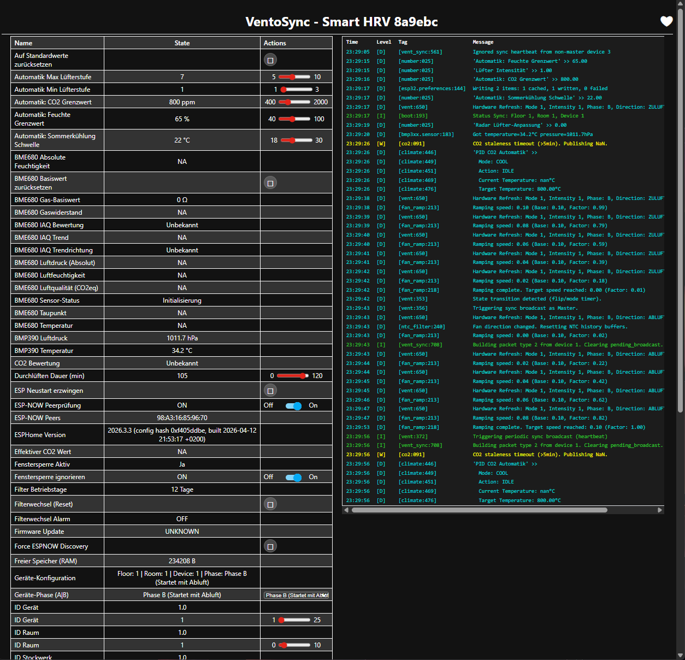
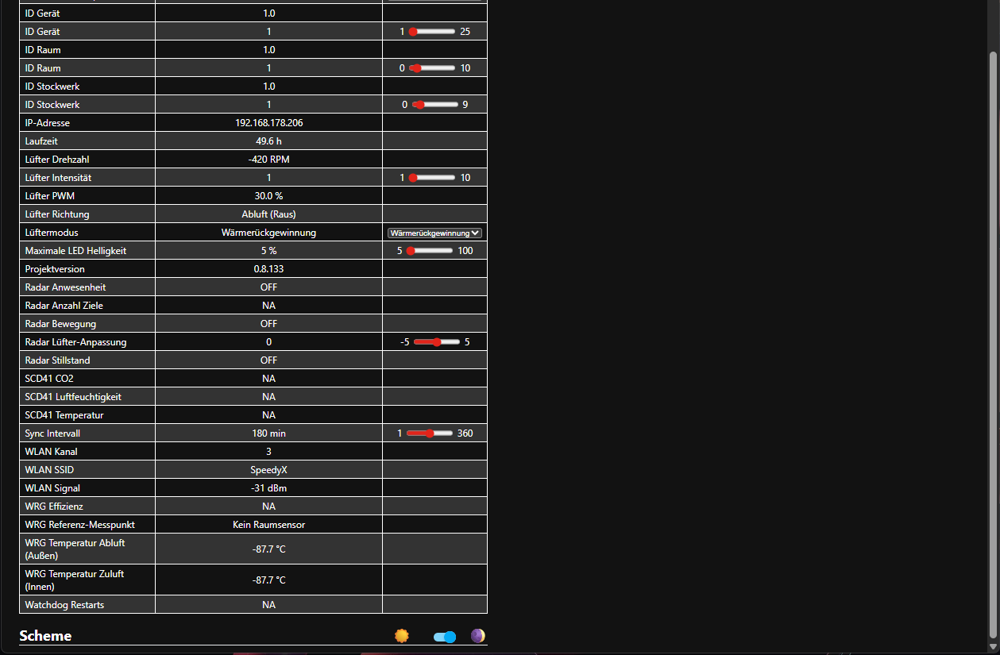
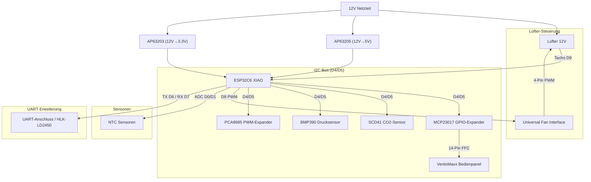

# 🌬️ VentoSync — Intelligente WRG-Wohnraumlüftungssteuerung auf Basis von ESPHome für VentoMaxx V-WRG Serie (ESP32-C6)

[](Readme.md)

## ⚖️ Disclaimer

> VentoSync ist ein unabhängiges Community-Projekt und steht in keiner Verbindung zur Ventomaxx GmbH.

## 🚀 Zusammenfassung & Überblick

Dieses Open-Source-Projekt bietet eine professionelle, dezentrale Lüftungssteuerung basierend auf ESPHome. Es ersetzt die Steuerung der VentoMaxx V-WRG Serie mittels einer eigens dafür entwickelten Platine (PCB) und steuert damit den reversierbaren 12V Lüfter zur Wärmerückgewinnung, überwacht optional die Luftqualität (CO2, Feuchte und Temperatur) mittels eines hochwertigen Sensirion SCD41 Sensors, berechnet die effektive Wärmerückgewinnung und nutzt das **originale VentoMaxx Bedienpanel** für eine nahtlose Integration, intuitive Steuerung. Darüber hinaus kann optional ein Radar-Sensor zur Anwesenheitserkennung integriert werden, der unsichtbar hinter der Blende des Lüftungsgerätes montiert werden kann.
Die Kommunikation zwischen den einzelnen Lüftungsgeräten erfolgt über das ESP-NOW Protokoll, sodass kein WLAN oder eine zentrale Steuereinheit erforderlich sind (die Kommunikation über die Stromleitungen, welche Ventomaxx nutzt, wird nicht verwendet).

> 💡 **Kompatibilität:** Die Steuerung funktioniert prinzipiell für jede dezentrale Wohnraumlüftung mit einem reversierbaren 12V Lüfter (3-PIN oder 4-PIN PWM). Sie wurde jedoch **speziell als Ersatz für die VentoMaxx V-WRG Serie** entwickelt. Die Hardware (PCB-Layout/Größe und Bedienpanel) ist damit explizit für die VentoMaxx V-WRG Serie optimiert und muss für andere Hersteller ggf. angepasst werden. Das PCB ist so konzipiert, dass es exakt in das Gehäuse der VentoMaxx V-WRG Serie passt und die vorhandenen Befestigungspunkte nutzt.
Achtung: Diese Lösung ist nicht kompatibel mit der VentoMaxx ZR-WRG Serie, da diese eine zentrale Steuereinheit nutzt!

[](https://esphome.io/)
[](https://www.home-assistant.io/)
[](https://esphome.io/components/esp32.html)


---

## 📑 Inhaltsverzeichnis

- [🚀 Zusammenfassung & Überblick](#🚀-zusammenfassung--überblick)
- [Motivation](#motivation)
- [🛠️ Maßgefertigte Leiterplatte (PCB)](#🛠️-maßgefertigte-leiterplatte-pcb)
- [🔄 Vergleich mit VentoMaxx](#🔄-vergleich-mit-ventomaxx-v-wrg)
- [✨ Leistungsmerkmale](#✨-leistungsmerkmale)
- [📡 ESP-NOW: Kabellose Autonomie](#📡-esp-now-kabellose-autonomie)
- [🖱️ Eigene Platine - PCB](#🖱️-eigene-platine---pcb)
- [🛠️ Hardware & Bill of Materials (BOM)](#🛠️-hardware--bill-of-materials-bom)
- [🔌 Pinbelegung & Verkabelung](#🔌-pinbelegung--verkabelung)
- [🛠️ Installation & Software](#🛠️-installation--software)
- [🎮 Bedienung & Steuerung](#🎮-bedienung--steuerung)
- [🧠 Wärmerückgewinnung - So funktioniert's](#🧠-wärmerückgewinnung---so-funktionierts)
- [🔧 Technische Details & Optimierungen](#🔧-technische-details--optimierungen)
- [📁 Projektstruktur](#📁-projektstruktur)
- [🏗️ Code-Architektur & Wartbarkeit](#🏗️-code-architektur--wartbarkeit)
- [🚀 Automatisierte Versionierung](#🚀-automatisierte-versionierung)
- [⚠️ Sicherheitshinweise](#⚠️-sicherheitshinweise)
- [⚖️ Rechtlicher Haftungsausschluss](#⚖️-rechtlicher-haftungsausschluss)
- [🔍 Troubleshooting](#🔍-troubleshooting)
- [📜 Lizenz](#📜-lizenz)

---

## Motivation

Ich habe vor vielen Jahren im Rahmen der Haussanierung die dezentrale Wohnraumlüftung V-WRG von Ventomaxx installiert (10 Geräte) und war damit auch sehr zufrieden. Allerdings hat mich die proprietäre Steuerung und die fehlende Integration in mein Smart Home System immer gestört. Daher habe ich mich entschlossen, eine eigene Platine (PCB) inkl. der Steuerungssoftware auf Basis von ESPHome zu entwickeln, da es keine fertige Lösung gab. Diese Lösung ist Open Source und soll anderen Nutzern helfen, die in der gleichen Situation wie ich sind.
Für die Steuerung der Lüftung auf Basis von CO2 nutze ich einen extrem hochwertigen und präzisen CO2-Sensor (Sensirion SCD41), der direkt in die Platine (per kleines Zusatz-PCB) integriert ist (Hinweis: Aktuell dient der BME680 als Fallback, da das SCD41-PCB noch in Fertigung ist). Dieser Sensor misst die echte CO2-Konzentration in der Luft und steuert die Lüftungsintensität entsprechend der Voreinstellungen (mittels einer modernen PID-Regelung). Sämtliche Code-Kommentare und die interne Dokumentation wurden zur besseren internationalen Wartbarkeit auf Englisch umgestellt, während das User-Interface weiterhin auf Deutsch bleibt.
Da die Lüftungsgeräte in den verschiedenen Räumen meistens eine sehr zentrale Position haben, nutze ich diese auch direkt zur Anwesenheitserkennung mittels Radar-Sensor, der unsichtbar hinter der Blende des Lüftungsgerätes versteckt montiert werden kann. Der Anwesenheitssensor wird für die Steuerung der Lüftungsintensität im Smart-Automatik Modus genutzt und kann darüber hinaus in Home Assistant für jegliche weitere Automatisierungen genutzt werden.
Der Funktionsumfang dieser Eigenentwicklung geht nach meinen Recherechen über alles hinaus, was aktuell am Markt der Lüftungsgeräte zu finden ist!

---

## 🛠️ Maßgefertigte Leiterplatte (PCB)

Das Herzstück des Projekts ist eine eigens entwickelte Platine, die exakt in das vorhandene Gehäuse der VentoMaxx-Geräte passt.


> [!TIP]
> Wenn du Interesse an einer Platine für deine eigenen Geräte hast, kannst du mich gerne unter **thomas@engeroff.net** kontaktieren. 
> Bitte beachte, dass ich noch nicht entschieden habe, ob ich die PCB-Produktionsdaten als Open Source zur Verfügung stellen werde.


---

## 🔄 Vergleich mit VentoMaxx V-WRG

Diese Lösung ist ein **Drop-in Replacement** für die [VentoMaxx V-WRG / WRG PLUS](https://www.ventomaxx.de/dezentrale-lueftung-produktuebersicht/aktive-luefter-mit-waermerueckgewinnung/) Steuerung — mechanisch kompatibel, funktional massiv erweitert:

| | VentoMaxx (Original) | ESPHome Smart WRG |
| :--- | :---: | :---: |
| Betriebsmodi | 3 | **5+** (inkl. Automatiken) |
| Sensorik | 0-1 (opt. VOC) | **6** (CO2, Temp, Feuchte, Druck, Radar, Tacho) |
| Lüfterregelung | 3 feste Stufen | **10 Stufen + stufenlos (PID)** |
| Smart Home | ❌ | ✅ Home Assistant (nativ) |
| Wartungsalarm | Timer-LED | ✅ Prädiktiv + Push |
| Synchronisation | Stromleitung | ✅ Kabellos (**ESP-NOW Protocol**) & Echtzeit-Sync |
| Updates | nur per Servicetechniker (muss eingeschickt werden) | ✅ Over-the-Air (OTA) |
| Versionierung | Manuell | ✅ Vollautomatisch (Patch-Level) |
| Erweiterbarkeit | ❌ | ✅ System kann mit zusätzlichen Sensoren und Aktoren oder individuellen Funktionen erweitert werden |
| Lizenz | Proprietär | ✅ Open Source (GPL v3) |

 **Den vollständigen Feature-für-Feature Vergleich mit allen technischen Details findest du in [📄 Comparison-VentoMaxx.md](documentation/Comparison-VentoMaxx.md).**

---

## ✨ Leistungsmerkmale

### ⚙️ Intelligente Betriebsmodi

Alle Geräte in einem Raum finden sich beim Start oder Raumwechsel vollautomatisch über eine **dynamische ESP-NOW Discovery** und kommunizieren anschließend effizient via Unicast.

- 🤖 **Smart-Automatik**: Vollautomatische Steuerung für maximalen Komfort und Effizienz. Standardbetrieb in Wärmerückgewinnung (Push-Pull) mit dynamischer Anpassung an CO2 und Luftfeuchtigkeit unter Einbezug von Wetterdaten.
Im Sommer wird die Querlüftung zur passiven nächtlichen Kühlung (wenn es außen kühler ist als innen) automatisch aktiviert. Dieser Modus ist der Standard im Alltag, um maximale Energieeffizienz und Luftqualität zu gewährleisten. In zukünftigen Versionen werde ich diesen Modus weiter optimieren, um den Komfort und die Effizienz weiter zu steigern.
- 🔄 **Effiziente Wärmerückgewinnung**: Zyklischer, bidirektionaler Betrieb (Push-Pull) zur Maximierung der Energieeffizienz. Dieser Modus lässt die CO2, Feuchte und Radar Anwesenheits Sensorik unberücksichtigt.
- 💨 **Querlüftung (Sommerbetrieb)**: Modus für permanenten Abluftstrom, ideal zur passiven Kühlung in Sommernächten. Flexibel konfigurierbar via Timer oder als Dauerbetrieb. Dieser Modus lässt die CO2, Feuchte und Radar Anwesenheits Sensorik unberücksichtigt.
- 🚀 **Stoßlüftung**: Intensivlüftung für schnellen Luftaustausch. Das Gerät lüftet für 15 Minuten mit der **manuell gewählten Intensität** und pausiert anschließend für 105 Minuten, um Feuchtigkeit effektiv abzuführen und den Keramikspeicher zu regenerieren. Danach wiederholt sich der Zyklus.

### 🛡️ Präzisions-Sensorik & Monitoring

- 🌡️ **Klimadatenerfassung**: Hochpräzise Messung von Temperatur und relativer Luftfeuchtigkeit mittels [Sensirion SCD41](https://sensirion.com/de/produkte/katalog/SCD41).
  - ✅ **Photoacoustic sensing** für präzise CO2-Messung (400-5000 ppm), Integrierte Temperatur- und Feuchtigkeitsmessung (SCD41), Dokumentation: `EasyEDA-Pro/components/SCD41-Sensirion.pdf`
  - ✅ **BME680 Optimierung**: Umstellung auf Standard-Plattform (ohne BSEC2) spart massiv Kompilierungszeit. IAQ wird nun über ein effizientes Template berechnet.
  - ⚠️ **Hinweis:** Da das SCD41-PCB noch in Fertigung ist, dient der **BME680** aktuell als Fallback (IAQ-Index). Der Code erkennt automatisch, ob der SCD41 vorhanden ist.
  - 💨 **Echte CO2-Messung**: Der SCD41 nutzt **photoacoustic sensing** zur direkten CO2-Messung (400-5000 ppm) statt berechneter Äquivalente - ideal für bedarfsgerechte Lüftungssteuerung.
  - 🏔️ **Luftdruckmessung & Hardware-Schutz via BMP390**: Der hochpräzise Barometer-Sensor [Bosch BMP390](https://www.bosch-sensortec.com/en/products/environmental-sensors/pressure-sensors/pressure-sensors-bmp390.html) liefert nicht nur lokale Wetterdaten und barometrische Kompensation für den SCD41, sondern fungiert auch als **Sicherheitswächter für das Traco-Netzteil**:
    - **Automatisches Derating-Management**: Überwachung der Innentemperatur im Gehäuse des Lüftungsgerätes zur Einhaltung der Traco-Spezifikationen.
    - **Not-Abschaltung**: Bei kritischen Temperaturen (>60°C) startet ein Sicherheits-Protokoll (Lüfterstopp und 60min Deep Sleep), um die Hardware vor Überhitzung zu schützen und eine entsprechende Warnung an Home Assistant zu senden.
- 📊 **Automatische Intensitätsregelung**: Das System kann die Lüfterleistung automatisch bei steigendem CO2-Gehalt oder Luftfeuchtigkeit für optimale Raumluftqualität erhöhen. Hierfür wird eine fortschrittliche PID-Regelung verwendet, welche die Lüfterleistung dynamisch an die gemessenen Werte anpasst. Die Regelung ist so optimiert, dass sie die Lüfterleistung so gering wie möglich hält, um den Energieverbrauch und die Geräuschentwicklung zu minimieren.
- 🚶 **Radar-basierte Anwesenheitserkennung (HLK-LD2450)**: Mittels eines mmWave-Radarsensors (integriert über den UART-Pin-Header) wird die Anwesenheit im Raum präzise erfasst. In den manuellen Modi (WRG, Durchlüften, Stoßlüftung) dient der Sensor als **dynamischer Boost/Dämpfer**. Über eine gleitende Bedarfssteuerung (Slider `-5` bis `+5`) kann die aktuell gewählte Lüfterstufe ideal angepasst werden (z.B. `+3` intensiviert die Lüftung im Büro bei Anwesenheit, `-2` senkt sie zur Lärmreduzierung im Schlafzimmer). Im Automatik-Modus wird die Präsenz zugunsten einer stabilen PID-Regelung ignoriert. Dieser Sensor wird natürlich auch Home Assistant zur Verfügung gestellt und kann für beliebige andere Automatisierungen genutzt werden.
- **💨 Fortgeschrittene Luftqualitäts-Logik**:
  - **Enthalpie-Abgleich / Absolute Feuchtigkeit**: Das System berechnet die absolute Luftfeuchtigkeit ($g/m^3$) mittels Magnus-Formel und vergleicht Innen- und Außenwerte. Im Automatik-Modus wird die Entfeuchtung nur aktiv, wenn die Außenluft tatsächlich trockener ist als die Innenluft. Dies verhindert den Eintrag von Feuchtigkeit bei Regen oder schwülem Sommerwetter. Details findest du in der [📄 Automatic-Mode-Logic.md](documentation/Automatic-Mode-Logic.md).
- 📊 **Echte VentoMaxx V-Kennlinie**: Basierend auf den physikalischen Parametern der Original-Hardware (50% PWM = Stopp-Zone), wurde die Kennlinie jedoch in den niedrigeren Stufen (Stufe 1-6) feiner abgestimmt, um akustisch noch dezenter zu bleiben.
- 🪟 **Fenstersperre (Window Guard)**: Automatischer raumweiter Lüftungsstopp bei offenen Fenstern.
  - ✅ **Smart Pause (5s Verzögerung)**: Die Sperre greift erst nach 5 Sekunden durchgehender Fenster-Öffnung, um kurzes Lüften/Nachschauen abzufedern. Alle VentoSync-Geräte im Raum stoppen sofort ihre Lüfter, um Energieverschwendung zu vermeiden.
  - ✅ **Automatisches Fortsetzen**: Das System behält seinen aktuellen Betriebsmodus (z.B. Automatik oder Manuell) bei und nimmt den Betrieb nahtlos wieder auf, sobald alle Fenster geschlossen sind.
  - ✅ **Visuelles Feedback (35s Limit)**: Ein markantes Pulsieren der Master-LED signalisiert den Zustand "Pause durch Fenster". Zur Vermeidung von Lichtstörungen nachts startet das Pulsieren nach 5 Sekunden und stoppt nach 35 Sekunden, während der Lüfter zum Schutz weiterhin gestoppt bleibt.
  - ✅ **HA Status-Entität**: Eine dedizierte Binär-Sensor-Entität (`binary_sensor.fenstersperre_aktiv`) bietet direkte Sichtbarkeit des Sperrstatus in Home Assistant.

#### **🏠 Home Assistant Konfiguration (Tutorial)**

> [!TIP]
> Eine Schritt-für-Schritt-Anleitung zur Integration mehrerer Fenstersensoren und zur Erstellung der benötigten Raum-Entitäten findest du in unserem **[Home Assistant Fenstersperre (Window Guard) Setup Guide](documentation/Window-Guard-HA-Setup-DE.md)**.
- 📈 **Phasen-Kontinuität**: Durch eine proportionale Skalierung des aktuellen Zyklusfortschritts an die neue Gesamtdauer setzt der Lüfter seinen Betrieb bei Intensitätsänderungen nahtlos fort.
- 🌊 **Sanftanlauf (Slew-Rate Limiter)**: Änderungen der Lüftergeschwindigkeit werden nun mit einer Rate von ca. 5 % pro Sekunde geglättet. Dies verhindert abrupte elektrische Lastsprünge und sorgt für einen hochwertigeren, leisen akustischen Übergang bei der Anpassung der Lüftungsstufen.
- **Virtuelle Drehzahlberechnung:** Intelligente virtuelle Drehzahlberechnung (4200 RPM @ 100%) als Fallback für den Standard-Lüfter ohne Tacho-Signal.
- 🔄 **Klartext-Richtungsanzeige**: Eine neue Sensor-Entität zeigt jederzeit die aktuelle Luftrichtung ("Zuluft (Rein)", "Abluft (Raus)" oder "Stillstand") an, was die Diagnose und Überwachung der Synchronisation erheblich vereinfacht.

- 🌴 **Urlaubsmodus (Vacation Mode)**: Energiesparmodus, der hauptsächlich bei längerer Abwesenheit genutzt wird. Er schaltet automatisch alle Geräte in einem Raum in die Stoßlüftung auf der niedrigsten Intensität (Stufe 1), um einen grundlegenden Luftaustausch bei minimalem Energieverbrauch sicherzustellen. Bei Deaktivierung wird der vorherige Systemzustand nahtlos wiederhergestellt. Dieser kann für alle Geräte gleichzeitig über einen Home Assistant Schalter-Helfer (Toggle Helper) aktiviert werden:
  - > Eine Schritt-für-Schritt-Anleitung zur Erstellung dieses Home Assistant Helfers findest du im **[Home Assistant Urlaubsmodus Setup Guide](documentation/Vacation-Mode-HA-Setup-DE.md)**.

- **Kindersicherung**: Die Kindersicherung sperrt das Gerät, sodass es nicht mehr über die Tasten am Gerät gesteuert werden kann. Dieser Modus ist primär über Home Assistant verfügbar.
  - 🛠️ **Konfigurierbar über HA-Entitäten** (sichtbar in der Sektion *Konfiguration* des Geräts):
    - `switch.kindersicherung` — Schalter zum Aktivieren oder Deaktivieren der Kindersicherung.
    - Wenn die Sperre aktiviert ist und eine Taste am Gerät gedrückt wird, blinken alle LEDs drei Mal auf.
    - Am Gerät selbst kann die Sperre durch **5-sekündiges Halten der Modus-Taste** aktiviert oder deaktiviert werden. Zur Bestätigung blinken alle LEDs zwei Mal.
    - Änderungen über Home Assistant sind jederzeit möglich und werden nicht durch die Kindersicherung blockiert.

### ⚡ Extrem niedriger Stromverbrauch

Das VentoMaxx System mit dieser ESPHome Steuerung arbeitet überragend effizient. Durch die Nutzung eines hochwertigen Traco-Netzteils und der präzisen PWM-Steuerung des ebm-papst Motors liegt die reine Wirkleistung (gemessen an 230V) in einem Bereich, der viele kommerzielle Anlagen deutlich unterbietet:

- **Stufe 1 (Grundlüftung):** ~2,7 - 2,9 Watt *(ca. 7,36 € / Jahr)*
- **Stufe 5 (Erhöhte Last):** ~3,2 - 3,7 Watt *(ca. 9,10 € / Jahr)*
- **Stufe 10 (Maximalleistung):** ~5,0 - 6,0 Watt *(ca. 15,75 € / Jahr)*

Selbst bei ganzjährigem 24/7-Dauerbetrieb auf der *absoluten Maximalstufe (10)* belaufen sich die nominellen Stromkosten (bei 0,30 €/kWh) auf lediglich rund 15 Euro im Jahr. Im meist genutzten Automatik-Modus (Werte pendeln nachts oder bei Abwesenheit auf Stufe 1 bis 3) liegen die realen Betriebskosten bei extrem sparsamen **ca. 7 bis 8,50 Euro pro Jahr** für die gesamte Einheit.

> **Hinweis**: Es handelt sich hierbei um keine 100% akkurate Labormessung. Ich habe diese Werte mittels eines Shelly 1PM mini ermittelt.

*Besonders bemerkenswert: In diese Messwerte ist der durchgängige Betrieb aller verbauten Komponenten eingeflossen – inklusive der ESP32-Steuerung (WLAN/ESP-NOW), der Klima- und CO2-Sensoren sowie dem kontinuierlich messenden mmWave-Radar-Anwesenheitssensor!*

### 🖥️ Bedienung am Lüftungsgerät

Um ein optimales Bedienerlebnis zu gewährleisten, wird das originale Bedienpanel des VentoMaxx V-WRG-1 beibehalten. Die Funktionalität wurde so weit wie möglich identisch zum Original umgesetzt, um eine intuitive Bedienung zu ermöglichen.


- 🚥 **Original VentoMaxx Panel**: Nutzung des originalen Bedienfelds mit 9 LEDs und 3 Tastern mit überwiegend identischer Funktionalität bzw. Bedienung wie beim Original.
- 🔘 **Intuitive Steuerung**:
  - **ON / OFF**: System Ein/Aus/Reset.
    Kurzes Drücken --> schaltet das Gerät ein.
    5sec gedrückt halten --> schaltet das Gerät aus.
    10sec gedrückt halten --> schaltet das Gerät aus und startet das System neu (Reboot).
  - **Modus**: Kurzes Drücken zykliert durch die Programme: **Automatik → WRG → Durchlüften → Stoßlüftung → Aus**.
  - **Stufe +**: 10 Geschwindigkeitsstufen (zyklisch, angezeigt über 5 LEDs mit halber/voller Helligkeit). Die originale Ventomaxx Steuerung bietet hier nur 5 Stufen. Taste gedrückt halten zykliert durch die Lüftungsstufen.
- 🔆 **LED Feedback**: Anzeige von Modus, aktueller Lüfterstufe (1-10) und Status.
  - ✨ **Gruppen-Synchronisierung**: Alle Displays in einer Lüftungsgruppe synchronisieren sich in Echtzeit. Ändert Gerät A den Modus oder die Stufe, wachen die LEDs aller Partner-Geräte (Peers) im Raum sofort auf, um den neuen Status für 30 Sekunden anzuzeigen (Wake-up Effekt).
  - **Diagnose-Blinkcodes (Master LED)**: Die mittlere LED (Master) signalisiert Störungen über ein Blink-Muster (Pulse):
    - **2x Blinken**: Synchronisierungs-Fehler zwischen den Lüftern (Raumgruppe). Die Geräte können sich nicht mehr untereinander abstimmen.
    - **3x Blinken**: Die Verbindung zum WLAN-Router ist unterbrochen. Die App-Steuerung ist aktuell nicht möglich.
    - **4x Blinken**: Hitzewarnung (50-60°C). Die Temperatur im Gehäuse des Lüftungsgerätes ist zu warm (z.B. durch direkte Sonneneinstrahlung oder einer Fehlfunktion). Die Anlage läuft noch, sollte aber geprüft werden. Bei über 60°C schaltet das Gerät automatisch ab.
- Die detaillierte Beschreibung der Bedienung und Steuerung findest du unter [Bedienung](#-bedienung--steuerung).

### 🏠 Integration

**Volle Home Assistant Integration**: Native API-Unterstützung für nahtloses Monitoring, Steuerung und Automatisierung über dein Smart Home System. Alle Funktionalitäten des Geräts sind über Home Assistant steuerbar und auslesbar.

**Lokales Web-Dashboard (`wrg_dashboard`)**: Ein asynchroner Webserver direkt auf dem ESP32 bietet eine **Premium, responsive UI/UX** basierend auf **Tailwind CSS**.
- **Modernes Design**: High-End Dark-Mode Interface, voll responsiv für Desktop & Mobile.
- **Echtzeit-Visualisierung**: Integriertes **Chart.js** für flüssige Graphen von CO2, Feuchte, Temp und RPM.
- **Einfache Konfiguration**: Dedizierte Sektionen für die schnelle Vor-Ort-Konfiguration von Geräte-ID, Floor ID, Room ID und Phase.
- **Diagnose-Tools**: Live-Überwachung aller Sensordaten als Kacheln mit Tagesverlaufsgraphen.
- **Autarker Betrieb**: Änderung sämtlicher Anlagen-Einstellungen auch ohne Home Assistant möglich (dennoch empfohlen). Rufe einfach **`http://<deine-IP-Adresse>/ui`** (oder z.B. `http://esptest.local/ui`) im Webbrowser auf. *(Hinweis: Die Root-URL `/` zeigt weiterhin das Standard-ESPHome-UI an)*

> [!IMPORTANT]
> **Hybrid-Offline-Betrieb**: Während die gesamte Kernlogik und Datenverarbeitung zu 100 % lokal auf dem ESP32-C6 läuft (auch ohne Internet), lädt das lokale Web-Dashboard aktuell **Tailwind CSS** und **Chart.js** über ein externes CDN (`https://cdn.tailwindcss.com`...). Das bedeutet, dass eine Internetverbindung erforderlich ist, um das Styling und die Graphen des Dashboards korrekt anzuzeigen. Lokale Assets (wie die Webfont) sind zwar vorbereitet, werden aber aktuell nicht genutzt, um den Speicherverbrauch (Flash) minimal zu halten.

#### WRG Dashboard - Lokales Web-Dashboard


*WRG-Dashboard 1: Lokales Web-Dashboard mit wichtigsten Einstellungen und übersichtlicher Darstellung der wichtigsten Daten*


*WRG-Dashboard 2: Live-Ansicht der verbundenen Geräte und aller Sensordaten im lokalen Web-Dashboard*

#### Standard ESPHome Dashboard


*Standard Dashboard: Lokales Web-Dashboard mit allen Entitäten und live Logs*


*Standard Dashboard: Lokales Web-Dashboard mit allen Entitäten und live Logs (Fortsetzung)*

**📡 ESP-NOW Visualisierung**: Das lokale Web-Dashboard bietet eine Live-Ansicht aller via ESP-NOW verbundenen Geräte. Die Kachel "Verbundene Geräte (ESP-NOW)" visualisiert Node-ID, aktuellen Betriebsmodus, Drehzahl und Luft-Richtung (Phase) aller aktiven Peers in Echtzeit.

## 📡 ESP-NOW: Kabellose Autonomie

Die Geräte kommunizieren über die [ESPHome ESP-NOW Komponente](https://esphome.io/components/espnow.html). **ESP-NOW** ist ein von Espressif entwickeltes, verbindungsloses Protokoll, das eine direkte Kommunikation zwischen ESP32-Geräten ohne Umweg über einen WLAN-Router ermöglicht.

### Vorteile im Überblick

- 🌐 **WLAN-Unabhängigkeit**: Die Geräte benötigen keinen WLAN-Router (Access Point) für die Synchronisation. Die Kommunikation erfolgt direkt auf der MAC-Ebene (2,4 GHz Radio). Fällt das lokale WLAN aus, arbeitet die Lüftungsgruppe ungestört weiter.
- 🛡️ **Hohe Zuverlässigkeit**: Durch die direkte Punkt-zu-Punkt-Kommunikation ist das System immun gegen Überlastungen oder Störungen im herkömmlichen WLAN-Netzwerk.
- ⚡ **Extrem geringe Latenz**: Da keine Verbindung aufgebaut oder verwaltet werden muss (handshake-frei nach Discovery), werden Synchronisationsbefehle nahezu verzögerungsfrei übertragen. Dies ist entscheidend für den exakten Richtungswechsel synchronisierter Lüfterpaare.
- 🔌 **Keine Steuerleitungen**: Es müssen keine Datenkabel durch Wände gezogen werden. Die Synchronisation erfolgt "Out-of-the-box" über Funk.
- 📡 **Dynamische Discovery & Persistence**: Geräte im gleichen Raum finden sich beim Booten oder bei Konfigurationsänderungen automatisch über einen Discovery-Broadcast. Sobald ein Matching (gleiche Floor/Room ID) stattfindet, werden die MAC-Adressen der Peers dauerhaft im NVS (Flash) gespeichert.
- ⚙️ **Effiziente Unicast-Kommunikation**: Nach der initialen Entdeckung erfolgt die eigentliche Datenübertragung (PID-Demand, Status, Sync) mittels gezielter Unicast-Pakete an die bekannten Peers. Dies reduziert das Grundrauschen im 2,4 GHz Band massiv und erhöht die Stabilität.
- ⚙️ **Globale Konfigurations-Synchronisation**: Änderungen an Einstellungen (z. B. CO2-Grenzwerte, Timer, Automatik-Modi) an einem Gerät via Home Assistant oder Bedienpanel werden in Echtzeit drahtlos an alle anderen synchronisierten Peers gespiegelt.

#### Discovery-Ablauf

1. **Broadcast**: Ein Gerät sendet beim Start oder Raumwechsel ein `ROOM_DISC` Paket an alle (FF:FF:FF:FF:FF:FF).
2. **Matching**: Empfänger prüfen, ob Floor- und Room-ID mit den eigenen übereinstimmen.
3. **Handshake**: Bei Übereinstimmung wird der Absender als Peer gespeichert und eine Bestätigung (`ROOM_CONF`) direkt (Unicast) zurückgeschickt.
4. **Persistence**: Die Liste der Peers übersteht Neustarts und sorgt für sofortige Einsatzbereitschaft nach dem Bootvorgang.

- 🔒 **Protocol v4 & Validierung**: Einführung eines dedizierten Magic Headers (`0x42`) und strenger Versionsprüfung zur Vermeidung von Fehlkommunikation zwischen verschiedenen Firmware-Ständen.

- ⚙️ **Echtzeit-Einstellungen-Mirroring**: Änderungen an Parametern (CO2-Grenzwerte, Fan-Levels, Timer) werden mittels ESP-NOW Unicast sofort an alle Partner-Geräte in der Raumgruppe übertragen, um ein einheitliches Regelungsverhalten sicherzustellen (Loop-Prevention inklusive).

- 📡 **Optimierte Signalstärke**: Um maximale Zuverlässigkeit für WLAN und ESP-NOW-Kommunikation zu gewährleisten — selbst bei Installationen weiter entfernt vom Router, hinter Wänden oder anderen Hindernissen — ist eine externe Antenne über einen U.FL-Stecker mit dem ESP32-C6 verbunden und der ESP ist so konfiguriert, dass er die externe Antenne anstelle der internen PCB-Antenne nutzt.

> Weitere Informationen zur ESP-NOW Kommunikation findest du in der [offiziellen ESPHome Dokumentation](https://esphome.io/components/espnow.html).


---

### 🗺️ Roadmap & Zukünftige Erweiterungen

Die folgenden weiteren "Advanced Automation"-Funktionen sind in Vorbereitung:

- **Intuitive Gruppensteuerung**:
  - Durch das "Group-Controller" Konzept via ESP-NOW können mehrere Geräte in einem Raum als eine einzige visuelle Einheit im Home Assistant Dashboard (z.B. mittels Mushroom Cards) abgebildet werden. Dies reduziert den WLAN-Traffic, erhöht die Stabilität und macht die Bedienung extrem einfach (hoher WAF).
  - *Details, Konzept und YAML-Beispiele für ESPHome und das HA Dashboard findest du im Ordner [ha_integration_example](ha_integration_example/).*

- **🌙 Intelligenter Nachtmodus**:
  - Zeitgesteuerte Drosselung der Lüfterleistung zur Geräuschminimierung in Ruhephasen.
  - **Lichtsensor-Integration**: Automatische Aktivierung eines "Whisper-Quiet" Profils bei Dunkelheit via Hardware-Twilight-Sensor (LDR/BH1750 Support geplant).
  - Einbeziehung der Anwesenheitserkennung (Radar-Sensor).
  - Einbeziehung der CO2-Werte zur Steuerung.
  - Lokal und remote aktivierbar.

- **🏠 Außer-Haus-Modus (Safety Dehumidification)**:
  - Automatisierter Schutzmodus für Abwesenheit (Urlaub).
  - Das System bleibt "Aus", überwacht aber die Luftfeuchtigkeit. Bei Überschreitung eines fixen Schwellenwerts (z. B. 60 %) startet die Lüftung auf Stufe 1 zur Schimmelprävention.

- **🌡️ Überwachungs-Modus (Sensor-Only)**:
  - Modus, in dem der Lüfter steht, aber alle Sensoren (CO2, Temp, Radar) und das Web-Dashboard voll aktiv bleiben (ohne Light Sleep), um lückenlose Messdaten in Home Assistant zu gewährleisten.

- **⏲️ Zeitgesteuertes Durchlüften**:
  - Über das Dashboard/App aktivierbarer manueller Zuluft- oder Abluftbetrieb mit integriertem Timer für gezielte Extraktion (z.B. nach dem Kochen), danach wechel zurück in den gewünschten Modus.

- **❄️ Frostschutz-Automatik**:
  - Intelligente Erkennung von drohendem Frost am Keramikspeicher bei extremen Außentemperaturen. Automatische Anpassung der Zykluszeiten oder kurzes Deaktivieren der Zuluft zur Regeneration des Speichers. Dafür kann der äußere NTC-Sensor genutzt werden.

- **📅 Autarker Wochenzeitplan**:
  - Native Implementierung von Zeitplänen direkt auf dem ESP32 zur Sicherstellung der Komfort-Funktion auch bei Ausfall der zentralen Smart-Home-Steuerung. Unabhängig davon können über Home Assistant Zeitpläne einfach konfiguriert werden. Wenn dieses Feature implementiert wird, muss sichergestellt werden, dass die Zeitpläne nicht mit Zeitplänen aus Home Assistant kollidieren.

- **🔔 Erweiterte Alarm-Logik**:
  - Implementierung von visuellen (Master-LED) und digitalen (Push) Alarmierungen für kritische Zustände wie extreme Luftfeuchtigkeit, Frostgefahr oder kritische CO2-Werte.

- **Closed-Loop Drehzahlüberwachung**:
  - Kontinuierliches Monitoring der Lüfterdrehzahl via Tacho-Signal für konstanten Volumenstrom und Fehlererkennung (nur bei 4-PIN PWM Lüfter).

- **KI-gestützte Lüftungssteuerung**:
  - Proaktive KI-gestützte Lüftungssteuerung basierend auf historischen Daten und externen Prognosen (Wetter, CO2, Feuchte). Siehe [📄 KI-gestützte Lüftungssteuerung](documentation/KI-gestützte-Lüftungssteuerung.md) für Details.

## 🖱️ Eigene Platine - PCB

Eine dedizierte Platine (PCB), die alle benötigten Komponenten (XIAO, Traco, Transistoren, Anschlüsse für Sensoren) kompakt vereint, wurde bereits von mir entwickelt, durch JLCPCB gefertigt und befindet sich aktuell in der Testphase.
Besonderen Wert habe ich dabei auf Sicherheit und Qualität gelegt, da die Lüftungen in der Regel 24*7 daherhaft laufen. Auch wenn die Leistung minimal ist, hat die Sicherheit hier höchste Priorität.
Die Komponenten wurden des weiteren so gewählt, dass eine Laufzeit >10 Jahre bedenkenlos möglich ist.
Um zusätzliche Erweiterungen möglich zu machen, habe ich einen zusätzlichen UART-PIN-Ansschluss (H4 --> wird bereits für den Radar-Sensor genutzt), einen zusätzlichen I²C-Ansschluss (H3 --> frei) und zusätzliche GPIO-PIN-Anschlüsse (H1 --> frei: 6 GPIOs, 3V3 und GND) vorgesehen.


Zusätzlich habe ich eine SCD41-PCB entwickelt, die den SCD41 CO2-Sensor perfekt positioniert für die existierende Lüftungsöffnung des Ventomaxx Gehäuses. Im Gegensatz zu vielen Billig-China-SCD41 Boards, sind hier auch beide Kondensatoren ensprechend den Herstellervorgaben montiert, ein Schlitz dient der termischen Trennung des SCD41-Sensors vom sonstigen Board und auch die Kupfer Planes wurden im unteren Bereich ausgespart, um die termische Trennung weiter zu maximieren. Die PINs haben 1,25mm Pitch und sind so positioniert, dass der SCD41 CO2-Sensor perfekt in die Lüftungsöffnung passt. Dieses PCB befindet sich aktuell noch in der Fertigung bei JLCPCB.


---

## 🛠️ Hardware & Bill of Materials (BOM)

### Zentrale Einheit

| Komponente | Beschreibung |
| :--- | :--- |
| **MCU** | [Seeed Studio XIAO ESP32C6](https://esphome.io/components/esp32.html) (RISC-V, WiFi 6, Zigbee/Matter ready) |
| **Power** | TRACO POWER TMPS 10-112 (230V AC zu 12V DC, 10W) <br>– **Premium-Wahl:** Zertifiziert nach **EN 60335-1** (Haushaltsgeräte) und **EN 62368-1** (IT/Industrie). Die Wahl fiel auf dieses High-End-Modul von Traco Power (Schweiz), da es durch seine doppelte Isolierung (**Schutzklasse II**) und hohe Isolationsspannung (4kV) maximale Sicherheit bietet. Im Gegensatz zu günstigen Netzteilen erfüllt es die strengen EMV-Anforderungen der **Klasse B** ohne externe Filter und ist für den wartungsfreien Dauerbetrieb (>10 Jahre) in Wohnräumen ausgelegt. |
| **DC/DC** | Diodes Inc. AP63205 (12V->5V) & AP63203 (12V->3.3V) <br>– **Eigenentwicklung:** Diese zwei professionellen Abwärtswandler (Buck Converter) wurden für eine hocheffiziente Energiewandlung (bis zu 94% Effizienz) direkt auf dem PCB implementiert. Sie gewährleisten eine extrem stabile Spannungsversorgung für MCU und Sensorik bei minimaler Wärmeentwicklung – ein wesentlicher Faktor für die Langzeitstabilität des Systems im Dauerbetrieb. |

### Aktoren & Sensoren

| Komponente | Beschreibung | Dokumentation |
| :--- | :--- | :--- |
| **Lüfter** | Original Ventomaxx V-WRG (EBM-PAPST 4412 F/2 GLL) 3-Pin PWM oder AxiRev (4-Pin PWM) | [Fan Component](https://esphome.io/components/fan/speed.html) |
| **SCD41** | Sensirion CO2-Sensor (Echtes CO2 400-5000ppm, Temp, Hum) via I²C | [SCD4X Component](https://esphome.io/components/sensor/scd4x.html) |
| **BMP390** | Bosch Hochpräziser Barometrischer Drucksensor via I²C | [BMP3XX Component](https://esphome.io/components/sensor/bmp3xx.html) |
| **BME680** | Bosch Gas Sensor (Fallback für IAQ/Luftqualität) via I²C | [BME680 Component](https://esphome.io/components/sensor/bme680.html) |
| **NTCs** | 2x NTC 10k (Zuluft/Abluft) für Effizienzmessung | [NTC Sensor](https://esphome.io/components/sensor/ntc.html) |
| **I/O Expander** | **MCP23017** (I2C) für VentoMaxx Panel | [MCP23017](https://esphome.io/components/mcp23017.html) |
| **LED Driver** | **PCA9685** (I2C) für dimmbare LEDs im VentoMaxx Panel | [PCA9685](https://esphome.io/components/output/pca9685.html) |

 
*Lüfter-Anschlussbelegung mit Originalkabel.*

Die vollständige Stückliste (Bill of Materials) befindet sich im Unterordner [EasyEDA-Pro](EasyEDA-Pro) in der [BOM](EasyEDA-Pro/BOM_ESPHome%20VentoSync%20PWM_PCB_ESPHome-WRG_ESP32_PWM_2026-03-01.csv) .

### 🖱️ User Interface

| Komponente | Beschreibung | Dokumentation |
| :--- | :--- | :--- |
| **VentoMaxx Panel** | Original Panel (14-Pin FFC). 3 Taster, 9 LEDs (via PCA9685 dimmbar). | Die PIN-Belegung des Original-Panels wurde von mir vollständig durchgemessen und dokumentiert, um die exakte Ansteuerung über das eigene PCB und die Port-Expander (MCP23017/PCA9685) zu ermöglichen. |


---

## 🔌 Pinbelegung & Verkabelung

Das System basiert auf dem [Seeed XIAO ESP32C6](https://esphome.io/components/esp32.html).

⚠️ **WICHTIG:** Der Lüfter läuft mit 12V, die Logik mit 3.3V oder auch 5V. Entsprechende Spannungsteiler und Schutzbeschaltungen sind vorhanden.

| XIAO Pin | GPIO | Funktion | Bemerkung |
| :--- | :--- | :--- | :--- |
| **D0** | GPIO0 | [ADC Input](https://esphome.io/components/sensor/adc.html) | NTC Außen (Abluft) |
| **D1** | GPIO1 | [ADC Input](https://esphome.io/components/sensor/adc.html) | NTC Innen (Zuluft) |
| **D2** | GPIO2 | Output | **MCP23017 Reset** |
| **D3** | GPIO21 | Output | **PCA9685 OE** (Output Enable) |
| **D4** | GPIO22 | [I2C SDA](https://esphome.io/components/i2c.html) | SCD41, BMP390, PCA9685, MCP23017 |
| **D5** | GPIO23 | [I2C SCL](https://esphome.io/components/i2c.html) | SCD41, BMP390, PCA9685, MCP23017 |
| **D6** | GPIO16 | [UART RX](https://esphome.io/components/uart.html) | **HLK-LD2450 Radar RX** |
| **D7** | GPIO17 | [UART TX](https://esphome.io/components/uart.html) | **HLK-LD2450 Radar TX** |
| **D8** | GPIO19 | [PWM Output](https://esphome.io/components/output/ledc.html) | **Fan PWM Primary** |
| **D9** | GPIO20 | [Pulse Counter](https://esphome.io/components/sensor/pulse_counter.html) | **Fan Tacho** (Pullup via 3V3) |
| **D10** | GPIO18 | - | Unbelegt (NC) |

### 📊 Schematische Darstellung (Konzept)



---

## 🛠️ Installation & Software

### 🚀 Schritt-für-Schritt Inbetriebnahme

1. **Firmware vorbereiten**: Kompiliere die Firmware mit deinen eigenen WLAN-Zugangsdaten (via `secrets.yaml`).
2. **Initiales Flashen**: Flashe den ESP (XIAO) initial per USB mit der VentoSync Firmware über das ESPHome Dashboard.
3. **Hardware-Einbau**:
   > [!CAUTION]
   > **LEBENSGEFAHR:** Der Einbau des PCB und ESP in das VentoMaxx Lüftungsgerät erfordert Arbeiten an der **230V Netzspannung**. Dieser Schritt darf **ausnahmslos nur von einer Elektrofachkraft** durchgeführt werden.
   Baue das PCB und den ESP gemäß Schaltplan in das Gehäuse des Lüftungsgerätes ein.
4. **Netzwerk-Konfiguration**: Hinterlege die IP-Adresse im Router als **feste IP (Static IP)**, um eine dauerhaft stabile Erreichbarkeit zu garantieren.
5. **Home Assistant Integration**: Füge das Gerät in Home Assistant unter der ESPHome-Integration hinzu (es wird i. d. R. sofort automatisch erkannt).
6. **Einstellungen anpassen**: Passe nach der Integration die folgenden Basis-Einstellungen in der Home Assistant UI oder dem lokalen Dashboard an:
   - **Device ID** (Eindeutige Nummer des Geräts)
   - **Room ID** (Geräte mit gleicher Room ID synchronisieren sich)
   - **Floor ID**
7. **Alternative - Web Dashboard**: Alternativ können (auch ohne Home Assistant) alle Settings über das lokale Web-Dashboard konfiguriert werden unter `http://<device-ip>` oder `http://<device-ip>/ui`.
8. **Spaß haben**: Genieße dein smartes, energieeffizientes Lüftungssystem!

### Voraussetzungen

- Installiertes ESPHome Dashboard (z.B. als Home Assistant Add-on)
- Grundkenntnisse in YAML

### Konfiguration

1. Kopiere den Inhalt von `ventosync.yaml` in deine ESPHome Instanz.
2. Erstelle eine `secrets.yaml` mit deinen WLAN-Daten:

```yaml
wifi_ssid: "DeinWLAN"
wifi_password: "DeinPasswort"
ap_password: "FallbackPasswort"
ota_password: "OTAPasswort"
```

### Kalibrierung der NTCs

Die Konfiguration nutzt NTCs mit einem B-Wert von 3435. Falls du andere Sensoren nutzt, passe den `b_constant` Wert im YAML Code an.


---

## 🎮 Bedienung & Steuerung

Die Steuerung erfolgt intuitiv über das integrierte Bedienpanel oder vollautomatisch via Home Assistant.

### 🖐️ Bedienpanel (VentoMaxx Style)

Das Panel verfügt über 3 Taster und 9 Status-LEDs.

#### Tastenbelegung

| Taste | Funktion | Bedienung |
| :--- | :--- | :--- |
| **Power (I/O)** | System Ein/Aus | • Kurz drücken: Ein / Aus (Toggle)<br>• Lang (>5s): Aus (Sicherheits-Aus)<br>• Sehr lang (>10s): Geräte-Neustart (Reboot) |
| **Modus (M)** | Betriebsmodus | • Kurz drücken: Zykliert durch Automatik → WRG → Durchlüften → Stoßlüftung → Aus |
| **Stufe (+)** | Lüfterstärke | • Kurz drücken: Zykliert durch 10 Geschwindigkeitsstufen (angezeigt über 5 LEDs).<br>• **Gedrückt halten**: Automatisches Auf- und Ab-Durchlaufen der Stufen (1 Stufe pro Sekunde) bis zum Loslassen. |

#### Status-LEDs (Feedback)

| LED | Anzahl | Position | Verhalten |
| :--- | :---: | :--- | :--- |
| **Power** | 🟢 1x | LED Panel | Leuchtet hell im Betrieb. Dimmt nach 60s @ `ui_active_timeout` (Standard: 60s) auf 20% Helligkeit ab (statt ganz auszugehen). |
| **Master** | 🟢 1x | LED Panel | Leuchtet bei aktivem UI (Normalbetrieb). Signalisiert Störungen durch Blink-Muster: **2x**: Raum-Synchronisierung fehlgeschlagen | **3x**: WLAN-Verlust | **4x**: Hitze-Warnung (50-60°C). Bei über 60°C schaltet das Gerät automatisch ab. |
| **Modus L** (`LED_WRG`) | 🟢 1x | Links | **Pulsiert** im Smart-Automatik Modus. Dauerhaft an bei WRG oder Durchlüften. |
| **Modus R** (`LED_VEN`) | 🟢 1x | Rechts | Dauerhaft an bei Stoßlüftung oder Durchlüften. |
| **Intensität** | 🟢 5x | LED Panel | Zeigt aktuelle Lüfterstufe 1–10 (halbe/volle Helligkeit für 10 Stufen über 5 LEDs). Nur bei aktivem UI sichtbar. |

**Modus-LED Zuordnung (bei aktivem UI):**

| Modus | `LED_WRG` (links) | `LED_VEN` (rechts) |
| :--- | :---: | :---: |
| **Automatik (Standard)** | 🔵 pulsiert | ⚫ |
| Wärmerückgewinnung (Eco) | 🟢 | ⚫ |
| Stoßlüftung | ⚫ | 🟢 |
| Durchlüften (Sommer) | 🟢 | 🟢 |
| Aus / System OFF | ⚫ | ⚫ |

> 💡 **60 Sekunden Auto-Dimming:** Alle Status-LEDs (Modus, Intensität, Master) erlöschen 60 Sekunden (konfigurierbar) nach dem letzten Tastendruck sanft. Die **Power-LED** bleibt dabei auf 20% gedimmt an. Bei jedem Tastendruck werden alle LEDs wieder aktiviert. Ausnahme: Die **Master-LED signalisiert Fehlerzustände weiter**, auch nach dem Timeout.

---

### 🔄 Detaillierte Betriebsmodi (Programme)

Über die **Modus-Taste (M)** zykliert das Gerät durch die Programme. Beim **Einschalten** ist **Modus 1 (Smart-Automatik)** aktiv.

> 💡 **Tipp:** Die Reihenfolge beim Tastendruck ist: **Automatik → WRG → Durchlüften → Stoßlüftung → Aus → Automatik...**

---

#### 1. 🤖 Smart-Automatik *(Standard / Empfohlen)* — `LED_WRG` 🟢 (pulsiert langsam)

**Dieser Modus ist der Standard beim Einschalten** und übernimmt vollautomatisch alle Steuerungsaufgaben. Die Lüftungsanlage regelt sich eigenständig basierend auf Umgebungsdaten und erfordert nach initialer HA-Konfiguration keinerlei manuelle Eingriffe ("Set and Forget").

**Aktive Smart-Features:**

| Feature | Sensor(en) | Schwellenwert |
| :--- | :--- | :--- |
| ✅ **CO2-Regelung (PID)** | SCD41 (`sensor.scd41_co2`) | `number.auto_co2_threshold` |
| ✅ **Feuchte-Management (PID)** | SCD41 (`sensor.scd41_humidity`) + HA `outdoor_humidity` | Über Außenfeuchte |
| ✅ **Sommer-Kühlfunktion** | NTC-Sensoren + ESP-NOW Gruppentemperatur | 22°C Innentemperatur |

**Logik im Detail:**

- **Grundbetrieb:** Wärmerückgewinnung (`MODE_ECO_RECOVERY`) auf Mindestlüfterstufe (`co2_min_fan_level`, Standard: 2). Die Wechselintervalle (Zyklusdauer) passen sich dabei dynamisch der aktuellen Lüfterstufe an (sanfte 70 Sekunden auf Stufe 1 bis schnelle 50 Sekunden auf Stufe 10) inkl. synchronisiertem NTC-Zeitfenster.
- **Adaptive Automatik (CO2-Priorisierung):** CO2 hat immer Vorrang. Steigt der CO2-Wert über den HA-Grenzwert, regelt ein PID-Regler die Lüfterleistung **exklusiv** und lautlos hoch — die Luftfeuchtigkeit wird während dieser Zeit ignoriert. Ein konfigurierbarer Min-/Max-Level (`automatik_min_fan_level`) begrenzt das Anpassungsfenster.
- **💧 Feuchtigkeitsmanagement:** Erst wenn der CO2-Bedarf gedeckt ist (Wert unter Grenzwert), übernimmt die Feuchtigkeits-Regelung. Steigt die Luftfeuchtigkeit über das Limit (Standard 60%), erhöht der separate PID-Regler (`pid_humidity`) die Leistung (Schimmelschutz). Eine intelligente Hysterese verhindert ein Hin- und Her-Schalten zwischen CO2- und Feuchtigkeitssteuerung. **Outdoor Check:** Es wird nur entfeuchtet, wenn die Außenluft trockener ist als die Innenluft (`out_hum < in_hum`).
- **Sommer-Kühlung:** Bei Innentemperatur > 22°C und kühlerem Außenbereich wechselt das System automatisch in `Durchlüften`. Sobald es außen wieder wärmer wird, kehrt es zu WRG zurück.
- **Anwesenheit (Manuelle Modi):** In den Modi WRG, Durchlüften und Stoßlüftung wird die Lüfterstärke bei erkannter Präsenz dynamisch angepasst (Slider `-5` bis `+5`). Dies erlaubt einen bedarfsgerechten "Präsenz-Boost" ohne die Automatik-Regelung zu beeinflussen.
- **🌱 Energiespar-Modus (Light Sleep):** Wenn das System ausgeschaltet wird (Modus `Aus`), wechselt der ESP32-C6 in einen stromsparenden Light Sleep. Dabei wird das WLAN deaktiviert und der LED-Treiber (PCA9685) via Hardware-Pin komplett abgeschaltet. Das Gerät bleibt über den physischen Power-Button jederzeit weckbar. Beim Aufwecken synchronisiert es sich automatisch direkt mit dem aktuellen Status der restlichen Lüftungsgruppe.
- **Gruppenlogik:** PID-Demand und Temperaturen werden sekündlich via ESP-NOW Unicast geteilt — alle entdeckten Geräte im Raum laufen synchron (die Lüfter skalieren identisch auf den höchsten Bedarf im Raum).

> **⚙️ Voraussetzung für das Feuchte-Management: `sensor.outdoor_humidity` in Home Assistant**
>
> Der ESPHome-Code erwartet die Entity-ID `sensor.outdoor_humidity` (in `sensors_climate.yaml`). Es gibt zwei Wege:
> **Option A (Wetterdienst):** Erstelle einen Template-Sensor basierend auf deiner Wetter-Integration (z.B. OpenWeatherMap).
> **Option B (Lokaler Sensor):** Erstelle einen Template-Sensor (Alias) oder passe die Entity-ID in der YAML an.
> *Ohne diesen Sensor funktioniert die Entfeuchtung trotzdem, der Outdoor-Check wird dann einfach übersprungen.*
Details siehe [Feuchte-Management-HA-Sensor.md](documentation/Feuchte-Management-HA-Sensor.md)

---

#### 2. ❄️ Wärmerückgewinnung (Eco Recovery) — `LED_WRG` 🟢

- **HA Entität:** `select.modus_lueftungsanlage` → `Eco Recovery`
- **Funktion:** Manueller WRG-Betrieb ohne die Smart-Automatik-Features. Die Luftrichtung wechselt zyklisch, Wärmeverlust wird um bis zu 85% reduziert.
- **Zykluszeiten:** Passen sich der Lüfterstufe an: Stufe 1: **70 Sek.**, Stufe 2: **65 Sek.**, … Stufe 5: **50 Sek.**
- **Synchronisation:** Phase A bläst hinein, Phase B hinaus — Geräte im Gegentakt, Haus druckneutral.

---

#### 3. 💨 Stoßlüftung — `LED_VEN` 🟢

- **HA Entität:** `button.stosslueftung_starten`
- **Funktion:** Intensivlüftung für schnellen Luftaustausch (z. B. nach dem Duschen oder Kochen).
- **Ablauf:** 15 Minuten intensiv lüften, 105 Minuten Pause, dann erneuter 15-Minuten-Zyklus (2 Std. Rhythmus). Wechselnde Startrichtung schützt den Keramikspeicher.

---

#### 4. 🌬️ Querlüftung / Durchlüften (Sommer) — `LED_WRG` 🟢 + `LED_VEN` 🟢

- **HA Entität:** `select.modus_lueftungsanlage` → `Ventilation` + `number.lueftungsdauer` (Timer, 0 = Endlos)
- **Funktion:** Konstanter Luftstrom ohne Richtungswechsel. Hälfte der Gruppe saugt an, andere Hälfte bläst ab → kühler Luftzug durch den Wohnraum.
- **Hinweis:** Im Automatik-Modus wird die Querlüftung **automatisch** bei hoher Innentemperatur aktiviert.

---

#### 5. ⭕ Aus — beide LEDs ⚫

- **HA Entität:** `select.modus_lueftungsanlage` → `Off`
- **Funktion:** Lüfter und PWM-Ausgänge werden gestoppt. Anlagen-LED erlischt.

---

### 📱 Steuerung über Home Assistant

Alle Funktionen sind vollständig in Home Assistant integriert. Änderungen am Panel werden sofort synchronisiert.

#### Verfügbare Steuerungen

- **Lüfter**: Slider 0-10% bis 100% (entspricht intern den 10 Stufen des Bedienpanels)
- **Modus**: Auswahl (Smart-Automatik / Eco Recovery / Ventilation / Off)
- **Timer**: Konfiguration für "Durchlüften" (Standard: 30 Min)
- **LED-Helligkeit**: `number.max_led_brightness` (0-100%, Standard: 80%) zur Begrenzung der maximalen Panel-Helligkeit.
- **CO2-Grenzwert**: `number.auto_co2_threshold` (Im Automatik-Modus immer aktiv)
- **Diagnose**: Anzeige von RPM, Temperatur, Feuchte und **CO2-Gehalt (ppm)**

👉 **Tipp:** Eine detaillierte Übersicht aller verfügbaren Home Assistant Entitäten inklusive ihrer technischen Namen (`ID`) und Funktion findest du im Dokument **[Entities_Documentation.md](documentation/Entities_Documentation.md)**.

#### 📊 Lüftergeschwindigkeit pro Stufe (VentoMaxx V-Kennlinie)

Der original VentoMaxx Lüfter (**ebm-papst 4412 F/2 GLL**) wird über ein **einzelnes PWM-Signal** gesteuert. Die Kennlinie folgt einer V-Form (gemessen via Oszilloskop), wobei 50% PWM den Stillstand markiert:


| Stufe | Leistung | PWM Dir A (Abluft) | PWM Dir B (Zuluft) | RPM (ca.) |
| :---: | :---: | :---: | :---: | :---: |
| **OFF** | 0 % | 50.0 % | 50.0 % | 0 |
| **1** | 10 % | 30.0 % | 70.0 % | 420 |
| **2** | 16 % | 27.2 % | 72.8 % | 672 |
| **3** | 23 % | 24.4 % | 75.6 % | 966 |
| **4** | 31 % | 21.7 % | 78.3 % | 1302 |
| **5** | 40 % | 18.9 % | 81.1 % | 1680 |
| **6** | 50 % | 16.1 % | 83.9 % | 2100 |
| **7** | 61 % | 13.3 % | 86.7 % | 2562 |
| **8** | 73 % | 10.6 % | 89.4 % | 3066 |
| **9** | 86 % | 7.8 % | 92.2 % | 3612 |
| **10** | 100 % | 5.0 % | 95.0 % | 4200 |

Das Drehzahlband ist so optimiert, dass es in den niedrigen Stufen (Stufe 1-6) eine feinere Abstufung ermöglicht, um akustisch noch dezenter zu bleiben, während in den höheren Stufen die Leistung schneller ansteigt.
> ⚙️ **Mindestdrehzahl:** Stufe 1 entspricht 10 % Drehzahl (PWM nie auf 50 % = Stopp). Im Automatik-Modus (PID) wird die Drehzahl stufenlos zwischen `co2_min_fan_level` und `co2_max_fan_level` geregelt.
> 🔄 **Software-Fan-Ramping:** Bei jedem Richtungswechsel (WRG/Stoßlüftung) führt das System eine **5-sekündige sanfte Abbrems- und Anlauframpe** durch. Dies schont den Motor und minimiert Umschaltgeräusche. Die Intensitäts-LEDs zeigen währenddessen bereits den Zielwert an.

#### Automatische Funktionen

- **Unaffälligkeitsmodus**: Die LEDs werden automatisch ausgeschaltet, wenn keine Bedienung am Gerät erfolgt.
- **Filterwechsel-Alarm**: Prädiktive Wartungsbenachrichtigung (siehe unten).

#### 🧹 Filterwechsel-Alarm in Home Assistant einrichten

Das System trackt automatisch die Betriebsstunden des Lüfters und löst einen Alarm aus, wenn:

- **Betriebsstunden > 365 Tage** (8760h Laufzeit), oder
- **Kalenderzeit > 3 Jahre** seit dem letzten Filterwechsel.

**Verfügbare Entitäten:**

| Entität | Typ | Beschreibung |
|---|---|---|
| `binary_sensor.filterwechsel_alarm` | Binary Sensor | `ON` = Filterwechsel empfohlen |
| `sensor.filter_betriebstage` | Sensor | Lüfter-Laufzeit in Tagen seit letztem Wechsel |
| `button.filter_gewechselt_reset` | Button | Nach Filterwechsel drücken → setzt Zähler zurück |

**Beispiel: Push-Benachrichtigung via HA Automation**

Füge folgende Automation in deine Home Assistant `automations.yaml` ein:

```yaml
automation:
  - alias: "Filterwechsel Benachrichtigung"
    trigger:
      - platform: state
        entity_id: binary_sensor.ventosync_filterwechsel_alarm
        to: "on"
    action:
      - service: notify.mobile_app_<dein_geraet>
        data:
          title: "🧹 Filterwechsel empfohlen"
          message: >-
            Die Lüftungsanlage hat {{ states('sensor.esptest_filter_betriebstage') }} Betriebstage
            seit dem letzten Filterwechsel erreicht. Bitte Filter prüfen und wechseln.
          data:
            tag: "filterwechsel"
            importance: high
```

> 💡 **Nach dem Filterwechsel:** Drücke den Button `Filter gewechselt (Reset)` in Home Assistant, um die Betriebsstunden und den Kalender-Timer zurückzusetzen.

---

### 💡 Tipps für optimale Nutzung

#### Wartung & Pflege

- **Filter**: Alle 12 Monate prüfen/wechseln.
- **Reinigung**: Panel nur mit trockenem Tuch reinigen.
- **Wärmetauscher**: Einmal jährlich mit Wasser ausspülen (siehe Herstelleranleitung).

---

## 🧠 Wärmerückgewinnung - So funktioniert's

### Grundprinzip

Das System nutzt einen **Keramikspeicher** zur Wärmerückgewinnung. Dieser speichert Wärme aus der Abluft und gibt sie an die Zuluft ab. Die Zykluszeit (Phase) variiert je nach Luftstufe zwischen **50s und 70s**, um die Energieeffizienz zu optimieren.

### Betriebszyklus (50s bis 70s pro Phase)


### Phase 1: Abluft (Rausblasen) - 70 Sekunden

```text
Innenraum (warm) → Keramikspeicher → Außen
    21°C              ↓ Wärme         5°C
                  speichern
```

**Was passiert:**

- 🔥 Warme Raumluft (21°C) strömt durch den Keramikspeicher
- 📈 Keramik erwärmt sich und speichert Energie
- 🌡️ **NTC Innen** misst am Ende die wahre Raumtemperatur
- 💨 Abgekühlte Luft (~10°C) wird nach außen geblasen

### Phase 2: Zuluft (Reinblasen) - 70 Sekunden

```text
Außen → Keramikspeicher → Innenraum (vorgewärmt)
 5°C     ↑ Wärme           ~16°C
        abgeben
```

**Was passiert:**

- ❄️ Kalte Außenluft (5°C) strömt durch den warmen Keramikspeicher
- 🔄 Keramik gibt gespeicherte Wärme ab
- 🌡️ **NTC Außen** misst Außentemperatur
- 🌡️ **NTC Innen** misst vorgewärmte Zuluft (~16°C)
- 🏠 Vorgewärmte Luft strömt in den Raum

### NTC Sensoren (Temperatur-Stabilisierung)

Die NTC Sensoren messen die Temperatur am Keramikspeicher innen und außen (`temp_zuluft` und `temp_abluft`). Da die Lüfterrichtung im Wärmerückgewinnungs-Modus zyklisch (z.B. alle 70 Sekunden) wechselt, benötigen die Sensoren aufgrund ihrer thermischen Masse eine gewisse Zeit, um sich an die neue Lufttemperatur anzupassen. Um die Messung möglichst genau zu machen, werden sehr kleine NTC Sensoren genutzt, mit möglichst geringer Masse und hoher Genauigkeit. Dadurch wird die Anpassung an die wechselnde Temperatur je nach Lüftungsrichtung möglichst schnell und präzise.
Um fehlerhafte Zwischenwerte in Home Assistant zu vermeiden, nutzen beide Sensoren eine **intelligente Temperatur-Stabilisierung**:

- Nach einem Richtungswechsel (Push/Pull) wird die Messwertübertragung für **40% der Zyklusdauer (min. 15s)** pausiert (was ca. 25-30s entspricht).
- Danach sammelt das System Messwerte in einem **30-Sekunden Sliding-Window**.
- Erst wenn die Schwankung innerhalb dieses Fensters auf realistische **0,3 °C** oder weniger fällt, gilt der Wert als stabil und wird aktualisiert.

*Hinweis zur Redundanz:* `temp_abluft` liefert bei nach innen gerichtetem Luftstrom die tatsächliche Außentemperatur. `temp_zuluft` liefert bei nach außen gerichtetem Luftstrom die Raumtemperatur und dient als Redundanz zum präziseren SCD41 Sensor.

Konkret wird der folgende Sensor verwendet:

| Hersteller | Artikelnummer | Bezugsquelle | Genauigkeit | Datenblatt |
| :--- | :--- | :--- | :--- | :--- |
| **VARIOHM** | `ENTC-EI-10K9777-02` | [Reichelt Elektronik](https://www.reichelt.de/de/de/shop/produkt/thermistor_ntc_-40_bis_125_c-350474) | ± 0,2 °C | [PDF](EasyEDA-Pro/components/NTC_ENTC_EI-10K9777-02.pdf) |

### Effizienzberechnung

Am Ende der Zuluft-Phase wird die Wärmerückgewinnung berechnet:

$$
\text{Effizienz} = \frac{T_{\text{Zuluft}} - T_{\text{Außen}}}{T_{\text{Raum}} - T_{\text{Außen}}} \times 100\%
$$

**Beispielrechnung:**

- Raumtemperatur: 21°C
- Außentemperatur: 5°C
- Zulufttemperatur: 16°C

$$
\text{Effizienz} = \frac{16°C - 5°C}{21°C - 5°C} \times 100\% = \frac{11°C}{16°C} \times 100\% = 68.75\%
$$

**Interpretation:**

- **> 70%:** Ausgezeichnete Wärmerückgewinnung
- **50-70%:** Gute Wärmerückgewinnung
- **< 50%:** Keramik zu kalt oder Zyklus zu kurz

### Optimierung der Effizienz

| Parameter                 | Auswirkung                          | Empfehlung      |
| :------------------------ | :---------------------------------- | :-------------- |
| **Zyklusdauer**           | Längere Zyklen = bessere Speicherung| 70-90s optimal  |
| **Lüftergeschwindigkeit** | Langsamer = mehr Wärmeübertragung   | 60-80%          |
| **Keramikvolumen**        | Mehr Masse = mehr Speicher          | Größer ist besser|
| **Außentemperatur**       | Kälter = höhere Effizienz möglich   | -               |

### Synchronisation mehrerer Geräte

Bei Verwendung mehrerer Geräte im gleichen Raum:

**Paar-Betrieb (2 Geräte):**

```text
Gerät A: Phase A (Zuluft)  ←→  Gerät B: Phase B (Abluft)
         ↓ 70s wechseln ↓
Gerät A: Phase B (Abluft) ←→  Gerät B: Phase A (Zuluft)
```

**Vorteile:**

- ✅ Kontinuierlicher Luftaustausch
- ✅ Keine Druckschwankungen
- ✅ Optimale Wärmerückgewinnung
- ✅ Synchronisiert über ESP-NOW

---

## 🔧 Technische Details & Optimierungen

Detaillierte technische Informationen zu Sensor-Optimierungen, ESPHome YAML Syntax, I²C-Konfiguration und weiteren technischen Aspekten findest du in der separaten Dokumentation:

📄 **[Technical-Details.md](documentation/Technical-Details.md)**

Diese Dokumentation enthält:

- ESPHome YAML Syntax Best Practices
- I²C Bus Konfiguration
- SCD41 CO2-Sensor Konfiguration
- ESP-NOW Kommunikation
- Lüftersteuerung (PWM)

---

## 📁 Projektstruktur

```text
VentoSync/
├── ventosync.yaml                 # Vollversion (SCD41, BME680, LD2450)
├── ventosync_bme680_only.yaml     # Variante (Nur BME680)
├── ventosync_radar_only.yaml      # Variante (Nur LD2450)
├── ventosync_nosensor.yaml        # Variante (Keine Klima-/Radar-Sensoren)
├── ventosync_base.yaml            # Gemeinsame Basis-Konfiguration
├── secrets.yaml                   # WLAN-Daten (Git-ignored)
├── packages/                      # Geteilte YAML-Module
│   ├── base/                      # Allgemeine Geräte- und ESP32-C6-Settings
│   ├── communication/             # ESP-NOW Protokolle
│   ├── io/                        # Hardware IO, Lüfter und Taster
│   ├── sensors/                   # Alle Sensoren und deren Mocks
│   │   ├── mock_bme680.yaml       # Mock für fehlenden BME680
│   │   ├── mock_radar.yaml        # Mock für fehlendes LD2450
│   │   ├── mock_scd41.yaml        # Mock für fehlenden SCD41
│   │   ├── sensor_BME680.yaml     # Bosch BME680 (IAQ & Gas Fallback)
│   │   ├── sensor_BMP390.yaml     # Bosch BMP390 (Druck, Thermal Guard)
│   │   ├── sensor_LD2450.yaml     # HLK-LD2450 Radar (Präsenz, Targets)
│   │   ├── sensor_NTC.yaml        # Analoge NTC-Fühler (Zuluft/Abluft)
│   │   ├── sensor_SCD41.yaml      # Sensirion SCD41 (CO2, Temp, Hum)
│   │   └── sensors_climate.yaml   # Klimastatistiken & WRG-Effizienz
│   ├── actuators/                 # PID-Regler, Automatik & Sicherheitslogik
│   ├── integration/               # Home Assistant Imports & Exports
│   └── ui/                        # Web GUI, LEDs, Diagnose

├── components/                    # Lokale Custom C++-Komponenten
│   ├── automation_helpers.h       # C++ Helper-Funktionen für Lambdas
│   └── ventilation_group/         # Lüftungssteuerung Logik
├── experimental/                  # Test- und Entwicklungsgeräte
│   ├── espslavetest.yaml          # Test-Knoten Konfiguration
│   ├── integration_test.yaml      # Automatisierte Integrationstests
│   └── espslaveNTC.yaml           # Experimentelles Setup mit NTC Sensorik
├── tests/                         # C++ Unit Tests (GTest)
│   ├── simple_test_runner.cpp     # Test-Logik für alle C++ Komponenten
│   └── run_tests.bat              # Build & Run Batch-Skript
├── assets/                        # Statische Dateien
│   └── materialdesignicons...ttf  # Material Design Webfont
├── documentation/                 # Tiefergehende Anleitungen
└── Readme_de.md                   # Diese Datei
└── Readme.md                      # Englische Version der Readme_de.md
```

---

## 🏗️ Code-Architektur & Wartbarkeit

### Modular aufgebaute Firmware

Die Firmware folgt einem **mehrstufigen modularen Architekturansatz**, der Wartbarkeit und Erweiterbarkeit maximiert:

#### **1. YAML Modularisierung (Packages)**

Die ehemals gewaltige Hauptdatei wurde drastisch verschlankt, um die Lesbarkeit und Pflege zu vereinfachen. Das Projekt nutzt intensiv die ESPHome `packages:` Funktion, um in sich geschlossene Logikbausteine in separate YAML-Dateien auszulagern. Seit Version 0.8.171 ist das `packages/`-Verzeichnis streng hierarchisch gegliedert:

- **`base/`**: Enthält die grundlegende ESP32-C6 Gerätekonfiguration.
- **`io/`**: Kapselt die physische Hardware. Beinhaltet I2C-Busse, Port-Expander, Basis-Pinbelegungen und die zentrale Lüfterkonfiguration.
- **`sensors/`**: Beinhaltet die gesamte Mess-Peripherie (SCD41, BME680, Radar, NTCs). 
  - 🧩 **Sensor-Mocks**: Fehlt ein Sensor (z.B. SCD41), springen automatisch Mocks (`mock_scd41.yaml`) ein. Diese verhindern Compile-Fehler, unterdrücken Log-Spamming und blenden nicht vorhandene Sensoren dank `internal: true` nahtlos aus Home Assistant aus.
- **`actuators/`**: Das "Gehirn" der Anlage. Hier sitzen hochperformante Automatisierungen, PID-Klimaregler und die sicherheitskritische thermische Abschaltung (`logic_safety.yaml`).
- **`integration/`**: Isoliert alle externen Home Assistant Datenpunkte (`homeassistant.yaml`), um das System autark lauffähig zu halten.
- **`ui/`**: Enthält Web GUI, Diagnose-Entitäten und Status-LEDs.

Die Hauptdateien (`ventosync.yaml` etc.) fungieren nun lediglich als schlanke "Wrapper", die die `ventosync_base.yaml` importieren und je nach Variante spezifische Sensoren oder Mocks dazuladen.

#### **2. `automation_helpers.h` - Zentrale Helper-Bibliothek**

Alle komplexen Lambda-Funktionen wurden aus dem YAML Code verbannt und in wiederverwendbare native C++ Helper-Funktionen ausgelagert:

**Vorteile:**

- ✅ **Bessere Lesbarkeit**: YAML bleibt übersichtlich, Logik ist in C++ dokumentiert
- ✅ **Wiederverwendbarkeit**: Funktionen können an mehreren Stellen genutzt werden
- ✅ **Typsicherheit**: Compiler-Checks zur Compile-Zeit statt Runtime-Fehler
- ✅ **IDE-Support**: Syntax-Highlighting, Auto-Completion und Refactoring-Tools
- ✅ **Einfachere Wartung**: Änderungen an einem Ort statt in mehreren YAML-Lambdas

**Enthaltene Funktionen:**

- `handle_espnow_receive()` - ESP-NOW Paket-Verarbeitung und State-Synchronisation
- `handle_button_*_click()` - Taster-Event-Handler (Power, Mode, Level)
- `set_*_handler()` - UI-Element Callbacks (Timer, Cycle Duration, Fan Intensity)
- `update_leds_logic()` - LED-Status-Aktualisierung basierend auf System-State
- `cycle_operating_mode()` - Betriebsmodus-Wechsel-Logik
- `calculate_heat_recovery_efficiency()` - Wärmerückgewinnungs-Berechnung

**Beispiel:**

```yaml
# Vorher: Komplexe Lambda direkt im YAML
binary_sensor:
  - platform: gpio
    on_press:
      - lambda: |-
          id(current_mode_index) = (id(current_mode_index) + 1) % 5;
          cycle_operating_mode(id(current_mode_index));
          id(update_leds).execute();

# Nachher: Sauberer Aufruf der Helper-Funktion
binary_sensor:
  - platform: gpio
    on_press:
      - lambda: handle_button_mode_click();

```
#### **3. 🚀 Performance & Technische Exzellenz**

Um eine 24/7-Zuverlässigkeit und Premium-Performance auf dem ESP32-C6 zu gewährleisten, implementiert die Firmware mehrere High-End C++ und Architektur-Optimierungen:

- **C++ Pro Performance & Thread Safety**:
  - ✅ **Thread Safety**: Ablösung von manuellen LwIP Semaphoren durch C++ Standard-Library `<mutex>` und `std::lock_guard` für 100% Exception-sicheres HTTP-Event Queueing.
  - ✅ **Memory Management**: Nutzung von Move Semantics (`std::move`) und strikte Const-Correctness zur Minimierung von RAM-Fragmentierung und CPU-Overhead.
  - ✅ **DRY Architecture**: Dedizierte, anonyme Lambda Helper-Funktionen für Web-JSON Building zur Eliminierung redundanter Logik.
  - ✅ **Footprint Reduction**: Optimierter RAM-Verbrauch durch Entfernung veralteter Web-UI Cache-Konzepte.

- **🛡️ Systemstabilität & Zuverlässigkeit**:
  - ✅ **NaN-Sichere PID-Steuerung**: Härtung der Bedarfsberechnung gegen ungültige Sensordaten. Das System hält den letzten gültigen Status bei Sensorausfällen und verhindert so unkontrolliertes Schalten.
  - ✅ **Einheitliche Steuerungsautorität**: Zentralisierung der Intensitätsberechnung (`evaluate_auto_mode`), um Race-Conditions zwischen unabhängigen Update-Intervallen zu eliminieren.
  - ✅ **Smart Group Sync**: Automatische Übertragung von Modi und Konfigurationen an alle Geräte im Raum via ESP-NOW mit integrierter Loop-Prevention.
  - ✅ **Konfigurations-Sicherheit**: Validierung von Min/Max-Lüfterstufen (Swap-Guard) zur Vermeidung von invertierter Skalierung bei Fehlkonfigurationen.


- **Vollständiger Boot-Flow nach allen Fixes**:

  ```text
  Boot (t=0)
    │
    ├─ on_boot (priority -10)
    │   ├─ delay 2s
    │   ├─ sync_config_to_controller()
    │   ├─ cycle_operating_mode()
    │   ├─ load_peers_from_runtime_cache()  ← NVS laden
    │   ├─ delay 1s
    │   ├─ send_discovery_broadcast()       ← Peers suchen
    │   ├─ delay 3s
    │   └─ request_peer_status()            ← State sync
    │
    ├─ interval 60s (wiederholt)
    │   └─ if peer_cache.empty() → send_discovery_broadcast()
    │
    └─ Normalbetrieb
  ```

- **Protocol v4 & Stability (März 2026)**:
  - ✅ **ESP-NOW v4 Upgrade**: Einführung von Magic Header (`0x42`) und Protokoll-Versionierung zur Vermeidung von Inkompatibilitäten.
  - ✅ **Echtzeit-Settings-Sync**: Vollständiges Mirroring aller Benutzer-Konfigurationen (CO2-Grenzwerte, Fan-Levels, Timer) via Unicast.
  - ✅ **Millis-Refactoring**: 64-Bit Arithmetik zur Vermeidung des 49-Tage Rollover Bugs in der `VentilationStateMachine`.
  - ✅ **NTC-Performance**: Optimierung der Filter-Wartezeit (40% des Zyklus) für schnellere Wertlieferung bei gleicher Stabilität.
  - ✅ **Sommer-Kühlung**: Präzisierung der Hysterese-Regelung (+1.5°C Aktivierung / -0.5°C Deaktivierung).
  - ✅ **Modularisierung & Internationalisierung**: Saubere Trennung von C++ Kern und YAML-Zuschnitt (sensor-spezifische Pakete) zur Behebung von Linker-Errors und Verbesserung der Kompilierbarkeit. Umstellung sämtlicher Code-Kommentare auf Englisch zur internationalen Wartbarkeit.
## 🚀 Automatisierte Versionierung

Um die Software-Wartung zu vereinfachen und sicherzustellen, dass jede Firmware-Änderung nachvollziehbar ist, verwendet das Projekt ein automatisiertes Versionierungssystem:

- **Automatischer Patch-Bump**: Bei jedem Kompiliervorgang wird die dritte Stelle der Version (z. B. `0.6.0` → `0.6.1`) automatisch durch ein Python-Build-Skript (`version_bump.py`) erhöht.
- **Transparenz**: Die aktuelle Version wird als C++ Makro in die Firmware injiziert und steht in Home Assistant über den Sensor `sensor.espwrglueftung_projekt_version` zur Verfügung.
- **Konsistenz**: Die Version wird in einer zentralen `version.json` im Projekt-Root gespeichert, was manuelle Fehler ausschließt.

---


### 🙏 Danksagungen / Credits

Ein besonderer Dank gilt **[patrickcollins12](https://github.com/patrickcollins12)** für sein hervorragendes Projekt **[ESPHome Fan Controller](https://github.com/patrickcollins12/esphome-fan-controller)**. Seine Implementierung und Erläuterungen zur Nutzung des [ESPHome PID Climate](https://esphome.io/components/climate/pid/) Moduls für geräuschlose (lautlose) stufenlose PWM-Lüftersteuerungen dienten als maßgebliche Inspiration und Grundlage für die CO2- und Feuchtigkeitsautomatik in diesem Projekt.

---

## ⚠️ Sicherheitshinweise

- Dieses Projekt arbeitet im 12V Bereich, was generell sicher ist.
- Das Netzteil (230V zu 12V) muss fachgerecht installiert werden.

---

## 🛠️ Entwicklungsumgebung - Installation & Software

### 1. ESPHome Installation

Installiere ESPHome über pip:

```bash
# Installiere ESPHome (neueste Version)
py -3.13 -m pip install --upgrade esphome
```

### 2. Firmware Kompilieren & Flashen

VentoSync nutzt eine modulare Hardware-Architektur. Wähle je nach verbauter Hardware die passende Konfigurationsdatei:

- **`ventosync.yaml`**: Vollversion (SCD41, BME680, LD2450)
- **`ventosync_bme680_only.yaml`**: Variante mit BME680 (ohne SCD41/LD2450)
- **`ventosync_radar_only.yaml`**: Variante mit Radar (ohne Klima-Sensoren)
- **`ventosync_nosensor.yaml`**: Basis-Lüftungssteuerung ohne Sensoren

Nutze das Skript `upload_all.sh` für automatisches Kompilieren und Flashen auf deine Geräte:

```bash
# Kompiliert und flasht alle im Skript definierten Geräte
./upload_all.sh
```

Alternativ manuell für ein einzelnes Gerät per ESPHome CLI:

```bash
# 1. Konfiguration prüfen
esphome config ventosync_nosensor.yaml

# 2. Kompilieren und direkt via OTA flashen (benötigt IP-Adresse)
esphome run ventosync_nosensor.yaml --device <IP-Adresse> --no-logs
```

### 3. OTA-Updates

Nach dem ersten Flashen über USB kannst du Updates drahtlos über Home Assistant durchführen:

1. Gehe in Home Assistant zu **Einstellungen → System → Updates**
2. Klicke auf **Firmware-Updates**
3. Wähle dein Gerät aus und klicke auf **Installieren**

---

## 🔍 Troubleshooting

Häufige Probleme und deren Lösungen:

- **❌ ESP-NOW Sync Fehler (2x Blinken der Master-LED):** 
  - Sicherstellen, dass alle Geräte in einem Raum die **gleiche `floor_id` und `room_id`** haben.
  - Entfernung zwischen den Geräten prüfen (ESP-NOW Reichweite beträgt ca. 30-50m durch Wände).
- **📶 WLAN-Verlust (3x Blinken der Master-LED):**
  - Zugangsdaten in der `secrets.yaml` prüfen.
  - Router-Erreichbarkeit prüfen (Lüftung arbeitet autark via ESP-NOW weiter).
- **🔥 Überhitzung (4x Blinken der Master-LED):**
  - Die Gehäuse-Innentemperatur liegt zwischen 50-60°C.
  - Lüfter auf Blockade oder direkte Sonneneinstrahlung prüfen.
  - Abschaltung erfolgt automatisch ab 60°C.
- **📊 Sensor zeigt NaN:**
  - Physische Verbindung der Sensoren (SCD41/BME680) prüfen.
  - I2C-Bus Initialisierung kontrollieren (Logs).

## ⚖️ Rechtlicher Haftungsausschluss

Dieses Projekt ist eine unabhängige Open-Source-Entwicklung. Es steht in **keiner** Verbindung zu der **VentoMaxx GmbH** und wird von dieser weder unterstützt noch empfohlen. Die Verwendung des Markennamens „VentoMaxx“ dient ausschließlich Identifikations- und Kompatibilitätszwecken.

Obwohl alle Anstrengungen unternommen wurden, um die Sicherheit und Funktionalität dieser Firmware und des zugehörigen PCB-Designs zu gewährleisten, übernimmt der Endbenutzer die volle Verantwortung für die Installation, Verkabelung und Nutzung. Modifikationen an Ihrem Lüftungsgerät können zum Erlöschen der Garantie führen und sollten nur von qualifiziertem Fachpersonal durchgeführt werden.

---

## 📜 Lizenz

Dieses Projekt steht unter der [GNU General Public License v3.0 (GPLv3)](LICENSE).
Feel free to fork & improve!

---

**Made with ❤️ and ESPHome**
