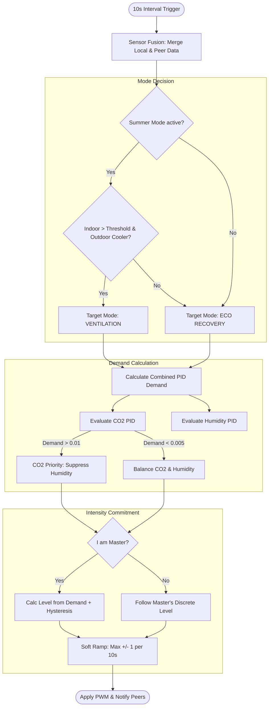

# 🤖 Standard Automatic Mode (Auto Logic)

The **Standard Automatic Mode** is the "brain" of VentoSync. It provides fully autonomous, sensor-driven ventilation control optimized for air quality, energy efficiency, and comfort. This document describes the technical implementation and the decision-making logic behind this mode.

---

## 🏗️ Architecture & File Structure

The logic is distributed across several layers to ensure maintainability and high performance on the ESP32-C6.

| Component | File | Responsibility |
| :--- | :--- | :--- |
| **Main Loop** | [`logic_automation.yaml`](../packages/logic_automation.yaml) | Triggers the evaluation cycle every 10 seconds. Defines internal PIDs. |
| **Core Logic (C++)** | [`auto_mode.h`](../components/helpers/auto_mode.h) | The "Engine". Implements math, sensor fusion, and mode switching logic. |
| **Climate Sensors** | [`sensors_climate.yaml`](../packages/sensors_climate.yaml) | Defines input sensors (SCD41, BME680, Home Assistant sensors) and efficiency metrics. |
| **UI & Thresholds** | [`ui_controls.yaml`](../packages/ui_controls.yaml) | Provides Home Assistant entities for runtime configuration (limits, targets). |
| **Global State** | [`globals.h`](../components/helpers/globals.h) | Shared pointers and variables accessible by both YAML and C++. |

---

## 🔄 Logic Flow: The 10-Second Decision Cycle

Every 10 seconds, the `evaluate_auto_mode()` function runs the following process:

---

## 🧪 Detailed Logic Components

### 1. Sensor Fusion & Fallbacks
The system ensures stability even if a local sensor fails.
- **Priority**: Local SCD41 > Local BME680 > Peer Data via ESP-NOW.
- **Directional Mapping**: NTC sensors are dynamically mapped. If the fan is blowing "In", the Outdoor NTC is used; if "Out", the Room NTC is sampled.

### 2. Humidity Management (Enthalpy Logic)
VentoSync prevents "moisture intake" during humid summer days or rainy weather.
- **Scientific Foundation**: The logic uses the **Magnus Formula** to calculate **Absolute Humidity ($g/m^3$)**.
- **Guard Condition**: Dehumidification via PID is only allowed if:
  $$Absolute\_Humidity_{Outdoor} < Absolute\_Humidity_{Indoor}$$
  This ensures that ventilation actually removes water from the building rather than bringing it in.

### 3. Dual-PID Priority Control
Two independent PID controllers run in the background (defined in `logic_automation.yaml`):
1. **PID CO2**: Target: 1000 ppm (configurable).
2. **PID Humidity**: Target: 60% rH (configurable).

**Conflict Resolution (Hysteresis)**:
- **CO2 Grab**: If CO2 demand exceeds **1%**, it takes full exclusive control of the fan.
- **CO2 Release**: Only when CO2 demand falls below **0.5%**, the control is handed over to the Humidity PID.
- This prevents "fighting" between controllers and ensures safe air quality (CO2) is always the primary goal.

### 4. Summer Cooling (Bypass Simulation)
Since decentralized units typically lack a physical bypass flap, the logic simulates a bypass by disabling the reversing cycle.
- **Condition**: Indoor Temp > 22°C AND Outdoor Temp < (Indoor - 1.5°C) AND HA "Sommerbetrieb" is ON.
- **Action**: Switch to `MODE_VENTILATION` (one-way flow).
- **Benefit**: Draws in cool night air efficiently without warming it up in the ceramic heat exchanger.

### 5. Master/Slave Synchronization (Room Authority)
To avoid different fans in the same room running at different speeds (which causes pressure imbalance), the system uses an **Authority Rule**:
- **Master (ID=1)**: Calculates the target level (1–10) based on local/room demand.
- **Slaves (ID > 1)**: Ignore their own demand calculation and mirror the Master’s discrete level in real-time.
- **Soft Ramping**: All devices apply a max transition of **+/- 1 level per 10 seconds** for silent and motor-friendly speed changes.

---

## ⚙️ Configuration Entities

| HA Entity | YAML ID | Default | Purpose |
| :--- | :--- | :---: | :--- |
| `Automatik Min Lüfterstufe` | `automatik_min_fan_level` | 2 | Minimum speed (Moisture base protection). |
| `Automatik Max Lüfterstufe` | `automatik_max_fan_level` | 7 | Maximum speed (Noise limiter for nights). |
| `Automatik: CO2 Grenzwert` | `auto_co2_threshold` | 1000 | Target setpoint for the CO2 PID. |
| `Automatik: Feuchte Grenzwert`| `auto_humidity_threshold` | 60% | Target setpoint for the Humidity PID. |
| `Sommerbetrieb` | `sommerbetrieb` | (Binary) | Master switch from HA to enable/disable cooling. |

---

> [!TIP]
> **Advanced Tuning**: The PID parameters ($K_p$, $K_i$) are defined in `logic_automation.yaml`. They are tuned for very slow, silent transitions to ensure the ventilation remains "forgotten" in the background.
