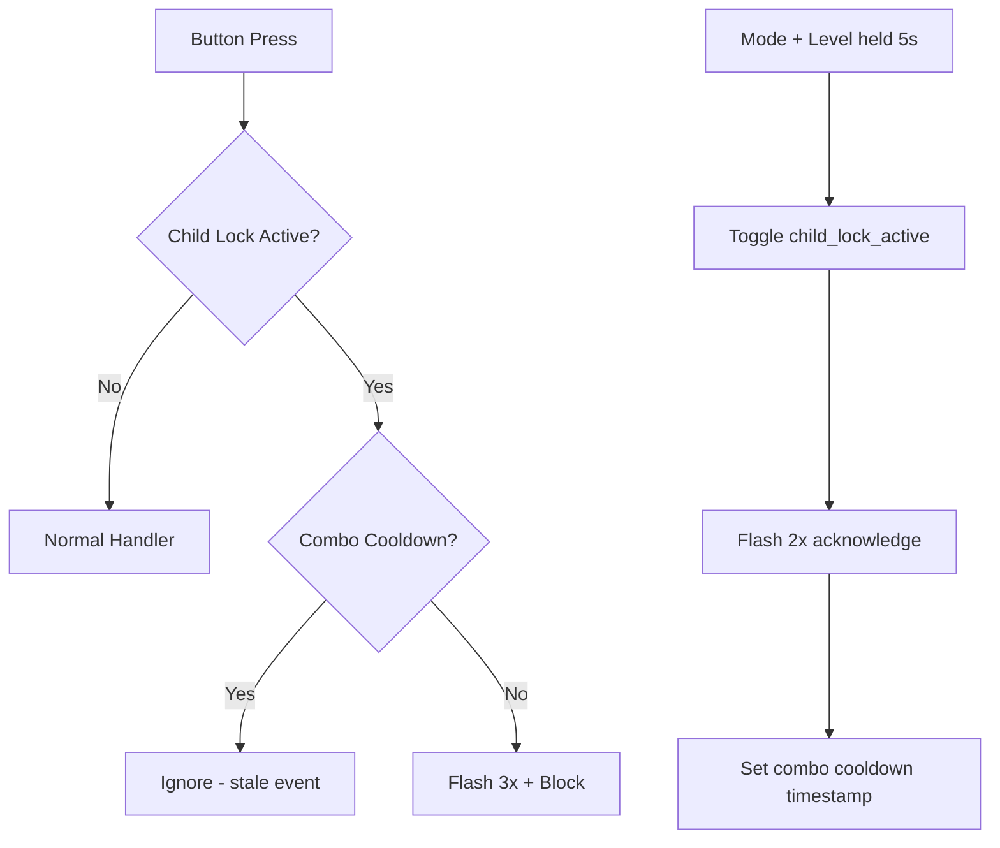

# 🔒 Kindersicherung (Child Protection Mode) — Implementation Summary

## Overview

The child protection mode locks the physical control panel buttons so the device cannot be operated by pressing buttons on the device. All control via Home Assistant remains fully functional.

## Changes

| File | Change |
|:--|:--|
| [ventosync_base.yaml](file:///home/tengeroff/ESPHome-Wohnraumlueftung/ventosync_base.yaml#L275-L280) | Added `child_lock_active` persistent global (bool, NVS-backed) |
| [globals.h](file:///home/tengeroff/ESPHome-Wohnraumlueftung/components/helpers/globals.h#L245-L248) | Added `extern` declarations for `child_lock_active` and `child_lock_switch` |
| [globals.h](file:///home/tengeroff/ESPHome-Wohnraumlueftung/components/helpers/globals.h#L372-L376) | Added `child_lock_combo_triggered_ms` inline timestamp for combo cooldown |
| [globals.h](file:///home/tengeroff/ESPHome-Wohnraumlueftung/components/helpers/globals.h#L438) | Added forward declaration for `flash_all_leds()` |
| [led_feedback.h](file:///home/tengeroff/ESPHome-Wohnraumlueftung/components/helpers/led_feedback.h#L89-L133) | Added `flash_all_leds(int count)` — flashes all 9 LEDs N times |
| [user_input.h](file:///home/tengeroff/ESPHome-Wohnraumlueftung/components/helpers/user_input.h) | Added child lock guards to all 5 physical button handlers |
| [ui_controls.yaml](file:///home/tengeroff/ESPHome-Wohnraumlueftung/packages/ui/ui_controls.yaml#L283-L305) | Added `switch.kindersicherung` (HA config entity) |
| [logic_buttons.yaml](file:///home/tengeroff/ESPHome-Wohnraumlueftung/packages/io/logic_buttons.yaml#L83-L167) | Added combo detection (Mode+Level 5s) and `child_lock_combo_handler` script |

## How It Works

### Home Assistant Control
- **Entity**: `switch.kindersicherung` (visible in device's *Configuration* section)
- Toggle ON → all physical buttons are blocked
- Toggle OFF → normal operation restored
- HA controls (mode changes, intensity slider, etc.) are **never blocked**

### Physical Device Control
- **Activate/Deactivate**: Hold **Mode** + **Level** buttons simultaneously for **5 seconds**
- **Acknowledgment**: All LEDs flash **2 times** on toggle
- **Blocked press feedback**: All LEDs flash **3 times** when a blocked button is pressed

### Technical Details

> [!NOTE]
> The child lock state is persisted in NVS (`restore_value: true`), so it survives reboots. The combo cooldown (500ms) prevents stale `on_click` events from firing after a combo toggle.

## Build Status

✅ **Configuration valid** — `esphome config` passed  
✅ **Compilation successful** — `esphome compile` passed (v0.8.210)
