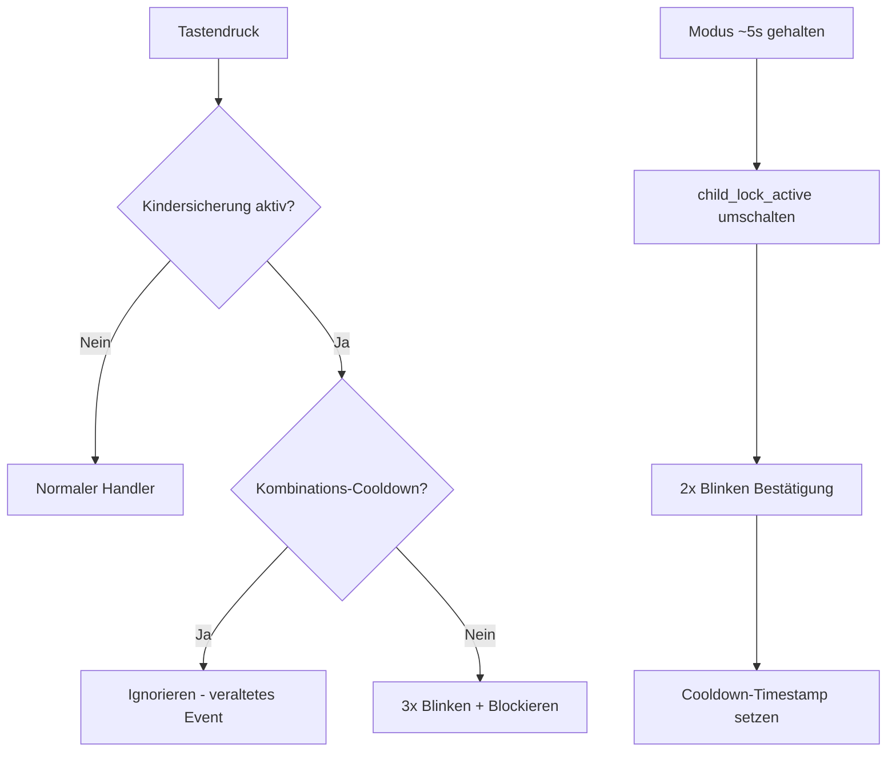

# 🔒 Kindersicherung — Implementierungsübersicht

## Übersicht

Die Kindersicherung sperrt die physischen Tasten des Bedienfelds am Lüftungsgerät, sodass das Gerät nicht versehentlich durch Drücken der Tasten verstellt werden kann. Die Steuerung über Home Assistant und das Web-Dashboard bleibt dabei uneingeschränkt funktionsfähig.

## Komponenten

| Datei | Aufgabe |
|:--|:--|
| [globals_ui.yaml](../../packages/globals/globals_ui.yaml) | Persistente Globale `child_lock_active` (bool, NVS-gespeichert, `restore_value: true`) |
| [globals.h](../../components/helpers/globals.h) | `extern`-Deklarationen für `child_lock_active` / `child_lock_switch`, Cooldown-Timestamp `child_lock_combo_triggered_ms` |
| [user_input.h](../../components/helpers/user_input.h) | Sperr-Prüfung in den physischen Tasten-Handlern (Power, Modus, Stufe Klick/Halten), `toggle_child_lock()`, `flash_all_leds_on()` / `restore_leds_after_flash()` |
| [ui_controls.yaml](../../packages/ui/ui_controls.yaml) | `switch.kindersicherung` (HA-Konfigurationsentität, `restore_mode: DISABLED`) |
| [logic_buttons.yaml](../../packages/io/logic_buttons.yaml) | Erkennung des Modus-Haltens (`child_lock_handler`) und die LED-Blink-Scripts `flash_leds_child_lock_2x` / `_3x` |

## Funktionsweise

### Steuerung über Home Assistant
- **Entität**: `switch.kindersicherung` (sichtbar im Bereich *Konfiguration* des Geräts)
- Schalter AN → alle physischen Tasten sind gesperrt
- Schalter AUS → normale Tastenbedienung wiederhergestellt
- HA-Bedienelemente und das Web-Dashboard (Moduswechsel, Intensitätsschieber etc.) werden **niemals gesperrt**

### Bedienung am physischen Gerät
- **Aktivieren/Deaktivieren**: Die **Modus-Taste** etwa **5 Sekunden** gedrückt halten (bestätigt nach 4,5 s durchgehendem Halten)
- **Bestätigung**: Die 8 Panel-LEDs (Power, 2 Modus, 5 Stufen) blinken **2-mal** bei Statusänderung
- **Feedback bei gesperrter Taste**: Alle LEDs blinken **3-mal**, wenn eine gesperrte Taste gedrückt wird

### Technische Details

> [!NOTE]
> Der Status der Kindersicherung wird im Flash (NVS via `restore_value: true`) gespeichert und bleibt somit auch nach einem Neustart oder Stromausfall erhalten. Der HA-Schalter muss `restore_mode: DISABLED` behalten — mit dem Standard `ALWAYS_OFF` hat seine Ausschalt-Aktion beim Booten die Sperre bei jedem Neustart gelöscht (behoben in 0.10.27). Der 500ms-Cooldown unterdrückt ein veraltetes Tasten-Event direkt nach dem Umschalten.
