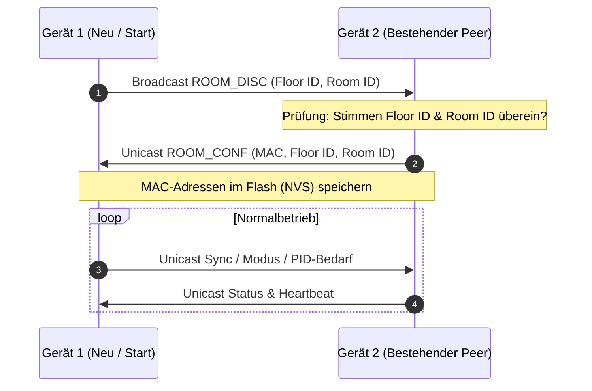

# 📡 ESP-NOW Funk-Mesh & Raum-Synchronisation

VentoSync nutzt **ESP-NOW** (über die [ESPHome ESP-NOW Komponente](https://esphome.io/components/espnow.html)) für die direkte, ultra-latenzarme Kommunikation von Gerät zu Gerät. ESP-NOW arbeitet direkt auf der MAC-Schicht im 2,4-GHz-Band, ohne Umweg über einen zentralen WLAN-Router oder Steuerkabel.

  

---

## 💡 Architekturentscheidung: Warum ESP-NOW statt Powerline (PLC)?

Kommerzielle Systeme wie das originale VentoMaxx setzen auf **Powerline Communication (PLC)** über die 230V-Stromleitung, um Lüfterpaare zu synchronisieren. Im Wohnalltag führt PLC jedoch häufig zu Problemen:
* Hohe Anfälligkeit für Störungen durch Phasenverschiebungen bei unterschiedlichen Stromkreisen.
* Starke Beeinträchtigung durch Schaltnetzteile, LED-Treiber und Wechselrichter moderner Photovoltaikanlagen.
* Erfordert oft teure Phasenkoppler im Sicherungskasten.

Ein reiner Betrieb über herkömmliches WLAN hingegen erzeugt eine dauerhafte Abhängigkeit vom WLAN-Router und dessen Verfügbarkeit.

**ESP-NOW** ist der moderne, optimale Mittelweg: Es baut ein extrem robustes, schnelles und direktes 2,4-GHz-Funknetzwerk zwischen den Lüftern auf — ohne Leitungen, ohne Phasenprobleme und mit voller lokaler Autonomie.

---

## ⚡ Zentrale Vorteile

* 🌐 **Vollständige WLAN-Unabhängigkeit**: Die Geräte benötigen keinen aktiven WLAN-Router für den synchronen Lüftungsbetrieb. Fällt das Heim-WLAN aus, arbeitet die Raum-Lüftungsgruppe ungestört weiter.
* 🛡️ **Netzwerk-Immunität**: Direkte Punkt-zu-Punkt-Kommunikation ist immun gegen Überlastungen oder Störungen im gewöhnlichen Heimnetzwerk.
* ⚡ **Nahezu verzögerungsfreie Übertragung**: Da nach der Discovery keine TCP/IP-Handshakes erforderlich sind, werden Richtungswechsel und Taktzyklen synchron auf die Millisekunde genau übertragen.
* 🔌 **Keine Steuerleitungen**: Kein Verlegen von Datenkabeln zwischen Wänden oder Räumen erforderlich.
* 📡 **Dynamische Discovery & NVS-Persistenz**: Geräte im selben Raum finden sich automatisch und speichern die MAC-Adressen der Partnergeräte dauerhaft im Flash-Speicher (NVS).
  > [!NOTE]
  > Durch die 254-Zeichen-Begrenzung in ESPHome Globals ist die persistente Peer-Liste für **bis zu ca. 14 Peers** pro Gerät ausgelegt — mehr als ausreichend für jeden Wohnraum.
* ⚙️ **Effiziente Unicast-Kommunikation**: Nach der ersten Erkennung erfolgen alle Sync-, Status- und PID-Datenübertragungen über gezielte Unicast-Pakete, was das 2,4-GHz-Frequenzband schont und die Stabilität maximiert.
* 🔄 **Echtzeit-Spiegelung von Einstellungen**: Änderungen an Parametern (CO2-Grenzwerte, Lüfterstufen, Betriebsmodi) an einem Gerät werden sofort drahtlos auf alle Peers der Raumgruppe übertragen.

---

## 🔍 Discovery- & Kopplungs-Ablauf

1. **Broadcast (`ROOM_DISC`)**: Ein startendes Gerät sendet ein Suchpaket an alle (`FF:FF:FF:FF:FF:FF`).
2. **Matching**: Empfänger prüfen, ob Etagen- und Raum-ID mit den eigenen Parametern übereinstimmen.
3. **Handshake (`ROOM_CONF`)**: Bei Übereinstimmung wird der Sender gespeichert und eine Unicast-Bestätigung zurückgesendet.
4. **Persistenz**: Die Peer-Liste übersteht Neustarts und ermöglicht sofortige Synchronisation direkt nach dem Booten.

---

## 🔒 Protokoll-Architektur & Paketvalidierung (v10)

* **Magic Header**: Jedes Datenpaket beginnt mit einem festen Prüfbyte (`0x42`), um fremde oder fehlerhafte 2,4-GHz-Pakete sofort zu verwerfen.
* **Firmware-Versionsprüfung**: Strikte Validierung verhindert Fehlinterpretationen bei unterschiedlichen Firmware-Ständen.
* **Schleifen-Schutz**: Einstellungsänderungen enthalten Sequenz-Token, um zirkuläre Broadcast-Schleifen beim Spiegeln von Parametern zu verhindern.

---

## 📶 Funk- & Antennen-Optimierung

Zur Gewährleistung maximaler Funkreichweite durch Betonwände und Decken:
* **Externe U.FL-Antenne**: Der ESP32-C6 nutzt eine externe Rundstrahlantenne über einen U.FL-Konnektor.
* **Antennen-Routing**: Die ESPHome-Firmware ist so konfiguriert, dass alle Funksignale über die externe Antenne statt über die interne PCB-Antenne geleitet werden, was die Signalstärke und Verbindungsqualität deutlich verbessert.
