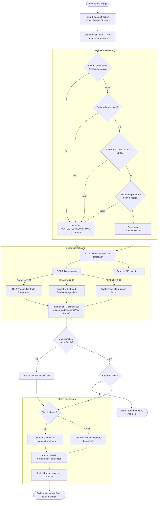

# 🤖 Smart-Automatik Modus (Auto-Logik)

Der **Smart-Automatik Modus** ist das „Gehirn“ von VentoSync. Er bietet eine vollautonome, sensorgesteuerte Lüftungsregelung, die für Raumluftqualität, Energieeffizienz und Komfort optimiert ist. Dieses Dokument beschreibt die technische Implementierung und die Entscheidungslogik hinter diesem Modus.

---

## 🏗️ Architektur & Dateistruktur

Die Logik ist über mehrere Schichten verteilt, um Wartbarkeit und hohe Performance auf dem ESP32-C6 zu gewährleisten.

| Komponente | Datei | Verantwortung |
| :--- | :--- | :--- |
| **Hauptschleife** | [`logic_automation.yaml`](../../packages/actuators/logic_automation.yaml) | Stößt den Auswertezyklus alle 10 Sekunden an. Ruft `evaluate_auto_mode()` auf. |
| **Kernlogik (C++)** | [`auto_mode.h`](../../components/helpers/auto_mode.h) | Die „Engine“. Implementiert Mathematik, Sensorfusion und Modus-Umschaltlogik. |
| **PID-Regler** | [`logic_pid.yaml`](../../packages/actuators/logic_pid.yaml) | Definiert die internen CO2- und Feuchte-PID-Klimaregler und deren Dummy-Ausgänge. |
| **Klimasensoren** | [`sensors_climate.yaml`](../../packages/sensors/sensors_climate.yaml) | Definiert Eingangssensoren (SCD43, BME680, Home Assistant Sensoren) und Effizienzmetriken. |
| **UI & Schwellwerte** | [`ui_controls.yaml`](../../packages/ui/ui_controls.yaml) | Stellt Home Assistant Entitäten für die Laufzeitkonfiguration bereit (Grenzwerte, Sollwerte). |
| **Globaler Status** | [`globals.h`](../../components/helpers/globals.h) | Geteilte Zeiger und Variablen, auf die sowohl YAML als auch C++ zugreifen können. |

---

## 🔄 Logik-Ablauf: Der 10-Sekunden-Entscheidungszyklus

Alle 10 Sekunden führt die Funktion `evaluate_auto_mode()` folgenden Prozess aus:

---

## 🧪 Detaillierte Logik-Komponenten

### 1. Sensorfusion & Fallbacks
Das System gewährleistet Stabilität, selbst wenn ein lokaler Sensor ausfällt.
- **CO2-Fallback-Kette** (im Template-Sensor `effective_co2`): Lokaler SCD43 → Lokaler BME680 IAQ eCO2 → Letzten bekannten Wert halten (bis zu 5 min) → NaN.
- **Temperatur-Fallback-Kette** (in `auto_mode.h`, `get_effective_temperatures()`): Lokale SCD43-Temperatur → Phasengekoppelte NTC-Werte → **frische Peer-Daten über ESP-NOW** → **letzte eigene gültige Messung** (`HeldReading`, bis zu 30 min) → NaN.
- **Phasengekoppelte NTC-Sensoren**: Die NTC-Sensoren sind fest im Luftkanal verbaut, die Zuordnung ändert sich also nie: `temp_zuluft` ist der Außensensor, `temp_abluft` der Innensensor. Ein Phase-Lock-Filter in `climate.h` lässt jeden NTC nur in der Lüftungsphase publizieren, in der er tatsächlich in seinem eigenen Luftstrom liegt (Innen-NTC bei Abluft, Außen-NTC bei Zuluft), und friert ihn andernfalls auf dem letzten Wert ein.
  - Bei **Wärmerückgewinnung** wechselt die Richtung alle 50–70 s, beide Sensoren werden also innerhalb eines Zyklus aufgefrischt und beide Werte genutzt.
  - Bei **Durchlüften** (Sommer-Bypass) wechselt die Richtung nicht mehr, ein NTC bleibt dauerhaft eingefroren. Dieser eingefrorene Wert wird bewusst **weder verwendet noch gesendet** — die obige Fusionskette füllt die Lücke, und `guard_summer_bypass()` (siehe Abschnitt 4) kehrt zur Wärmerückgewinnung zurück, wenn das nicht gelingt.
- **Raumweites CO2 und Feuchte**: Für die Schutzmechanismen der Klima-Koordination wird nicht der lokale Sensor allein herangezogen, sondern der **raumweite Worst Case** — der höchste CO2-Wert (`get_room_max_co2()`) und die höchste relative Feuchte (feuchteste Stelle) aus lokalem Sensor und allen frischen Peers.

### 2. Feuchtemanagement (Enthalpie-Logik)
VentoSync verhindert Feuchteeintrag an schwülen Sommertagen oder bei Regenwetter.
- **Wissenschaftliche Grundlage**: Die Logik nutzt die **Magnus-Formel** zur Berechnung der **Absoluten Feuchte ($g/m^3$)**.
- **Schutzbedingung (Guard Condition)**: Entfeuchtung via PID ist nur zulässig, wenn:
  $$Absolute\_Feuchte_{Außen} < Absolute\_Feuchte_{Innen}$$
  Dies stellt sicher, dass die Lüftung tatsächlich Wasser aus dem Gebäude abführt, anstatt Feuchtigkeit von außen hineinzuziehen.

### 3. Dual-PID Prioritätssteuerung
Zwei unabhängige PID-Regler laufen im Hintergrund (definiert in [`logic_pid.yaml`](../../packages/actuators/logic_pid.yaml)):
1. **PID CO2**: Zielwert: 1000 ppm (konfigurierbar).
2. **PID Feuchte**: Zielwert: 60% rH (konfigurierbar).

**Konfliktlösung (Hysterese)**:
- **CO2 Grab**: Übersteigt der CO2-Bedarf **1%**, übernimmt CO2 die Prioritätskontrolle der Hysterese-State-Machine.
- **CO2 Release**: Erst wenn der CO2-Bedarf unter **0.5%** fällt, wird die Kontrolle an den Feuchte-PID übergeben.
- **Hold**: Zwischen 0.5% und 1% wird der aktuelle Zustand gehalten (kein Umschalten), um Oszillationen zu verhindern.
- **Priorität mit Boost**: Auch während CO2 Priorität hat, gilt als effektiver Bedarf `max(CO2, Feuchte)` — die Feuchte kann die Lüfterstufe über die CO2-Anforderung anheben, sie jedoch nicht absenken. Das garantiert sowohl Luftqualität als auch Feuchteschutz.

**Raumweite Bedarfsfusion**:
Das obige Ergebnis ist der Bedarf der **lokalen** Sensoren. Darüber hinaus übernimmt jedes Gerät den höchsten Bedarf, den ein frischer Peer meldet: `effektiver Bedarf = max(lokal, höchster frischer Peer-Bedarf)` (`ventosync::room::room_max_peer_demand()`, Frische `max(5 min, zwei Heartbeats)`).

- Peers berechnen ihren Wert mit ihrem vollständigen CO2- **und** Feuchte-PID inklusive Integralanteil, Prioritätshysterese und Enthalpie-Schutz — ein Master **ohne eigene Sensoren** regelt den Raum dadurch exakt wie das Sensorgerät.
- Jedes Gerät sendet **ausschließlich seinen eigenen lokalen Sensorbedarf** (`local_pid_demand`), nie das fusionierte Ergebnis, und `NaN`, wenn es keinen eigenen Sensor hat. Würde ein fusionierter Wert erneut gesendet, könnten sich zwei Geräte gegenseitig auf einer hohen Stufe festhalten (Rückkopplung, CHANGELOG 0.10.21).
- Während des Moduswechsel-Holdoffs (siehe unten) sendet das Gerät ebenfalls `NaN`, weil sein eigener PID-Ausgang noch nicht vertrauenswürdig ist.

**Moduswechsel-Holdoff**:
Direkt nach dem Umschalten **in** die Smart-Automatik sind die PID-Ausgänge noch einige Zyklen lang veraltet (der Proportionalanteil des Reglers überschreibt die von `system_lifecycle.h` auf null gesetzten Werte). Für `MODE_SWITCH_HOLDOFF_MS` (15 s ≈ 1,5 CO2-PID-Zyklen) wird der Bedarf deshalb auf `0` gezwungen, sodass der Lüfter von der Mindeststufe startet und erst hochregelt, wenn ein echter Sensorzyklus abgeschlossen ist.

**Gar keine Daten**: Liefern weder die lokalen Sensoren noch ein Peer einen brauchbaren Bedarf, ist das Ergebnis `NaN` und der Zyklus bricht **ohne Änderung der Lüfterstufe** ab — der letzte Zustand wird gehalten, statt auf einen Standardwert zurückzufallen.

### 4. Sommerkühlung (Bypass-Simulation)
Da dezentrale Geräte bauartbedingt keine mechanische Bypass-Klappe besitzen, simuliert die Logik einen Bypass durch Deaktivierung des Reversierzyklus.
- **Bedingung**: Raumtemperatur > Schwelle (Slider, Standard 22°C) UND Außentemperatur < (Raum - 1.5°C) UND HA „Sommerbetrieb“ ist AKTIV UND keine aktive Klimaanlage (Klima-Koordination).
- **Freigabe**: „Sommerbetrieb“ AUS, oder Außen ≥ Raum − 0,5°C, oder Raum < Schwelle − 0,5°C.
- **Aktion**: Wechsel in `MODE_VENTILATION` (Durchlüften / unidirektionaler Luftstrom, ohne Timer).
- **Temperaturen**: Bei unidirektionalem Luftstrom ist nur der NTC im eigenen Luftstrom messbar (ansaugend: außen, ausblasend: innen). Der andere Wert kommt von einem Peer, sonst aus der letzten eigenen Messung (≤ 30 min); fehlt er weiterhin, kehrt `guard_summer_bypass()` in die Wärmerückgewinnung zurück und sperrt den Wiedereintritt 5 min lang (`SUMMER_COOLING_REMEASURE_MS`) zum Nachmessen.
- **Vorteil**: Zieht kühle Nachtluft effizient ein, ohne sie im Keramik-Wärmespeicher aufzuheizen.

### 5. Master/Slave-Synchronisierung (Raum-Autorität)
Um zu verhindern, dass verschiedene Lüfter im selben Raum mit unterschiedlichen Drehzahlen laufen (was Druckungleichgewichte erzeugt), nutzt das System eine **Autoritätsregel**:
- **Master (ID=1)**: Berechnet die diskrete Zielstufe (1–10) aus dem Raumbedarf (lokal + fusionierter Peer-Bedarf) über `VentilationLogic::calculate_auto_target_level()`.
- **Slaves (ID > 1)**: Spiegeln die diskrete Stufe des Masters, statt eine eigene aus ihrem Bedarf zu berechnen — begrenzen sie aber weiterhin auf **ihr eigenes Stufenfenster** `[min, max]`. Da Fenstereinstellungen und Klima-Status raumweit gelten, ist dieses Fenster normalerweise identisch mit dem des Masters; es weicht nur vorübergehend ab, etwa bis der nächste Heartbeat einen geänderten Klima-Status überträgt.
- **Master offline**: Kam innerhalb von `PEER_TIMEOUT_MS` (15 min) kein Paket von Gerät ID 1, berechnet der Slave die Stufe wieder selbst aus dem Bedarf, damit der Raum weiter geregelt wird.
- **Soft-Ramping**: Alle Geräte wenden einen maximalen Übergang von **+/- 1 Stufe pro 10 Sekunden** an (±2 im Zyklus direkt nach einem Moduswechsel), für leise und motorschonende Drehzahländerungen. Ein schrumpfendes Fenster — etwa die Obergrenze der Klima-Koordination — wird deshalb mit einer Stufe pro Zyklus angefahren, nicht in einem Sprung.

---

### 6. Klima-Koordination (Smart Climate Control)
Ein optionaler Modifikator, der zu Beginn jedes 10-Sekunden-Zyklus ausgewertet wird (`auto_mode::evaluate_hvac_coordination()`). Solange der raumweite Schalter `Klima-Koordination` an ist **und** Home Assistant die Klimaanlage als aktiv meldet (API-Action `set_ac_active`, raumweit geteilt), läuft der Zyklus mit eingeschränktem Profil:
- **Reine CO2-Regelung**: Die Feuchte-PID-Anforderung wird ignoriert, der CO2-PID-Sollwert wird auf `hvac_co2_threshold` (Standard 1200 ppm) umgeschaltet und in jedem Zyklus erneut gesetzt.
- **Stufenfenster**: `[1, hvac_max_fan_level]` (Standard 1–3) ersetzt `automatik_min/max_fan_level`.
- **Modus-Sperre**: `determine_auto_operating_mode()` liefert immer Wärmerückgewinnung — kein Sommer-Bypass bei laufender Klimaanlage.
- **Gesundheitsschutz**: Ein CO2-Notfall (≥ `hvac_emergency_co2`, Freigabe ≤ `hvac_co2_threshold`) und ein Schimmelschutz (≥ 70 % rH bei trockenerer Außenluft, Freigabe ≤ 65 %) stellen die normalen Grenzen und den Dual-PID wieder her. Beide werden mit dem **raumweiten Worst Case** gespeist (höchster CO2-Wert / höchste rH aus lokalem Sensor und allen frischen Peers), sodass die schlechteste Luft im Raum entscheidet. Meldet kein Gerät im Raum einen CO2-Wert, wird gar nicht gedrosselt.
- **Entprellung**: „Klima aus" muss 120 s anhalten, bevor die Einschränkungen aufgehoben werden; die Rückkehr erfolgt mit der Standardrampe von ±1 Stufe pro Zyklus.

Details, Zustandsautomat und HA-Einrichtung: [📄 Intelligente Klimaanlagen-Koordination](de_smart-climate-control.md).

---

## ⚙️ Konfigurations-Entitäten

| HA-Entität (deutscher UI-Name) | Entity-ID | Global (C++) | Standard | Zweck |
| :--- | :--- | :--- | :---: | :--- |
| `Smart-Automatik Min Lüfterstufe` | `automatik_min_luefterstufe` | `automatik_min_fan_level` | 2 | Mindestdrehzahl (Grundlüftung zum Feuchteschutz). |
| `Smart-Automatik Max Lüfterstufe` | `automatik_max_luefterstufe` | `automatik_max_fan_level` | 7 | Maximaldrehzahl (Geräuschbegrenzung für die Nacht). |
| `Smart-Automatik: CO2 Grenzwert` | `auto_co2_threshold` | `auto_co2_threshold_val` | 1000 ppm | Sollwert für den CO2-PID. |
| `Smart-Automatik: Feuchte Grenzwert` | `auto_humidity_threshold` | `auto_humidity_threshold_val` | 60 % | Sollwert für den Feuchte-PID. |
| `Smart-Automatik: Sommerkühlung Schwelle` | `auto_summer_cooling_threshold` | `summer_cooling_threshold` | 22 °C | Raumtemperatur, ab der der Sommer-Bypass greifen darf (Abschnitt 4). |
| `Sommerbetrieb` | `sommerbetrieb` | — | (binär) | Jahreszeit-Freigabe aus HA; `false` solange HA offline ist (Wärmerückgewinnung bleibt aktiv). |
| `Klima-Koordination` | `smart_climate_control` | `hvac_enabled_val` | Aus | Aktiviert den HVAC-Koordinations-Modifikator, raumweit (Abschnitt 6). |
| `Klima-Koordination: CO2 Grenzwert` | `hvac_co2_threshold` | `hvac_co2_threshold_val` | 1200 ppm | Gelockerter CO2-Sollwert bei aktiver Klimaanlage. |
| `Klima-Koordination: Max Lüfterstufe` | `hvac_max_fan_level` | `hvac_max_fan_level_val` | 3 | Lüfterstufen-Obergrenze bei aktiver Klimaanlage. |
| `Klima-Koordination: CO2 Notfallgrenze` | `hvac_emergency_co2` | `hvac_emergency_co2_val` | 1500 ppm | Schwelle des CO2-Notfall-Overrides. |

Alle Slider und der HVAC-Schalter sind raumweite Einstellungen: Eine Änderung an einem beliebigen Gerät wird als `MSG_STATE` an die Peers gesendet und vom Master-Heartbeat erneut gesetzt.

---

> [!TIP]
> **Erweitertes Tuning**: Die PID-Parameter ($K_p$, $K_i$) sind in [`logic_pid.yaml`](../../packages/actuators/logic_pid.yaml) definiert. Sie sind für sehr langsame, lautlose Übergänge abgestimmt, damit die Lüftung unbemerkt im Hintergrund arbeitet. Der Differentialanteil ($K_d$) ist explizit auf Null gesetzt — eine trendbasierte Regelung würde das Sensorrauschen des SCD43 verstärken und ist für eine Wohnraumlüftung ungeeignet.
