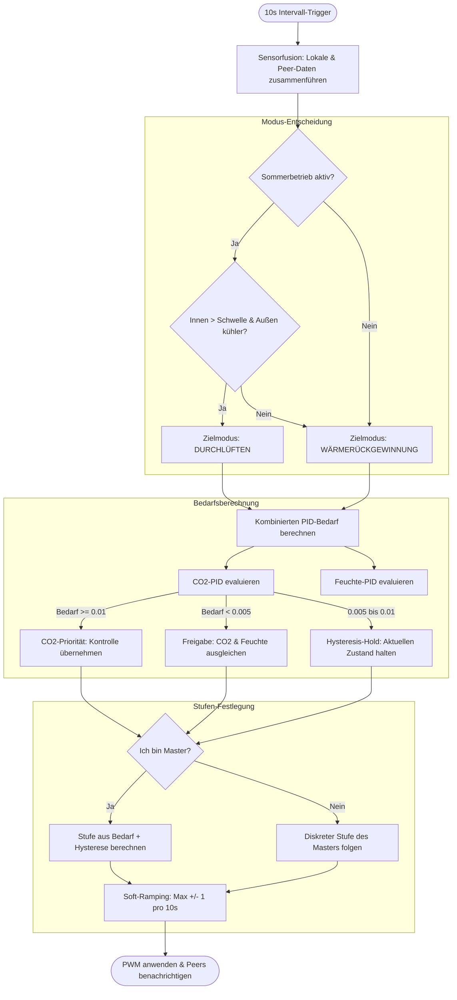

# 🤖 Smart-Automatik Modus (Auto-Logik)

Der **Smart-Automatik Modus** ist das „Gehirn“ von VentoSync. Er bietet eine vollautonome, sensorgesteuerte Lüftungsregelung, die für Raumluftqualität, Energieeffizienz und Komfort optimiert ist. Dieses Dokument beschreibt die technische Implementierung und die Entscheidungslogik hinter diesem Modus.

---

## 🏗️ Architektur & Dateistruktur

Die Logik ist über mehrere Schichten verteilt, um Wartbarkeit und hohe Performance auf dem ESP32-C6 zu gewährleisten.

| Komponente | Datei | Verantwortung |
| :--- | :--- | :--- |
| **Hauptschleife** | [`logic_automation.yaml`](../../packages/actuators/logic_automation.yaml) | Triggers the evaluation cycle every 10 seconds. Ruft `evaluate_auto_mode()` auf. |
| **Kernlogik (C++)** | [`auto_mode.h`](../../components/helpers/auto_mode.h) | Die „Engine“. Implementiert Mathematik, Sensorfusion und Modus-Umschaltlogik. |
| **PID-Regler** | [`logic_pid.yaml`](../../packages/actuators/logic_pid.yaml) | Definiert die internen CO2- und Feuchte-PID-Klimaregler und deren Dummy-Ausgänge. |
| **Klimasensoren** | [`sensors_climate.yaml`](../../packages/sensors/sensors_climate.yaml) | Definiert Eingangssensoren (SCD43, BME680, Home Assistant Sensoren) und Effizienzmetriken. |
| **UI & Schwellwerte** | [`ui_controls.yaml`](../../packages/ui/ui_controls.yaml) | Stellt Home Assistant Entitäten für die Laufzeitkonfiguration bereit (Grenzwerte, Sollwerte). |
| **Globaler Status** | [`globals.h`](../../components/helpers/globals.h) | Geteilte Zeiger und Variablen, auf die sowohl YAML als auch C++ zugreifen können. |

---

## 🔄 Logik-Ablauf: Der 10-Sekunden-Entscheidungszyklus

Alle 10 Sekunden führt die Funktion `evaluate_auto_mode()` folgenden Prozess aus:

---

## 🧪 Detaillierte Logik-Komponenten

### 1. Sensorfusion & Fallbacks
Das System gewährleistet Stabilität, selbst wenn ein lokaler Sensor ausfällt.
- **CO2-Fallback-Kette** (im Template-Sensor `effective_co2`): Lokaler SCD43 → Lokaler BME680 IAQ eCO2 → Letzten bekannten Wert halten (bis zu 5 min) → NaN.
- **Temperatur-Fallback-Kette** (in `auto_mode.h`): Lokale SCD43-Temperatur → Phasengekoppelte NTC-Werte → Peer-Daten über ESP-NOW.
- **Phasengekoppelte NTC-Sensoren**: Die NTC-Sensoren sind fest im Luftkanal verbaut. Ein Phase-Lock-Filter in `climate.h` stellt sicher, dass jeder NTC nur während seiner gültigen Lüftungsphase Messwerte publiziert (Innen-NTC bei Abluft, Außen-NTC bei Zuluft) und andernfalls den letzten gültigen Wert hält. Dadurch repräsentiert `temp_zuluft` stets die Außentemperatur und `temp_abluft` stets die Innentemperatur, unabhängig von der aktuellen Drehrichtung des Lüfters.

### 2. Feuchtemanagement (Enthalpie-Logik)
VentoSync verhindert Feuchteeintrag an schwülen Sommertagen oder bei Regenwetter.
- **Wissenschaftliche Grundlage**: Die Logik nutzt die **Magnus-Formel** zur Berechnung der **Absoluten Feuchte ($g/m^3$)**.
- **Schutzbedingung (Guard Condition)**: Entfeuchtung via PID ist nur zulässig, wenn:
  $$Absolute\_Feuchte_{Außen} < Absolute\_Feuchte_{Innen}$$
  Dies stellt sicher, dass die Lüftung tatsächlich Wasser aus dem Gebäude abführt, anstatt Feuchtigkeit von außen hineinzuziehen.

### 3. Dual-PID Prioritätssteuerung
Zwei unabhängige PID-Regler laufen im Hintergrund (definiert in [`logic_pid.yaml`](../../packages/actuators/logic_pid.yaml)):
1. **PID CO2**: Zielwert: 1000 ppm (konfigurierbar).
2. **PID Feuchte**: Zielwert: 60% rH (konfigurierbar).

**Konfliktlösung (Hysterese)**:
- **CO2 Grab**: Übersteigt der CO2-Bedarf **1%**, übernimmt CO2 die Prioritätskontrolle der Hysterese-State-Machine.
- **CO2 Release**: Erst wenn der CO2-Bedarf unter **0.5%** fällt, wird die Kontrolle an den Feuchte-PID übergeben.
- **Hold**: Zwischen 0.5% und 1% wird der aktuelle Zustand gehalten (kein Umschalten), um Oszillationen zu verhindern.
- **Priorität mit Boost**: Auch während CO2 Priorität hat, gilt als effektiver Bedarf `max(CO2, Feuchte)` — die Feuchte kann die Lüfterstufe über die CO2-Anforderung anheben, sie jedoch nicht absenken. Das garantiert sowohl Luftqualität als auch Feuchteschutz.

### 4. Sommerkühlung (Bypass-Simulation)
Da dezentrale Geräte bauartbedingt keine mechanische Bypass-Klappe besitzen, simuliert die Logik einen Bypass durch Deaktivierung des Reversierzyklus.
- **Bedingung**: Raumtemperatur > Schwelle (Slider, Standard 22°C) UND Außentemperatur < (Raum - 1.5°C) UND HA „Sommerbetrieb“ ist AKTIV UND keine aktive Klimaanlage (Klima-Koordination).
- **Freigabe**: „Sommerbetrieb“ AUS, oder Außen ≥ Raum − 0,5°C, oder Raum < Schwelle − 0,5°C.
- **Aktion**: Wechsel in `MODE_VENTILATION` (Durchlüften / unidirektionaler Luftstrom, ohne Timer).
- **Temperaturen**: Bei unidirektionalem Luftstrom ist nur der NTC im eigenen Luftstrom messbar (ansaugend: außen, ausblasend: innen). Der andere Wert kommt von einem Peer, sonst aus der letzten eigenen Messung (≤ 30 min); fehlt er weiterhin, kehrt `guard_summer_bypass()` in die Wärmerückgewinnung zurück und sperrt den Wiedereintritt 5 min lang (`SUMMER_COOLING_REMEASURE_MS`) zum Nachmessen.
- **Vorteil**: Zieht kühle Nachtluft effizient ein, ohne sie im Keramik-Wärmespeicher aufzuheizen.

### 5. Master/Slave-Synchronisierung (Raum-Autorität)
Um zu verhindern, dass verschiedene Lüfter im selben Raum mit unterschiedlichen Drehzahlen laufen (was Druckungleichgewichte erzeugt), nutzt das System eine **Autoritätsregel**:
- **Master (ID=1)**: Berechnet die diskrete Zielstufe (1–10) basierend auf dem lokalen/Raumbedarf.
- **Slaves (ID > 1)**: Ignorieren ihre eigene Bedarfsberechnung und spiegeln die diskrete Stufe des Masters in Echtzeit.
- **Soft-Ramping**: Alle Geräte wenden einen maximalen Übergang von **+/- 1 Stufe pro 10 Sekunden** für leise und motorshonende Drehzahländerungen an.

---

### 6. Klima-Koordination (Smart Climate Control)
Ein optionaler Modifikator, der zu Beginn jedes 10-Sekunden-Zyklus ausgewertet wird (`auto_mode::evaluate_hvac_coordination()`). Solange der raumweite Schalter `Klima-Koordination` an ist **und** Home Assistant die Klimaanlage als aktiv meldet (API-Action `set_ac_active`, raumweit geteilt), läuft der Zyklus mit eingeschränktem Profil:
- **Reine CO2-Regelung**: Die Feuchte-PID-Anforderung wird ignoriert, der CO2-PID-Sollwert wird auf `hvac_co2_threshold` (Standard 1200 ppm) umgeschaltet und in jedem Zyklus erneut gesetzt.
- **Stufenfenster**: `[1, hvac_max_fan_level]` (Standard 1–3) ersetzt `automatik_min/max_fan_level`.
- **Modus-Sperre**: `determine_auto_operating_mode()` liefert immer Wärmerückgewinnung — kein Sommer-Bypass bei laufender Klimaanlage.
- **Gesundheitsschutz**: Ein CO2-Notfall (≥ `hvac_emergency_co2`, Freigabe ≤ `hvac_co2_threshold`) und ein Schimmelschutz (≥ 70 % rH bei trockenerer Außenluft, Freigabe ≤ 65 %) stellen die normalen Grenzen und den Dual-PID wieder her. Ohne CO2-Messwert wird nichts gedrosselt.
- **Entprellung**: „Klima aus" muss 120 s anhalten, bevor die Einschränkungen aufgehoben werden; die Rückkehr erfolgt mit der Standardrampe von ±1 Stufe pro Zyklus.

Details, Zustandsautomat und HA-Einrichtung: [📄 Intelligente Klimaanlagen-Koordination](de_smart-climate-control.md).

---

## ⚙️ Konfigurations-Entitäten

| HA-Entität | YAML-ID | Standard | Zweck |
| :--- | :--- | :---: | :--- |
| `Automatik Min Lüfterstufe` | `automatik_min_fan_level` | 2 | Mindestdrehzahl (Grundlüftung zum Feuchteschutz). |
| `Automatik Max Lüfterstufe` | `automatik_max_fan_level` | 7 | Maximaldrehzahl (Geräuschbegrenzung für die Nacht). |
| `Automatik: CO2 Grenzwert` | `auto_co2_threshold` | 1000 | Sollwert für den CO2-PID. |
| `Automatik: Feuchte Grenzwert`| `auto_humidity_threshold` | 60% | Sollwert für den Feuchte-PID. |
| `Sommerbetrieb` | `sommerbetrieb` | (Binär) | Hauptschalter aus HA zur Aktivierung/Deaktivierung der Kühlung. |
| `Klima-Koordination` | `smart_climate_control` | Aus | Aktiviert den HVAC-Koordinations-Modifikator (siehe Abschnitt 6). |
| `Klima-Koordination: CO2 Grenzwert` | `hvac_co2_threshold` | 1200 | Gelockerter CO2-Sollwert bei aktiver Klimaanlage. |
| `Klima-Koordination: Max Lüfterstufe` | `hvac_max_fan_level` | 3 | Lüfterstufen-Obergrenze bei aktiver Klimaanlage. |
| `Klima-Koordination: CO2 Notfallgrenze` | `hvac_emergency_co2` | 1500 | Schwelle des CO2-Notfall-Overrides. |

---

> [!TIP]
> **Erweitertes Tuning**: Die PID-Parameter ($K_p$, $K_i$) sind in [`logic_pid.yaml`](../../packages/actuators/logic_pid.yaml) definiert. Sie sind für sehr langsame, lautlose Übergänge abgestimmt, damit die Lüftung unbemerkt im Hintergrund arbeitet. Der Differentialanteil ($K_d$) ist explizit auf Null gesetzt — eine trendbasierte Regelung würde das Sensorrauschen des SCD43 verstärken und ist für eine Wohnraumlüftung ungeeignet.
