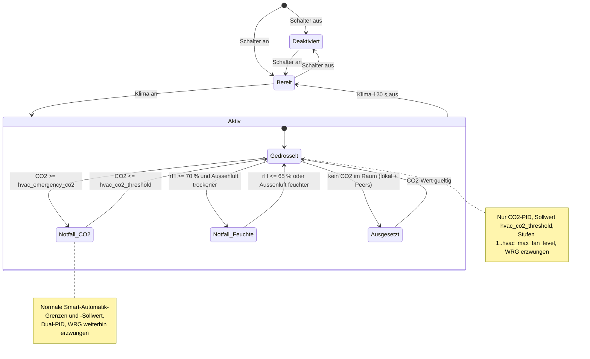

# ❄️🔥 Intelligente Klimaanlagen-Koordination (Smart Climate Control)

[](../en/en_smart-climate-control.md)

> **Status:** Implementiert seit Version **0.10.13** (raumweite Grenzwerte und geteilter CO2-Wert seit **0.10.14**, ESP-NOW-Protokoll v8). Die Entscheidungslogik liegt in
> [`components/ventilation_logic/hvac_coordinator.h`](../../components/ventilation_logic/hvac_coordinator.h)
> (rein, unit-getestet), die Integration in die Smart-Automatik in
> [`components/helpers/auto_mode.h`](../../components/helpers/auto_mode.h) und die Home-Assistant-Entitäten in
> [`packages/ui/ui_controls.yaml`](../../packages/ui/ui_controls.yaml) sowie
> [`packages/integration/homeassistant.yaml`](../../packages/integration/homeassistant.yaml).

## Problemstellung

Dezentrale Wohnraumlüftungen mit Wärmerückgewinnung tauschen ständig Innen- gegen Außenluft aus. Wenn eine **Raumklimaanlage (Split-Klimagerät oder mobiles Klimagerät)** einen Raum aktiv konditioniert, ist intensive Lüftung kontraproduktiv: Sie importiert heiße, feuchte Außenluft (bzw. bläst im Winter teuer erwärmte Raumluft hinaus), belastet den Kompressor stärker und verschwendet Energie. Andererseits verschlechtert das vollständige Abschalten der Lüftung die Raumluftqualität (CO2-Anstieg, VOC-Anreicherung) und beseitigt den für den Feuchteschutz nötigen Grundluftwechsel.

**Ziel:** Solange die Klimaanlage im Raum aktiv ist, drosselt VentoSync die Lüftung auf das **Minimum, das für gesunde Raumluft erforderlich ist** — und nicht mehr. Gesundheit hat immer Vorrang vor Energieeffizienz.

---

## Funktionskonzept

### Aktivierung & Modusumschaltung

VentoSync bietet einen **dedizierten Schalter** in Home Assistant, mit dem Smart Climate Control pro Gerät aktiviert oder deaktiviert wird:

| HA-Entität | YAML-ID | Typ | Standard | Zweck |
| :--- | :--- | :---: | :---: | :--- |
| `switch.klima_koordination` („Klima-Koordination") | `smart_climate_control` | **Switch** | Aus | Master-Schalter zur Aktivierung/Deaktivierung der HVAC-Koordination für dieses Gerät. Wird im Flash gespeichert. |

Bei **deaktiviertem** Schalter ignoriert die Lüftung den Klima-Status vollständig und arbeitet normal.
Bei **aktiviertem** Schalter reagiert VentoSync auf die Klimaanlagen-Entität des Raums und wendet das unten beschriebene eingeschränkte Profil **ausschließlich im Betriebsmodus `Smart-Automatik`** an. Manuelle Modi (Wärmerückgewinnung, Durchlüften, Stoßlüftung, Aus) werden nie verändert — das Feature ist ein *Modifikator* der Automatik, kein eigener Betriebsmodus.

### Klimaanlagen-Status (aus Home Assistant)

Der Betriebszustand der Klimaanlage erreicht die Firmware über einen **von ESPHome importierten Home-Assistant-Binary-Sensor** (gleicher Mechanismus wie `sensor.outdoor_humidity` und die Fenstersperre):

| ESPHome-ID | Standard-HA-Entität (Substitution `hvac_ac_sensor_id`) | Bedeutung |
| :--- | :--- | :--- |
| `hvac_ac_active` | `binary_sensor.ventosync_hvac_active_room_<room_id>` | `on` = Klimaanlage ist in einem konditionierenden Modus eingeschaltet. |

Die ESPHome-Plattform `homeassistant` für Binary-Sensoren versteht nur `on` / `off`. Eine `climate`-Entität muss daher in Home Assistant über einen **Template-Binary-Sensor** abgebildet werden (siehe [Home-Assistant-Einrichtung](#️-home-assistant-einrichtung)).

> [!IMPORTANT]
> **Den Betriebsmodus der Klimaanlage verwenden, nicht die Kompressor-Aktion.** Eine `climate`-Entität liefert zwei verschiedene Signale:
> `state` (der gewählte *hvac_mode*: `cool`, `heat`, `heat_cool`, `dry`, `fan_only`, `off`) und das Attribut `hvac_action`
> (was das Gerät *gerade jetzt* tut: `cooling`, `heating`, `drying`, `idle`, `off`). Sobald der Sollwert erreicht ist, wechselt
> der Kompressor alle paar Minuten zwischen `cooling` und `idle`. Würde „Klima aktiv" auf `hvac_action` abgebildet, würde die
> Lüftung ständig zwischen gedrosseltem und normalem Profil pendeln. Die empfohlene Zuordnung lautet deshalb:
>
> - **Klima aktiv** = `state` ∈ {`cool`, `heat`, `heat_cool`, `dry`, `auto`}
> - **Klima inaktiv** = `state` ∈ {`off`, `fan_only`, `unavailable`, `unknown`}
>
> `fan_only` zählt als inaktiv: Das Gerät wälzt nur Luft um, es gibt keine thermische Last zu schützen.

**Fail-Safe-Verhalten:** Hat die Entität noch nie einen Zustand gemeldet, ist sie `unavailable` oder ist die API-Verbindung zu Home Assistant getrennt, gilt die Klimaanlage als **inaktiv**. Die Lüftung wird nie blind gedrosselt.

---

## Regelungsstrategie: Nur-Luftqualitäts-Profil

Wenn Smart Climate Control **aktiviert** ist, der Betriebsmodus **Smart-Automatik** lautet und die Klimaanlage **aktiv** ist, wechselt die Automatik in das eingeschränkte **„Nur Luftqualität"**-Profil:

### Leitprinzip

> **Nur so viel lüften, wie für die Gesundheit nötig ist — nicht für Komfort oder Entfeuchtung.**

Die standardmäßige Dual-PID-Regelung (CO2 + Feuchte) wird durch eine **reine CO2-Regelschleife** mit verschärften Grenzen ersetzt:

| Parameter | Normale Smart-Automatik | HVAC-Koordination (gedrosselt) | Begründung |
| :--- | :---: | :---: | :--- |
| **CO2-Sollwert (PID)** | `auto_co2_threshold` (Standard 1000 ppm) | `hvac_co2_threshold` (Standard **1200 ppm**) | Gelockerte Zielgröße; 1200 ppm sind laut DIN EN 13779 Kategorie IDA 3 noch „mäßig / akzeptabel" und benötigen deutlich weniger Luftwechsel. |
| **Max. Lüfterstufe** | `automatik_max_fan_level` (Standard 7) | `hvac_max_fan_level` (Standard **3**) | Harte Obergrenze gegen Energieverschwendung; Stufe 3 erzeugt minimale Geräusche und thermische Last. |
| **Min. Lüfterstufe** | `automatik_min_fan_level` (Standard 2) | **1** (fest) | Grundlüftung (Feuchteschutz nach DIN 1946-6). Bewusst unterhalb des normalen Nutzer-Minimums: Im Kühl-/Entfeuchtungsbetrieb entfeuchtet die Klimaanlage wesentlich effektiver als die Lüftung. |
| **Feuchte-PID** | Aktiv (Entfeuchtung) | **Ignoriert** | Lüftungsbasierte Entfeuchtung würde feuchte Außenluft importieren. Der Schimmelschutz (unten) bleibt als Sicherheitsnetz. |
| **Sommerkühlung (Bypass)** | Aktiv (Querlüftung) | **Unterdrückt** | Querlüftung importiert Luft, die die Klimaanlage anschließend erneut konditionieren muss. |
| **Betriebsmodus innerhalb der Smart-Automatik** | Dynamisch (WRG / Durchlüften) | **Erzwungen: Wärmerückgewinnung** | Minimiert den thermischen Austausch mit der Außenluft, solange der Raum klimatisiert wird. |

Alles andere bleibt unverändert: Der CO2-PID (`kp = 0.001`, `ki = 0.0000005`), die diskrete Stufenzuordnung mit ihrem ±25-%-Hystereseband und die sanfte Rampe von **±1 Stufe pro 10-Sekunden-Zyklus** sind dieselben Codepfade wie im normalen Automatikbetrieb — nur Sollwert und Stufenfenster werden ausgetauscht.

### CO2-Schwellenwert-Begründung

| CO2-Wert (ppm) | DIN EN 13779 Kategorie | Gesundheitsbewertung | Rolle in VentoSync |
| :---: | :---: | :--- | :--- |
| ≤ 800 | IDA 1 (Hoch) | Ausgezeichnet | Bei aktivem Klimabetrieb unnötig |
| ≤ 1000 | IDA 2 (Mittel) | Gut — Pettenkofer-Grenzwert | Standard-Sollwert der Smart-Automatik |
| ≤ 1200 | IDA 3 (Mäßig) | Akzeptabel | **Standard-HVAC-Sollwert** (`hvac_co2_threshold`) |
| ≤ 1500 | IDA 4 (Niedrig) | Tolerierbar, nicht für Dauerbetrieb | Obere Sicherheitsgrenze |
| > 1500 | — | Schlecht | **Notfall-Override** (`hvac_emergency_co2`) — normale Automatikregelung greift wieder |

---

## Gesundheitsschutz (Guards)

Zwei Schutzmechanismen heben die Einschränkungen auf, während die Klimaanlage weiterläuft. Beide arbeiten mit Hysterese, damit der Lüfter nicht pendelt.

### 1. CO2-Notfall-Override

| Ereignis | Bedingung | Wirkung |
| :--- | :--- | :--- |
| **Eintritt** | CO2 ≥ `hvac_emergency_co2` (Standard 1500 ppm) | Stufenbegrenzung aufgehoben (normale `automatik_min/max`), CO2-Sollwert zurück auf `auto_co2_threshold`, Feuchte-PID wieder aktiv. Wärmerückgewinnung bleibt erzwungen (kein Sommer-Bypass bei laufender Klimaanlage). |
| **Freigabe** | CO2 ≤ `hvac_co2_threshold` (Standard 1200 ppm) | Gedrosseltes Profil wird wieder aktiv. |

Die Firmware hält die Notfallgrenze **mindestens 100 ppm oberhalb** des gelockerten Sollwerts, sodass ein falsch eingestellter Slider die Hysterese nie kollabieren lassen kann.

### 2. Schimmelschutz (Feuchte)

Das ursprüngliche Konzept hat die Feuchteregelung komplett deaktiviert. Das ist nur sicher, solange die Klimaanlage tatsächlich entfeuchtet (Kühl-/Entfeuchtungsmodus). Läuft die Klimaanlage im **Heizbetrieb**, entzieht sie keine Feuchte, und auch im Sommer kann ein Bad oder eine Küche die Schimmelschwelle überschreiten. Deshalb:

| Ereignis | Bedingung | Wirkung |
| :--- | :--- | :--- |
| **Eintritt** | Raumfeuchte ≥ **70 % rH** **und** Lüften kann den Raum trocknen (absolute Außenfeuchte < Innenfeuchte, Magnus-Formel — derselbe Enthalpie-Guard wie beim Feuchte-PID) | Wie beim CO2-Notfall: Einschränkungen aufgehoben, Dual-PID aktiv, Wärmerückgewinnung erzwungen. |
| **Freigabe** | Raumfeuchte ≤ **65 % rH** **oder** Außenluft wird feuchter als Innenluft | Gedrosseltes Profil wird wieder aktiv. |

Ist die Außenluft schwüler als der Raum, würde Lüften Feuchte *eintragen* — der Schutz bleibt stumm und überlässt die Entfeuchtung der Klimaanlage.

### 3. Fehlender CO2-Messwert (raumweit)

Die Gesundheitsgarantie dieses Features beruht auf einer CO2-Messung (SCD43 oder BME680-eCO2-Fallback über `effective_co2`). Die Messung gilt **raumweit**: Jedes Gerät teilt seinen eigenen effektiven CO2-Wert im ESP-NOW-Paket, und der Koordinator wertet den **höchsten** CO2-Wert aus lokalem Sensor und allen Peers aus, deren Wert höchstens 5 Minuten alt ist (`ventosync::room::PEER_DATA_MAX_AGE_MS`). Ein Gerät ohne eigenen Sensor (Varianten `radar_only` / `nosensor` / `NTConly`) koordiniert damit auf Basis der Raummessung. Die Log-Zeile kennzeichnet Werte von einem Peer mit „via Peer".

Der **Schimmelschutz** arbeitet genauso: Er nutzt die höchste relative Feuchte aus lokalem SCD41 und allen aktuellen Peers (`room_humidity`) sowie die am selben Ort gemessene Temperatur für den Vergleich der absoluten Feuchte. Damit greift er auch in Räumen, deren Master keinen Feuchtesensor hat.

Nur wenn **kein Gerät im Raum** einen CO2-Wert liefert, meldet der Koordinator **„Ausgesetzt (kein CO2-Wert im Raum)"** und drosselt **nicht**. Die Wärmerückgewinnung bleibt bei aktiver Klimaanlage weiterhin erzwungen.

---

## Übergangsverhalten

* **Klimaanlage schaltet ein:** Das eingeschränkte Profil greift beim nächsten 10-Sekunden-Zyklus (der importierte Binary-Sensor löst zusätzlich eine sofortige Auswertung aus). Der Lüfter fährt um höchstens 1 Stufe pro Zyklus herunter, z. B. Stufe 6 → 3 in ca. 30 s.
* **Klimaanlage schaltet aus:** Die Firmware wartet auf **120 s durchgehendes „aus"**, bevor die Einschränkungen aufgehoben werden (`AC_RELEASE_DELAY_MS`). Das fängt kurze Home-Assistant-Reconnects und kurzzeitiges Umschalten ab. Bei Split-Geräten, deren Integration nur `hvac_action` liefert, zusätzlich ein `delay_off` im HA-Template-Sensor setzen (siehe unten), um Kompressor-Taktung weiter zu glätten.
* **Freigabe:** Grenzen und Sollwert kehren zu den Nutzerwerten zurück; das CO2-PID-Integral wird bei jedem Sollwertwechsel und das Feuchte-PID-Integral bei Wiederaktivierung zurückgesetzt, sodass kein Windup aus der gedrosselten Phase übernommen wird. Der Lüfter fährt mit ±1 Stufe pro 10 s wieder hoch.
* **Sollwert-Autorität:** Der HA-Slider `auto_co2_threshold` und der ESP-NOW-Konfigurationsabgleich schreiben beide das CO2-PID-Ziel. Der Koordinator setzt das korrekte Ziel in jedem Zyklus erneut, sodass eine Slider-Änderung während des Klimabetriebs den gelockerten Sollwert nicht unbemerkt überschreiben kann.

---

## Entscheidungs-Zustandsautomat



Der Zustand wird als Diagnose-Textsensor **„Klima-Koordination Status"** (`hvac_status`) mit folgenden Werten veröffentlicht:

| Wert | Bedeutung |
| :--- | :--- |
| `Deaktiviert` | Schalter ist aus. |
| `Inaktiv (kein Smart-Automatik)` | Schalter an, aber ein manueller Betriebsmodus ist gewählt. |
| `Bereit (Klima aus)` | Scharf, Klimaanlage inaktiv — normale Smart-Automatik. |
| `Aktiv (gedrosselt)` | Klimaanlage aktiv — Nur-Luftqualitäts-Profil angewendet. |
| `Notfall (CO2)` | Klimaanlage aktiv, CO2-Notfall-Override greift. |
| `Notfall (Feuchte)` | Klimaanlage aktiv, Schimmelschutz greift. |
| `Ausgesetzt (kein CO2-Wert im Raum)` | Klimaanlage aktiv, aber kein CO2-Wert von irgendeinem Gerät im Raum — keine Drosselung. |

---

## Konfigurations-Entitäten

| HA-Entität (deutscher UI-Name) | YAML-ID | Typ | Standard | Bereich | Zweck |
| :--- | :--- | :---: | :---: | :---: | :--- |
| `Klima-Koordination` | `smart_climate_control` | Switch | Aus | — | Aktivierung/Deaktivierung der HVAC-Koordination für dieses Gerät. |
| `Klima-Koordination: CO2 Grenzwert` | `hvac_co2_threshold` | Number (Slider), **raumweit** | 1200 ppm (`hvac_default_co2_threshold`) | 800–1500 ppm | Gelockerter CO2-Sollwert bei aktiver Klimaanlage. Zugleich Freigabeschwelle des CO2-Notfalls. |
| `Klima-Koordination: Max Lüfterstufe` | `hvac_max_fan_level` | Number (Slider), **raumweit** | 3 (`hvac_default_max_fan_level`) | 1–5 | Maximale Lüfterstufe bei aktiver Klimaanlage. |
| `Klima-Koordination: CO2 Notfallgrenze` | `hvac_emergency_co2` | Number (Slider), **raumweit** | 1500 ppm (`hvac_default_emergency_co2`) | 1200–2000 ppm | CO2-Wert, ab dem die normale Automatikregelung unabhängig vom Klima-Status greift (wird ≥ Sollwert + 100 ppm gehalten). |
| `Klima-Koordination Status` | `hvac_status` | Textsensor (Diagnose) | — | — | Aktueller Koordinator-Zustand (siehe Tabelle oben). |
| *(intern)* `Klima Aktiv (Raum)` | `hvac_ac_active` | Binary-Sensor (Import aus HA) | — | — | Echtzeit-Klima-Status; Entity-ID über die Substitution `hvac_ac_sensor_id`. |

Alle Slider und der Schalter sind `entity_category: config`, werden im NVS gespeichert und greifen beim nächsten Auswertezyklus. Die drei Slider sind **raumweite Einstellungen**: Eine Änderung an einem beliebigen Gerät wird sofort per ESP-NOW an alle Peers des Raums übertragen (`sync_settings_to_peers()`), und der Master-Heartbeat setzt sie erneut, genau wie die Smart-Automatik Min/Max-Stufen. Ihre Startwerte stammen aus den Substitutionen `hvac_default_co2_threshold`, `hvac_default_emergency_co2` und `hvac_default_max_fan_level` in `ventosync_base.yaml`. Der Schalter bleibt pro Gerät. Feste Konstanten (`MIN_FAN_LEVEL = 1`, Schimmelschutz 70 % / 65 %, Freigabeverzögerung 120 s, Notfallabstand 100 ppm) sind in `hvac_coordinator.h` definiert.

---

## 🛠️ Home-Assistant-Einrichtung

Pro Raum einen Template-Binary-Sensor anlegen, der die Climate-Entität auf `on` / `off` abbildet. Die von der Firmware erwartete Standard-Entity-ID für **Raum 1** lautet `binary_sensor.ventosync_hvac_active_room_1` (überschreibbar über die Substitution `hvac_ac_sensor_id` in `ventosync_base.yaml` bzw. der Geräte-YAML).

```yaml
template:
  - binary_sensor:
      - name: "VentoSync HVAC Active Room 1"
        unique_id: ventosync_hvac_active_room_1
        device_class: running
        # Den gewählten hvac_mode verwenden, NICHT hvac_action (Kompressor-Taktung würde flattern).
        state: >
          {{ states('climate.schlafzimmer_klima') in ['cool', 'heat', 'heat_cool', 'dry', 'auto'] }}
        # Optional: zusätzliche Glättung bei kurzem Ausschalten der Klimaanlage.
        delay_off:
          minutes: 5
```

Für einen einfachen `input_boolean`-Helfer oder eine Schaltsteckdose, die ein mobiles Klimagerät versorgt, kann `hvac_ac_sensor_id` direkt auf diese Entität zeigen (jede `on`/`off`-Entität funktioniert).

> [!TIP]
> Mehrere Klimageräte in einem Raum: mit einem **Binary-Sensor-Gruppen**-Helfer („beliebige Entität an") zusammenfassen — genau wie bei der [Fenstersperre](de_window-guard-ha-setup.md) — und die Gruppe als `hvac_ac_sensor_id` verwenden.

---

## Räume mit mehreren Geräten (ESP-NOW, Protokoll v9)

Das `VentilationPacket` trägt seit Protokoll **v8** vier zusätzliche Felder (`room_co2`, `hvac_co2_threshold`, `hvac_emergency_co2`, `hvac_max_fan_level`). Alle Geräte eines Raums müssen dieselbe Firmware-Version fahren — gleichzeitiges OTA-Rollout, wie bei jedem Protokollbump (aktuelles Protokoll: v9, das `room_humidity` ergänzt hat). Vier Mechanismen halten eine Raumgruppe konsistent:

1. **Geteilter CO2-Wert:** Jedes Gerät sendet seinen effektiven CO2-Wert; Geräte ohne Sensor werten den Koordinator mit dem Raumwert aus (siehe [Fehlender CO2-Messwert](#3-fehlender-co2-messwert-raumweit)).
2. **Raumweite Grenzwerte:** Die drei Slider werden über den bestehenden Config-Sync-Pfad (`handle_config_sync()`) abgeglichen: Eine Änderung an einem Gerät geht als `MSG_STATE` an alle Peers, der `MSG_SYNC`-Heartbeat des Masters setzt die Werte auf Slaves erneut.
3. **Stufen-Autorität:** In der Smart-Automatik spiegeln Slaves die diskrete Lüfterstufe des Masters (Geräte-ID 1). Drosselt der Master auf Stufe 1–3, folgt jeder Slave innerhalb eines Auswertezyklus.
4. **Modus-Abgleich:** Das periodische Sync-Paket des Masters trägt den erzwungenen WRG-Modus; Slaves übernehmen ihn.

Jedes Gerät wertet den Koordinator dennoch lokal aus (standardmäßig dieselbe Klima-Entität über `${room_id}`), sodass ein Slave bei ausgefallenem Master selbstständig drosselt. Nur der Aktivierungsschalter gilt **pro Gerät** — das Feature auf jedem Gerät im Raum einschalten.

---

## Energie-Auswirkungsabschätzung

| Szenario | Ø Lüfterstufe | Geschätzte Lüfterleistung | Thermische Last auf Klimaanlage |
| :--- | :---: | :---: | :--- |
| **Normale Smart-Automatik** (Klima ignoriert) | 4–6 | 2–4 W | Hoch — ständige Außenluftzufuhr, Klima kompensiert |
| **HVAC-Koordination** (Klima aktiv) | 1–3 | 0,5–1,5 W | **Minimal** — Wärmerückgewinnung bei geringem Volumenstrom |
| **Aus** (keine Lüftung) | 0 | 0 W | Keine — aber CO2 steigt, ungesund |

> [!TIP]
> Grobe Abschätzung für ein 20 m² Schlafzimmer mit 2 Personen und einer 3,5-kW-Split-Klimaanlage: Die Drosselung von Stufe 5 auf Stufe 1–2 während des Klimabetriebs nimmt der Klimaanlage in der Größenordnung von **50–150 W** kontinuierlicher thermischer Kompensationslast ab, also grob **10–20 %** ihres Energiebedarfs in sommerlichen Spitzenstunden. Die tatsächliche Einsparung hängt von Außenbedingungen, Wärmetauscher-Wirkungsgrad und der belegungsabhängigen CO2-Last ab.

---

## Implementierungshinweise

1. **Sensor-Anforderungen:** Keine zusätzliche Hardware. Benötigt eine CO2-Quelle (`effective_co2`: SCD43 oder BME680-eCO2) und eine Home-Assistant-Entität für den Klima-Status. Der Schimmelschutz nutzt zusätzlich die Raumfeuchte und `sensor.outdoor_humidity`.
2. **Dateien:** `components/ventilation_logic/hvac_coordinator.h` (reiner `ventosync::hvac::Coordinator`, Unit-Tests T-7a–T-7j in `tests/simple_test_runner.cpp`), `components/helpers/auto_mode.h` (`evaluate_hvac_coordination()`, `apply_co2_setpoint()`, Stufenfenster und WRG-Sperre in `evaluate_auto_mode()`), `components/helpers/globals.h` (Entitäts-Externs, `hvac_state`), `packages/ui/ui_controls.yaml`, `packages/integration/homeassistant.yaml`, `packages/base/ventosync_base.yaml` (`hvac_ac_sensor_id`).
3. **Heizbetrieb:** Dieselbe Logik gilt, wenn die Klimaanlage im Winter heizt — intensive Lüftung würde warme Raumluft hinausbefördern. Da Heizen nicht entfeuchtet, ist der Schimmelschutz in dieser Jahreszeit das Sicherheitsnetz.
4. **Flash-Verschleiß:** Nur Schalter und die drei Slider werden (bei Änderung) persistiert. Der Laufzeitzustand liegt im RAM.
5. **Hardware-Varianten:** Die Entitäten existieren in allen Varianten. Varianten ohne CO2-Quelle nutzen den von einem Peer geteilten CO2-Wert; nur ein Raum ganz ohne CO2-Quelle meldet `Ausgesetzt (kein CO2-Wert im Raum)` und drosselt nie.
