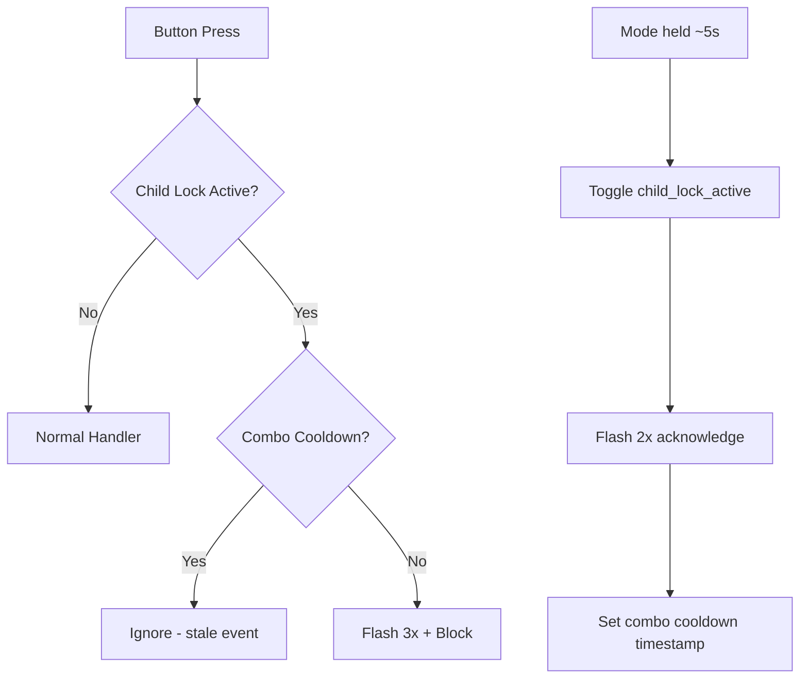

# 🔒 Kindersicherung (Child Protection Mode) — Implementation Summary

## Overview

The child protection mode locks the physical control panel buttons so the device cannot be operated by pressing buttons on the device. All control via Home Assistant remains fully functional.

## Components

| File | Role |
|:--|:--|
| [globals_ui.yaml](../../packages/globals/globals_ui.yaml) | Persistent global `child_lock_active` (bool, NVS-backed, `restore_value: true`) |
| [globals.h](../../components/helpers/globals.h) | `extern` declarations for `child_lock_active` / `child_lock_switch`, `child_lock_combo_triggered_ms` cooldown timestamp |
| [user_input.h](../../components/helpers/user_input.h) | Child lock guards in the physical button handlers (Power, Mode, Level click/hold), `toggle_child_lock()`, `flash_all_leds_on()` / `restore_leds_after_flash()` |
| [ui_controls.yaml](../../packages/ui/ui_controls.yaml) | `switch.kindersicherung` (HA config entity, `restore_mode: DISABLED`) |
| [logic_buttons.yaml](../../packages/io/logic_buttons.yaml) | Mode-hold detection (`child_lock_handler`) and the LED flash scripts `flash_leds_child_lock_2x` / `_3x` |

## How It Works

### Home Assistant Control
- **Entity**: `switch.kindersicherung` (visible in device's *Configuration* section)
- Toggle ON → all physical buttons are blocked
- Toggle OFF → normal operation restored
- HA controls and the web dashboard (mode changes, intensity slider, etc.) are **never blocked**

### Physical Device Control
- **Activate/Deactivate**: Hold the **Mode** button for about **5 seconds** (confirmed after 4.5 s of continuous hold)
- **Acknowledgment**: The 8 panel LEDs (power, 2 mode, 5 level) flash **2 times** on toggle
- **Blocked press feedback**: All LEDs flash **3 times** when a blocked button is pressed

### Technical Details

> [!NOTE]
> The child lock state is persisted in NVS (`restore_value: true`), so it survives reboots. The HA switch must keep `restore_mode: DISABLED` — with the default `ALWAYS_OFF` its boot-time turn_off action cleared the lock on every reboot (fixed in 0.10.27). The combo cooldown (500ms) prevents stale button events right after a toggle.
