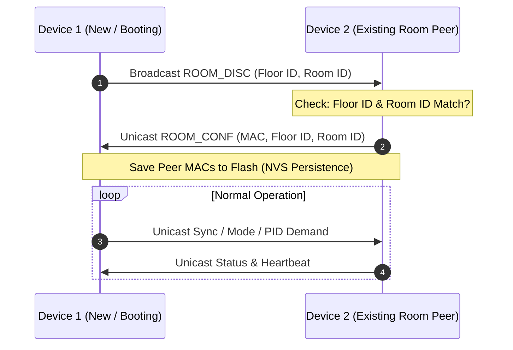

# 📡 ESP-NOW Wireless Mesh & Room Synchronization

VentoSync utilizes **ESP-NOW** (via the [ESPHome ESP-NOW Component](https://esphome.io/components/espnow.html)) for direct, ultra-low-latency device-to-device communication. ESP-NOW operates directly at the MAC layer on 2.4 GHz radio, eliminating the need for a central Wi-Fi router or physical interconnect cables.

  

---

## 💡 Architectural Decision: Why ESP-NOW over Powerline (PLC)?

Commercial systems like the original VentoMaxx rely on **Powerline Communication (PLC)** over the 230V mains power lines to synchronize paired fans. In residential environments, PLC frequently suffers from:
* Severe signal degradation and phase-crossing barriers across different electrical circuits.
* High susceptibility to switching noise and high-frequency harmonics from modern LED drivers, solar inverters, and power supplies.
* Complex installation requirements (such as needing expensive phase couplers in the sub-panel).

Standard Wi-Fi, on the other hand, creates a hard dependency on an active external router and access point availability.

**ESP-NOW** is the modern, optimal solution: it establishes a robust, highly reliable, and ultra-fast direct 2.4 GHz mesh directly between the ventilation units with zero wiring and full autonomy.

---

## ⚡ Core Advantages

* 🌐 **Complete Wi-Fi Independence**: Devices do not rely on an active Wi-Fi access point for synchronized operation. If the home router reboots or fails, all room ventilation groups continue operating synchronously without interruption.
* 🛡️ **Network Immunity**: Direct point-to-point transmission avoids Wi-Fi traffic congestion and channel interference.
* ⚡ **Microsecond-Level Latency**: Because packets require no TCP/IP handshake after discovery, directional reversal commands for paired push-pull units are transmitted synchronously and seamlessly.
* 🔌 **Zero Interconnect Cabling**: No control wiring needed between walls or across floors.
* 📡 **Dynamic Room Discovery & NVS Persistence**: Devices automatically discover other units in the same virtual room and store their peer MAC addresses directly in non-volatile flash memory (NVS).
  > [!NOTE]
  > Due to the 254-character string limit in ESPHome Globals, the persistent peer list is designed for **up to 14 peers** per device. This is more than sufficient for standard residential rooms.
* ⚙️ **Efficient Unicast Routing**: After initial discovery, all PID demand, status telemetry, and synchronization commands are transmitted via targeted unicast packets, drastically reducing RF noise in the 2.4 GHz band.
* 🔄 **Global Settings Mirroring**: Changing parameters (CO2 thresholds, fan speed levels, active modes) on any unit in the room via Home Assistant or physical buttons is mirrored wirelessly to all peers in real-time.

---

## 🔍 Discovery & Pairing Process

1. **Broadcast (`ROOM_DISC`)**: A booting device or one whose Room/Floor ID changed broadcasts a discovery frame to `FF:FF:FF:FF:FF:FF`.
2. **Matching**: Receiving devices check whether the packet's Floor ID and Room ID match their own.
3. **Handshake (`ROOM_CONF`)**: If matched, the receiver adds the sender as a peer and responds with a direct unicast confirmation.
4. **Persistence**: The peer list is stored in NVS, allowing instantaneous synchronization upon subsequent reboots without waiting for discovery.

---

## 🔒 Protocol Architecture & Packet Validation (v10)

* **Magic Header Validation**: Every packet begins with a fixed magic byte (`0x42`) to immediately discard foreign or malformed 2.4 GHz packets.
* **Firmware Version Guard**: Strict version validation ensures that packets from incompatible firmware builds are rejected cleanly.
* **Loop Prevention**: Settings updates contain sequence tokens to prevent cyclic broadcast loops when mirroring configuration values across peers.

---

## 📶 RF & Antenna Optimization

To guarantee reliable wireless reach through concrete walls, drywall, and ceilings:
* **U.FL External Antenna**: The ESP32-C6 is equipped with an external omnidirectional antenna connected via U.FL.
* **Antenna Switching**: ESPHome firmware is configured to route all RF signals through the external antenna connector rather than the small on-board PCB antenna, providing superior signal strength and link margins.
