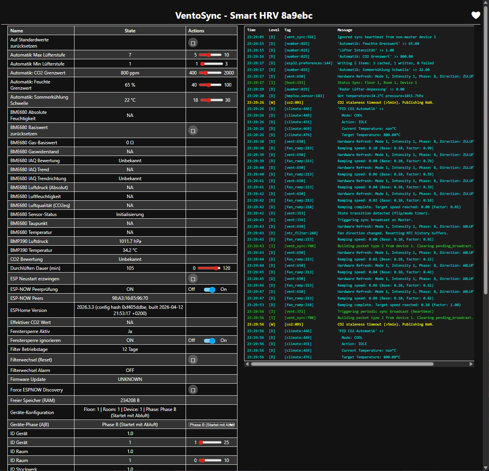
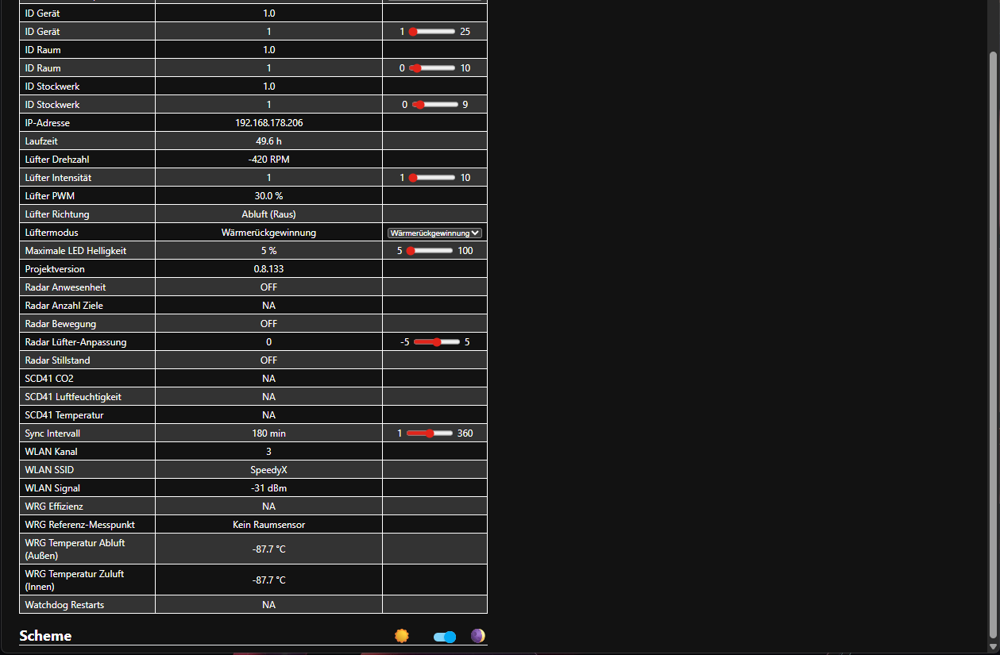

# 📊 VentoSync Local Web Dashboard

The **VentoSync Local Web Dashboard** is a standalone, browser-based management and monitoring interface served directly from the ESP32-C6 microcontroller. It allows full control, live monitoring, and configuration without requiring Home Assistant or an external smart home hub.

---

## ✨ Core Features

* **Modern Responsive Interface**: High-end dark mode design built with **Tailwind CSS**, optimized for smartphones, tablets, and desktop computers.
* **Real-time Live Charts**: Integrated **Chart.js** graphing for live telemetry of CO2, relative & absolute humidity, temperature, and fan RPM.
* **On-Site Device Setup**: Direct on-device configuration for Device ID, Room ID, Floor ID, and airflow Phase (Phase A / Phase B).
* **Sensor Diagnostics**: Live sensor tiles with historical daily minimum/maximum/average values.
* **ESP-NOW Live Peer Grid**: Real-time overview of all connected mesh peers in the same room group (Node ID, mode, speed level, airflow direction).
* **Standalone Operation**: Full autonomy without Home Assistant. Accessible via:
  * **Custom VentoSync UI**: `http://<your-device-ip>/ui` (or `http://esptest.local/ui`)
  * **Native ESPHome Interface**: `http://<your-device-ip>/`

---

## 📸 Interface Preview

### VentoSync Dashboard (Tailwind CSS UI)

  
  &nbsp;
  

*Left: Main controls, fan speed slider, operating modes, and configuration parameters.*  
*Right: Connected ESP-NOW peers and real-time telemetry tiles.*

---

### Standard ESPHome Dashboard

For low-level diagnostics, full entity logs, and firmware management, the root URL (`/`) provides the standard ESPHome web server interface:

  
  &nbsp;
  

---

## 📡 ESP-NOW Peer Visualization

The dashboard dynamically scans and lists all active ESP-NOW ventilation units in the same room. The **"Connected Devices (ESP-NOW)"** tile displays:
* **Node / Device ID**
* **Operating Mode** (Auto, Eco Recovery, Boost, Ventilation, Off)
* **Fan Speed Level** (1–10)
* **Current Airflow Direction / Phase** (Supply In / Exhaust Out / Standstill)
* **Telemetry** (fan RPM, board temperature, PID demand)
* **Air quality per device** (CO2 in ppm, rating, temperature, relative humidity)

> [!NOTE]
> The air quality values are shared over ESP-NOW (protocol v10), so each card shows the readings of **that** device's own sensor — whether it is an SCD43 or the BME680 eCO2 fallback. A device without a climate sensor shows `--`; the rating uses the same classification as the local "Luftqualität" tile, so both always agree.

---

## 🌐 Hybrid-Offline Operation

> [!IMPORTANT]
> **CDN Asset Loading**: While all ventilation logic, PID control, and sensor telemetry run 100% locally on the ESP32-C6 (completely functional even without an active internet connection), the web dashboard loads **Tailwind CSS** and **Chart.js** via an external CDN (`https://cdn.tailwindcss.com`...).
>
> An internet connection is therefore required for the web browser to load the dashboard styling and live charts. Local font assets and scripts are kept off the flash memory to preserve storage footprint.
