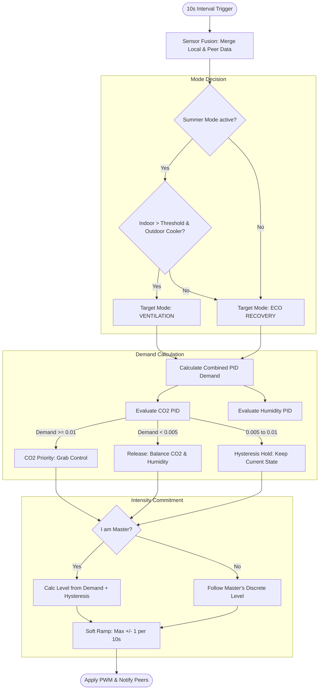

# 🤖 Smart automatic Mode (Auto Logic)

The **Smart automatic Mode** is the "brain" of VentoSync. It provides fully autonomous, sensor-driven ventilation control optimized for air quality, energy efficiency, and comfort. This document describes the technical implementation and the decision-making logic behind this mode.

---

## 🏗️ Architecture & File Structure

The logic is distributed across several layers to ensure maintainability and high performance on the ESP32-C6.

| Component | File | Responsibility |
| :--- | :--- | :--- |
| **Main Loop** | [`logic_automation.yaml`](../../packages/actuators/logic_automation.yaml) | Triggers the evaluation cycle every 10 seconds. Calls `evaluate_auto_mode()`. |
| **Core Logic (C++)** | [`auto_mode.h`](../../components/helpers/auto_mode.h) | The "Engine". Implements math, sensor fusion, and mode switching logic. |
| **PID Controllers** | [`logic_pid.yaml`](../../packages/actuators/logic_pid.yaml) | Defines the internal CO2 and Humidity PID climate controllers and their dummy outputs. |
| **Climate Sensors** | [`sensors_climate.yaml`](../../packages/sensors/sensors_climate.yaml) | Defines input sensors (SCD43, BME680, Home Assistant sensors) and efficiency metrics. |
| **UI & Thresholds** | [`ui_controls.yaml`](../../packages/ui/ui_controls.yaml) | Provides Home Assistant entities for runtime configuration (limits, targets). |
| **Global State** | [`globals.h`](../../components/helpers/globals.h) | Shared pointers and variables accessible by both YAML and C++. |

---

## 🔄 Logic Flow: The 10-Second Decision Cycle

Every 10 seconds, the `evaluate_auto_mode()` function runs the following process:

---

## 🧪 Detailed Logic Components

### 1. Sensor Fusion & Fallbacks
The system ensures stability even if a local sensor fails.
- **CO2 Fallback Chain** (in `effective_co2` template sensor): Local SCD43 → Local BME680 IAQ eCO2 → Hold last value (up to 5 min) → NaN.
- **Temperature Fallback Chain** (in `auto_mode.h`): Local SCD43 Temperature → NTC Phase-Locked Values → Peer Data via ESP-NOW.
- **Phase-Locked NTC Sensors**: The NTC sensors are physically fixed in the air duct. A phase-lock filter in `climate.h` ensures each NTC only publishes values during its valid ventilation phase (Indoor NTC during exhaust, Outdoor NTC during intake), holding the last valid reading otherwise. This means `temp_zuluft` always represents outdoor temperature and `temp_abluft` always represents indoor temperature, regardless of the current fan direction.

### 2. Humidity Management (Enthalpy Logic)
VentoSync prevents "moisture intake" during humid summer days or rainy weather.
- **Scientific Foundation**: The logic uses the **Magnus Formula** to calculate **Absolute Humidity ($g/m^3$)**.
- **Guard Condition**: Dehumidification via PID is only allowed if:
  $$Absolute\_Humidity_{Outdoor} < Absolute\_Humidity_{Indoor}$$
  This ensures that ventilation actually removes water from the building rather than bringing it in.

### 3. Dual-PID Priority Control
Two independent PID controllers run in the background (defined in [`logic_pid.yaml`](../../packages/actuators/logic_pid.yaml)):
1. **PID CO2**: Target: 1000 ppm (configurable).
2. **PID Humidity**: Target: 60% rH (configurable).

**Conflict Resolution (Hysteresis)**:
- **CO2 Grab**: If CO2 demand exceeds **1%**, CO2 takes priority control of the hysteresis state machine.
- **CO2 Release**: Only when CO2 demand falls below **0.5%**, control is handed over to the Humidity PID.
- **Hold**: Between 0.5% and 1%, the current state is maintained (no switching) to prevent oscillation.
- **Priority with Boost**: Even while CO2 has priority, the effective demand is `max(CO2, Humidity)` — humidity can boost the fan speed above CO2's request, but cannot reduce it. This ensures both air quality and moisture safety.

### 4. Summer Cooling (Bypass Simulation)
Since decentralized units typically lack a physical bypass flap, the logic simulates a bypass by disabling the reversing cycle.
- **Condition**: Indoor Temp > threshold (slider, default 22°C) AND Outdoor Temp < (Indoor - 1.5°C) AND HA "Sommerbetrieb" is ON AND no active AC (Smart Climate Control).
- **Release**: "Sommerbetrieb" OFF, or Outdoor ≥ Indoor − 0.5°C, or Indoor < threshold − 0.5°C.
- **Action**: Switch to `MODE_VENTILATION` (one-way flow, no timer).
- **Temperatures**: In one-way flow only the NTC facing its own air stream is measurable (intake: outdoor, exhaust: indoor). The other value comes from a peer, else from the device's last reading (≤ 30 min); if still unknown, `guard_summer_bypass()` returns to heat recovery and blocks re-entry for 5 min (`SUMMER_COOLING_REMEASURE_MS`) to re-measure.
- **Benefit**: Draws in cool night air efficiently without warming it up in the ceramic heat exchanger.

### 5. Master/Slave Synchronization (Room Authority)
To avoid different fans in the same room running at different speeds (which causes pressure imbalance), the system uses an **Authority Rule**:
- **Master (ID=1)**: Calculates the target level (1–10) based on local/room demand.
- **Slaves (ID > 1)**: Ignore their own demand calculation and mirror the Master's discrete level in real-time.
- **Soft Ramping**: All devices apply a max transition of **+/- 1 level per 10 seconds** for silent and motor-friendly speed changes.

### 6. Smart Climate Control (HVAC Coordination)
An optional modifier evaluated at the start of every 10-second cycle (`auto_mode::evaluate_hvac_coordination()`). While the room-wide `Klima-Koordination` switch is on **and** Home Assistant reports the AC as active (API action `set_ac_active`, shared room-wide), the cycle runs with a restricted profile:
- **CO2-only loop**: the humidity PID demand is ignored, the CO2 PID setpoint is switched to `hvac_co2_threshold` (default 1200 ppm) and re-asserted every cycle.
- **Level window**: `[1, hvac_max_fan_level]` (default 1–3) replaces `automatik_min/max_fan_level`.
- **Mode lock**: `determine_auto_operating_mode()` always returns heat recovery — no summer bypass while the AC runs.
- **Health guards**: a CO2 emergency (≥ `hvac_emergency_co2`, release ≤ `hvac_co2_threshold`) and a mold guard (≥ 70 % rH while outdoor air is drier, release ≤ 65 %) restore the normal limits and dual-PID. Without a CO2 reading nothing is throttled.
- **Debounce**: AC "off" must persist 120 s before the restrictions are released; the ramp back is the standard ±1 level per cycle.

Details, state machine and HA setup: [📄 Smart Climate Control — HVAC Coordination](en_smart-climate-control.md).

---

## ⚙️ Configuration Entities

| HA Entity | YAML ID | Default | Purpose |
| :--- | :--- | :---: | :--- |
| `Automatik Min Lüfterstufe` | `automatik_min_fan_level` | 2 | Minimum speed (Moisture base protection). |
| `Automatik Max Lüfterstufe` | `automatik_max_fan_level` | 7 | Maximum speed (Noise limiter for nights). |
| `Automatik: CO2 Grenzwert` | `auto_co2_threshold` | 1000 | Target setpoint for the CO2 PID. |
| `Automatik: Feuchte Grenzwert`| `auto_humidity_threshold` | 60% | Target setpoint for the Humidity PID. |
| `Sommerbetrieb` | `sommerbetrieb` | (Binary) | Master switch from HA to enable/disable cooling. |
| `Klima-Koordination` | `smart_climate_control` | Off | Enables the HVAC coordination modifier (see section 6). |
| `Klima-Koordination: CO2 Grenzwert` | `hvac_co2_threshold` | 1200 | Relaxed CO2 setpoint while the AC is active. |
| `Klima-Koordination: Max Lüfterstufe` | `hvac_max_fan_level` | 3 | Fan level cap while the AC is active. |
| `Klima-Koordination: CO2 Notfallgrenze` | `hvac_emergency_co2` | 1500 | CO2 emergency override threshold. |

---

> [!TIP]
> **Advanced Tuning**: The PID parameters ($K_p$, $K_i$) are defined in [`logic_pid.yaml`](../../packages/actuators/logic_pid.yaml). They are tuned for very slow, silent transitions to ensure the ventilation remains "forgotten" in the background. The derivative term ($K_d$) is explicitly set to zero — trend-based regulation would amplify sensor noise on the SCD43 and is unsuitable for residential ventilation.
