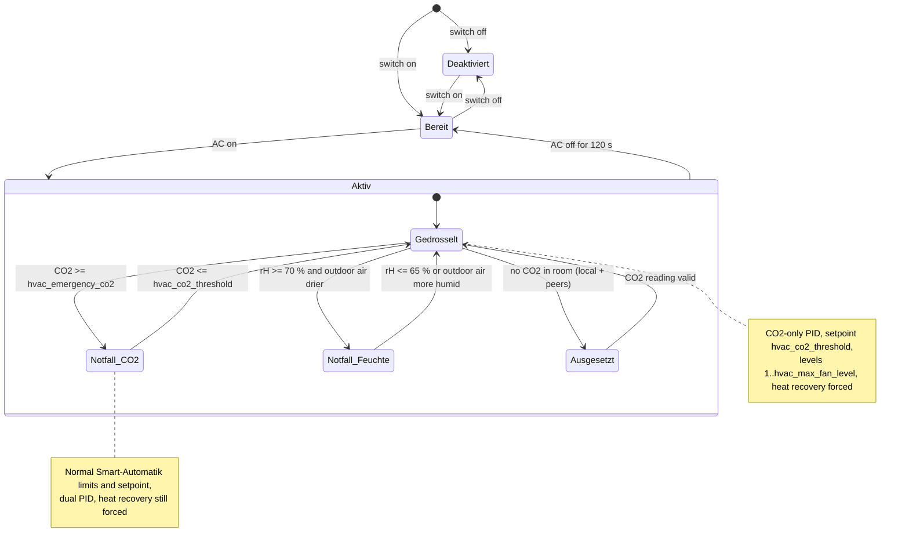

# ❄️🔥 Smart Climate Control — HVAC Coordination

[](../de/de_smart-climate-control.md)

> **Status:** Implemented since version **0.10.13** (room-wide thresholds and shared CO2 since **0.10.14**, ESP-NOW protocol v8; AC state via Home Assistant action and room-wide switch since **0.10.22**, protocol v10). The decision logic lives in
> [`components/ventilation_logic/hvac_coordinator.h`](../../components/ventilation_logic/hvac_coordinator.h)
> (pure, unit-tested), the integration into Smart-Automatik in
> [`components/helpers/auto_mode.h`](../../components/helpers/auto_mode.h), and the Home Assistant entities in
> [`packages/ui/ui_controls.yaml`](../../packages/ui/ui_controls.yaml) and
> [`packages/integration/homeassistant.yaml`](../../packages/integration/homeassistant.yaml).

## Problem Statement

Decentralized heat-recovery ventilation units exchange indoor air with outdoor air. When a **room air conditioner (split AC or portable AC)** is actively conditioning a room, high-intensity ventilation is counter-productive: it imports hot, humid outdoor air (or exhausts expensively heated air in winter), forcing the compressor to work harder and wasting energy. Conversely, shutting ventilation off entirely degrades indoor air quality (CO2 build-up, VOC accumulation) and removes the base air exchange required for moisture protection.

**Goal:** While the AC in a room is active, VentoSync throttles ventilation to the **minimum required for healthy indoor air quality** — and no more. Health always wins over energy efficiency.

---

## Functional Concept

### Activation & Mode Toggle

VentoSync exposes a **dedicated switch** in Home Assistant that enables or disables Smart Climate Control for the **whole room**:

| HA Entity | YAML ID | Type | Default | Purpose |
| :--- | :--- | :---: | :---: | :--- |
| `switch.klima_koordination` ("Klima-Koordination") | `smart_climate_control` | **Switch**, room-wide | Off | Enable/disable HVAC coordination. Switching it on any device switches it on every device of the room (ESP-NOW). Persisted in flash. |

When **disabled**, the ventilation ignores the AC state entirely and operates normally.
When **enabled**, VentoSync listens to the room's AC state entity and applies the restricted profile described below **only while operating in the `Smart-Automatik` mode**. Manual modes (Heat Recovery, Cross-Ventilation, Boost, Off) are never modified — the feature is a *modifier* of the automatic logic, not a separate operating mode.

### AC State Input (from Home Assistant)

Home Assistant **pushes** the AC state to the ventilation units with the API action **`set_ac_active`** (defined in `packages/integration/homeassistant.yaml`):

| HA action | Data | Meaning |
| :--- | :--- | :--- |
| `esphome.<device_name>_set_ac_active` | `active: true` / `false` | `true` = the AC is switched on in a conditioning mode. |

* **Room-wide:** the pushed state is shared with all devices of the room over ESP-NOW (protocol v10 flag). HA therefore has to reach **at least one** device of the room; calling the action on every device adds redundancy. Each device broadcasts only the state HA pushed to *it* (never the room-wide result), so the flag cannot latch.
* **Independent of the room ID:** unlike an imported entity, the action does not depend on a compile-time `room_id` substitution — the runtime room configuration (`config_room_id`) decides which devices share the state.
* **Expiry:** a pushed state is trusted for **15 minutes** (`AC_STATE_MAX_AGE_MS`). The HA automation re-sends it periodically (recommended every 5 min, see [Home Assistant Setup](#️-home-assistant-setup)); this also covers device reboots and HA restarts.
* **Diagnostics:** the last pushed value is shown as `binary_sensor.klima_aktiv_ha_signal` ("Klima aktiv (HA-Signal)").

> [!IMPORTANT]
> **Use the AC's operating mode, not the compressor action.** A `climate` entity has two different signals:
> `state` (the selected *hvac_mode*: `cool`, `heat`, `heat_cool`, `dry`, `fan_only`, `off`) and the attribute `hvac_action`
> (what the unit is doing *right now*: `cooling`, `heating`, `drying`, `idle`, `off`). The compressor cycles between
> `cooling` and `idle` every few minutes once the setpoint is reached. Mapping "AC active" to `hvac_action` would make the
> ventilation oscillate between the throttled and the normal profile. The recommended mapping is therefore:
>
> - **AC active** = `state` ∈ {`cool`, `heat`, `heat_cool`, `dry`, `auto`}
> - **AC inactive** = `state` ∈ {`off`, `fan_only`, `unavailable`, `unknown`}
>
> `fan_only` counts as inactive: the unit is only circulating air and there is no thermal load to protect.

**Fail-safe behavior:** If Home Assistant has never pushed a state, the last push is older than 15 minutes, or the API connection is down, the local AC state is treated as **inactive** (a fresh state from a peer of the room still counts). Ventilation is never throttled blindly.

---

## Control Strategy: Air-Quality-Only Profile

When Smart Climate Control is **enabled**, the operating mode is **Smart-Automatik** and the AC is **active**, the automatic logic switches to the restricted **"Air Quality Only"** profile:

### Governing Principle

> **Ventilate only as much as necessary for health, not for comfort or dehumidification.**

The standard dual-PID (CO2 + Humidity) regulation is replaced by a **CO2-only** loop with tightened constraints. Because the switch and the AC state are room-wide, every device of the room applies the same profile — also the demand a device shares with its peers is CO2-only while throttled:

| Parameter | Normal Smart-Automatik | HVAC Coordination (Throttled) | Rationale |
| :--- | :---: | :---: | :--- |
| **CO2 setpoint (PID)** | `auto_co2_threshold` (default 1000 ppm) | `hvac_co2_threshold` (default **1200 ppm**) | Relaxed target; 1200 ppm is still "moderate / acceptable" per DIN EN 13779 category IDA 3 and needs significantly less air exchange. |
| **Max fan level** | `automatik_max_fan_level` (default 7) | `hvac_max_fan_level` (default **3**) | Hard cap against energy waste; Level 3 causes minimal airflow noise and thermal load. |
| **Min fan level** | `automatik_min_fan_level` (default 2) | **1** (fixed) | Base ventilation (DIN 1946-6 *Feuchteschutz*). Deliberately below the user's normal minimum: while the AC runs in cooling / dry mode it dehumidifies far more effectively than ventilation. |
| **Humidity PID** | Active (dehumidification) | **Ignored** | Ventilation-based dehumidification would import humid outdoor air. The mold guard (below) remains as a safety net. |
| **Summer cooling (bypass)** | Active (cross-ventilation) | **Suppressed** | Cross-ventilation imports air the AC then has to re-condition. |
| **Operating mode inside Smart-Automatik** | Dynamic (Heat Recovery / Cross-Ventilation) | **Forced: Heat Recovery** | Minimizes thermal exchange with outdoors while the room is conditioned. |

Everything else stays unchanged: the CO2 PID (`kp = 0.001`, `ki = 0.0000005`), the discrete level mapping with its ±25 % hysteresis band and the soft ramp of **±1 level per 10-second cycle** are the same code paths as in normal automatic operation — only the setpoint and the level window are exchanged.

### CO2 Threshold Justification

| CO2 Level (ppm) | DIN EN 13779 Category | Health Assessment | Role in VentoSync |
| :---: | :---: | :--- | :--- |
| ≤ 800 | IDA 1 (High) | Excellent | Unnecessary during AC operation |
| ≤ 1000 | IDA 2 (Medium) | Good — Pettenkofer limit | Standard Smart-Automatik target |
| ≤ 1200 | IDA 3 (Moderate) | Acceptable | **Default HVAC target** (`hvac_co2_threshold`) |
| ≤ 1500 | IDA 4 (Low) | Tolerable, not recommended long-term | Upper safety boundary |
| > 1500 | — | Poor | **Emergency override** (`hvac_emergency_co2`) — normal automatic regulation resumes |

---

## Health Guards

Two guards lift the restrictions while the AC keeps running. Both use hysteresis so the fan does not oscillate.

### 1. CO2 Emergency Override

| Event | Condition | Effect |
| :--- | :--- | :--- |
| **Enter** | CO2 ≥ `hvac_emergency_co2` (default 1500 ppm) | Level cap removed (normal `automatik_min/max`), CO2 setpoint back to `auto_co2_threshold`, humidity PID re-enabled. Heat recovery stays enforced (no summer bypass while the AC runs). |
| **Release** | CO2 ≤ `hvac_co2_threshold` (default 1200 ppm) | Throttled profile resumes. |

The firmware keeps the emergency threshold **at least 100 ppm above** the relaxed setpoint, so a misconfigured slider can never collapse the hysteresis.

### 2. Mold Guard (Humidity)

The original concept disabled humidity control completely. That is only safe while the AC actually dehumidifies (cooling / dry mode). An AC running in **heating mode** does not remove moisture, and even in summer a bathroom or kitchen can exceed the mold threshold. Therefore:

| Event | Condition | Effect |
| :--- | :--- | :--- |
| **Enter** | Indoor rH ≥ **70 %** **and** ventilation can dry the room (outdoor absolute humidity < indoor, Magnus formula — same enthalpy guard as the humidity PID) | Same as the CO2 emergency: restrictions lifted, dual-PID active, heat recovery enforced. |
| **Release** | Indoor rH ≤ **65 %** **or** outdoor air becomes more humid than indoor air | Throttled profile resumes. |

If the outdoor air is muggier than the room, ventilating would *add* moisture — the guard stays silent and leaves dehumidification to the AC.

### 3. Missing CO2 Reading (Room-Wide)

The health guarantee of this feature rests on a CO2 measurement (SCD43, or the BME680 eCO2 fallback via `effective_co2`). The measurement is **room-wide**: every device shares its own effective CO2 in the ESP-NOW packet, and the coordinator evaluates the **highest** CO2 of the local sensor and all peers whose reading is at most 5 minutes old (`ventosync::room::PEER_DATA_MAX_AGE_MS`; two heartbeats for longer sync intervals). A device without its own sensor (`radar_only` / `nosensor` / `NTConly` variants) therefore coordinates on the room's measurement. The log line marks values that came from a peer with "via Peer".

The **mold guard** works the same way: it uses the highest relative humidity of the local SCD41 and all fresh peers (`room_humidity`), together with the temperature measured at the same spot for the absolute-humidity check. It therefore also protects rooms whose Master has no humidity sensor.

Only if **no device in the room** delivers a CO2 value does the coordinator report **"Ausgesetzt (kein CO2-Wert im Raum)"** and refrain from throttling. Heat recovery is still enforced while the AC is active.

---

## Transition Behavior

* **AC turns on:** The restricted profile applies immediately on the device that received the HA action and on the other devices of the room with their next ESP-NOW heartbeat (default every 60 s). The fan ramps down by at most 1 level per 10-second cycle, e.g. Level 6 → 3 within ~30 s; the level window is always enforced, also when the fan was running above the cap.
* **AC turns off:** The firmware waits for **120 s of continuous "off"** before releasing the restrictions (`AC_RELEASE_DELAY_MS`). This absorbs short Home Assistant reconnects and users toggling the AC briefly. For split units whose integration only exposes `hvac_action`, derive the pushed state from a template binary sensor with `delay_off` (see below) to smooth compressor cycling further.
* **Release:** Limits and setpoint return to the user's normal values, the CO2 PID integral is reset on every setpoint change and the humidity PID integral is reset when it is re-enabled, so no wind-up from the throttled period carries over. The fan ramps back up by ±1 level per 10 s.
* **Setpoint authority:** The HA slider `auto_co2_threshold` and the ESP-NOW config sync both write the CO2 PID target. The coordinator re-asserts the correct target every cycle, so a slider change during AC operation cannot silently break the relaxed setpoint.

---

## Decision State Machine



The state is published as the diagnostic text sensor **"Klima-Koordination Status"** (`hvac_status`) with these values:

| Value | Meaning |
| :--- | :--- |
| `Deaktiviert` | Switch is off. |
| `Inaktiv (kein Smart-Automatik)` | Switch is on but a manual operating mode is selected. |
| `Bereit (Klima aus)` | Armed, AC inactive — normal Smart-Automatik. |
| `Aktiv (gedrosselt)` | AC active — air-quality-only profile applied. |
| `Notfall (CO2)` | AC active, CO2 emergency override in effect. |
| `Notfall (Feuchte)` | AC active, mold guard in effect. |
| `Ausgesetzt (kein CO2-Wert im Raum)` | AC active but no CO2 reading from any device in the room — not throttling. |

---

## Configuration Entities

| HA Entity (German UI name) | YAML ID | Type | Default | Range | Purpose |
| :--- | :--- | :---: | :---: | :---: | :--- |
| `Klima-Koordination` | `smart_climate_control` | Switch, **room-wide** | Off | — | Enable/disable HVAC coordination for the room. |
| `Klima-Koordination: CO2 Grenzwert` | `hvac_co2_threshold` | Number (Slider), **room-wide** | 1200 ppm (`hvac_default_co2_threshold`) | 800–1500 ppm | Relaxed CO2 setpoint while the AC is active. Also the release threshold of the CO2 emergency. |
| `Klima-Koordination: Max Lüfterstufe` | `hvac_max_fan_level` | Number (Slider), **room-wide** | 3 (`hvac_default_max_fan_level`) | 1–5 | Maximum fan level while the AC is active. |
| `Klima-Koordination: CO2 Notfallgrenze` | `hvac_emergency_co2` | Number (Slider), **room-wide** | 1500 ppm (`hvac_default_emergency_co2`) | 1200–2000 ppm | CO2 level at which normal automatic regulation resumes regardless of AC state (kept ≥ setpoint + 100 ppm). |
| `Klima-Koordination Status` | `hvac_status` | Text sensor (diagnostic) | — | — | Current coordinator state (see table above). |
| `Klima aktiv (HA-Signal)` | `hvac_ac_active` | Binary sensor (diagnostic) | — | — | AC state last pushed by Home Assistant to this device (action `set_ac_active`). |

All sliders and the switch are `entity_category: config`, persisted in NVS and take effect at the next evaluation cycle. The switch and the three sliders are **room-wide settings**: change them on any one device and the value is pushed to all peers of the room over ESP-NOW immediately (`sync_settings_to_peers()`), and the Master's heartbeat re-asserts it, exactly like the Smart-Automatik min/max levels. Their first-boot values come from the substitutions `hvac_default_co2_threshold`, `hvac_default_emergency_co2` and `hvac_default_max_fan_level` in `ventosync_base.yaml` (switch: off). Values received from a peer are only adopted inside the slider ranges above; the coordinator additionally clamps them (constants `CO2_THRESHOLD_*`, `EMERGENCY_CO2_*`, `MAX_FAN_LEVEL_CONFIG_*` in `hvac_coordinator.h`). Fixed constants (`MIN_FAN_LEVEL = 1`, mold guard 70 % / 65 %, release delay 120 s, emergency margin 100 ppm) are defined in `hvac_coordinator.h`.

---

## 🛠️ Home Assistant Setup

Create one automation per room that pushes the AC state to the VentoSync units of that room. `<device_name>` is the ESPHome node name of the unit (hyphens become underscores, e.g. `ventosync-dg-buero` → `esphome.ventosync_dg_buero_set_ac_active`).

```yaml
automation:
  - alias: "VentoSync: AC state room 1"
    mode: queued
    triggers:
      - trigger: state
        entity_id: climate.bedroom_ac
      - trigger: homeassistant
        event: start
      - trigger: time_pattern   # re-send: the device state expires after 15 min
        minutes: "/5"
    variables:
      # Use the selected hvac_mode, NOT hvac_action (compressor cycling would flap).
      ac_active: "{{ states('climate.bedroom_ac') in ['cool', 'heat', 'heat_cool', 'dry', 'auto'] }}"
    actions:
      # At least one device of the room; list every device for redundancy.
      - action: esphome.ventosync_bedroom_1_set_ac_active
        data:
          active: "{{ ac_active }}"
        continue_on_error: true
      - action: esphome.ventosync_bedroom_2_set_ac_active
        data:
          active: "{{ ac_active }}"
        continue_on_error: true
```

* **`input_boolean` / smart plug** (portable AC): use that entity in the trigger and `is_state('input_boolean.xyz', 'on')` as `ac_active`.
* **Extra smoothing** for integrations that only expose `hvac_action`: create a template binary sensor with `delay_off: {minutes: 5}` and use it as the trigger/source instead of the climate entity.
* **Multiple AC units in one room:** OR them in the `ac_active` template (or use a **Binary Sensor Group** helper, "any entity on", exactly like the [Window Guard setup](en_window-guard-ha-setup.md)).

> [!IMPORTANT]
> **Migration from ≤ 0.10.21:** the firmware no longer imports `binary_sensor.ventosync_hvac_active_room_<room_id>` (substitution `hvac_ac_sensor_id` removed). An existing template binary sensor can stay and simply serve as the trigger/source of the automation above. The "Klima-Koordination" switch starts **off** after the update — switch it on once per room.

---

## Multi-Device Rooms (ESP-NOW, Protocol v10)

The `VentilationPacket` carries the Smart Climate Control fields `room_co2`, `hvac_co2_threshold`, `hvac_emergency_co2`, `hvac_max_fan_level` (since v8) and `hvac_flags` (since **v10**: bit 0 = room-wide switch, bit 1 = the sender's own HA AC state). All devices of a room must run the same firmware version — a simultaneous OTA rollout, as with every protocol bump. Five mechanisms keep a room group consistent:

1. **Shared CO2:** Every device broadcasts its effective CO2; devices without a sensor evaluate the coordinator with the room's reading (see [Missing CO2 Reading](#3-missing-co2-reading-room-wide)).
2. **Room-wide settings:** The switch and the three sliders are synchronized through the existing config-sync path (`handle_config_sync()`): a change on any device is sent as `MSG_STATE` to all peers, and the Master's `MSG_SYNC` heartbeat re-asserts the values on slaves.
3. **Level authority:** In Smart-Automatik, slaves mirror the discrete fan level of the Master (device ID 1). When the Master throttles to Level 1–3, every slave follows within one evaluation cycle.
4. **Mode sync:** The Master's periodic sync packet carries the enforced heat-recovery mode; slaves adopt it.
5. **Shared AC state:** A device treats the AC as active if HA pushed "active" to it **or** to any fresh peer (freshness: 5 min, extended to two heartbeats for longer sync intervals).

Each device still evaluates the coordinator locally with the room-wide inputs, so a slave whose Master is offline throttles on its own. Slaves following the Master additionally clamp the adopted level to their own level window.

---

## Energy Impact Estimation

| Scenario | Avg. Fan Level | Est. Fan Power | Thermal Load on AC |
| :--- | :---: | :---: | :--- |
| **Normal Smart-Automatik** (AC ignored) | 4–6 | 2–4 W | High — continuous outdoor air intake, AC compensates |
| **HVAC Coordination** (AC active) | 1–3 | 0.5–1.5 W | **Minimal** — heat recovery at low airflow |
| **Off** (no ventilation) | 0 | 0 W | None — but CO2 rises, unhealthy |

> [!TIP]
> Rough estimate for a 20 m² bedroom with 2 occupants and a 3.5 kW split AC: throttling from Level 5 to Level 1–2 during AC operation removes on the order of **50–150 W** of continuous thermal compensation load from the AC, i.e. roughly **10–20 %** of its energy during peak summer hours. Actual savings depend on outdoor conditions, the heat-exchanger efficiency and the occupancy-driven CO2 load.

---

## Implementation Notes

1. **Sensor requirements:** No additional hardware. Requires a CO2 source (`effective_co2`: SCD43 or BME680 eCO2) and a Home Assistant automation that pushes the AC state (`set_ac_active`). The mold guard additionally uses the indoor humidity and `sensor.outdoor_humidity`.
2. **Files:** `components/ventilation_logic/hvac_coordinator.h` (pure `ventosync::hvac::Coordinator`, unit tests T-7a–T-7p in `tests/simple_test_runner.cpp`), `components/ventilation_logic/room_fusion.h` (room-wide CO2 / humidity / AC fusion), `VentilationLogic::calculate_auto_target_level()` (level window), `components/helpers/auto_mode.h` (`evaluate_hvac_coordination()`, `hvac_on_ha_ac_state()`, `apply_co2_setpoint()`, ECO lock in `evaluate_auto_mode()`), `components/helpers/network_sync.h` (room-wide sync), `components/helpers/globals.h` (entity externs, `hvac_state`), `packages/ui/ui_controls.yaml`, `packages/integration/homeassistant.yaml` (API action).
3. **Heating-mode support:** The same logic applies when the AC heats in winter — high ventilation would exhaust warm indoor air. Because heating does not dehumidify, the mold guard is the safety net in that season.
4. **Flash wear:** Only the switch and the three sliders are persisted (on change). Runtime state (including the pushed AC state) lives in RAM.
5. **Hardware variants:** The entities exist in all variants. The MQTT variant still needs the native API for the `set_ac_active` action. Variants without a CO2 source use the CO2 reading shared by a peer; only a room without any CO2 source reports `Ausgesetzt (kein CO2-Wert im Raum)` and never throttles.
